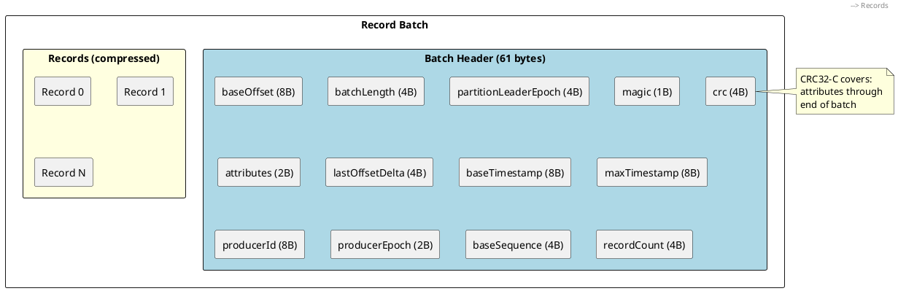
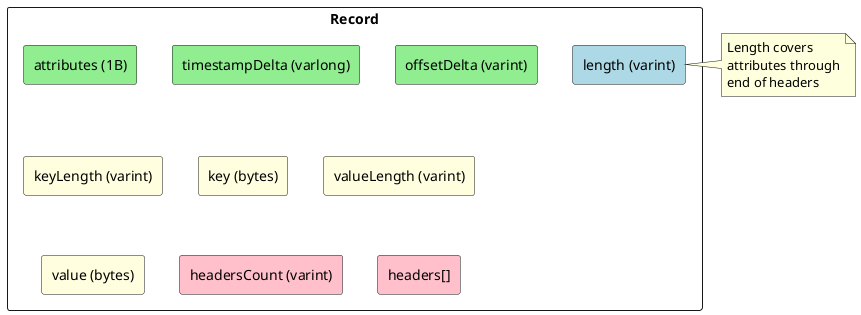
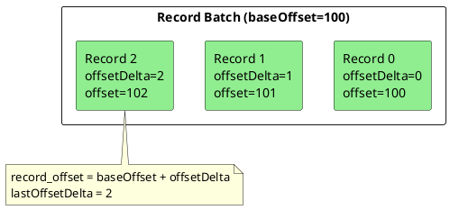
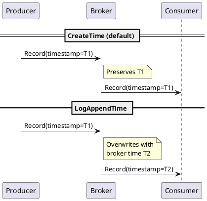
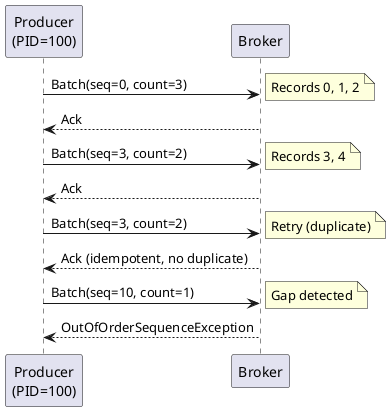
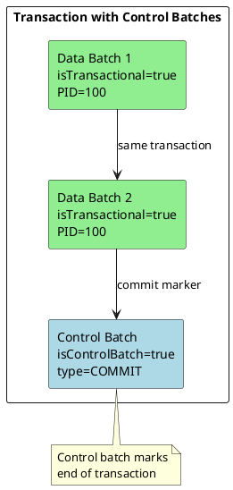
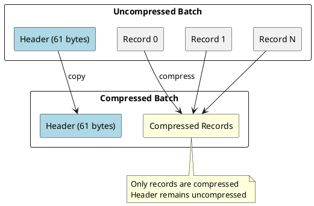
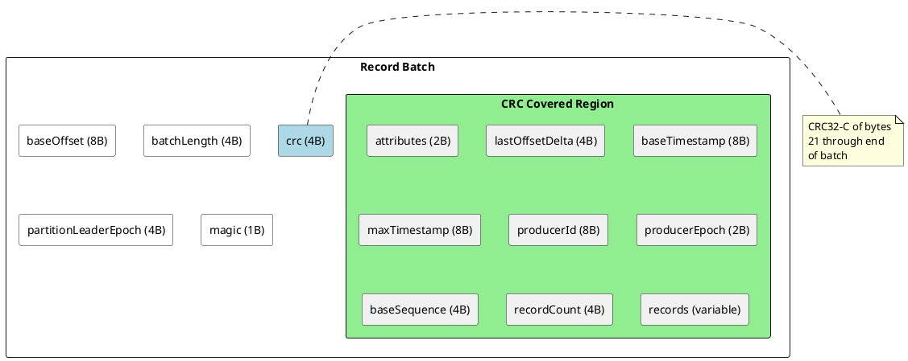

# Kafka Record Batch Format

This document specifies the record batch format used in Apache Kafka for storing and transmitting messages. The record batch is the fundamental unit of data in Kafka, used in produce requests, fetch responses, and log storage.

---

## Format Evolution

### Message Format Versions

| Magic Value | Introduced | Name | Key Features |
|:-----------:|------------|------|--------------|
| 0 | 0.8.0 | Message v0 | Basic messages |
| 1 | 0.10.0 | Message v1 | Timestamps |
| 2 | 0.11.0 | Record Batch | Compression, headers, transactions |

!!! note "Current Format"
    This document focuses on Magic 2 (Record Batch format), the current format used since Kafka 0.11.0. Legacy formats (Magic 0 and 1) are deprecated but may still be encountered in older clusters.

---

## Record Batch Structure

### Overview



### Batch Header Fields

```
RecordBatch =>
    baseOffset: INT64
    batchLength: INT32
    partitionLeaderEpoch: INT32
    magic: INT8
    crc: UINT32
    attributes: INT16
    lastOffsetDelta: INT32
    baseTimestamp: INT64
    maxTimestamp: INT64
    producerId: INT64
    producerEpoch: INT16
    baseSequence: INT32
    recordCount: INT32
    records: [Record]
```

| Field | Type | Offset | Description |
|-------|------|:------:|-------------|
| `baseOffset` | INT64 | 0 | Offset of first record in batch |
| `batchLength` | INT32 | 8 | Byte length from partitionLeaderEpoch to end |
| `partitionLeaderEpoch` | INT32 | 12 | Leader epoch at produce time |
| `magic` | INT8 | 16 | Format version (2 for current) |
| `crc` | UINT32 | 17 | CRC32-C of bytes 21 to end |
| `attributes` | INT16 | 21 | Batch flags |
| `lastOffsetDelta` | INT32 | 23 | Offset delta of last record |
| `baseTimestamp` | INT64 | 27 | Timestamp of first record |
| `maxTimestamp` | INT64 | 35 | Maximum timestamp in batch |
| `producerId` | INT64 | 43 | Producer ID for idempotence |
| `producerEpoch` | INT16 | 51 | Producer epoch |
| `baseSequence` | INT32 | 53 | Sequence number of first record |
| `recordCount` | INT32 | 57 | Number of records in batch |
| `records` | [Record] | 61 | Variable-length record data |

### Batch Attributes

The 16-bit attributes field contains the following flags:

| Bits | Mask | Field | Description |
|:----:|:----:|-------|-------------|
| 0-2 | 0x07 | compression | Compression codec |
| 3 | 0x08 | timestampType | 0=CreateTime, 1=LogAppendTime |
| 4 | 0x10 | isTransactional | Part of transaction |
| 5 | 0x20 | isControlBatch | Control batch (commit/abort markers) |
| 6 | 0x40 | hasDeleteHorizonMs | Delete horizon present |
| 7-15 | - | unused | Reserved for future use |

#### Compression Codec Values

| Value | Codec | Description |
|:-----:|-------|-------------|
| 0 | None | No compression |
| 1 | GZIP | GZIP compression |
| 2 | Snappy | Snappy compression |
| 3 | LZ4 | LZ4 compression |
| 4 | ZSTD | Zstandard compression |

!!! note "Compression Scope"
    Compression applies to the records portion only, not the batch header. The header is always uncompressed.

#### Timestamp Types

| Value | Type | Description |
|:-----:|------|-------------|
| 0 | CreateTime | Timestamp set by producer |
| 1 | LogAppendTime | Timestamp set by broker on append |

---

## Record Structure

### Record Format

Each record within a batch uses variable-length encoding:

```
Record =>
    length: VARINT
    attributes: INT8
    timestampDelta: VARLONG
    offsetDelta: VARINT
    keyLength: VARINT
    key: BYTES
    valueLength: VARINT
    value: BYTES
    headersCount: VARINT
    headers: [Header]
```



| Field | Type | Description |
|-------|------|-------------|
| `length` | VARINT | Byte length from attributes to end of headers |
| `attributes` | INT8 | Reserved (must be 0) |
| `timestampDelta` | VARLONG | Timestamp offset from batch baseTimestamp |
| `offsetDelta` | VARINT | Offset relative to batch baseOffset |
| `keyLength` | VARINT | Key byte length (-1 for null) |
| `key` | BYTES | Message key (omitted if keyLength < 0) |
| `valueLength` | VARINT | Value byte length (-1 for null) |
| `value` | BYTES | Message value (omitted if valueLength < 0) |
| `headersCount` | VARINT | Number of headers |
| `headers` | [Header] | Record headers |

### Record Header Format

```
Header =>
    keyLength: VARINT
    key: BYTES
    valueLength: VARINT
    value: BYTES
```

| Field | Type | Description |
|-------|------|-------------|
| `keyLength` | VARINT | Header key length |
| `key` | BYTES | Header key (UTF-8, not null-terminated) |
| `valueLength` | VARINT | Header value length (-1 for null) |
| `value` | BYTES | Header value (omitted if valueLength < 0) |

!!! note "Header Keys"
    Header keys must be valid UTF-8 strings. Header keys should not contain null characters. Duplicate header keys are permitted.

---

## Offset Semantics

### Offset Calculation



| Calculation | Formula |
|-------------|---------|
| Record offset | `baseOffset + offsetDelta` |
| Last offset in batch | `baseOffset + lastOffsetDelta` |
| Next expected offset | `baseOffset + lastOffsetDelta + 1` |

### Offset Assignment

| Scenario | Offset Behavior |
|----------|-----------------|
| Producer send | Client assigns relative offsets (0, 1, 2, ...) |
| Broker receive | Broker assigns absolute offsets, updates baseOffset |
| Fetch response | Consumer receives absolute offsets |

!!! warning "Offset Gaps"
    Compaction and transactional aborts may create offset gaps. Consumers must not assume consecutive offsets.

---

## Timestamp Semantics

### Timestamp Calculation

```
record_timestamp = baseTimestamp + timestampDelta
```

### Timestamp Types



### Configuration

| Setting | Scope | Options |
|---------|-------|---------|
| `log.message.timestamp.type` | Broker | CreateTime, LogAppendTime |
| `message.timestamp.type` | Topic | CreateTime, LogAppendTime |

---

## Producer ID and Sequence Numbers

### Idempotent Producer Fields

| Field | Purpose | Assignment |
|-------|---------|------------|
| `producerId` | Globally unique producer identifier | Broker-assigned via InitProducerId |
| `producerEpoch` | Fencing counter for same transactional.id | Increments on InitProducerId |
| `baseSequence` | First sequence number in batch | Producer-assigned, monotonic |

### Sequence Number Semantics



| Requirement | Level |
|-------------|-------|
| Sequence numbers must be monotonically increasing per partition | must |
| Sequence number gaps result in OutOfOrderSequenceException | must |
| Duplicate sequence numbers are silently deduplicated | must |
| Sequence numbers wrap at INT32_MAX | may |

### Non-Idempotent Batches

For non-idempotent producers:

| Field | Value |
|-------|-------|
| `producerId` | -1 |
| `producerEpoch` | -1 |
| `baseSequence` | -1 |

---

## Control Batches

Control batches contain transaction markers rather than user data.

### Control Batch Identification

| Attribute | Value |
|-----------|-------|
| `isControlBatch` | true (bit 5 set) |
| `recordCount` | 1 (single control record) |

### Control Record Types

| Type | Value | Description |
|------|:-----:|-------------|
| ABORT | 0 | Transaction aborted |
| COMMIT | 1 | Transaction committed |

### Control Record Format

```
ControlRecord =>
    version: INT16
    type: INT16
```

| Field | Type | Description |
|-------|------|-------------|
| `version` | INT16 | Control record version (currently 0) |
| `type` | INT16 | Control type (0=ABORT, 1=COMMIT) |



---

## Compression

### Compression Application



### Compression Behavior

| Aspect | Specification |
|--------|---------------|
| Scope | Records portion only (after header) |
| Inner batches | Nested compression not supported |
| Empty batches | May be compressed (compresses to minimal size) |
| CRC calculation | Over compressed data |

### Compression Configuration

| Setting | Scope | Options |
|---------|-------|---------|
| `compression.type` | Producer | none, gzip, snappy, lz4, zstd |
| `compression.type` | Broker | producer, none, gzip, snappy, lz4, zstd |
| `compression.type` | Topic | producer, none, gzip, snappy, lz4, zstd |

**Broker Compression Behavior:**

| Broker Setting | Producer Codec | Stored Codec |
|----------------|----------------|--------------|
| `producer` | Any | Same as producer |
| `none` | Any | Uncompressed |
| Specific codec | Any | Specified codec |

!!! warning "Re-compression Cost"
    Setting broker compression different from producer compression causes re-compression on every message, significantly increasing broker CPU usage.

---

## CRC Validation

### CRC32-C Calculation

| Property | Value |
|----------|-------|
| Algorithm | CRC32-C (Castagnoli) |
| Polynomial | 0x1EDC6F41 |

### CRC Coverage



### Validation Requirements

| Requirement | Level |
|-------------|-------|
| Producer must compute CRC before sending | must |
| Broker must validate CRC on receive | must |
| Consumer must validate CRC on fetch | should |
| CRC mismatch must result in CorruptRecordException | must |

---

## Size Limits

### Default Limits

| Limit | Default | Configuration |
|-------|:-------:|---------------|
| Maximum record size | 1 MB | `message.max.bytes` (broker), `max.message.bytes` (topic) |
| Maximum batch size | 1 MB | `max.partition.fetch.bytes` (consumer fetch limit) |
| Maximum request size | 100 MB | `socket.request.max.bytes` (broker) |

### Size Calculation

| Size Component | Calculation |
|----------------|-------------|
| Record size | `length` field value + length field size |
| Batch size | `batchLength` + 12 (header prefix) |
| Batch overhead | 61 bytes minimum (empty batch) |

---

## Legacy Format Compatibility

### Magic 0 (Message v0)

```
MessageV0 =>
    crc: INT32
    magic: INT8 (= 0)
    attributes: INT8
    key: BYTES
    value: BYTES
```

| Feature | Support |
|---------|:-------:|
| Compression | ✅ |
| Timestamps | ❌ |
| Headers | ❌ |
| Transactions | ❌ |

### Magic 1 (Message v1)

```
MessageV1 =>
    crc: INT32
    magic: INT8 (= 1)
    attributes: INT8
    timestamp: INT64
    key: BYTES
    value: BYTES
```

| Feature | Support |
|---------|:-------:|
| Compression | ✅ |
| Timestamps | ✅ |
| Headers | ❌ |
| Transactions | ❌ |

### Format Conversion

| Direction | Behavior |
|-----------|----------|
| v0/v1 → v2 | Broker converts on log compaction or fetch |
| v2 → v0/v1 | Broker down-converts for old consumers |

!!! warning "Down-Conversion Overhead"
    Down-conversion from v2 to v0/v1 is CPU-intensive and loses features (headers, exactly-once semantics). Upgrade all clients to avoid down-conversion.

---

## Implementation Requirements

### Producer Requirements

| Requirement | Level |
|-------------|-------|
| Must use magic byte 2 for Kafka 0.11+ | must |
| Must compute CRC32-C correctly | must |
| Must assign monotonic sequence numbers (if idempotent) | must |
| Should batch multiple records for efficiency | should |
| Should compress records for bandwidth efficiency | should |

### Consumer Requirements

| Requirement | Level |
|-------------|-------|
| Must validate CRC on fetch | should |
| Must handle compression transparently | must |
| Must filter aborted transaction records (if read_committed) | must |
| Must handle control batches appropriately | must |

### Broker Requirements

| Requirement | Level |
|-------------|-------|
| Must validate CRC on produce | must |
| Must assign monotonic offsets | must |
| Must preserve record ordering within batch | must |
| Must support all compression codecs | must |
| May re-compress with different codec | may |

---

## Related Documentation

- [Protocol Primitives](protocol-primitives.md) - Data type encodings
- [Protocol Messages](protocol-messages.md) - Request/response framing
- [Compression](compression.md) - Compression codecs
- [Failure Handling](failure-handling.md) - Idempotent producers