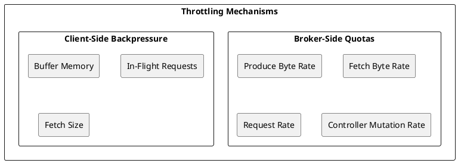
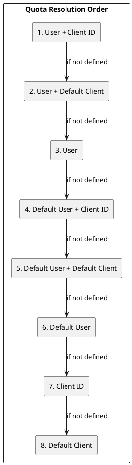
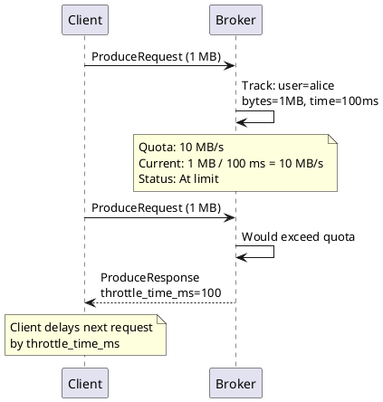
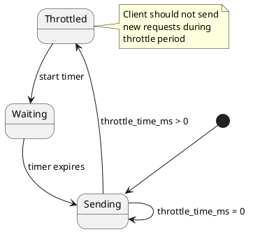
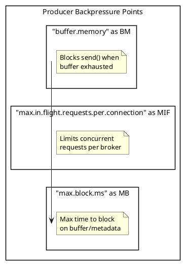
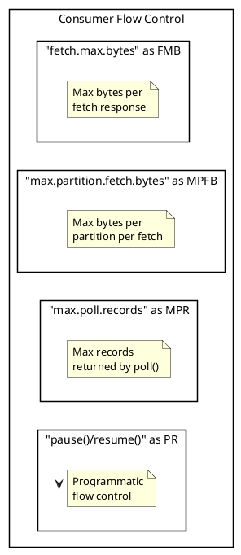
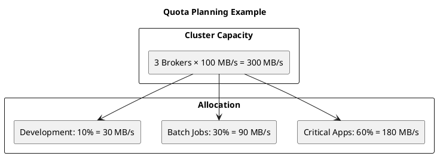
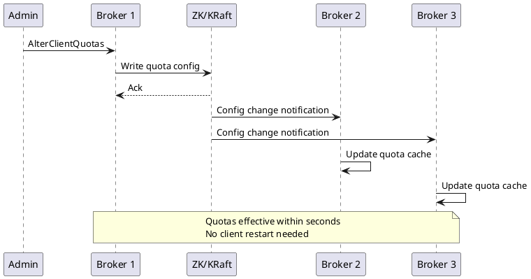

# Kafka Client Throttling

Kafka implements throttling mechanisms to protect brokers from overload and ensure fair resource sharing among clients. This guide covers quota types, configuration, client-side backpressure, and quota monitoring.

## Throttling Overview



---

## Broker-Side Quotas

### Quota Types

| Quota Type | Description | Unit |
|------------|-------------|------|
| `producer_byte_rate` | Upper bound for producer throughput | bytes/sec |
| `consumer_byte_rate` | Upper bound for fetch throughput | bytes/sec |
| `request_percentage` | Upper bound of time spent processing requests | percentage |
| `controller_mutation_rate` | Rate limit for topic mutations | mutations/sec |
| `connection_creation_rate` | Upper bound of connections accepted per IP | connections/sec |

### Quota Hierarchy



### Configuration Examples

**Per-User Quota:**

```bash
# Set quota for specific user
kafka-configs.sh --bootstrap-server localhost:9092 \
    --alter --add-config 'producer_byte_rate=10485760,consumer_byte_rate=20971520' \
    --entity-type users --entity-name alice
```

**Per-Client-ID Quota:**

```bash
# Set quota for specific client ID
kafka-configs.sh --bootstrap-server localhost:9092 \
    --alter --add-config 'producer_byte_rate=5242880' \
    --entity-type clients --entity-name batch-producer
```

**User + Client-ID Quota:**

```bash
# Set quota for specific user and client combination
kafka-configs.sh --bootstrap-server localhost:9092 \
    --alter --add-config 'producer_byte_rate=52428800' \
    --entity-type users --entity-name alice \
    --entity-type clients --entity-name high-priority-producer
```

**Default Quota:**

```bash
# Set default quota for all users
kafka-configs.sh --bootstrap-server localhost:9092 \
    --alter --add-config 'producer_byte_rate=1048576,consumer_byte_rate=2097152' \
    --entity-type users --entity-default

# Set default quota for all clients
kafka-configs.sh --bootstrap-server localhost:9092 \
    --alter --add-config 'request_percentage=25' \
    --entity-type clients --entity-default
```

---

## Quota Enforcement

### How Throttling Works



### Throttle Time Calculation

```
throttle_time = (observed_rate - quota_limit) / quota_limit × window_size
```

Example:
- Quota: 10 MB/s
- Observed rate: 15 MB/s
- Excess: 5 MB/s (50% over)
- Throttle time: ~500ms to bring back to limit

Window size comes from the quota sampling configuration (`quota.window.size.seconds` and `num.quota.samples`).

### Client Response to Throttling



---

## Request Rate Quotas

### Request Handler Time

```properties
# Percentage of I/O thread time
request_percentage=25
```

**Calculation:**

```
request_percentage is a percentage (double) representing the upper bound of time spent processing requests. Values can exceed 100 (for example, 200).
```

### Mutation Rate Quota (Kafka 2.7+)

Limits admin operations to protect the controller:

```bash
# Set controller mutation rate quota
kafka-configs.sh --bootstrap-server localhost:9092 \
    --alter --add-config 'controller_mutation_rate=10' \
    --entity-type users --entity-name admin-user
```

| Operation | Mutations |
|-----------|:---------:|
| CreateTopics (1 topic, 10 partitions) | 10 |
| DeleteTopics (1 topic) | 1 |
| CreatePartitions (+5 partitions) | 5 |
| AlterConfigs | Variable |

---

## Client-Side Backpressure

### Producer Backpressure



**Configuration:**

```properties
# Total buffer memory
buffer.memory=33554432  # 32 MB

# Max concurrent requests per connection
max.in.flight.requests.per.connection=5

# Max time to block on send()
max.block.ms=60000  # 60 seconds
```

### Consumer Backpressure



**Configuration:**

```properties
# Max bytes per fetch response
fetch.max.bytes=52428800  # 50 MB

# Max bytes per partition
max.partition.fetch.bytes=1048576  # 1 MB

# Max records per poll
max.poll.records=500
```

### Consumer Pause/Resume

```java
// Implement backpressure with pause/resume
while (running) {
    ConsumerRecords<String, String> records = consumer.poll(Duration.ofMillis(100));

    for (TopicPartition partition : records.partitions()) {
        if (shouldPause(partition)) {
            // Stop fetching from this partition
            consumer.pause(Collections.singleton(partition));
            pausedPartitions.add(partition);
        } else {
            processRecords(records.records(partition));
        }
    }

    // Resume partitions that can accept more
    for (TopicPartition partition : pausedPartitions) {
        if (canResume(partition)) {
            consumer.resume(Collections.singleton(partition));
            pausedPartitions.remove(partition);
        }
    }
}
```

---

## Quota Monitoring

### Broker Metrics

| Metric | Description |
|--------|-------------|
| `kafka.server:type=Fetch,name=queue-size` | Throttled fetch queue size |
| `kafka.server:type=Produce,name=queue-size` | Throttled produce queue size |
| `kafka.server:type=Request,name=queue-size` | Throttled request queue size |
| `kafka.server:type=Fetch,name=throttle-time` | Average fetch throttle time |
| `kafka.server:type=Produce,name=throttle-time` | Average produce throttle time |
| `kafka.server:type=Request,name=throttle-time` | Average request throttle time |
| `kafka.server:type=ControllerMutation,name=throttle-time` | Average controller mutation throttle time |

### Client Metrics

| Metric | Description |
|--------|-------------|
| `produce-throttle-time-avg` | Average produce throttle time |
| `produce-throttle-time-max` | Max produce throttle time |
| `fetch-throttle-time-avg` | Average fetch throttle time |
| `fetch-throttle-time-max` | Max fetch throttle time |

### Viewing Quotas

```bash
# List all quotas
kafka-configs.sh --bootstrap-server localhost:9092 \
    --describe --entity-type users

# Describe specific user quota
kafka-configs.sh --bootstrap-server localhost:9092 \
    --describe --entity-type users --entity-name alice

# Describe specific client quota
kafka-configs.sh --bootstrap-server localhost:9092 \
    --describe --entity-type clients --entity-name my-producer
```

---

## Quota Planning

### Capacity Estimation



### Quota Guidelines

| Client Type | Producer Quota | Consumer Quota | Request % |
|-------------|:--------------:|:--------------:|:---------:|
| Critical real-time | 50-100 MB/s | 100-200 MB/s | 50% |
| Standard production | 10-50 MB/s | 50-100 MB/s | 25% |
| Batch processing | 5-20 MB/s | 20-50 MB/s | 10% |
| Development | 1-5 MB/s | 5-10 MB/s | 5% |

---

## Dynamic Quota Updates

### Online Quota Changes

```bash
# Increase quota without restart
kafka-configs.sh --bootstrap-server localhost:9092 \
    --alter --add-config 'producer_byte_rate=52428800' \
    --entity-type users --entity-name alice

# Remove quota (fall back to default)
kafka-configs.sh --bootstrap-server localhost:9092 \
    --alter --delete-config 'producer_byte_rate' \
    --entity-type users --entity-name alice
```

### Quota Change Propagation



---

## Handling Throttling

### Producer Handling

```java
// Monitor throttle metrics
producer.metrics().forEach((name, metric) -> {
    if (name.name().contains("throttle")) {
        double value = (double) metric.metricValue();
        if (value > 0) {
            log.warn("Producer throttled: {} = {}", name, value);
        }
    }
});
```

### Consumer Handling

```java
// Check for throttling in consumer
ConsumerRecords<String, String> records = consumer.poll(Duration.ofMillis(100));

// Get metrics
Metric throttleMetric = consumer.metrics().get(
    new MetricName("fetch-throttle-time-avg", "consumer-fetch-manager-metrics",
        "", Collections.emptyMap()));

if (throttleMetric != null) {
    double throttleTime = (double) throttleMetric.metricValue();
    if (throttleTime > 100) {
        log.warn("Consumer being throttled: {}ms average", throttleTime);
    }
}
```

### Adaptive Rate Limiting

```java
public class AdaptiveProducer {
    private final RateLimiter rateLimiter;
    private double currentRate;

    public void send(ProducerRecord<String, String> record) {
        rateLimiter.acquire();  // Client-side rate limiting

        producer.send(record, (metadata, exception) -> {
            if (metadata != null && metadata.throttleTimeMs() > 0) {
                // Reduce rate when throttled
                adjustRate(metadata.throttleTimeMs());
            }
        });
    }

    private void adjustRate(long throttleTimeMs) {
        if (throttleTimeMs > 100) {
            currentRate *= 0.8;  // Reduce by 20%
            rateLimiter.setRate(currentRate);
        }
    }
}
```

---

## Network Bandwidth Throttling

### Inter-Broker Throttling

Throttle replication traffic during reassignment:

```bash
# Set replication throttle
kafka-configs.sh --bootstrap-server localhost:9092 \
    --alter --add-config 'leader.replication.throttled.rate=50000000,follower.replication.throttled.rate=50000000' \
    --entity-type brokers --entity-name 1
```

### Throttle During Reassignment

```bash
# Reassignment with throttle
kafka-reassign-partitions.sh --bootstrap-server localhost:9092 \
    --reassignment-json-file reassignment.json \
    --throttle 50000000 \
    --execute

# Verify and remove throttle after completion
kafka-reassign-partitions.sh --bootstrap-server localhost:9092 \
    --reassignment-json-file reassignment.json \
    --verify
```

---

## Troubleshooting Throttling

### Diagnosing Throttling Issues

| Symptom | Possible Cause | Solution |
|---------|----------------|----------|
| High throttle time | Quota too low | Increase quota |
| Inconsistent throttling | Multiple client IDs | Consolidate or set per-client quotas |
| Sudden throttling | Burst traffic | Implement client-side rate limiting |
| All clients throttled | Default quota too low | Increase default or set specific quotas |

### Debug Commands

```bash
# Check current quotas
kafka-configs.sh --bootstrap-server localhost:9092 \
    --describe --entity-type users --entity-type clients

# Check broker metrics
kafka-run-class.sh kafka.tools.JmxTool \
    --object-name 'kafka.server:type=ClientQuotaManager,user=*,client-id=*' \
    --jmx-url service:jmx:rmi:///jndi/rmi://localhost:9999/jmxrmi
```

---

## Version Compatibility

| Feature | Minimum Version |
|---------|-----------------|
| Byte rate quotas | 0.9.0 |
| Request percentage quota | 0.11.0 |
| User quotas | 0.10.1 |
| User + Client-ID quotas | 0.10.1 |
| Controller mutation quota | 2.7.0 |

---

## Best Practices

### Quota Configuration

| Practice | Rationale |
|----------|-----------|
| Set default quotas | Prevent unknown clients from overloading |
| Use user quotas with authentication | Accurate tracking per user |
| Leave headroom | Allow for traffic bursts |
| Monitor throttle metrics | Detect quota issues early |

### Client Design

| Practice | Rationale |
|----------|-----------|
| Implement client-side rate limiting | Smooth traffic patterns |
| Handle throttle response | Avoid wasted requests |
| Use pause/resume for consumers | Control processing rate |
| Monitor throttle metrics | Adapt to quota changes |

---

## Related Documentation

- [Kafka Protocol](kafka-protocol.md) - Throttle time in responses
- [Connection Pooling](connection-pooling.md) - Connection management
- [Monitoring](../../operations/monitoring/index.md) - Quota metrics
- [Configuration](../../operations/configuration/index.md) - Full configuration reference