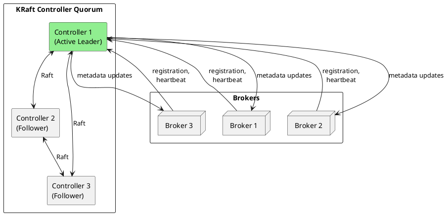
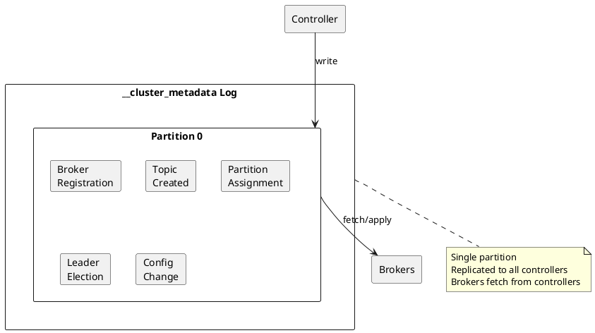
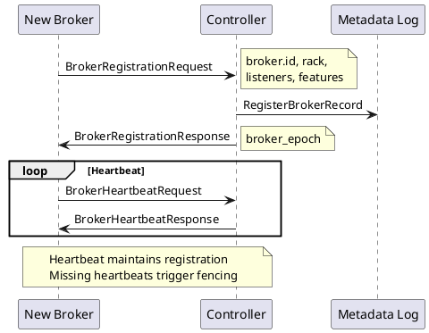
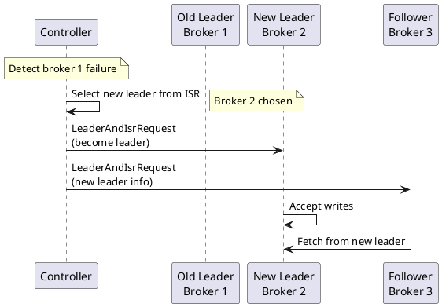
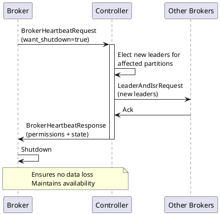

# Kafka Cluster Management

Internal mechanisms for cluster coordination, metadata management, and administrative operations.

---

## Controller Architecture

For detailed Raft consensus mechanics, controller failover, and ZooKeeper migration, see [KRaft Deep Dive](../kraft/index.md).



---

## Controller Responsibilities

| Responsibility | Description |
|----------------|-------------|
| **Broker registration** | Track broker membership and liveness |
| **Leader election** | Elect new partition leaders on failure |
| **Partition assignment** | Assign partitions to brokers |
| **Topic management** | Create, delete, and modify topics |
| **Configuration management** | Store and distribute configurations |
| **Metadata propagation** | Distribute cluster metadata to brokers |
| **Client quota management** | Enforce producer/consumer quotas |

---

## Metadata Management

### Cluster Metadata Log

In KRaft mode, all metadata is stored in the `__cluster_metadata` internal log.



Brokers do not replicate the metadata log; they fetch metadata updates from the controller quorum.

### Metadata Record Types

Common record types include:

| Record Type | Description |
|-------------|-------------|
| `RegisterBrokerRecord` | Broker joins cluster |
| `BrokerRegistrationChangeRecord` | Broker registration update |
| `FenceBrokerRecord` | Broker fenced |
| `UnfenceBrokerRecord` | Broker unfenced |
| `UnregisterBrokerRecord` | Broker leaves cluster |
| `RegisterControllerRecord` | Controller registration |
| `TopicRecord` | Topic created |
| `RemoveTopicRecord` | Topic removed |
| `PartitionRecord` | Partition assignment |
| `PartitionChangeRecord` | Leader/ISR change |
| `ConfigRecord` | Configuration change |
| `ClientQuotaRecord` | Quota configuration |
| `ProducerIdsRecord` | Producer ID allocation |
| `FeatureLevelRecord` | Feature level changes |

### Inspecting Metadata

```bash
# Dump metadata log
kafka-metadata-shell.sh --snapshot /var/kafka-logs/__cluster_metadata-0/00000000000000000000.log \
  --command "cat"

# Describe cluster
kafka-metadata-shell.sh --snapshot /var/kafka-logs/__cluster_metadata-0/00000000000000000000.log \
  --command "describe"

# List brokers
kafka-metadata-shell.sh --snapshot /var/kafka-logs/__cluster_metadata-0/00000000000000000000.log \
  --command "brokers"

# Show topic details
kafka-metadata-shell.sh --snapshot /var/kafka-logs/__cluster_metadata-0/00000000000000000000.log \
  --command "topic" --topic-name my-topic
```

---

## Broker Registration

### Registration Flow



### Broker States

| State | Description |
|-------|-------------|
| **NOT_RUNNING** | Broker not running |
| **STARTING** | Broker starting and catching up with metadata |
| **RECOVERY** | Broker caught up, waiting to be unfenced |
| **RUNNING** | Broker registered and accepting requests |
| **PENDING_CONTROLLED_SHUTDOWN** | Broker initiating controlled shutdown |
| **SHUTTING_DOWN** | Broker shutting down |

### Heartbeat Configuration

```properties
# Broker heartbeat interval
broker.heartbeat.interval.ms=2000

# Session timeout (broker considered dead if no heartbeat)
broker.session.timeout.ms=18000
```

---

## Leader Election

For detailed leader election protocol, ISR mechanics, and leader epochs, see [Replication](../replication/index.md#leader-election).

### Election Triggers

| Trigger | Description |
|---------|-------------|
| **Broker failure** | Leader broker becomes unavailable |
| **Controlled shutdown** | Broker initiates graceful shutdown |
| **Manual election** | Administrator triggers election |
| **Preferred leader** | Automatic rebalancing to preferred replica |

### Election Process



### Preferred Leader Election

```bash
# Trigger preferred leader election
kafka-leader-election.sh --bootstrap-server kafka:9092 \
  --election-type preferred \
  --all-topic-partitions

# For specific topic
kafka-leader-election.sh --bootstrap-server kafka:9092 \
  --election-type preferred \
  --topic my-topic

# Unclean election (data loss risk)
kafka-leader-election.sh --bootstrap-server kafka:9092 \
  --election-type unclean \
  --topic my-topic --partition 0
```

---

## Partition Assignment

### Initial Assignment

When creating a topic, partitions are assigned to brokers considering:
- Rack awareness (distribute across racks)
- Broker load (balance partition count)
- Existing assignments (minimize movement)

```bash
# Create topic with specific assignment
kafka-topics.sh --bootstrap-server kafka:9092 \
  --create \
  --topic my-topic \
  --replica-assignment 1:2:3,2:3:1,3:1:2
# Format: partition0_replicas,partition1_replicas,...
```

### Reassignment

```bash
# Generate reassignment plan
cat > topics.json << 'EOF'
{
  "topics": [{"topic": "my-topic"}],
  "version": 1
}
EOF

kafka-reassign-partitions.sh --bootstrap-server kafka:9092 \
  --topics-to-move-json-file topics.json \
  --broker-list "1,2,3,4" \
  --generate

# Execute plan
kafka-reassign-partitions.sh --bootstrap-server kafka:9092 \
  --reassignment-json-file reassignment.json \
  --throttle 100000000 \
  --execute

# Verify completion
kafka-reassign-partitions.sh --bootstrap-server kafka:9092 \
  --reassignment-json-file reassignment.json \
  --verify
```

---

## Configuration Management

### Dynamic Configuration

Configurations can be changed without broker restart.

```bash
# Broker configuration
kafka-configs.sh --bootstrap-server kafka:9092 \
  --entity-type brokers \
  --entity-name 1 \
  --alter \
  --add-config log.cleaner.threads=4

# Topic configuration
kafka-configs.sh --bootstrap-server kafka:9092 \
  --entity-type topics \
  --entity-name my-topic \
  --alter \
  --add-config retention.ms=86400000

# Client quota
kafka-configs.sh --bootstrap-server kafka:9092 \
  --entity-type users \
  --entity-name producer-user \
  --alter \
  --add-config producer_byte_rate=10485760
```

### Configuration Precedence

| Level | Description |
|-------|-------------|
| **Per-topic** | Highest priority, topic-specific |
| **Per-broker** | Broker-specific override |
| **Cluster-wide dynamic** | Dynamic default for all brokers |
| **Static (server.properties)** | File-based configuration |
| **Default** | Built-in defaults |

---

## Controlled Shutdown

### Graceful Shutdown Process



!!! note "ControlledShutdownRequest"
    ControlledShutdownRequest was removed in Kafka 4.0. In KRaft, brokers signal shutdown intent via BrokerHeartbeatRequest.

### Shutdown Configuration

```properties
# Enable controlled shutdown
controlled.shutdown.enable=true

# Maximum retries
controlled.shutdown.max.retries=3

# Retry backoff
controlled.shutdown.retry.backoff.ms=5000
```

---

## Cluster Health Monitoring

### Key Metrics

| Metric | Description | Alert Threshold |
|--------|-------------|-----------------|
| `ActiveControllerCount` | Active controllers | ≠ 1 |
| `OfflinePartitionsCount` | Offline partitions | > 0 |
| `UnderReplicatedPartitions` | Under-replicated partitions | > 0 |
| `GlobalPartitionCount` | Total partitions | Growing unexpectedly |

### Health Check Commands

```bash
# Check controller
kafka-metadata-shell.sh --snapshot /var/kafka-logs/__cluster_metadata-0/*.log \
  --command "describe" | grep -i controller

# Check offline partitions
kafka-topics.sh --bootstrap-server kafka:9092 \
  --describe --unavailable-partitions

# Check under-replicated
kafka-topics.sh --bootstrap-server kafka:9092 \
  --describe --under-replicated-partitions
```

---

## Related Documentation

- [Architecture Overview](../index.md) - System architecture
- [Brokers](../brokers/index.md) - Broker internals
- [Replication](../replication/index.md) - Replication protocol
- [Fault Tolerance](../fault-tolerance/index.md) - Failure handling
- [Operations](../../operations/index.md) - Operational procedures
