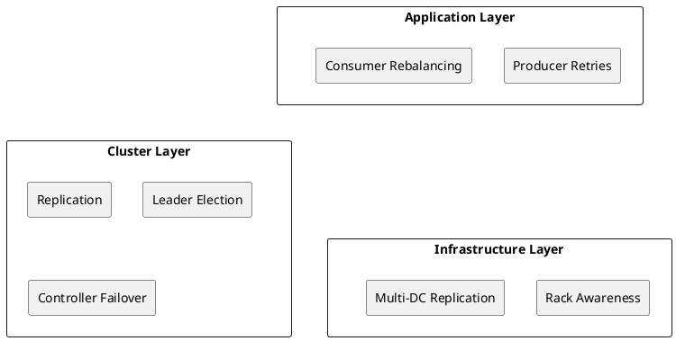
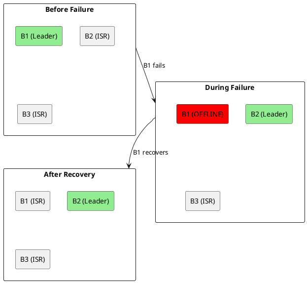
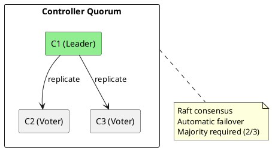
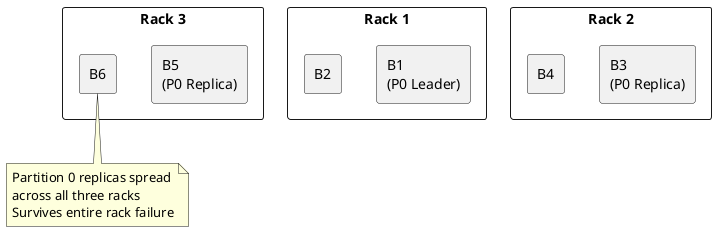

# Fault Tolerance

Kafka's fault tolerance mechanisms ensure data durability and service availability during failures.

---

## Fault Tolerance Layers



---

## Broker Failure Scenarios

### Single Broker Failure



| Phase | Action |
|-------|--------|
| Detection | Controller detects broker offline (session timeout) |
| Election | Controller elects new leader from ISR |
| Recovery | Returning broker catches up as follower |

### Multiple Broker Failures

| Scenario | Impact | Mitigation |
|----------|--------|------------|
| Brokers < RF fail | No data loss if ISR healthy | Use RF ≥ 3 |
| All ISR fail | Partition unavailable | Use min.insync.replicas |
| Unclean election | Potential data loss | Disable unclean election |

---

## Controller Failover

For complete Raft consensus mechanics, election protocols, and metadata recovery, see [KRaft Deep Dive](../kraft/index.md#failover-behavior).

### KRaft Controller Quorum



### Failover Sequence

1. Leader controller fails
2. Remaining voters detect failure (heartbeat timeout)
3. New election triggered
4. Voter with most up-to-date log wins
5. New leader resumes metadata operations

---

## Rack Awareness

Distribute replicas across failure domains to survive rack/zone failures. For complete topology design including network architecture and multi-datacenter layouts, see [Topology](../topology/index.md#rack-awareness).



### Configuration

```properties
# Broker configuration
broker.rack=rack1

# Replica placement
replica.selector.class=org.apache.kafka.common.replica.RackAwareReplicaSelector
```

---

## Data Durability Settings

For detailed ISR mechanics, acknowledgment levels, and min.insync.replicas behavior, see [Replication](../replication/index.md#acknowledgment-levels).

### Producer Configuration

```properties
# Maximum durability
acks=all
retries=2147483647
delivery.timeout.ms=120000
enable.idempotence=true

# Ordering guarantee
max.in.flight.requests.per.connection=5
```

### Broker Configuration

```properties
# Replication
default.replication.factor=3
min.insync.replicas=2
unclean.leader.election.enable=false

# Durability
log.flush.interval.messages=10000
log.flush.interval.ms=1000
```

### Durability Matrix

| acks | min.insync.replicas | RF | Survives |
|------|---------------------|-----|----------|
| 1 | 1 | 3 | 0 broker failures (leader) |
| all | 1 | 3 | RF-1 broker failures |
| all | 2 | 3 | 1 broker failure |
| all | 2 | 5 | 3 broker failures |

---

## Failure Detection

### Broker Detection

| Mechanism | Configuration | Default |
|-----------|---------------|---------|
| Session timeout | `broker.session.timeout.ms` | 18000 |
| Heartbeat interval | `broker.heartbeat.interval.ms` | 2000 |

### Client Detection

| Client | Setting | Default |
|--------|---------|---------|
| Producer | `request.timeout.ms` | 30000 |
| Consumer | `session.timeout.ms` | 45000 |
| Consumer | `heartbeat.interval.ms` | 3000 |

---

## Recovery Procedures

### Partition Recovery

```bash
# Check offline partitions
kafka-topics.sh --bootstrap-server kafka:9092 \
  --describe --unavailable-partitions

# Check under-replicated
kafka-topics.sh --bootstrap-server kafka:9092 \
  --describe --under-replicated-partitions

# Force leader election (if ISR available)
kafka-leader-election.sh --bootstrap-server kafka:9092 \
  --election-type preferred \
  --topic my-topic \
  --partition 0
```

### Unclean Recovery (Last Resort)

!!! danger "Data Loss Risk"
    Unclean leader election can result in data loss. Use only when availability is critical.

```bash
# Temporarily enable unclean election
kafka-configs.sh --bootstrap-server kafka:9092 \
  --entity-type topics \
  --entity-name my-topic \
  --alter \
  --add-config unclean.leader.election.enable=true

# Trigger election
kafka-leader-election.sh --bootstrap-server kafka:9092 \
  --election-type unclean \
  --topic my-topic \
  --partition 0

# Disable unclean election
kafka-configs.sh --bootstrap-server kafka:9092 \
  --entity-type topics \
  --entity-name my-topic \
  --alter \
  --delete-config unclean.leader.election.enable
```

---

## Monitoring for Failures

### Critical Alerts

| Metric | Condition | Severity |
|--------|-----------|----------|
| `OfflinePartitionsCount` | > 0 | Critical |
| `UnderReplicatedPartitions` | > 0 for 5min | Warning |
| `UnderMinIsrPartitionCount` | > 0 | Critical |
| `ActiveControllerCount` | ≠ 1 | Critical |

### Health Checks

```bash
#!/bin/bash
# health-check.sh

# Check for offline partitions
OFFLINE=$(kafka-topics.sh --bootstrap-server kafka:9092 \
  --describe --unavailable-partitions 2>/dev/null | wc -l)

if [ "$OFFLINE" -gt 0 ]; then
  echo "CRITICAL: $OFFLINE offline partitions"
  exit 2
fi

# Check for under-replicated
UNDER_REP=$(kafka-topics.sh --bootstrap-server kafka:9092 \
  --describe --under-replicated-partitions 2>/dev/null | wc -l)

if [ "$UNDER_REP" -gt 0 ]; then
  echo "WARNING: $UNDER_REP under-replicated partitions"
  exit 1
fi

echo "OK: Cluster healthy"
exit 0
```

---

## Best Practices

| Practice | Rationale |
|----------|-----------|
| Use RF ≥ 3 | Survive multiple failures |
| Set min.insync.replicas = 2 | Ensure durability with acks=all |
| Disable unclean election | Prevent data loss |
| Enable rack awareness | Survive rack failures |
| Regular failover testing | Validate recovery procedures |
| Monitor ISR shrinkage | Detect issues early |

---

## Related Documentation

- [Replication](../replication/index.md) - Replication protocol
- [Brokers](../brokers/index.md) - Broker architecture
- [Multi-Datacenter](../../concepts/multi-datacenter/index.md) - DR strategies
- [Operations](../../operations/index.md) - Operational procedures
