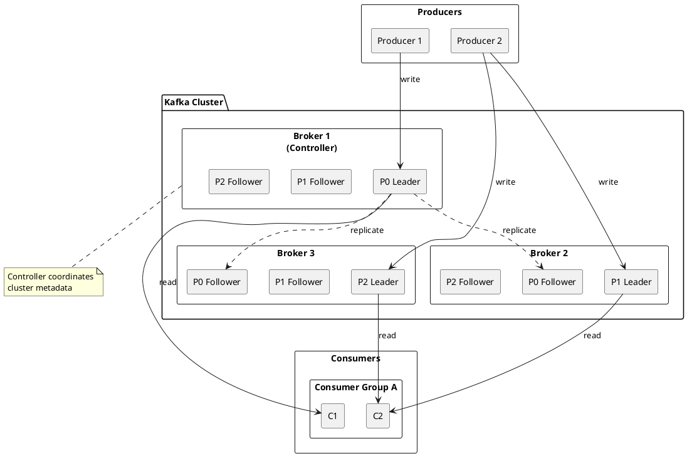
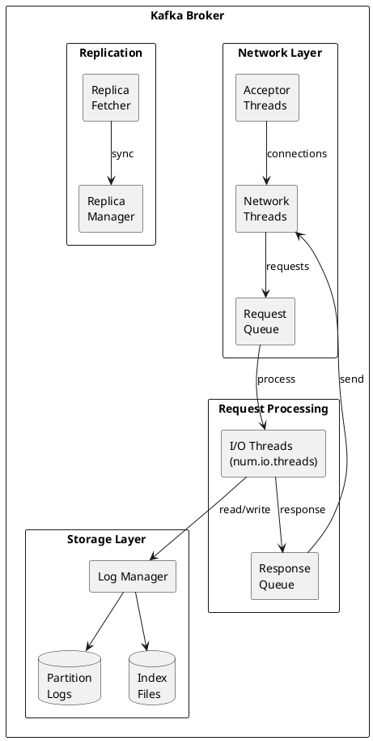
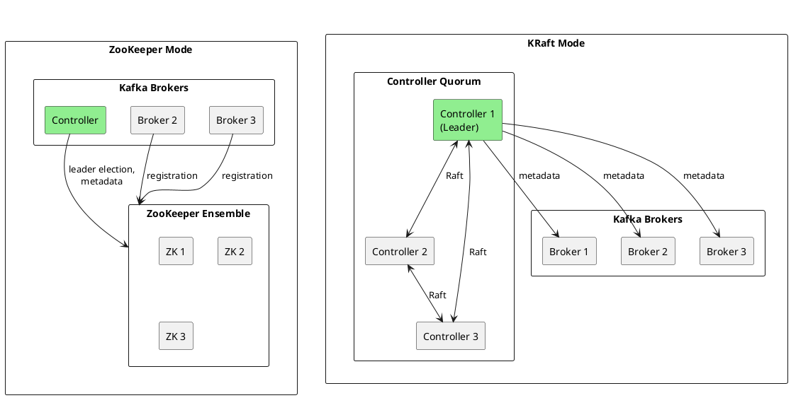
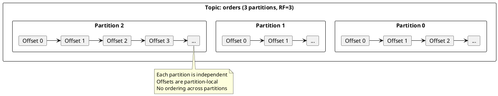
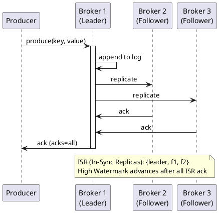
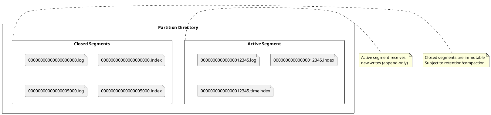
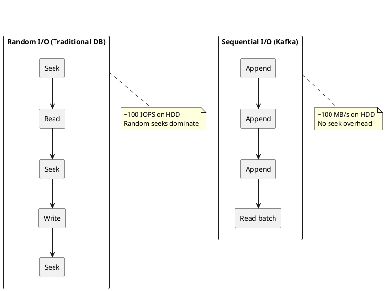
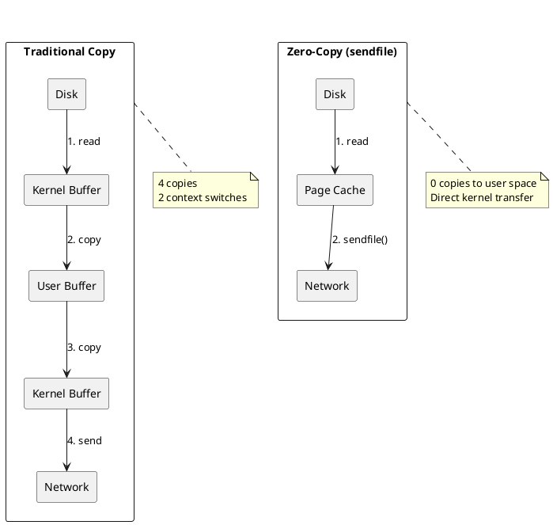

# Kafka Architecture

Apache Kafka is a distributed commit log designed for high-throughput, fault-tolerant, real-time data streaming.

---

## Architectural Overview

Kafka's architecture consists of brokers forming a cluster, with data organized into topics and partitions. Producers write to topic partitions, and consumers read from them.

### Core Components

| Component | Description |
|-----------|-------------|
| **Broker** | Server that stores data and serves client requests |
| **Controller** | Broker responsible for cluster coordination (leader election, partition assignment) |
| **Topic** | Named category of records; logical grouping of related events |
| **Partition** | Ordered, immutable sequence of records within a topic |
| **Replica** | Copy of a partition for fault tolerance |
| **Producer** | Client that publishes records to topics |
| **Consumer** | Client that subscribes to topics and processes records |
| **Consumer Group** | Set of consumers that coordinate to consume a topic |

---

## Brokers

Brokers are the servers that form a Kafka cluster. Each broker:

- Stores partition data on disk
- Handles produce and fetch requests from clients
- Replicates data to other brokers
- Participates in cluster coordination

### Broker Architecture

### Key Broker Configurations

| Configuration | Default | Description |
|---------------|---------|-------------|
| `broker.id` | -1 (auto) | Unique identifier for this broker |
| `log.dirs` | /tmp/kafka-logs | Directories for partition data |
| `num.network.threads` | 3 | Threads for network I/O |
| `num.io.threads` | 8 | Threads for disk I/O |
| `socket.send.buffer.bytes` | 102400 | Socket send buffer |
| `socket.receive.buffer.bytes` | 102400 | Socket receive buffer |
| `socket.request.max.bytes` | 104857600 | Maximum request size (100MB) |

→ [Broker Deep Dive](brokers/index.md)

---

## Controller

The controller manages cluster-wide metadata operations. In KRaft mode, controllers are a dedicated process role; in ZooKeeper mode, a broker is elected as controller.

### Controller Responsibilities

| Responsibility | Description |
|----------------|-------------|
| **Leader election** | Elect new partition leaders when leaders fail |
| **Partition assignment** | Assign partitions to brokers |
| **Broker registration** | Track broker membership in cluster |
| **Topic management** | Create and delete topics |
| **Metadata propagation** | Distribute cluster metadata to all brokers |

### KRaft vs ZooKeeper

Kafka is transitioning from ZooKeeper to KRaft (Kafka Raft) for cluster coordination.

| Aspect | ZooKeeper Mode | KRaft Mode |
|--------|----------------|------------|
| **External dependency** | ZooKeeper cluster required | None |
| **Metadata storage** | Split (ZK + broker logs) | Unified (__cluster_metadata topic) |
| **Failover time** | Seconds to minutes | Milliseconds to seconds |
| **Partition scale** | Higher metadata overhead; lower practical limits | Higher practical partition counts |
| **Operational complexity** | Two systems to manage | Single system |
| **Version** | Removed in Kafka 4.0 | Kafka 3.3+ (production ready) |

→ [KRaft Deep Dive](kraft/index.md)

---

## Partitions and Replication

### Partitions

A topic is divided into partitions—ordered, append-only logs. Partitions enable:

- **Parallelism**: Multiple consumers can read different partitions concurrently
- **Ordering**: Records within a partition maintain strict order
- **Scalability**: Partitions can be distributed across brokers

### Replication

Each partition has multiple replicas distributed across brokers. One replica is the leader; others are followers.

### Replication Concepts

For complete ISR mechanics, leader election protocol, and acknowledgment configuration, see [Replication](replication/index.md).

| Concept | Description |
|---------|-------------|
| **Leader** | Replica that handles all reads and writes for a partition |
| **Follower** | Replica that replicates from leader; can become leader if current leader fails |
| **ISR (In-Sync Replicas)** | Set of replicas that are fully caught up with leader |
| **High Watermark** | Offset up to which all ISR have replicated; consumers can only read up to HW |
| **LEO (Log End Offset)** | Latest offset in the leader's log |

### Replication Factor

The replication factor determines how many copies of each partition exist:

| RF | Behavior | Use Case |
|----|----------|----------|
| **1** | No redundancy; data loss on broker failure | Development only |
| **2** | Tolerates 1 broker failure with `min.insync.replicas=1` | Limited production use |
| **3** | Tolerates 1 broker failure with `min.insync.replicas=2` | Production standard |
| **4+** | Higher durability; rarely needed | Critical data |

→ [Replication Deep Dive](replication/index.md)

---

## Storage Engine

Kafka stores data in log segments on disk. The storage design prioritizes sequential I/O for maximum throughput. For complete storage internals including indexes, compaction, and retention policies, see [Storage Engine](storage-engine/index.md).

### Log Segment Files

| File | Purpose |
|------|---------|
| `.log` | Message data (key, value, headers, metadata) |
| `.index` | Offset-to-position index for efficient seeking |
| `.timeindex` | Timestamp-to-offset index for time-based seeking |
| `.txnindex` | Transaction index (for transactional messages) |
| `.snapshot` | Producer state snapshots |

### Retention Policies

| Policy | Configuration | Behavior |
|--------|---------------|----------|
| **Time-based** | `retention.ms` | Delete segments older than threshold |
| **Size-based** | `retention.bytes` | Delete oldest segments when partition exceeds size |
| **Compaction** | `cleanup.policy=compact` | Keep only latest value per key |

→ [Storage Engine Deep Dive](storage-engine/index.md)

---

## Performance Architecture

Kafka achieves high throughput through several design choices. For detailed performance tuning, benchmarking, and optimization techniques, see [Performance Internals](performance-internals/index.md).

### Sequential I/O

### Zero-Copy Transfers

Kafka uses `sendfile()` to transfer data directly from disk to network, bypassing user-space copies.

!!! warning "TLS Disables Zero-Copy"
    When TLS encryption is enabled, zero-copy is not possible because data must be encrypted in user space. Throughput impact depends on CPU and workload.

### Batching

Producers batch messages before sending, and consumers fetch in batches:

| Batching Point | Configuration | Benefit |
|----------------|---------------|---------|
| **Producer** | `batch.size`, `linger.ms` | Amortize network overhead, enable compression |
| **Broker** | Internal batching | Efficient disk writes |
| **Consumer** | `fetch.min.bytes`, `fetch.max.wait.ms` | Reduce fetch requests |

### OS Page Cache

Kafka relies on the OS page cache rather than managing its own cache:

| Benefit | Description |
|---------|-------------|
| **Automatic management** | OS handles cache eviction |
| **Warm restarts** | Cache survives broker restarts |
| **Memory efficiency** | Avoids double-buffering in JVM |
| **Read-ahead** | OS prefetches sequential reads |

→ [Performance Internals](performance-internals/index.md)

---

## Fault Tolerance

Kafka survives failures at multiple levels. For complete failure scenarios, recovery procedures, and monitoring strategies, see [Fault Tolerance](fault-tolerance/index.md).

| Failure | Kafka Response |
|---------|----------------|
| **Single broker** | Leader election; ISR continues serving |
| **Multiple brokers** | Service continues if enough replicas remain |
| **Rack failure** | Rack-aware placement ensures cross-rack replicas |
| **Network partition** | ISR shrinks; `acks=all` writes fail if ISR < `min.insync.replicas` |
| **Disk failure** | Replicas on failed log dirs go offline; leaders move to healthy replicas |

### Data Durability Configuration

| Setting | Value | Behavior |
|---------|-------|----------|
| `acks=all` | Producer waits for all ISR | Strongest durability |
| `min.insync.replicas=2` | Require 2 replicas for writes | Prevents single-replica writes |
| `unclean.leader.election.enable=false` | Only ISR can become leader | Prevents data loss on failover |

→ [Fault Tolerance Guide](fault-tolerance/index.md)

---

## Related Documentation

- [Topics and Partitions](topics/index.md) - Partitions, leaders, ISR, replication
- [Transaction Coordinator](transactions/index.md) - Exactly-once semantics, two-phase commit
- [Brokers](brokers/index.md) - Broker architecture and configuration
- [KRaft](kraft/index.md) - KRaft consensus mode
- [Replication](replication/index.md) - ISR, leader election, durability
- [Storage Engine](storage-engine/index.md) - Log segments, indexes, compaction
- [Performance Internals](performance-internals/index.md) - Zero-copy, batching, tuning
- [Fault Tolerance](fault-tolerance/index.md) - Failure scenarios and recovery
- [Topology](topology/index.md) - Rack awareness, network design