# KRaft: Kafka Raft Consensus

KRaft (Kafka Raft) is Kafka's built-in consensus protocol that replaced Apache ZooKeeper for metadata management. Introduced in Kafka 2.8 and production-ready since Kafka 3.3, KRaft simplifies Kafka's architecture by eliminating the external ZooKeeper dependency.

---

## Why KRaft Replaced ZooKeeper

### Architectural Simplification

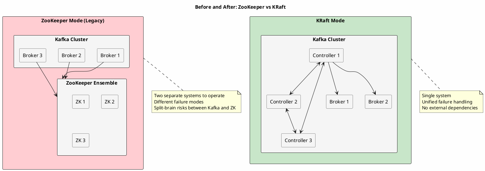

### Benefits of KRaft

| Aspect | ZooKeeper Mode | KRaft Mode |
|--------|----------------|------------|
| **Operational complexity** | Two systems to manage | Single system |
| **Scaling** | Higher metadata overhead; lower practical limits | Higher practical partition counts |
| **Recovery time** | Minutes (controller failover) | Seconds |
| **Metadata propagation** | Pull-based, eventually consistent | Fetch-based, ordered |
| **Security** | Separate auth for ZK | Unified Kafka security |
| **Monitoring** | Two metric systems | Single metric system |

---

## Raft Consensus Protocol

KRaft implements the Raft consensus algorithm for leader election and log replication among controllers.

### Raft Fundamentals

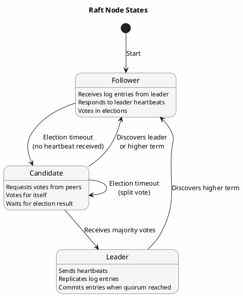

### Leader Election

When the controller leader fails, remaining controllers elect a new leader:

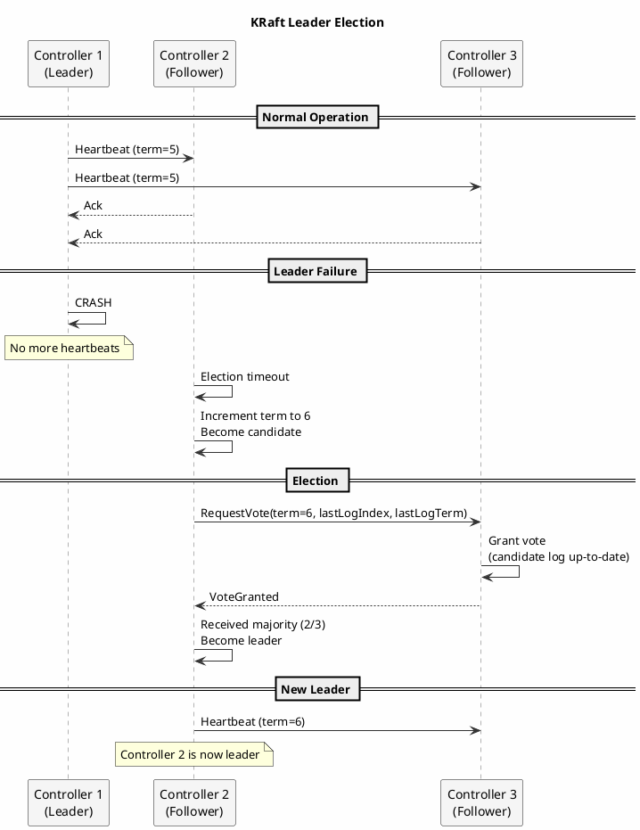

**Election rules:**

1. **Term** — Logical clock incremented on each election
2. **Vote** — Each controller votes once per term
3. **Log completeness** — Only vote for candidates with up-to-date logs
4. **Majority** — Candidate needs `(n/2) + 1` votes to become leader

### Log Replication

The leader replicates metadata log entries to followers:

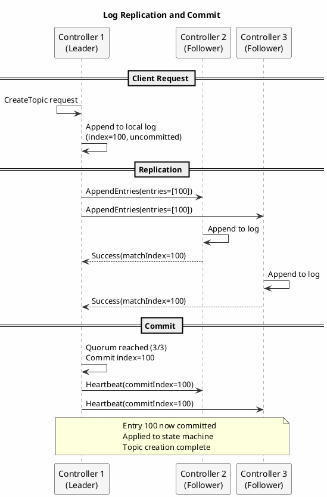

**Commit rules:**

- Entry is committed when replicated to a majority of controllers
- Only entries from the current term can be committed directly
- Committing an entry commits all prior entries

### Quorum and Fault Tolerance

| Controllers | Quorum | Tolerated Failures |
|-------------|--------|-------------------|
| 1 | 1 | 0 (no fault tolerance) |
| 3 | 2 | 1 |
| 5 | 3 | 2 |
| 7 | 4 | 3 |

**Recommendation:** Use 3 controllers for most deployments. Use 5 for large clusters requiring higher availability.

---

## Metadata Log

All cluster metadata is stored in a replicated log, not in an external system.

### Log Structure

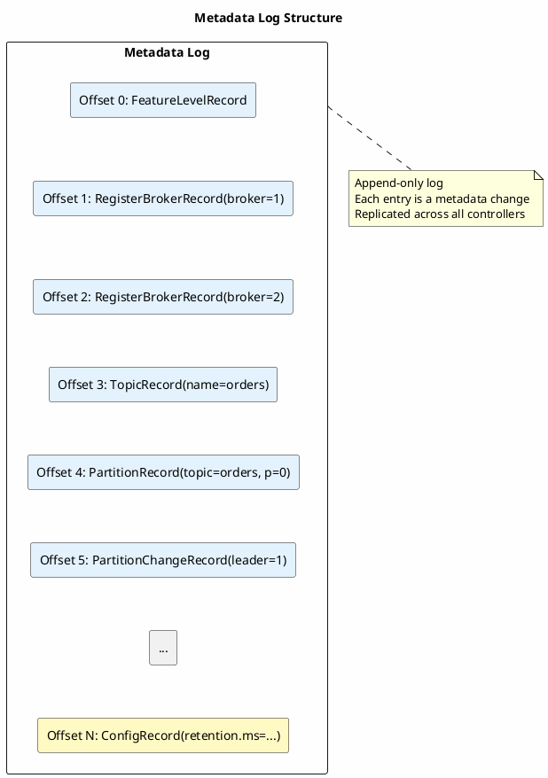

### Record Types

| Category | Record Types (non-exhaustive) |
|----------|--------------|
| **Cluster** | `FeatureLevelRecord`, `ZkMigrationStateRecord` |
| **Brokers** | `RegisterBrokerRecord`, `UnregisterBrokerRecord`, `BrokerRegistrationChangeRecord`, `FenceBrokerRecord`, `UnfenceBrokerRecord` |
| **Topics** | `TopicRecord`, `RemoveTopicRecord` |
| **Partitions** | `PartitionRecord`, `PartitionChangeRecord` |
| **Configuration** | `ConfigRecord`, `RemoveConfigRecord` |
| **Security** | `ClientQuotaRecord`, `UserScramCredentialRecord`, `AccessControlEntryRecord` |
| **Producers** | `ProducerIdsRecord` |

### Snapshots

To prevent unbounded log growth, controllers periodically create snapshots:

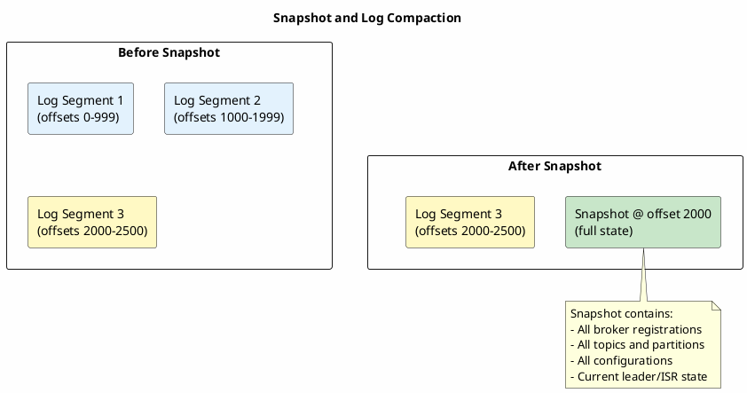

**Snapshot configuration:**

```properties
# Minimum records between snapshots
metadata.log.max.record.bytes.between.snapshots=20971520

# Maximum time between snapshots
metadata.log.max.snapshot.interval.ms=3600000
```

### Storage Location

```bash
# Metadata log directory structure
/var/kafka-logs/__cluster_metadata-0/
├── 00000000000000000000.log      # Log segment
├── 00000000000000000000.index    # Offset index
├── 00000000000000000000.timeindex
├── 00000000000000001000.log      # Next segment
├── 00000000000000001000-checkpoint.snapshot  # Snapshot
└── leader-epoch-checkpoint
```

---

## Controller Communication

### Controller-to-Controller (Raft)

Controllers communicate using the Raft protocol over a dedicated listener:

```properties
# Controller listener configuration
controller.listener.names=CONTROLLER
listeners=CONTROLLER://0.0.0.0:9093

# Inter-controller security
listener.security.protocol.map=CONTROLLER:SSL
```

### Controller-to-Broker (Metadata Fetch)

In KRaft, brokers fetch metadata updates from the controller log (unlike ZooKeeper watch-based updates):

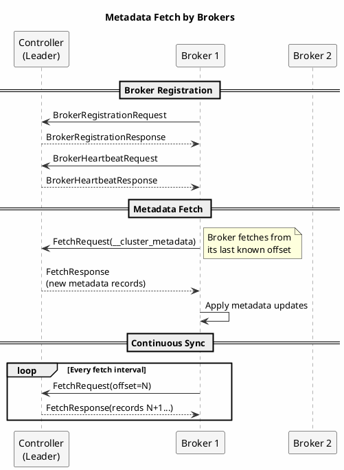

**Key difference from ZooKeeper:**

| Aspect | ZooKeeper Mode | KRaft Mode |
|--------|----------------|------------|
| **Propagation** | Watch-based, async | Fetch-based, controlled |
| **Consistency** | Eventual | Offset-based, ordered |
| **Latency** | Variable | Predictable |

---

## Quorum Configuration

### Controller Quorum Voters

```properties
# Define the controller quorum
controller.quorum.voters=1@controller1:9093,2@controller2:9093,3@controller3:9093

# Format: node.id@host:port
# All controllers must have the same voter list
```

### Deployment Modes

#### Combined Mode (Development/Small Clusters)

Controllers and brokers run in the same JVM:

```properties
# server.properties for combined mode
process.roles=broker,controller
node.id=1
controller.quorum.voters=1@node1:9093,2@node2:9093,3@node3:9093
```

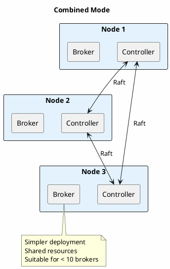

#### Isolated Mode (Production/Large Clusters)

Dedicated controller nodes separate from brokers:

```properties
# controller.properties (controller-only nodes)
process.roles=controller
node.id=1
controller.quorum.voters=1@ctrl1:9093,2@ctrl2:9093,3@ctrl3:9093

# broker.properties (broker-only nodes)
process.roles=broker
node.id=101
controller.quorum.voters=1@ctrl1:9093,2@ctrl2:9093,3@ctrl3:9093
```

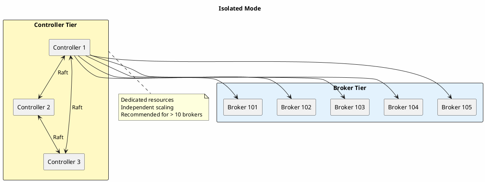

### Controller Sizing

Kafka controllers keep cluster metadata in memory and on disk.

| Cluster Size | Controller Count | Controller Resources |
|--------------|------------------|---------------------|
| Development | 1 (no HA) | 1 CPU, 1GB RAM |
| Small (< 10 brokers) | 3 (combined mode) | 2 CPU, 4GB RAM |
| Medium (10-50 brokers) | 3 (isolated) | 4 CPU, 8GB RAM |
| Large (50+ brokers) | 5 (isolated) | 8 CPU, 16GB RAM |

!!! note "Sourcing"
    The table above reflects repository guidance. Kafka's KRaft ops docs note that typical clusters can use ~5 GB memory and ~5 GB disk for the metadata log directory.

---

## Failover Behavior

### Controller Leader Failure

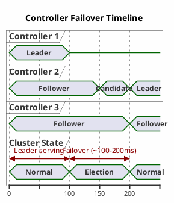

**Failover characteristics:**

| Metric | Typical Value |
|--------|---------------|
| Detection time | ≤ `controller.quorum.fetch.timeout.ms` (default 2000ms) |
| Election time | ≤ `controller.quorum.election.timeout.ms` (default 1000ms) |
| Total failover | Detection + election + metadata catch-up |

### Broker Behavior During Failover

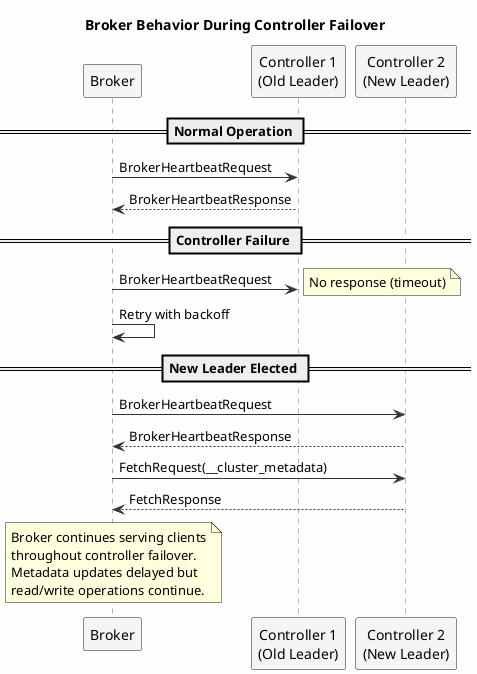

**Key point:** Broker data operations (produce/consume) continue during controller failover. Only metadata operations (topic creation, leader election) are temporarily blocked.

### Split-Brain Prevention

Raft's quorum requirement prevents split-brain:

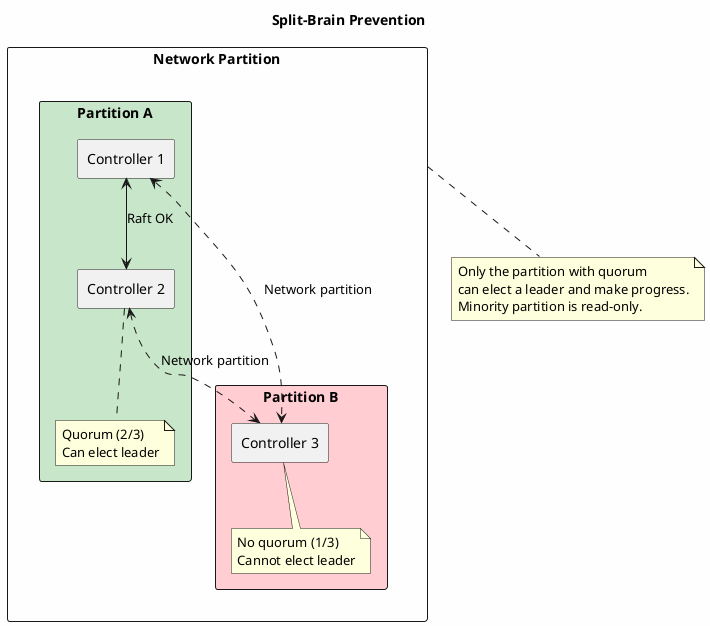

---

## Migration from ZooKeeper

### Migration Modes

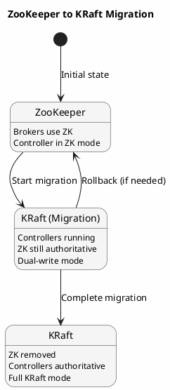

### Migration Steps

1. **Deploy controller quorum:**

```bash
# Format controller storage
kafka-storage.sh format -t $(kafka-storage.sh random-uuid) \
  -c controller.properties
```

2. **Enable migration mode:**

```properties
# In broker server.properties
zookeeper.metadata.migration.enable=true
controller.quorum.voters=1@ctrl1:9093,2@ctrl2:9093,3@ctrl3:9093
```

3. **Start controllers and migrate:**

```bash
# Controllers will sync metadata from ZooKeeper
# Monitor migration progress
kafka-metadata-shell.sh --snapshot /var/kafka-logs/__cluster_metadata-0/*.log \
  describe
```

4. **Restart brokers in KRaft mode:**

```properties
# Remove ZK config, enable KRaft
process.roles=broker
controller.quorum.voters=1@ctrl1:9093,2@ctrl2:9093,3@ctrl3:9093
# Remove: zookeeper.connect=...
```

### Rollback Capability

During migration, rollback is possible until finalization:

| Phase | Rollback Possible | Data Safe |
|-------|-------------------|-----------|
| Controllers deployed | Yes | Yes |
| Dual-write mode | Yes | Yes |
| Brokers migrated | Yes (restart with ZK) | Yes |
| Migration finalized | No | N/A |

---

## Troubleshooting

### Common Issues

| Issue | Symptom | Resolution |
|-------|---------|------------|
| **No leader elected** | `LEADER_NOT_AVAILABLE` errors | Check controller connectivity, verify quorum voters |
| **Metadata out of sync** | Brokers have stale topic info | Check broker fetch lag from controllers |
| **Controller OOM** | Controller crashes | Increase heap, check for partition explosion |
| **Slow elections** | Long failover time | Check network latency between controllers |

### Diagnostic Commands

```bash
# Check controller quorum status
kafka-metadata-quorum.sh --bootstrap-controller ctrl1:9093 \
  describe --status

# View current controller leader
kafka-metadata-quorum.sh --bootstrap-controller ctrl1:9093 \
  describe --status | rg -i leader

# Check metadata log lag
kafka-metadata-shell.sh --snapshot /var/kafka-logs/__cluster_metadata-0/*.log \
  log | tail -20

# Verify broker registration
kafka-broker-api-versions.sh --bootstrap-server broker1:9092
```

### Key Metrics

| Metric | Description | Alert Condition |
|--------|-------------|-----------------|
| `kafka.controller:type=KafkaController,name=ActiveControllerCount` | Active controllers | ≠ 1 |
| `kafka.controller:type=ControllerEventManager,name=EventQueueSize` | Pending controller events | > 1000 |
| `kafka.server:type=MetadataLoader,name=CurrentMetadataOffset` | Broker metadata offset | Lag > 1000 |
| `kafka.raft:type=RaftMetrics,name=CommitLatencyAvg` | Raft commit latency | > 100ms |

---

## Summary

| Aspect | Detail |
|--------|--------|
| **What** | Built-in consensus replacing ZooKeeper |
| **Protocol** | Raft (leader election, log replication) |
| **Storage** | `__cluster_metadata` topic |
| **Quorum** | 3 or 5 controllers recommended |
| **Failover** | 2-5 seconds typical |
| **Deployment** | Combined (small) or isolated (large) mode |

---

## Related Documentation

- [Cluster Management](../cluster-management/index.md) - Controller operations
- [Fault Tolerance](../fault-tolerance/index.md) - Failure handling
- [Brokers](../brokers/index.md) - Broker internals
- [Architecture Overview](../index.md) - System architecture
