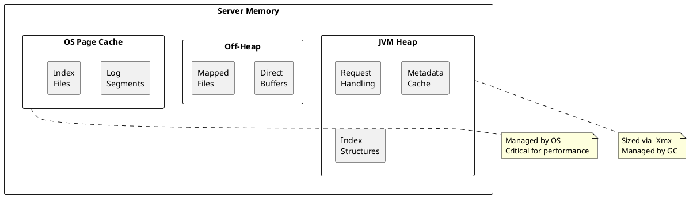
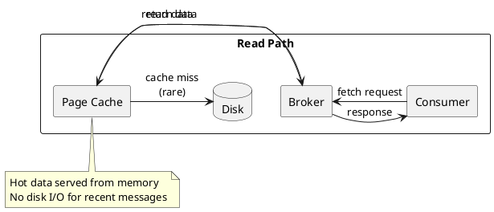
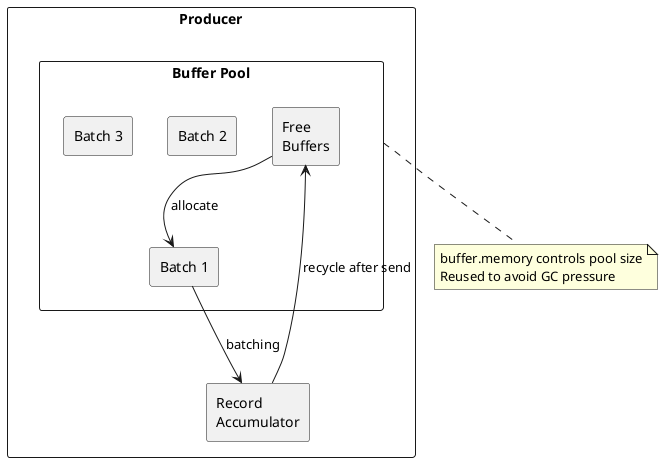

# Kafka Memory Management

Memory architecture and optimization for Apache Kafka brokers and clients.

---

## Memory Architecture Overview



---

## JVM Heap

### Heap Components

| Component | Description | Memory Impact |
|-----------|-------------|---------------|
| **Request buffers** | Incoming/outgoing request data | Proportional to connections |
| **Metadata cache** | Topic/partition metadata | Proportional to partitions |
| **Index structures** | In-memory index pointers | ~10MB per 1000 partitions |
| **Producer state** | Idempotent producer tracking | ~5KB per producer per partition |
| **Group coordinator** | Consumer group state | Proportional to groups/members |

### Recommended Heap Sizes

| Cluster Size | Partitions | Heap Size |
|--------------|------------|-----------|
| Small | < 1,000 | 4-6 GB |
| Medium | 1,000-10,000 | 6-8 GB |
| Large | 10,000-50,000 | 8-12 GB |
| Very Large | > 50,000 | 12-16 GB |

### JVM Configuration

```bash
# Recommended JVM settings
export KAFKA_HEAP_OPTS="-Xms6g -Xmx6g"

# GC settings (G1GC recommended)
export KAFKA_JVM_PERFORMANCE_OPTS="-server \
  -XX:+UseG1GC \
  -XX:MaxGCPauseMillis=20 \
  -XX:InitiatingHeapOccupancyPercent=35 \
  -XX:+ExplicitGCInvokesConcurrent \
  -XX:G1HeapRegionSize=16M \
  -XX:MetaspaceSize=96m \
  -XX:MinMetaspaceFreeRatio=50 \
  -XX:MaxMetaspaceFreeRatio=80"
```

---

## OS Page Cache

### Page Cache Role

Kafka relies heavily on the OS page cache for performance. The page cache stores recently accessed disk data in RAM.



### Page Cache Sizing

**Rule of thumb:** Reserve at least as much RAM for page cache as data you want to keep "hot" (typically last few hours of data).

```
Page Cache = Total RAM - JVM Heap - OS Overhead

Example:
  Total RAM: 64 GB
  JVM Heap: 6 GB
  OS/Other: 2 GB
  Page Cache: ~56 GB available
```

### Monitoring Page Cache

```bash
# Check memory usage
free -g

# Check page cache hit ratio
cat /proc/meminfo | grep -E "Cached|Buffers|MemFree|MemTotal"

# Monitor disk I/O (high I/O = cache misses)
iostat -x 1
```

---

## Buffer Pools

### Network Buffer Pool

Kafka uses buffer pools to reduce garbage collection overhead.

```properties
# Broker network buffer sizing
socket.send.buffer.bytes=102400
socket.receive.buffer.bytes=102400
socket.request.max.bytes=104857600
```

### Producer Buffer Pool



```properties
# Producer buffer configuration
buffer.memory=33554432           # 32MB total buffer pool
batch.size=16384                 # 16KB per batch
linger.ms=5                      # Wait time for batching
```

### Consumer Buffer Pool

```properties
# Consumer fetch sizing
fetch.min.bytes=1                # Minimum bytes to fetch
fetch.max.bytes=52428800         # Maximum per fetch (50MB)
max.partition.fetch.bytes=1048576  # Per partition (1MB)
```

---

## Memory Pressure Scenarios

### Heap Exhaustion

**Symptoms:**
- `OutOfMemoryError`
- GC taking > 10% of time
- Request latency spikes

**Causes:**
| Cause | Solution |
|-------|----------|
| Too many partitions | Reduce partitions or increase heap |
| Large metadata cache | Reduce topic count |
| Producer state buildup | Reduce idempotent producers |
| Memory leak | Update Kafka version |

### Page Cache Exhaustion

**Symptoms:**
- High disk read I/O
- Consumer latency increases
- `await` time in iostat high

**Causes:**
| Cause | Solution |
|-------|----------|
| Heap too large | Reduce heap, leave more for cache |
| Too much data | Add more brokers |
| Random access patterns | Improve consumer patterns |

---

## Garbage Collection

### G1GC Tuning

```bash
# Recommended G1GC settings
-XX:+UseG1GC
-XX:MaxGCPauseMillis=20
-XX:InitiatingHeapOccupancyPercent=35
-XX:G1HeapRegionSize=16M
```

| Parameter | Purpose |
|-----------|---------|
| `MaxGCPauseMillis` | Target pause time (20ms recommended) |
| `InitiatingHeapOccupancyPercent` | When to start concurrent GC |
| `G1HeapRegionSize` | Region size (16M for larger heaps) |

### GC Monitoring

```bash
# Enable GC logging
-Xlog:gc*:file=/var/log/kafka/gc.log:time,tags:filecount=10,filesize=100M

# Monitor GC
jstat -gc <pid> 1000

# Analyze GC log
# Look for: pause times, frequency, throughput
```

### GC Metrics

| Metric | Target |
|--------|--------|
| GC pause time | < 20ms |
| GC frequency | < 1 per second |
| GC throughput | > 99% |

---

## Direct Memory

### Off-Heap Buffers

Kafka uses direct memory for network I/O operations.

```bash
# Configure direct memory limit
-XX:MaxDirectMemorySize=2g
```

### Memory-Mapped Files

Index files use memory-mapped I/O:

```properties
# These files are memory-mapped
# .index - offset index
# .timeindex - timestamp index
```

---

## Client Memory Management

### Producer Memory

```properties
# Total memory for buffering
buffer.memory=33554432

# Memory allocation behavior
max.block.ms=60000  # Block when buffer full
```

**Memory calculation:**
```
Required memory = buffer.memory +
                  (partitions × batch.size overhead) +
                  compression buffers
```

### Consumer Memory

```properties
# Fetch sizing
fetch.max.bytes=52428800
max.poll.records=500
```

**Memory calculation:**
```
Required memory = fetch.max.bytes +
                  deserialization buffers +
                  record processing buffers
```

---

## Memory Tuning Checklist

### Broker

- [ ] Set heap size appropriately (6-12GB typical)
- [ ] Leave sufficient RAM for page cache
- [ ] Configure G1GC with appropriate pause target
- [ ] Monitor GC pause times and frequency
- [ ] Watch for page cache evictions

### Producer

- [ ] Size `buffer.memory` for throughput needs
- [ ] Set appropriate `batch.size`
- [ ] Monitor `buffer-available-bytes` metric

### Consumer

- [ ] Configure fetch sizes appropriately
- [ ] Set `max.poll.records` for processing capacity
- [ ] Monitor memory usage in application

---

## Related Documentation

- [Architecture Overview](../index.md) - System architecture
- [Performance Internals](../performance-internals/index.md) - Performance tuning
- [Brokers](../brokers/index.md) - Broker configuration
- [Operations](../../operations/index.md) - Operational procedures
