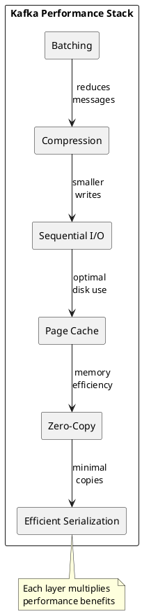
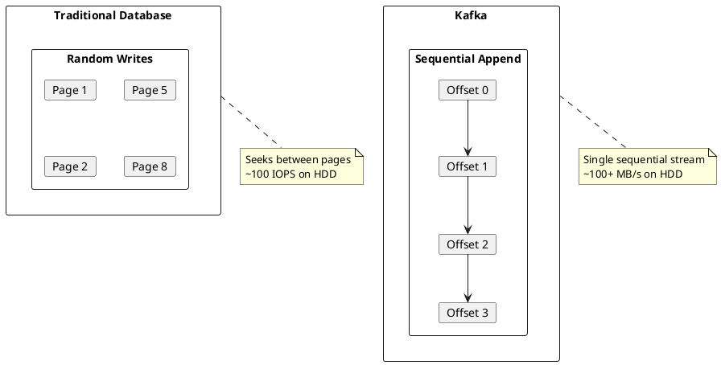
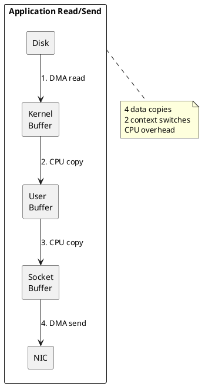
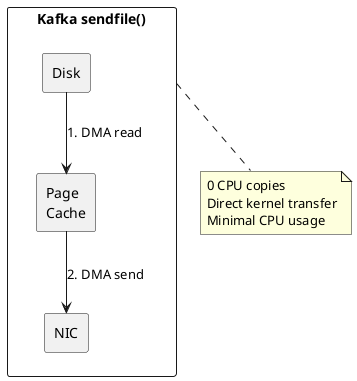
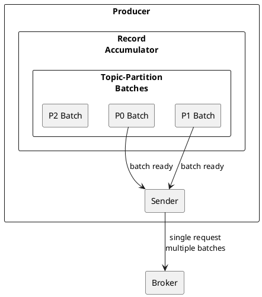
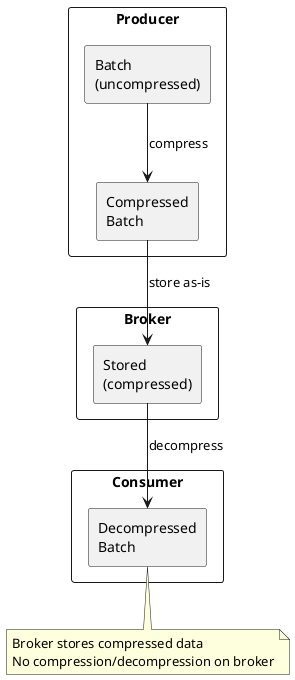
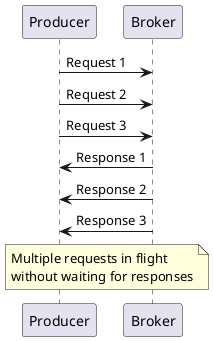
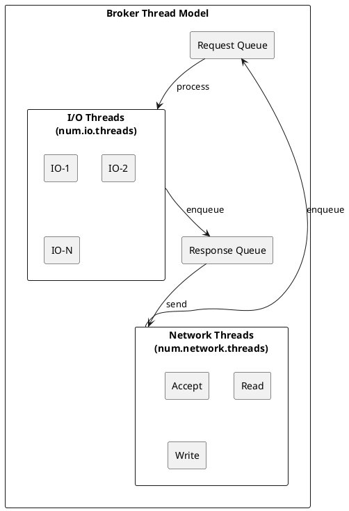
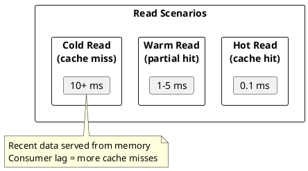

# Kafka Performance Internals

Deep dive into Kafka's performance architecture and optimization techniques.

---

## Performance Design Principles



---

## Sequential I/O

For complete log segment structure, indexes, and retention policies, see [Storage Engine](../storage-engine/index.md).

### Write Path

Kafka appends all writes to the end of log segments, achieving sequential disk access.



### Performance Comparison

| Access Pattern | HDD Performance | SSD Performance |
|----------------|-----------------|-----------------|
| Random 4KB | ~100 IOPS | ~100K IOPS |
| Sequential | ~100 MB/s | ~500 MB/s |
| **Kafka advantage** | **1000x better** | **5x better** |

---

## Zero-Copy Transfers

### Traditional Copy Path



### Zero-Copy Path (sendfile)



### Implementation

```java
// Kafka uses FileChannel.transferTo()
// which maps to sendfile() system call
fileChannel.transferTo(position, count, socketChannel);
```

### Limitations

| Condition | Zero-Copy Available |
|-----------|---------------------|
| Plaintext | Yes |
| TLS/SSL enabled | No (encryption requires user-space) |
| Compression | Only for already-compressed data |

!!! warning "TLS Impact"
    Enabling TLS disables zero-copy, potentially reducing throughput by 30-50%.

---

## Batching

### Producer Batching



### Batching Configuration

| Parameter | Default | Effect |
|-----------|---------|--------|
| `batch.size` | 16384 | Maximum bytes per batch |
| `linger.ms` | 0 | Time to wait for more records |
| `buffer.memory` | 33554432 | Total memory for batching |

### Batching Benefits

```
Without batching (1000 messages):
  1000 network round-trips
  1000 small disk writes
  High overhead per message

With batching (1000 messages in 10 batches):
  10 network round-trips
  10 larger disk writes
  Amortized overhead
```

### Consumer Fetch Batching

```properties
# Minimum data to fetch
fetch.min.bytes=1

# Maximum time to wait
fetch.max.wait.ms=500

# Maximum data per request
fetch.max.bytes=52428800
```

---

## Compression

### Compression Algorithms

| Algorithm | Compression Ratio | CPU Usage | Speed |
|-----------|-------------------|-----------|-------|
| **none** | 1.0x | None | Fastest |
| **gzip** | ~5-8x | High | Slow |
| **snappy** | ~2-3x | Low | Fast |
| **lz4** | ~3-4x | Low | Fastest |
| **zstd** | ~4-6x | Medium | Fast |

### Compression Flow



### Configuration

```properties
# Producer compression
compression.type=lz4

# Topic-level compression (broker will recompress if different)
compression.type=producer  # Keep producer compression
compression.type=gzip      # Force specific compression
```

### Compression Selection Guide

| Use Case | Recommended |
|----------|-------------|
| **High throughput, low latency** | lz4 |
| **Balanced** | zstd |
| **Maximum compression** | gzip |
| **Minimal CPU** | snappy |
| **Already compressed data** | none |

---

## Request Pipelining

### In-Flight Requests



```properties
# Maximum in-flight requests
max.in.flight.requests.per.connection=5
```

### Ordering Considerations

| Setting | Ordering | Throughput |
|---------|----------|------------|
| `max.in.flight=1` | Guaranteed | Lower |
| `max.in.flight=5` | May reorder on retry | Higher |
| `max.in.flight=5` + idempotent | Guaranteed | Higher |

---

## Thread Model

### Broker Threads



### Thread Configuration

| Parameter | Default | Recommendation |
|-----------|---------|----------------|
| `num.network.threads` | 3 | CPU cores / 4 |
| `num.io.threads` | 8 | CPU cores |
| `num.replica.fetchers` | 1 | 2-4 for high partition counts |
| `num.recovery.threads.per.data.dir` | 1 | 2-4 for faster recovery |

---

## Page Cache Optimization

### Warm Cache Benefits



### Optimal Memory Allocation

```
Total RAM: 64 GB

JVM Heap: 6 GB (enough for metadata)
OS/System: 2 GB
Page Cache: 56 GB (for log data)

If hourly throughput = 50 GB
Page cache covers ~1 hour of data
```

---

## Benchmarking

### Producer Performance Test

```bash
# Throughput test
kafka-producer-perf-test.sh \
  --topic test-topic \
  --num-records 10000000 \
  --record-size 1024 \
  --throughput -1 \
  --producer-props \
    bootstrap.servers=kafka:9092 \
    batch.size=65536 \
    linger.ms=10 \
    compression.type=lz4
```

### Consumer Performance Test

```bash
# Throughput test
kafka-consumer-perf-test.sh \
  --bootstrap-server kafka:9092 \
  --topic test-topic \
  --messages 10000000 \
  --threads 4
```

### End-to-End Latency Test

```bash
kafka-run-class.sh kafka.tools.EndToEndLatency \
  kafka:9092 \
  test-topic \
  10000 \
  all \
  1024
```

---

## Performance Metrics

### Key Metrics

| Metric | Healthy Range |
|--------|---------------|
| `RequestsPerSec` | Depends on workload |
| `TotalTimeMs (P99)` | < 100 ms |
| `RequestQueueTimeMs` | < 10 ms |
| `LocalTimeMs` | < 50 ms |
| `RemoteTimeMs` | < 50 ms |
| `ThrottleTimeMs` | 0 |

### Bottleneck Identification

| Symptom | Likely Bottleneck |
|---------|-------------------|
| High RequestQueueTimeMs | Network threads saturated |
| High LocalTimeMs | Disk I/O or I/O threads saturated |
| High RemoteTimeMs | Replication lag |
| High ResponseQueueTimeMs | Network threads saturated |

---

## Related Documentation

- [Architecture Overview](../index.md) - System architecture
- [Memory Management](../memory-management/index.md) - Memory tuning
- [Storage Engine](../storage-engine/index.md) - Disk I/O optimization
- [Operations](../../operations/index.md) - Operational procedures
