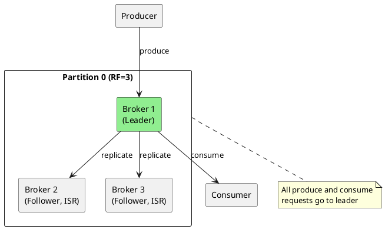
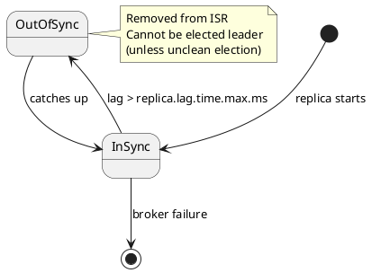
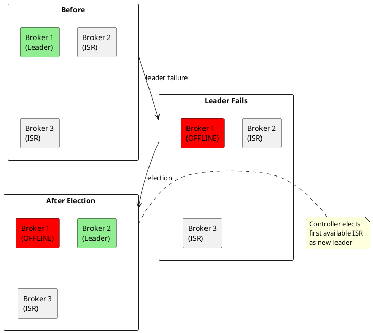
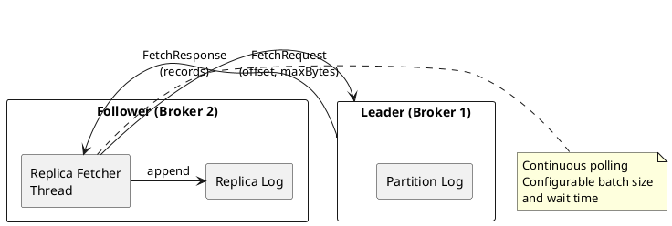
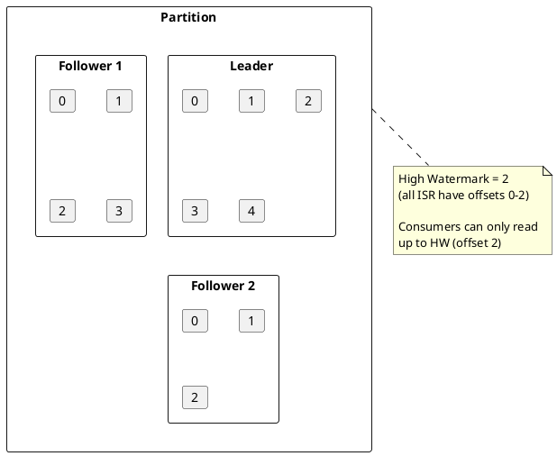
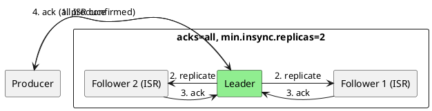

# Replication

Kafka's replication protocol provides fault tolerance and high availability through partition replicas.

---

## Replication Overview

Each partition has multiple replicas distributed across brokers. One replica is the leader; others are followers.



---

## In-Sync Replicas (ISR)

The ISR is the set of replicas that are fully caught up with the leader.

### ISR Membership Criteria

| Criterion | Configuration |
|-----------|---------------|
| **Caught up** | Within `replica.lag.time.max.ms` (default: 30s) |
| **Connected** | Active session with leader |

### ISR Dynamics



### Configuration

```properties
# ISR settings
replica.lag.time.max.ms=30000          # Max lag before removal
min.insync.replicas=2                   # Minimum ISR for acks=all

# Replica fetching
replica.fetch.min.bytes=1
replica.fetch.wait.max.ms=500
num.replica.fetchers=1
```

---

## Leader Election

### Clean Leader Election

When the current leader fails, a new leader is elected from the ISR.



### Unclean Leader Election

If all ISR replicas fail, an out-of-sync replica can become leader (with data loss risk).

```properties
# Disable for data safety (recommended)
unclean.leader.election.enable=false

# Enable for availability over consistency
unclean.leader.election.enable=true
```

| Setting | Behavior |
|---------|----------|
| `false` | Partition unavailable until ISR replica returns |
| `true` | Out-of-sync replica elected; potential data loss |

---

## Replica Fetching

Followers continuously fetch data from the leader to stay synchronized.



### Fetch Configuration

```properties
# Fetcher threads per source broker
num.replica.fetchers=1

# Fetch request sizing
replica.fetch.min.bytes=1
replica.fetch.max.bytes=1048576

# Fetch timing
replica.fetch.wait.max.ms=500
replica.fetch.backoff.ms=1000
```

---

## High Watermark

The high watermark (HW) is the offset up to which all ISR replicas have acknowledged.



### Visibility

| Role | Can See |
|------|---------|
| Consumer | Up to high watermark |
| Follower | All replicated data |
| Leader | All written data |

---

## Acknowledgment Levels

The `acks` setting controls durability guarantees.

| acks | Behavior | Durability | Latency |
|------|----------|------------|---------|
| `0` | No acknowledgment | None | Lowest |
| `1` | Leader acknowledgment | Leader only | Low |
| `all` | All ISR acknowledgment | Full | Higher |

### acks=all with min.insync.replicas

```properties
# Producer
acks=all

# Broker/Topic
min.insync.replicas=2
replication.factor=3
```

With these settings:
- Produce succeeds if ≥2 replicas acknowledge
- Produce fails if ISR < 2 (NotEnoughReplicasException)



---

## Leader Epoch

Leader epochs prevent data divergence during leader changes.

### Problem Without Epochs

```
Time 1: Leader A writes offset 100
Time 2: Leader A fails before replication
Time 3: Leader B elected with offset 99
Time 4: Leader B writes offset 100 (different data!)
Time 5: Leader A returns, has different offset 100
```

### Solution With Epochs

```
Epoch 0: Leader A (offsets 0-99)
Epoch 1: Leader B (offsets 100+)

When Leader A returns:
- Sees epoch 1 > epoch 0
- Truncates local log to match epoch boundary
- Fetches from new leader
```

### Leader Epoch File

```bash
cat /var/kafka-logs/orders-0/leader-epoch-checkpoint
# epoch start_offset
0 0
1 100
2 250
```

---

## Preferred Replica Election

Rebalance leadership to preferred replicas for even distribution.

```bash
# Trigger preferred replica election
kafka-leader-election.sh --bootstrap-server kafka:9092 \
  --election-type preferred \
  --all-topic-partitions
```

```properties
# Automatic preferred leader election
auto.leader.rebalance.enable=true
leader.imbalance.check.interval.seconds=300
leader.imbalance.per.broker.percentage=10
```

---

## Monitoring Replication

### Key Metrics

| Metric | Description | Alert |
|--------|-------------|-------|
| `UnderReplicatedPartitions` | Partitions with ISR < RF | > 0 |
| `UnderMinIsrPartitionCount` | Partitions below min.insync.replicas | > 0 |
| `OfflinePartitionsCount` | Partitions without leader | > 0 |
| `ReplicaLagTimeMax` | Max follower lag | High values |

### Commands

```bash
# Check under-replicated partitions
kafka-topics.sh --bootstrap-server kafka:9092 \
  --describe --under-replicated-partitions

# Check offline partitions
kafka-topics.sh --bootstrap-server kafka:9092 \
  --describe --unavailable-partitions

# Describe partition replicas
kafka-topics.sh --bootstrap-server kafka:9092 \
  --describe --topic orders
```

---

## Related Documentation

- [Brokers](../brokers/index.md) - Broker architecture
- [Fault Tolerance](../fault-tolerance/index.md) - Failure handling
- [Delivery Semantics](../../concepts/delivery-semantics/index.md) - Consistency guarantees
- [Operations](../../operations/index.md) - Operational procedures
