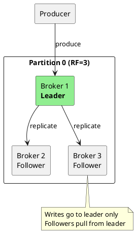
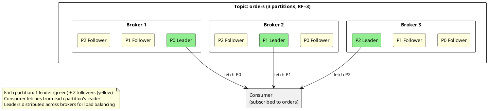
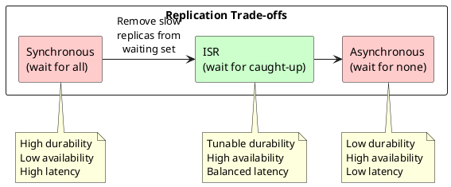
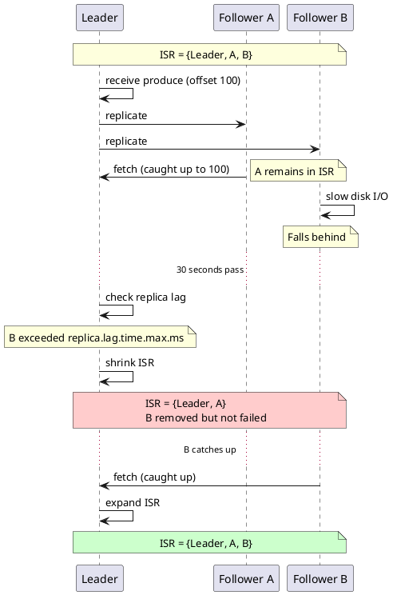
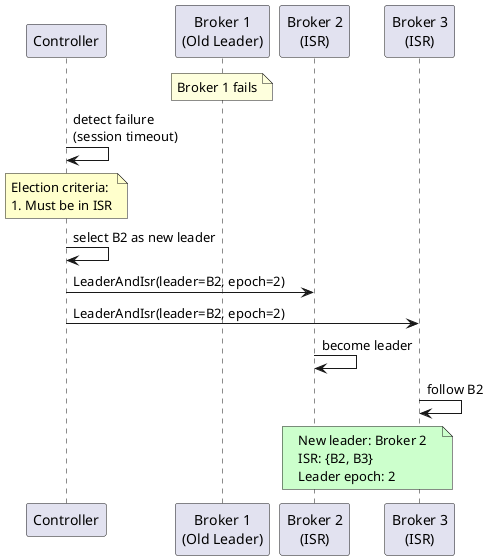
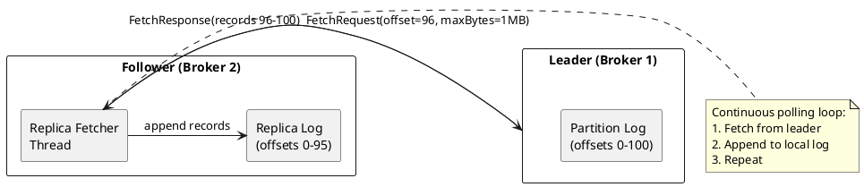
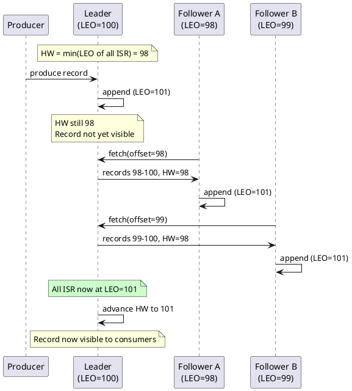
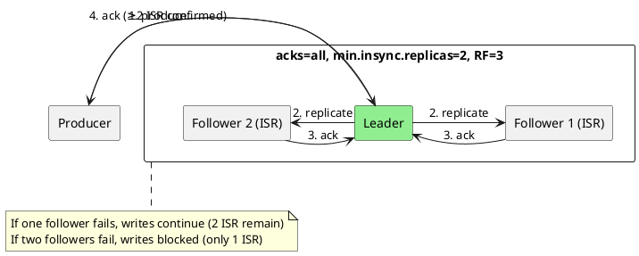

# Replication

Kafka's replication protocol provides fault tolerance and high availability by maintaining multiple copies of each partition across different brokers. This document covers both the mechanics of replication and the design rationale behind each mechanism.

---

## Replication Fundamentals

Replication addresses three problems inherent to distributed systems:

| Problem | Solution |
|---------|----------|
| **Data loss** | Multiple copies survive individual failures |
| **Availability** | Another replica serves requests when one fails |
| **Durability** | Acknowledged writes exist on multiple machines |

However, replication introduces consistency challenges, performance overhead, and complexity in failure handling. Kafka's replication protocol—built around ISR, leader election, and high watermark—addresses these challenges through specific design choices.

---

## Replication Model

Each partition has multiple replicas distributed across brokers. One replica is the **leader**; others are **followers**.



### Consumer Fetch Patterns

Consumers fetch from partition leaders by default. With multiple partitions distributed across brokers, a consumer fetches from multiple leaders simultaneously:



### Client-to-Replica Communication

| Client Type | Target Replica | Notes |
|-------------|----------------|-------|
| **Producer** | Leader only | Required for ordering and consistency |
| **Consumer** | Leader (default) | Ensures reading up to high watermark |
| **Consumer** | Follower (optional) | KIP-392, Kafka 2.4+; reduces cross-datacenter traffic |
| **Follower** | Leader | Replication protocol |

### Follower Fetching (KIP-392)

Since Kafka 2.4, consumers can fetch from follower replicas instead of the leader. This feature reduces cross-datacenter network traffic by allowing consumers to read from replicas in the same rack or availability zone.

**Configuration:**

```properties
# Broker: assign rack ID
broker.rack=us-east-1a

# Consumer: enable rack-aware fetching
client.rack=us-east-1a
```

When `client.rack` matches a follower's `broker.rack`, the consumer prefers fetching from that follower instead of the leader.

**Trade-offs:**

| Aspect | Leader Fetching | Follower Fetching |
|--------|-----------------|-------------------|
| Data freshness | Up to high watermark | Slightly behind leader |
| Network cost | Cross-rack/AZ possible | Same rack/AZ preferred |
| Consistency | Reads HW directly | Follower's HW may lag slightly |

!!! note "Follower HW Lag"
    Followers learn the high watermark from fetch responses. A follower's HW may lag slightly behind the leader's HW, meaning consumers fetching from followers may see data become visible slightly later than those fetching from the leader.

### Leader-Based Replication

Kafka uses **single-leader replication** rather than multi-leader or leaderless approaches:

| Approach | Trade-off | Kafka |
|----------|-----------|-------|
| **Single-leader** | Simpler consistency, potential bottleneck | ✅ Used |
| **Multi-leader** | Higher write availability, conflict resolution needed | ❌ Not used |
| **Leaderless** | No single point of failure, complex consistency | ❌ Not used |

Single-leader replication provides strong ordering guarantees within a partition. All writes pass through one broker, establishing a definitive order. Followers replicate this order, avoiding conflict resolution complexity.

---

## In-Sync Replicas (ISR)

The ISR is the set of replicas that are "sufficiently caught up" with the leader. ISR is central to Kafka's consistency and availability guarantees.

### Design Rationale

Two alternative approaches to replication illustrate the ISR design:

**Synchronous replication** requires waiting for *all* replicas before acknowledging writes:

- Benefit: If the leader fails, all replicas have all acknowledged data—no data loss
- Drawback: One slow replica blocks the entire partition
- Drawback: One failed replica makes the partition unavailable for writes

**Asynchronous replication** acknowledges immediately after leader persistence:

- Benefit: Fast acknowledgment; no blocking on slow or failed replicas
- Drawback: If the leader fails, data not yet replicated is lost
- Drawback: No durability guarantee for acknowledged writes

**ISR provides a middle ground**: a dynamic set of replicas that are "caught up enough" to be trusted. With `acks=all`, writes wait for all *ISR members*, not all replicas. If a replica falls behind or fails, it is removed from ISR rather than blocking writes—the definition of "all" shrinks to exclude problematic replicas.

This means ISR provides durability guarantees only across the current ISR membership. If ISR shrinks to just the leader, `acks=all` behaves like `acks=1`—a subsequent leader failure loses data. The `min.insync.replicas` setting prevents this by refusing writes when ISR is too small.



### ISR Membership Criteria

A replica remains in the ISR when meeting **both** conditions:

| Criterion | Configuration | Default |
|-----------|---------------|---------|
| **Caught up** | Within `replica.lag.time.max.ms` of leader | 30000 (30s) |
| **Connected** | Active session with leader | - |

!!! note "Time-Based vs Count-Based Lag"
    Earlier Kafka versions used message count (`replica.lag.max.messages`) to determine ISR membership. This approach caused problems: during write bursts, replicas would temporarily fall out of ISR even when healthy. The time-based approach (`replica.lag.time.max.ms`) provides more stability—a replica that actively fetches remains in ISR regardless of temporary lag.

### ISR Dynamics



### ISR Functions

ISR serves three purposes:

| Purpose | Mechanism |
|---------|-----------|
| **Write acknowledgment** | With `acks=all`, producers wait for all ISR members |
| **Leader election** | Only ISR members can become leader (by default) |
| **Durability guarantee** | Data on all ISR members survives leader failure |

### ISR Configuration

| Configuration | Default | Description |
|---------------|---------|-------------|
| `replica.lag.time.max.ms` | 30000 | Max time follower can lag before ISR removal |
| `min.insync.replicas` | 1 | Minimum ISR size for `acks=all` produces |
| `unclean.leader.election.enable` | false | Allow non-ISR replicas to become leader |

### Min In-Sync Replicas

The `min.insync.replicas` setting establishes a **durability floor**—the minimum number of replicas that must have data before it is considered safe:

| RF | min.insync.replicas | Behavior | Use Case |
|:--:|:-------------------:|----------|----------|
| 3 | 1 | Write succeeds if leader alone persists | Performance over durability |
| 3 | 2 | Write requires leader + 1 follower | **Recommended**: survives 1 failure |
| 3 | 3 | Write requires all replicas | Maximum durability, reduced availability |

!!! warning "ISR Shrinkage Impact"
    If ISR size falls below `min.insync.replicas`, producers with `acks=all` receive `NotEnoughReplicasException`. The partition becomes **unavailable for writes** until ISR recovers. This behavior is intentional: Kafka refuses writes that cannot meet the configured durability guarantee.

---

## Leader Election

When a partition leader fails, Kafka elects a new leader to restore availability. The election process determines which replica becomes the new leader and the fate of uncommitted data. For controller-side election coordination, see [Cluster Management](../cluster-management/index.md#leader-election).

### Election Benefits

| Capability | Mechanism |
|------------|-----------|
| **Automatic failover** | New leader takes over without manual intervention |
| **Bounded unavailability** | Partition offline only during election; duration depends on timeouts and load |
| **Data preservation** | ISR-based election prevents data loss |

### Clean Leader Election

When the leader fails, the controller elects a new leader from the ISR:



### ISR-Only Election Rationale

Electing only from ISR ensures the new leader has all committed data:

```
Scenario: Leader has offsets 0-99, committed (HW=100)
          Leader fails

ISR replica (offset 99):     Has all committed data ✓
Non-ISR replica (offset 50): Missing offsets 51-99 ✗
```

If a non-ISR replica became leader, offsets 51-99 would be lost despite having been acknowledged to producers.

### Unclean Leader Election

When all ISR replicas fail simultaneously, Kafka must choose between availability and consistency:

| Choice | Configuration | Consequence |
|--------|---------------|-------------|
| **Wait for ISR** | `unclean.leader.election.enable=false` | Partition unavailable until ISR returns |
| **Elect non-ISR** | `unclean.leader.election.enable=true` | Data loss possible, but partition available |

!!! danger "Data Loss Risk"
    Unclean leader election can lose acknowledged data. Example: A producer receives acknowledgment for offset 100. All ISR members fail. A non-ISR replica with offset 80 becomes leader. Offsets 81-100 are permanently lost despite successful acknowledgment.

**Enable unclean election when:**

- Availability takes priority over consistency
- Data can be reconstructed from source systems
- Loss is acceptable (e.g., metrics, logs)

**Keep disabled (default) when:**

- Processing financial transactions
- Maintaining audit logs
- Handling any data where loss is unacceptable

---

## Replica Fetching

Followers do not receive pushed data; they **pull** from the leader. This pull-based model enables flow control and simplifies leader responsibilities.

### Pull-Based Design

| Approach | Trade-off |
|----------|-----------|
| **Push (leader → follower)** | Leader must track each follower's state; complex backpressure |
| **Pull (follower → leader)** | Follower controls pace; leader treats all fetches uniformly |

Kafka uses pull-based replication. The same fetch mechanism serves both followers and consumers, simplifying the codebase.



### Fetch Configuration

| Configuration | Default | Purpose |
|---------------|---------|---------|
| `num.replica.fetchers` | 1 | Parallel fetch threads per source broker |
| `replica.fetch.min.bytes` | 1 | Minimum bytes before responding |
| `replica.fetch.max.bytes` | 1048576 | Maximum bytes per fetch |
| `replica.fetch.wait.max.ms` | 500 | Max wait for min.bytes |
| `replica.fetch.backoff.ms` | 1000 | Backoff after fetch error |

---

## High Watermark

The high watermark (HW) is the offset up to which **all ISR replicas** have replicated. It represents the boundary between "safe" and "potentially lost" data.

### Design Rationale

Without high watermark, the following scenario is possible:

```
1. Producer writes offset 100 to leader
2. Consumer immediately reads offset 100
3. Leader fails before replicating to followers
4. New leader elected with offset 99
5. Consumer has data that no longer exists in Kafka
```

High watermark prevents this by exposing only data replicated to all ISR:

```
1. Producer writes offset 100 to leader (HW still 99)
2. Consumer can only read up to offset 99 (HW)
3. Followers replicate offset 100
4. Leader advances HW to 100
5. Consumer can now read offset 100
```

### HW Advancement



### Data Visibility

| Role | Visible Data | Rationale |
|------|--------------|-----------|
| **Consumer** | Up to HW | Only "safe" data that survives failures |
| **Follower** | All fetched data | Must replicate everything |
| **Leader** | All written data | Owns the authoritative log |

!!! note "Read-After-Write Latency"
    Producers do not immediately see their own writes when consuming. Records become visible only after HW advances—requiring all ISR members to replicate. This latency is typically milliseconds but can increase under load.

---

## Acknowledgment Levels

The `acks` setting controls the durability-latency trade-off for producers, determining how many replicas must have data before Kafka acknowledges success.

### Application Requirements

Different applications have different durability requirements:

| Application | Priority | Appropriate acks |
|-------------|----------|------------------|
| Metrics/telemetry | Throughput over durability | `0` or `1` |
| Application logs | Balance | `1` |
| Financial transactions | Durability over throughput | `all` |

### Ack Levels Compared

| acks | Behavior | Durability | Latency |
|:----:|----------|------------|---------|
| `0` | No acknowledgment waited | None—fire and forget | Lowest |
| `1` | Wait for leader persistence | Leader only—lost if leader fails before replication | Low |
| `all` | Wait for all ISR persistence | Depends on `min.insync.replicas` | Higher |

### acks=all with min.insync.replicas

These two settings work together:

- `acks=all`: Producer waits for all ISR
- `min.insync.replicas`: Minimum ISR size to accept writes



**Common configurations:**

| RF | min.insync.replicas | acks | Survives | Use Case |
|:--:|:-------------------:|:----:|----------|----------|
| 3 | 2 | all | 1 failure | Production default |
| 3 | 1 | all | 0 failures after ack | Development/test |
| 3 | 2 | 1 | Leader-only durability | High throughput |

---

## Leader Epoch

Leader epochs solve a critical problem: **divergent logs after leader changes**.

### The Divergence Problem

Without epochs, the following scenario creates inconsistent data:

```
Time 1: Leader A writes offset 100 (not yet replicated)
Time 2: Network partition—A cannot reach followers or controller
Time 3: Controller elects B as new leader
Time 4: B writes offset 100 (different data)
Time 5: Partition heals—both A and B have offset 100 with different data
```

Without epochs, determining which offset 100 is correct is impossible.

### Epoch-Based Resolution

Each leader term receives a monotonically increasing **epoch number**. Operations carry their epoch, and stale epochs are rejected:

```
Epoch 0: Leader A (offsets 0-99)
         A writes offset 100 with epoch 0

Epoch 1: Leader B (elected during partition)
         B writes offset 100 with epoch 1

When A reconnects:
  - A's epoch 0 < current epoch 1
  - A becomes follower
  - A truncates to last offset from epoch 0 (offset 99)
  - A fetches offset 100 from B (the authoritative version)
```

### Epoch Benefits

| Scenario | Resolution |
|----------|------------|
| Network partition | Old leader's writes rejected (stale epoch) |
| Split brain | Only current epoch accepted; conflicts resolved by truncation |
| Log recovery | Followers truncate to epoch boundary, then catch up |

### Leader Epoch File

Each partition maintains an epoch checkpoint:

```bash
cat /var/kafka-logs/orders-0/leader-epoch-checkpoint
# epoch start_offset
0 0
1 100
2 250
```

This file records when each epoch started, enabling recovery after failures.

---

## Preferred Replica Election

Over time, leader distribution becomes unbalanced. Preferred replica election restores balance.

### Leader Imbalance

```
Initial:  Broker 1: Leader for P0, P1
          Broker 2: Leader for P2, P3

After B1 fails and recovers:
          Broker 1: Follower for everything
          Broker 2: Leader for P0, P1, P2, P3  ← Overloaded
```

The "preferred replica" is the first replica in the assignment list. Preferred election moves leadership back to this replica.

### Configuration

| Configuration | Default | Purpose |
|---------------|---------|---------|
| `auto.leader.rebalance.enable` | true | Automatically elect preferred leaders |
| `leader.imbalance.check.interval.seconds` | 300 | Check frequency |
| `leader.imbalance.per.broker.percentage` | 10 | Trigger threshold |

### Manual Election

```bash
# Trigger preferred replica election for all partitions
kafka-leader-election.sh --bootstrap-server kafka:9092 \
  --election-type preferred \
  --all-topic-partitions

# Trigger for specific topic
kafka-leader-election.sh --bootstrap-server kafka:9092 \
  --election-type preferred \
  --topic orders
```

---

## Monitoring Replication

Replication health is critical. Under-replicated partitions indicate problems that may become failures. For complete failure handling and recovery procedures, see [Fault Tolerance](../fault-tolerance/index.md).

### Key Metrics

| Metric | Description | Alert Threshold |
|--------|-------------|-----------------|
| `UnderReplicatedPartitions` | Partitions with ISR < RF | > 0 |
| `UnderMinIsrPartitionCount` | Partitions below min.insync.replicas | > 0 (critical) |
| `OfflinePartitionsCount` | Partitions without leader | > 0 (critical) |
| `ReplicaLagTimeMax` | Max follower lag in ms | Sustained high values |
| `IsrShrinksPerSec` | Rate of ISR shrinkage | Elevated = instability |
| `IsrExpandsPerSec` | Rate of ISR expansion | Should follow shrinks |

### Metric Interpretation

| Condition | Indication | Action |
|-----------|------------|--------|
| Under-replicated > 0 | Followers behind or offline | Check follower broker health, disk I/O |
| Under-min-ISR > 0 | Durability at risk | **Urgent**: restore replicas or reduce load |
| Offline > 0 | No leader available | **Critical**: check broker status, consider unclean election |
| High lag time | Slow replication | Check network, disk, CPU on followers |
| Frequent ISR changes | Unstable cluster | Check for overload, network issues |

### Diagnostic Commands

```bash
# Check under-replicated partitions
kafka-topics.sh --bootstrap-server kafka:9092 \
  --describe --under-replicated-partitions

# Check offline partitions
kafka-topics.sh --bootstrap-server kafka:9092 \
  --describe --unavailable-partitions

# Describe specific topic's replicas
kafka-topics.sh --bootstrap-server kafka:9092 \
  --describe --topic orders

# Output shows:
# Topic: orders  Partition: 0  Leader: 1  Replicas: 1,2,3  Isr: 1,2
#                                                          ↑ Broker 3 not in ISR
```

---

## Related Documentation

- [Topics and Partitions](../topics/index.md) - Topic architecture, partition structure, and assignment
- [Brokers](../brokers/index.md) - Broker architecture and controller
- [Fault Tolerance](../fault-tolerance/index.md) - Failure scenarios and recovery
- [Delivery Semantics](../../concepts/delivery-semantics/index.md) - End-to-end consistency guarantees
- [Producers](../../application-development/producers/index.md) - Producer acknowledgment configuration