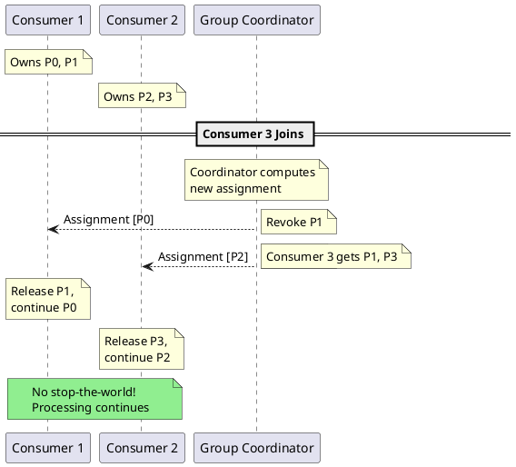
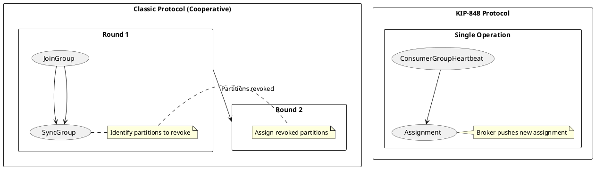

# Kafka Consumer Group Rebalancing

Consumer group rebalancing redistributes partition assignments among group members. This document covers the rebalance protocol, assignment strategies, and mechanisms to minimize rebalance impact.

---

## Rebalancing Overview

### Why Rebalancing Occurs

| Trigger | Description |
|---------|-------------|
| **Consumer join** | New consumer joins group |
| **Consumer leave** | Consumer leaves gracefully |
| **Consumer failure** | Heartbeat timeout |
| **Subscription change** | Topic subscription modified |
| **Partition change** | Partitions added to subscribed topic |
| **Session timeout** | Consumer missed heartbeat deadline |
| **Max poll exceeded** | Processing time exceeded `max.poll.interval.ms` |

### Rebalance Impact


| Impact | Description |
|--------|-------------|
| **Processing pause** | Eager stops all; cooperative/consumer protocol pauses only moved partitions |
| **Increased latency** | Messages delayed during rebalance |
| **Duplicate processing** | At-least-once semantics may cause reprocessing |
| **State loss** | In-memory state may need rebuilding |

---

## Rebalance Protocol

### Eager Rebalancing (Traditional)


### Cooperative Rebalancing (Incremental)


### Protocol Comparison

| Aspect | Eager | Cooperative |
|--------|-------|-------------|
| **Revocation** | All partitions revoked | Only moved partitions revoked |
| **Processing** | Full stop during rebalance | Continues for stable partitions |
| **Rebalance count** | Single rebalance | May require multiple rounds |
| **Complexity** | Simple | More complex |
| **Kafka version** | All versions | 2.4+ |

---

## Rebalance Triggers

### Heartbeat Mechanism


### Timeout Configuration

| Configuration | Default | Description |
|---------------|:-------:|-------------|
| `session.timeout.ms` | 45000 | Time to detect consumer failure |
| `heartbeat.interval.ms` | 3000 | Heartbeat frequency |
| `max.poll.interval.ms` | 300000 | Max time between poll() calls |

**Relationship:**

```
session.timeout.ms > heartbeat.interval.ms * 3

Typical: heartbeat = session_timeout / 3
```

### Timeout Scenarios

| Scenario | Trigger | Result |
|----------|---------|--------|
| Network partition | No heartbeat | Consumer removed after session.timeout |
| Long processing | poll() delayed | Consumer removed after max.poll.interval |
| Consumer crash | No heartbeat | Consumer removed after session.timeout |
| Graceful shutdown | LeaveGroup | Immediate rebalance |

---

## Assignment Strategies

### Range Assignor

Assigns partitions in ranges per topic.


### RoundRobin Assignor

Distributes partitions round-robin across consumers.


### Sticky Assignor

Preserves existing assignments while balancing.

| Characteristic | Description |
|----------------|-------------|
| **Stickiness** | Minimizes partition movement |
| **Balance** | Ensures even distribution |
| **Cooperative** | Supports incremental rebalancing |

```properties
# Configuration
partition.assignment.strategy=org.apache.kafka.clients.consumer.StickyAssignor
```

### CooperativeSticky Assignor

Combines sticky assignment with cooperative rebalancing.

```properties
# Recommended for Kafka 2.4+
partition.assignment.strategy=org.apache.kafka.clients.consumer.CooperativeStickyAssignor
```

### Strategy Comparison

| Strategy | Balance | Stickiness | Cooperative | Use Case |
|----------|:-------:|:----------:|:-----------:|----------|
| Range | Good | ❌ | ❌ | Simple, few topics |
| RoundRobin | Best | ❌ | ❌ | Many topics |
| Sticky | Good | ✅ | ❌ | Stateful processing |
| CooperativeSticky | Good | ✅ | ✅ | Production default |

---

## Static Membership

### Overview

Static membership assigns a persistent identity to consumers, reducing unnecessary rebalances.


### Configuration

```properties
# Consumer configuration
group.instance.id=consumer-instance-1
session.timeout.ms=300000  # 5 minutes (can be longer with static membership)
```

### Static vs Dynamic Membership

| Aspect | Dynamic | Static |
|--------|---------|--------|
| Consumer restart | Triggers rebalance | No rebalance (within timeout) |
| Session timeout | Short (45s typical) | Can be longer (5-30 min) |
| Member ID | Assigned by coordinator | Derived from instance ID |
| Deployment | Rolling restarts cause churn | Smooth rolling restarts |

### Static Membership Benefits

| Benefit | Description |
|---------|-------------|
| **Reduced rebalances** | Transient failures don't trigger rebalance |
| **Faster recovery** | Same assignment on rejoin |
| **Rolling deployments** | One consumer at a time without full rebalance |
| **Stable state** | Kafka Streams state stores remain local |

---

## Rebalance Optimization

### Minimize Rebalance Frequency

```properties
# Increase session timeout for static membership
session.timeout.ms=300000

# Use cooperative rebalancing
partition.assignment.strategy=org.apache.kafka.clients.consumer.CooperativeStickyAssignor

# Static membership
group.instance.id=my-consumer-instance-1
```

### Minimize Rebalance Duration

```properties
# Faster heartbeat
heartbeat.interval.ms=1000

# Shorter JoinGroup timeout
max.poll.interval.ms=30000  # Reduce if processing is fast

# Pre-warm consumer before starting poll
# (Initialize resources before subscribing)
```

### Handle Long Processing

```java
// Pattern: Pause partitions during long processing
consumer.poll(Duration.ofMillis(100));
for (ConsumerRecord<String, String> record : records) {
    // Pause to prevent rebalance
    consumer.pause(consumer.assignment());

    // Long processing
    processRecord(record);

    // Resume
    consumer.resume(consumer.assignment());
}
```

---

## Rebalance Listener

### ConsumerRebalanceListener

```java
consumer.subscribe(Arrays.asList("orders"), new ConsumerRebalanceListener() {
    @Override
    public void onPartitionsRevoked(Collection<TopicPartition> partitions) {
        // Called BEFORE rebalance
        // Commit offsets for revoked partitions
        Map<TopicPartition, OffsetAndMetadata> offsets = new HashMap<>();
        for (TopicPartition partition : partitions) {
            offsets.put(partition, new OffsetAndMetadata(currentOffset(partition)));
        }
        consumer.commitSync(offsets);

        // Flush any buffered data
        flushState(partitions);
    }

    @Override
    public void onPartitionsAssigned(Collection<TopicPartition> partitions) {
        // Called AFTER rebalance
        // Initialize state for new partitions
        for (TopicPartition partition : partitions) {
            initializeState(partition);
        }
    }

    @Override
    public void onPartitionsLost(Collection<TopicPartition> partitions) {
        // Called when partitions lost without revoke (cooperative)
        // State may already be invalid
        log.warn("Partitions lost: {}", partitions);
    }
});
```

### Cooperative Rebalance Listener

```java
// With cooperative rebalancing
@Override
public void onPartitionsRevoked(Collection<TopicPartition> partitions) {
    // Only revoked partitions, not all assigned
    // Other partitions continue processing
    commitOffsetsForPartitions(partitions);
}

@Override
public void onPartitionsAssigned(Collection<TopicPartition> partitions) {
    // Only newly assigned partitions
    // Existing partitions unchanged
    initializeStateForPartitions(partitions);
}
```

---

## Monitoring Rebalances

### Key Metrics

| Metric | Description | Alert |
|--------|-------------|-------|
| `rebalance-latency-avg` | Average rebalance duration | > 30s |
| `rebalance-latency-max` | Maximum rebalance duration | > 60s |
| `rebalance-total` | Total rebalance count | Increasing rapidly |
| `last-rebalance-seconds-ago` | Time since last rebalance | - |
| `failed-rebalance-total` | Failed rebalances | > 0 |

### Diagnosing Rebalance Issues

```bash
# Check consumer group state
kafka-consumer-groups.sh --bootstrap-server kafka:9092 \
  --describe --group my-group

# Monitor group membership changes
kafka-consumer-groups.sh --bootstrap-server kafka:9092 \
  --describe --group my-group --members

# Check for rebalance in logs
grep -i "rebalance\|revoke\|assign" /var/log/kafka/consumer.log
```

### Common Issues

| Issue | Symptom | Solution |
|-------|---------|----------|
| Frequent rebalances | High rebalance-total | Enable static membership |
| Long rebalances | High rebalance-latency | Reduce group size, use cooperative |
| Consumer timeouts | Members leaving | Increase max.poll.interval.ms |
| Uneven assignment | Imbalanced lag | Check assignment strategy |

---

## Scaling Consumers

### Adding Consumers


### Scaling Limits

| Constraint | Description |
|------------|-------------|
| Max consumers = partitions | Extra consumers idle |
| Adding partitions | Changes key distribution |
| Consumer group size | Larger groups = longer rebalances |

### Scaling Best Practices

| Practice | Rationale |
|----------|-----------|
| Plan partition count for growth | Avoid adding partitions later |
| Use static membership | Smooth scaling operations |
| Scale gradually | One consumer at a time |
| Monitor during scale | Detect issues early |

---

## Consumer Group States

### State Machine


### State Descriptions

| State | Description |
|-------|-------------|
| **Empty** | No active members |
| **PreparingRebalance** | Waiting for members to join |
| **CompletingRebalance** | Waiting for SyncGroup |
| **Stable** | Normal operation |
| **Dead** | Group being deleted |

---

## Next Generation Protocol (KIP-848)

### Overview

KIP-848 introduces a fundamentally redesigned consumer rebalance protocol that moves partition assignment from the client to the server (broker). This eliminates the multi-round rebalance problem of cooperative rebalancing and provides truly seamless partition reassignment.

| Aspect | Classic Protocol | KIP-848 Protocol |
|--------|------------------|------------------|
| **Assignment location** | Consumer (leader) | Broker (group coordinator) |
| **Rebalance rounds** | 1 (eager) or 2+ (cooperative) | Single notification |
| **Stop-the-world** | Yes (eager) or partial (cooperative) | No global stop-the-world |
| **Protocol complexity** | Client-side logic | Server-side logic |
| **Kafka version** | All versions | 4.0+ (GA) |

### Version Support

| Kafka Version | KIP-848 Status | Notes |
|---------------|----------------|-------|
| < 3.7 | ❌ Not available | Use classic protocol |
| 3.7.x | ⚠️ Early access | Use classic protocol for production |
| 3.8.x | ⚠️ Early access | Improved stability |
| 4.0+ | ✅ Stable (GA) | Production ready, recommended for new deployments |

!!! note "Version guidance"
    Kafka docs state KIP-848 is GA in 4.0. This guide treats 3.7/3.8 as early access.

### How It Works



**Key difference:** The broker computes and pushes assignments directly to consumers. Consumers do not need to coordinate with each other through JoinGroup/SyncGroup rounds.

### Configuration

```properties
# Enable KIP-848 protocol (Kafka 3.7+)
group.protocol=consumer

# Classic protocol (default, backward compatible)
group.protocol=classic
```

**Broker configuration (Kafka 3.7-3.8 early access):**

```properties
# Enable consumer protocol (4.0+)
group.version=1

# Enabled protocols (default includes classic, consumer, streams)
group.coordinator.rebalance.protocols=classic,consumer,streams
```

### Protocol Comparison



| Aspect | Cooperative (Classic) | KIP-848 |
|--------|----------------------|---------|
| **Rebalance trigger** | Heartbeat returns REBALANCE_IN_PROGRESS | Heartbeat returns new assignment |
| **Assignment computation** | Leader consumer | Group coordinator |
| **Partition release** | Consumer-initiated after SyncGroup | Consumer-initiated after heartbeat |
| **New partition assignment** | Requires second rebalance round | Immediate in same response |
| **Minimum latency** | 2× heartbeat interval | 1× heartbeat interval |

### Migration Path

**From Classic to KIP-848:**

1. **Upgrade brokers** to Kafka 3.7+ (early access) or 4.0+ (stable)
2. **Enable new coordinator** on brokers (3.7-3.8 only)
3. **Upgrade consumers** to compatible client version
4. **Set `group.protocol=consumer`** on consumers
5. **Rolling restart** consumers (group will have mixed protocols temporarily)

!!! note "Mixed Protocol Groups"
    During migration, a consumer group can have members using both protocols. The coordinator handles this gracefully, but full benefits are only realized when all members use KIP-848.

### Benefits

| Benefit | Description |
|---------|-------------|
| **Lower latency** | Single round-trip vs multiple rounds |
| **No stop-the-world** | Stable partitions continue processing |
| **Simpler clients** | Assignment logic moved to broker |
| **Better scalability** | Reduced coordination overhead |
| **Predictable behavior** | Broker has global view of group |

### Limitations

| Limitation | Description |
|------------|-------------|
| **Kafka version** | Requires 3.7+ (early access) or 4.0+ (stable) |
| **Client support** | Requires updated client libraries |
| **Custom assignors** | Server-side assignors only |
| **Feature maturity** | Early access in 3.7/3.8 |

### Monitoring

New metrics for KIP-848 protocol:

| Metric | Description |
|--------|-------------|
| `group-coordinator-metrics` | New coordinator metrics |
| `consumer-group-heartbeat-rate` | Heartbeat frequency |
| `consumer-group-rebalance-rate` | Assignment change frequency |

---

## Version Compatibility

| Feature | Kafka Version |
|---------|---------------|
| Basic rebalancing | 0.9.0+ |
| Sticky assignor | 0.11.0+ |
| Static membership | 2.3.0+ |
| Cooperative rebalancing | 2.4.0+ |
| KIP-848 (GA) | 4.0.0+ |

---

## Related Documentation

- [Scaling Overview](index.md) - Cluster scaling concepts
- [Partition Reassignment](partition-reassignment.md) - Partition movement
- [Consumer APIs](../client-connections/protocol-apis-consumer.md) - Protocol details
- [Consumers](../../application-development/consumers/index.md) - Consumer configuration