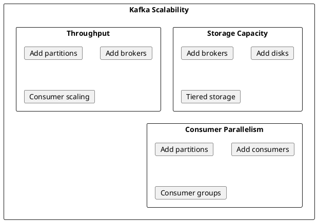
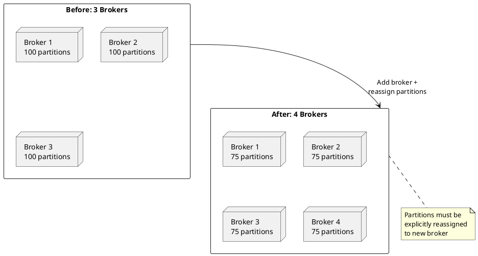
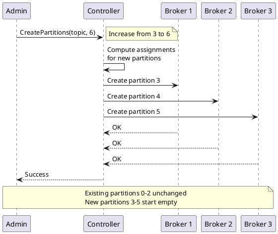
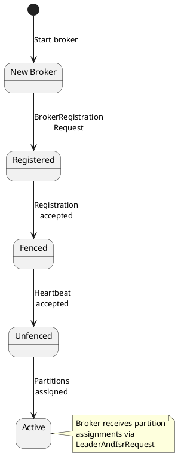
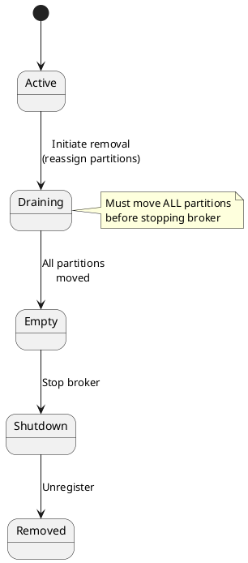
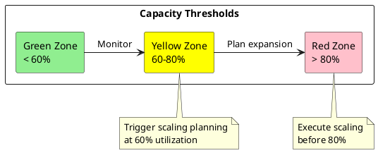
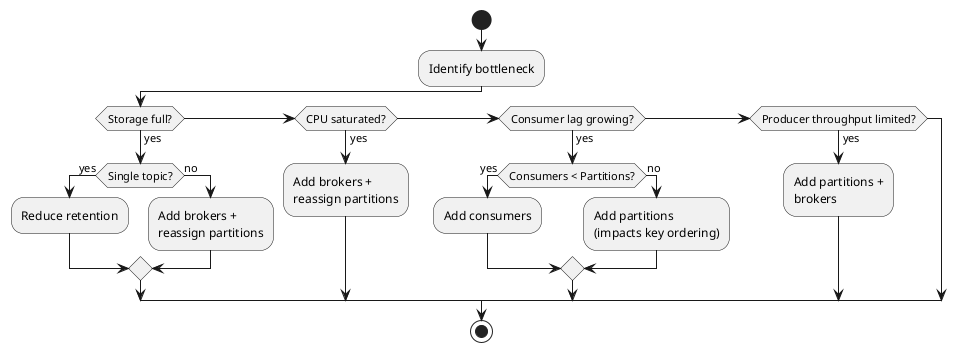
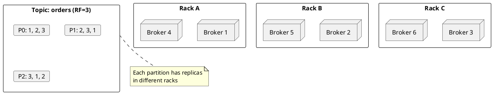

# Kafka Cluster Scaling

This document covers the architecture and mechanisms for scaling Apache Kafka clusters. Kafka supports horizontal scaling through broker addition, partition expansion, and dynamic rebalancing.

---

## Scaling Overview

### Scalability Dimensions



| Dimension | Scaling Mechanism | Considerations |
|-----------|-------------------|----------------|
| **Storage** | Add brokers, expand disks | Requires partition reassignment |
| **Produce throughput** | Add partitions | May affect ordering guarantees |
| **Consume throughput** | Add partitions + consumers | Max consumers = partitions |
| **Message rate** | Add brokers + partitions | Rebalancing overhead |

---

## Horizontal Scaling Model

### Broker Scaling



### Scaling Characteristics

| Operation | Automatic | Data Movement | Impact |
|-----------|:---------:|:-------------:|--------|
| Add broker | ❌ | Required | None until reassignment |
| Remove broker | ❌ | Required | Must drain first |
| Add partitions | ❌ | None | Immediate after admin request |
| Add consumers | ✅ | None | Triggers rebalance |

!!! warning "Broker Addition"
    Adding a broker does not automatically rebalance partitions. Explicit partition reassignment is required to distribute load to the new broker.

---

## Partition Scaling

### Adding Partitions



### Partition Scaling Constraints

| Constraint | Description |
|------------|-------------|
| **Increase only** | Partition count cannot be decreased |
| **Key distribution** | Adding partitions changes key routing |
| **Empty partitions** | New partitions start with no data |
| **Consumer scaling** | More partitions enable more consumers |

!!! danger "Key Distribution Impact"
    Adding partitions changes the key-to-partition mapping. Messages with the same key may route to different partitions after expansion. This affects ordering guarantees for keyed messages.

### Partition Count Formula

```
optimal_partitions = max(
    target_throughput / per_partition_throughput,
    max_expected_consumers
)
```

| Factor | Guideline (Repository Guidance) |
|--------|-----------|
| Per-partition throughput | ~10 MB/s typical |
| Consumer parallelism | 1 partition per consumer thread |
| Broker capacity | ~4000 partitions per broker (depending on hardware) |
| Cluster limit | Monitor total partition count |

---

## Broker Lifecycle

### Adding a Broker



### Broker Addition Process

1. **Deploy new broker** - Configure with unique broker.id
2. **Start broker** - Broker registers with controller
3. **Verify registration** - Confirm broker appears in cluster
4. **Generate reassignment plan** - Compute partition moves
5. **Execute reassignment** - Move partitions with throttling
6. **Verify balance** - Confirm even distribution

```bash
# Step 1: Start new broker (broker.id=4)
kafka-server-start.sh config/server.properties

# Step 2: Verify registration
kafka-broker-api-versions.sh --bootstrap-server kafka:9092
kafka-topics.sh --bootstrap-server kafka:9092 --describe | rg "Replicas:.*\\b4\\b"

# Step 3: Generate reassignment plan
cat > topics.json << 'EOF'
{"topics": [{"topic": "orders"}, {"topic": "events"}], "version": 1}
EOF

kafka-reassign-partitions.sh --bootstrap-server kafka:9092 \
  --topics-to-move-json-file topics.json \
  --broker-list "1,2,3,4" \
  --generate > reassignment.json

# Step 4: Execute with throttle
kafka-reassign-partitions.sh --bootstrap-server kafka:9092 \
  --reassignment-json-file reassignment.json \
  --throttle 50000000 \
  --execute

# Step 5: Monitor progress
kafka-reassign-partitions.sh --bootstrap-server kafka:9092 \
  --reassignment-json-file reassignment.json \
  --verify
```

### Removing a Broker



### Broker Removal Process

```bash
# Step 1: Generate plan moving all partitions off broker 4
kafka-reassign-partitions.sh --bootstrap-server kafka:9092 \
  --topics-to-move-json-file all-topics.json \
  --broker-list "1,2,3" \
  --generate > removal-plan.json

# Step 2: Execute reassignment
kafka-reassign-partitions.sh --bootstrap-server kafka:9092 \
  --reassignment-json-file removal-plan.json \
  --throttle 100000000 \
  --execute

# Step 3: Wait for completion
kafka-reassign-partitions.sh --bootstrap-server kafka:9092 \
  --reassignment-json-file removal-plan.json \
  --verify

# Step 4: Verify no partitions on broker 4
kafka-topics.sh --bootstrap-server kafka:9092 --describe | rg "Replicas:.*\\b4\\b"

# Step 5: Stop broker
kafka-server-stop.sh
```

!!! danger "Data Loss Risk"
    Stopping a broker before completing partition reassignment results in data loss if the broker holds the only replica of any partition.

---

## Scaling Patterns

### Capacity Planning



### Metrics for Scaling Decisions

| Metric | Threshold (Repository Guidance) | Action |
|--------|:---------:|--------|
| Disk utilization | > 70% | Add brokers or storage |
| CPU utilization | > 70% sustained | Add brokers |
| Network throughput | > 70% capacity | Add brokers |
| Partition count per broker | > 4000 | Add brokers |
| Consumer lag | Increasing | Add partitions + consumers |
| Request latency (p99) | > SLA | Scale horizontally |

### Scaling Strategy Decision Tree



---

## Rack-Aware Scaling

### Rack Distribution



### Rack-Aware Configuration

```properties
# Broker configuration
broker.rack=rack-a

# Topic creation with rack awareness
kafka-topics.sh --bootstrap-server kafka:9092 \
  --create \
  --topic orders \
  --partitions 6 \
  --replication-factor 3
# Automatically distributes across racks
```

### Scaling with Rack Awareness

| Consideration | Recommendation |
|---------------|----------------|
| New broker placement | Add to least-populated rack |
| Minimum racks | RF racks for full fault tolerance |
| Balanced racks | Equal brokers per rack |
| Reassignment | Maintain rack diversity |

---

## Scaling Automation

### Auto-Scaling Considerations

| Aspect | Challenge |
|--------|-----------|
| **Partition reassignment** | Requires data movement |
| **Consumer rebalancing** | Temporary pause |
| **State migration** | Kafka Streams applications |
| **Connection overhead** | Client reconnection |

### Kubernetes Scaling

```yaml
apiVersion: kafka.strimzi.io/v1beta2
kind: Kafka
metadata:
  name: kafka-cluster
spec:
  kafka:
    replicas: 3  # Scale by changing this
    storage:
      type: persistent-claim
      size: 100Gi
    config:
      auto.create.topics.enable: false
      default.replication.factor: 3
      min.insync.replicas: 2
```

!!! note "Kubernetes Scaling"
    Kubernetes-based Kafka operators (Strimzi, Confluent) automate broker addition but typically require manual partition reassignment for optimal balance.

---

## Scaling Best Practices

### Pre-Scaling Checklist

| Check | Purpose |
|-------|---------|
| Current partition distribution | Identify imbalance |
| Under-replicated partitions | Ensure cluster healthy |
| Active reassignments | Wait for completion |
| Consumer lag | Note current state |
| Disk space on all brokers | Ensure room for data movement |

### During Scaling

| Practice | Rationale |
|----------|-----------|
| Use throttling | Prevent saturation during reassignment |
| Scale incrementally | Add one broker at a time |
| Monitor continuously | Detect issues early |
| Test rollback | Ensure recovery path exists |

### Post-Scaling Verification

```bash
# Verify partition balance
kafka-topics.sh --bootstrap-server kafka:9092 --describe | \
  awk '/Leader:/ {leaders[$NF]++} END {for (b in leaders) print b": "leaders[b]}'

# Verify no under-replicated partitions
kafka-topics.sh --bootstrap-server kafka:9092 \
  --describe --under-replicated-partitions

# Verify consumer group health
kafka-consumer-groups.sh --bootstrap-server kafka:9092 \
  --describe --all-groups
```

---

## Related Documentation

- [Partition Reassignment](partition-reassignment.md) - Detailed reassignment procedures
- [Consumer Rebalancing](consumer-rebalancing.md) - Consumer scaling
- [Cluster Management](../cluster-management/index.md) - Cluster operations
- [Performance Internals](../performance-internals/index.md) - Performance tuning
