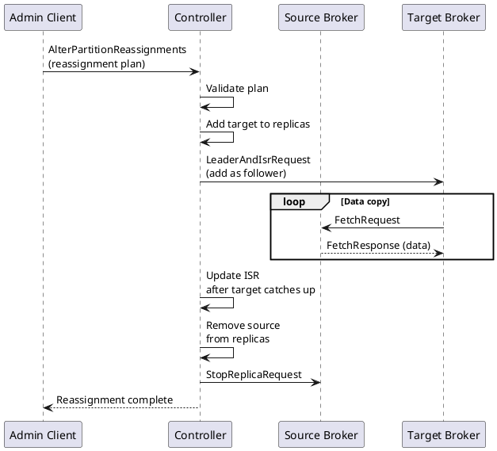
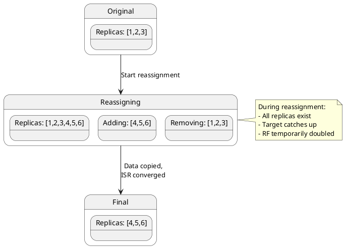
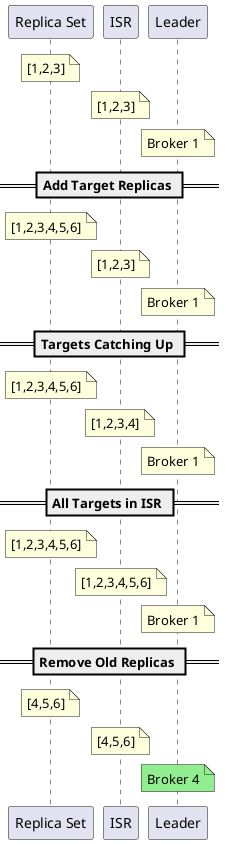
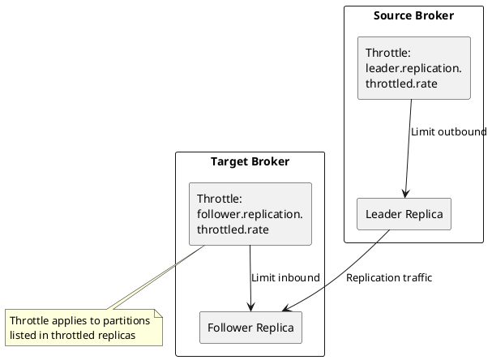
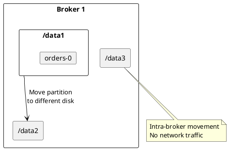

# Kafka Partition Reassignment

Partition reassignment moves partition replicas between brokers to balance load, accommodate scaling, or replace failed hardware. This document covers the reassignment protocol, throttling mechanisms, and operational procedures.

---

## Reassignment Overview

### Why Reassign Partitions

| Scenario | Goal |
|----------|------|
| **Broker addition** | Distribute load to new brokers |
| **Broker removal** | Evacuate partitions before decommissioning |
| **Load balancing** | Even distribution across brokers |
| **Rack migration** | Move partitions between racks |
| **Storage balancing** | Balance disk usage across brokers |

### Reassignment Architecture



---

## Reassignment Process

### State Transitions



### Detailed Flow

1. **Plan validation** - Controller validates broker IDs and partition existence
2. **Add target replicas** - New replicas added to replica set (non-ISR)
3. **Data replication** - New replicas fetch from leader
4. **ISR join** - New replicas join ISR when caught up
5. **Leader election** - If leader changing, elect new leader
6. **Remove old replicas** - Old replicas removed from replica set
7. **Delete data** - Old brokers delete partition data



---

## Reassignment Commands

### Generate Reassignment Plan

```bash
# Create topics file
cat > topics-to-move.json << 'EOF'
{
  "topics": [
    {"topic": "orders"},
    {"topic": "events"},
    {"topic": "logs"}
  ],
  "version": 1
}
EOF

# Generate plan for target brokers
kafka-reassign-partitions.sh --bootstrap-server kafka:9092 \
  --topics-to-move-json-file topics-to-move.json \
  --broker-list "1,2,3,4,5,6" \
  --generate

# Output: Current and proposed assignment
```

### Manual Reassignment Plan

```json
{
  "version": 1,
  "partitions": [
    {
      "topic": "orders",
      "partition": 0,
      "replicas": [4, 5, 6],
      "log_dirs": ["any", "any", "any"]
    },
    {
      "topic": "orders",
      "partition": 1,
      "replicas": [5, 6, 4],
      "log_dirs": ["any", "any", "any"]
    },
    {
      "topic": "orders",
      "partition": 2,
      "replicas": [6, 4, 5],
      "log_dirs": ["any", "any", "any"]
    }
  ]
}
```

### Execute Reassignment

```bash
# Execute with throttling (recommended)
kafka-reassign-partitions.sh --bootstrap-server kafka:9092 \
  --reassignment-json-file reassignment.json \
  --throttle 50000000 \
  --execute

# Execute without throttling (fast but impacts cluster)
kafka-reassign-partitions.sh --bootstrap-server kafka:9092 \
  --reassignment-json-file reassignment.json \
  --execute
```

### Monitor Progress

```bash
# Check reassignment status
kafka-reassign-partitions.sh --bootstrap-server kafka:9092 \
  --reassignment-json-file reassignment.json \
  --verify

# List ongoing reassignments
kafka-reassign-partitions.sh --bootstrap-server kafka:9092 \
  --list

# Cancel reassignment
kafka-reassign-partitions.sh --bootstrap-server kafka:9092 \
  --reassignment-json-file reassignment.json \
  --cancel
```

---

## Throttling

### Throttle Mechanism



### Throttle Configuration

| Configuration | Scope | Description |
|---------------|-------|-------------|
| `leader.replication.throttled.rate` | Broker | Max bytes/sec for leader replicas |
| `follower.replication.throttled.rate` | Broker | Max bytes/sec for follower replicas |
| `leader.replication.throttled.replicas` | Topic | Partitions with throttled leaders |
| `follower.replication.throttled.replicas` | Topic | Partitions with throttled followers |

### Setting Throttle

```bash
# Set throttle rate (50 MB/s)
kafka-reassign-partitions.sh --bootstrap-server kafka:9092 \
  --reassignment-json-file reassignment.json \
  --throttle 50000000 \
  --execute

# Increase throttle during reassignment
kafka-reassign-partitions.sh --bootstrap-server kafka:9092 \
  --reassignment-json-file reassignment.json \
  --throttle 100000000 \
  --execute

# Remove throttle (after completion)
kafka-configs.sh --bootstrap-server kafka:9092 \
  --entity-type brokers \
  --entity-default \
  --alter \
  --delete-config leader.replication.throttled.rate,follower.replication.throttled.rate

kafka-configs.sh --bootstrap-server kafka:9092 \
  --entity-type topics \
  --entity-name orders \
  --alter \
  --delete-config leader.replication.throttled.replicas,follower.replication.throttled.replicas
```

### Throttle Calculation

```
time_estimate = total_data_to_move / throttle_rate

# Example:
# 500 GB to move at 50 MB/s = ~2.8 hours
# 500 GB to move at 100 MB/s = ~1.4 hours
```

| Throttle Rate | Use Case |
|---------------|----------|
| 10-30 MB/s | Production with high sensitivity |
| 50-100 MB/s | Normal production |
| 100-200 MB/s | Off-peak hours |
| Unlimited | Maintenance window only |

!!! warning "Throttle Removal"
    The `--verify` command automatically removes throttle settings when reassignment completes. If reassignment is cancelled, manually remove throttles using `kafka-configs.sh`.

---

## Inter-Broker Protocol

### AlterPartitionReassignments API

```
AlterPartitionReassignmentsRequest =>
    timeout_ms: INT32
    topics: [Topic]

Topic =>
    name: STRING
    partitions: [Partition]

Partition =>
    partition_index: INT32
    replicas: [INT32]  // null to cancel
```

### ListPartitionReassignments API

```
ListPartitionReassignmentsRequest =>
    timeout_ms: INT32
    topics: [Topic]

ListPartitionReassignmentsResponse =>
    topics: [Topic]

Topic =>
    name: STRING
    partitions: [Partition]

Partition =>
    partition_index: INT32
    replicas: [INT32]        // Current replica set
    adding_replicas: [INT32]  // Being added
    removing_replicas: [INT32] // Being removed
```

---

## Log Directory Movement

### Moving Between Disks



### Log Directory Reassignment

```bash
# Describe current log dirs
kafka-log-dirs.sh --bootstrap-server kafka:9092 \
  --describe --topic-list orders

# Create log dir reassignment plan
cat > log-dir-reassignment.json << 'EOF'
{
  "version": 1,
  "partitions": [
    {
      "topic": "orders",
      "partition": 0,
      "replicas": [1, 2, 3],
      "log_dirs": ["/data2", "any", "any"]
    }
  ]
}
EOF

# Execute
kafka-reassign-partitions.sh --bootstrap-server kafka:9092 \
  --reassignment-json-file log-dir-reassignment.json \
  --execute
```

---

## Reassignment Monitoring

### Key Metrics

| Metric | Description | Alert |
|--------|-------------|-------|
| `kafka.server:type=BrokerTopicMetrics,name=ReassignmentBytesInPerSec` | Bytes/sec being copied | - |
| `kafka.server:type=BrokerTopicMetrics,name=ReassignmentBytesOutPerSec` | Bytes/sec being sent | - |
| `kafka.server:UnderReplicatedPartitions` | Partitions below RF | > 0 extended |
| `kafka.server:IsrShrinksPerSec` | ISR shrink rate | Elevated during reassignment |
| `kafka.server:IsrExpandsPerSec` | ISR expand rate | Indicates progress |

### Progress Tracking

```bash
# Watch reassignment progress
watch -n 10 'kafka-reassign-partitions.sh \
  --bootstrap-server kafka:9092 \
  --reassignment-json-file reassignment.json \
  --verify'

# Check under-replicated partitions
kafka-topics.sh --bootstrap-server kafka:9092 \
  --describe --under-replicated-partitions

# Monitor replication lag
# Use broker metrics: ReassignmentBytesInPerSec/OutPerSec
```

---

## Failure Handling

### Reassignment Failures

| Failure | Impact | Recovery |
|---------|--------|----------|
| Source broker crash | Reassignment stalls | Wait for recovery or cancel |
| Target broker crash | New replica lost | Restart broker, retry |
| Controller failover | Continues after election | Automatic |
| Network partition | Reassignment stalls | Resolve network, resume |

### Cancelling Reassignment

```bash
# Cancel specific reassignment
kafka-reassign-partitions.sh --bootstrap-server kafka:9092 \
  --reassignment-json-file reassignment.json \
  --cancel

# Verify cancellation
kafka-reassign-partitions.sh --bootstrap-server kafka:9092 \
  --list
```

### Recovery After Failure

```bash
# Check current state
kafka-topics.sh --bootstrap-server kafka:9092 \
  --describe --topic orders

# If stuck with extra replicas, cancel and restart
kafka-reassign-partitions.sh --bootstrap-server kafka:9092 \
  --reassignment-json-file reassignment.json \
  --cancel

# Retry with fresh plan
kafka-reassign-partitions.sh --bootstrap-server kafka:9092 \
  --reassignment-json-file reassignment.json \
  --throttle 50000000 \
  --execute
```

---

## Best Practices

### Planning

| Practice | Rationale |
|----------|-----------|
| Assess data volume | Calculate reassignment duration |
| Schedule during low traffic | Minimize production impact |
| Start with small topics | Validate process |
| Document original state | Enable rollback |

### Execution

| Practice | Rationale |
|----------|-----------|
| Always use throttling | Prevent cluster saturation |
| Monitor continuously | Detect issues early |
| Reassign incrementally | Reduce blast radius |
| Keep original plan | Required for verify/cancel |

### Post-Reassignment

| Practice | Rationale |
|----------|-----------|
| Verify completion | Ensure all moves finished |
| Check partition balance | Confirm even distribution |
| Monitor cluster health | Detect delayed issues |
| Remove throttle configs | Clean up configuration |

---

## Reassignment Scenarios

### Scenario: Add Broker

```bash
# 1. New broker joins (broker.id=4)
# 2. Generate balanced plan
kafka-reassign-partitions.sh --bootstrap-server kafka:9092 \
  --topics-to-move-json-file all-topics.json \
  --broker-list "1,2,3,4" \
  --generate > add-broker-4.json

# 3. Execute with throttle
kafka-reassign-partitions.sh --bootstrap-server kafka:9092 \
  --reassignment-json-file add-broker-4.json \
  --throttle 100000000 \
  --execute
```

### Scenario: Remove Broker

```bash
# 1. Generate plan excluding broker 4
kafka-reassign-partitions.sh --bootstrap-server kafka:9092 \
  --topics-to-move-json-file all-topics.json \
  --broker-list "1,2,3" \
  --generate > remove-broker-4.json

# 2. Execute
kafka-reassign-partitions.sh --bootstrap-server kafka:9092 \
  --reassignment-json-file remove-broker-4.json \
  --throttle 100000000 \
  --execute

# 3. Wait for completion
kafka-reassign-partitions.sh --bootstrap-server kafka:9092 \
  --reassignment-json-file remove-broker-4.json \
  --verify

# 4. Stop broker 4
kafka-server-stop.sh
```

### Scenario: Balance Across Racks

```bash
# Create rack-aware reassignment
# Ensure replicas distributed across racks
cat > rack-balance.json << 'EOF'
{
  "version": 1,
  "partitions": [
    {
      "topic": "orders",
      "partition": 0,
      "replicas": [1, 3, 5]
    }
  ]
}
EOF
# Broker 1 = rack-a, Broker 3 = rack-b, Broker 5 = rack-c
```

---

## Related Documentation

- [Scaling Overview](index.md) - Cluster scaling concepts
- [Consumer Rebalancing](consumer-rebalancing.md) - Consumer scaling
- [Cluster Management](../cluster-management/index.md) - Cluster operations
- [Replication](../replication/index.md) - Replication protocol