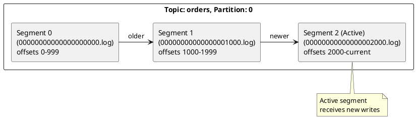
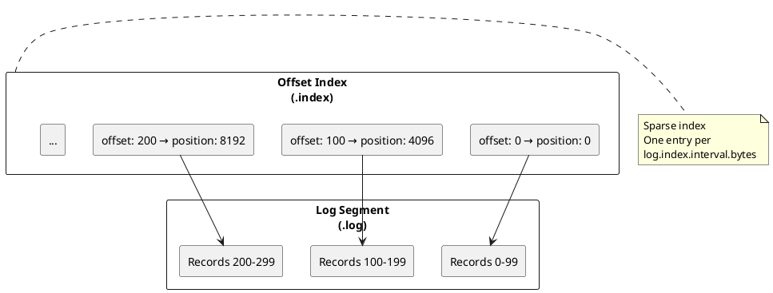
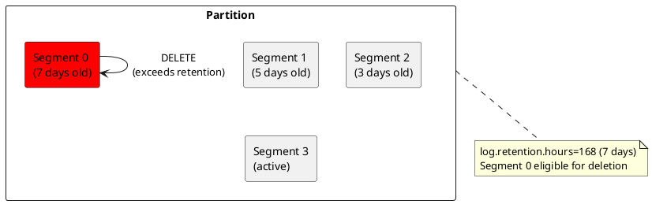
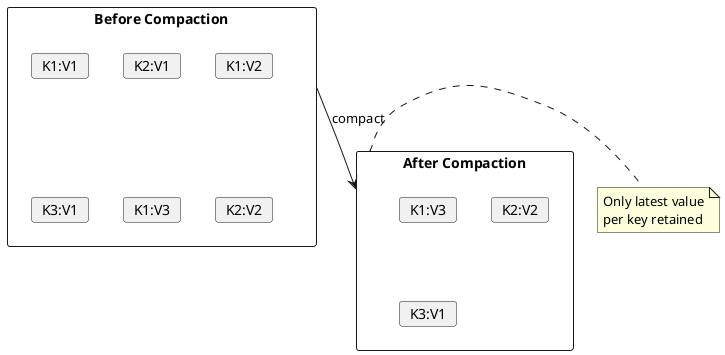
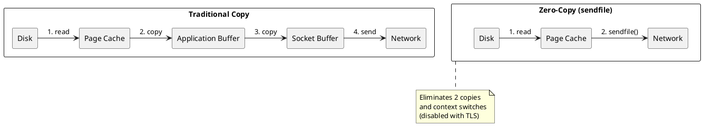

# Storage Engine

Kafka's storage engine provides durable, high-throughput message persistence through an append-only log structure.

---

## Log Structure

Each partition is stored as an ordered, append-only sequence of records in log segments.



### Directory Structure

```
/var/kafka-logs/
├── orders-0/
│   ├── 00000000000000000000.log      # Segment file
│   ├── 00000000000000000000.index    # Offset index
│   ├── 00000000000000000000.timeindex # Timestamp index
│   ├── 00000000000000000000.txnindex  # Transaction index
│   ├── 00000000000000000000.snapshot  # Producer state
│   ├── 00000000000000001000.log
│   ├── 00000000000000001000.index
│   ├── 00000000000000001000.timeindex
│   ├── leader-epoch-checkpoint
│   └── partition.metadata
├── orders-1/
│   └── ...
└── orders-2/
    └── ...
```

---

## Log Segments

### Segment Files

| File | Purpose | Content |
|------|---------|---------|
| `.log` | Message data | Record batches |
| `.index` | Offset index | Offset → position mapping |
| `.timeindex` | Timestamp index | Timestamp → offset mapping |
| `.snapshot` | Producer state | Idempotency data |
| `.txnindex` | Transaction index | Aborted transactions |

### Segment Rolling

New segments are created when:

| Condition | Configuration |
|-----------|---------------|
| Size threshold | `log.segment.bytes` (default: 1GB) |
| Time threshold | `log.roll.ms` / `log.roll.hours` (broker defaults for `segment.ms`) |
| Index full | `log.index.size.max.bytes` |

```properties
# Segment configuration
log.segment.bytes=1073741824        # 1GB
log.roll.hours=168                  # 7 days
log.index.size.max.bytes=10485760  # 10MB
log.index.interval.bytes=4096      # Index entry every 4KB
```

---

## Record Format

### Record Batch Structure

```
RecordBatch:
├── baseOffset: int64
├── batchLength: int32
├── partitionLeaderEpoch: int32
├── magic: int8 (2 for current version)
├── crc: int32
├── attributes: int16
│   ├── compression (bits 0-2)
│   ├── timestampType (bit 3)
│   ├── isTransactional (bit 4)
│   └── isControlBatch (bit 5)
├── lastOffsetDelta: int32
├── firstTimestamp: int64
├── maxTimestamp: int64
├── producerId: int64
├── producerEpoch: int16
├── baseSequence: int32
├── records: [Record]
```

### Individual Record

```
Record:
├── length: varint
├── attributes: int8
├── timestampDelta: varlong
├── offsetDelta: varint
├── keyLength: varint
├── key: byte[]
├── valueLength: varint
├── value: byte[]
└── headers: [Header]
```

---

## Indexes

### Offset Index

Maps logical offsets to physical file positions for efficient seeking.



### Timestamp Index

Maps timestamps to offsets for time-based seeking.

```bash
# Seek to offset by timestamp
kafka-consumer-groups.sh --bootstrap-server kafka:9092 \
  --group my-group \
  --topic orders \
  --reset-offsets \
  --to-datetime 2024-01-15T10:00:00.000 \
  --execute
```

---

## Retention

### Time-Based Retention

Delete segments older than retention period.

```properties
log.retention.ms=604800000        # 7 days (default)
log.retention.check.interval.ms=300000  # Check every 5 min
```

!!! note "Retention aliases"
    `log.retention.hours` and `log.retention.minutes` are legacy aliases for `log.retention.ms`.

### Size-Based Retention

Delete oldest segments when partition exceeds size limit.

```properties
log.retention.bytes=107374182400  # 100GB per partition
```

### Retention Behavior



---

## Log Compaction

Retains only the latest value for each key, useful for changelog/table semantics.



### Compaction Configuration

```properties
# Enable compaction
log.cleanup.policy=compact

# Or both delete and compact
log.cleanup.policy=compact,delete

# Broker compaction defaults
log.cleaner.enable=true
log.cleaner.threads=1
log.cleaner.min.cleanable.ratio=0.5
log.cleaner.min.compaction.lag.ms=0
log.cleaner.delete.retention.ms=86400000  # 24h tombstone retention

# Segment eligibility
log.segment.bytes=1073741824
min.cleanable.dirty.ratio=0.5

!!! note "Scope"
    `log.cleaner.*` settings are broker defaults. `min.cleanable.dirty.ratio` is a topic-level override.
```

### Tombstones

Delete a key by producing a record with null value (tombstone).

```java
producer.send(new ProducerRecord<>("topic", "key-to-delete", null));
```

Tombstones are retained for `log.cleaner.delete.retention.ms` before removal.

---

## Performance Optimizations

For complete performance tuning including batching, compression selection, and thread model optimization, see [Performance Internals](../performance-internals/index.md).

### Zero-Copy

Kafka uses `sendfile()` to transfer data directly from page cache to network socket.



### Page Cache

Kafka relies heavily on OS page cache for read performance.

| Recommendation (Repository Guidance) | Rationale |
|----------------|-----------|
| Allocate 25-50% RAM to page cache | Caches active segments |
| Use SSDs | Faster random reads for index lookups |
| Separate disks for log.dirs | Parallel I/O |

---

## Monitoring Storage

### Key Metrics

| Metric | Description |
|--------|-------------|
| `kafka.log:type=Log,name=Size` | Partition size in bytes |
| `kafka.log:type=Log,name=NumLogSegments` | Segment count |
| `kafka.log:type=LogCleaner,name=cleaner-recopy-percent` | Compaction efficiency |
| `kafka.log:type=LogCleaner,name=max-clean-time-secs` | Compaction duration |

### Disk Commands

```bash
# Check partition sizes
du -sh /var/kafka-logs/*/

# List segment files
ls -la /var/kafka-logs/orders-0/

# Dump log segment
kafka-dump-log.sh --files /var/kafka-logs/orders-0/00000000000000000000.log \
  --print-data-log
```

---

## Related Documentation

- [Architecture Overview](../index.md) - Kafka architecture
- [Performance](../performance-internals/index.md) - Performance optimizations
- [Operations](../../operations/index.md) - Operational procedures
- [Configuration](../../operations/configuration/index.md) - Configuration reference
