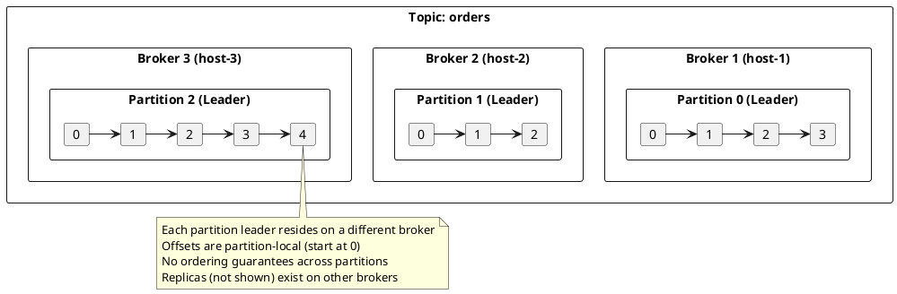
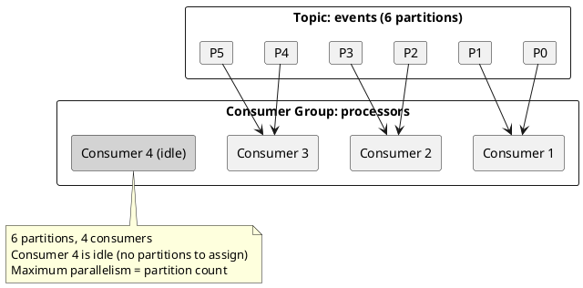
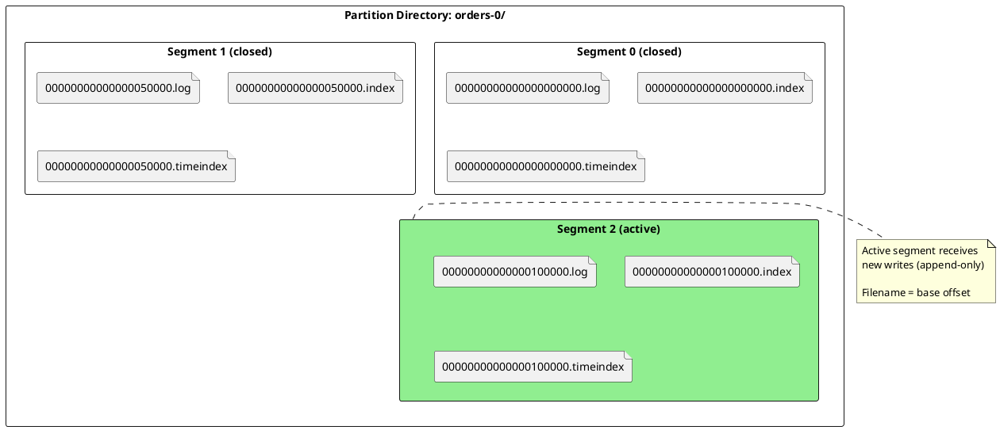
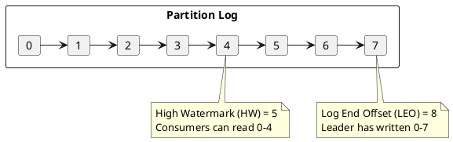
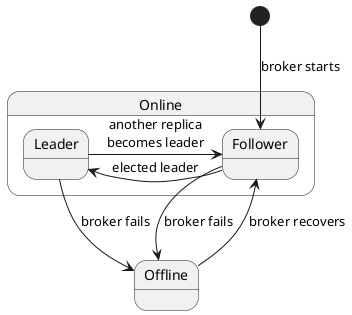
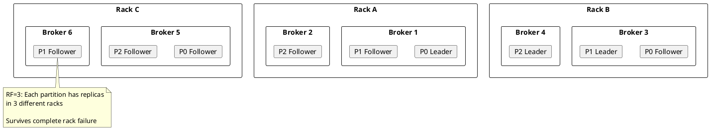

# Topics and Partitions

Topics and partitions form the foundation of Kafka's distributed architecture. A topic is a logical channel for records; partitions provide horizontal scalability and fault tolerance through distributed, replicated logs.

---

## Topic Architecture

A topic is a named, append-only log that organizes related records. Unlike traditional message queues where messages are deleted after consumption, Kafka topics retain records based on configurable retention policies.



### Topic Properties

| Property | Description |
|----------|-------------|
| **Name** | Unique identifier within the cluster; immutable after creation |
| **Partition count** | Number of partitions; can be increased but not decreased |
| **Replication factor** | Number of replicas per partition; set at creation |
| **Retention** | How long records are kept (time or size based) |
| **Cleanup policy** | Delete old segments or compact by key |

### Topic Naming Constraints

| Constraint | Rule |
|------------|------|
| Length | 1-249 characters |
| Characters | `[a-zA-Z0-9._-]` only |
| Reserved | `.` and `..` are not allowed |
| Reserved | Names starting with `__` are internal topics |
| Collision | `.` and `_` are interchangeable in metrics; avoid mixing |

!!! warning "Internal Topics"
    Topics prefixed with `__` are managed by Kafka internally and must not be modified directly:

    - `__consumer_offsets` - Consumer group offset storage
    - `__transaction_state` - Transaction coordinator state
    - `__share_group_state` - Share group state
    - `__cluster_metadata` - KRaft metadata (KRaft mode only)

---

## Why Partitions Exist

Partitions exist because a single machine has fundamental physical limitations. Understanding these limitations explains why distributed systems like Kafka partition data across multiple nodes.

### The Single-Broker Bottleneck

A Kafka broker running on a single server faces hard limits imposed by hardware:

**Disk I/O Throughput**

Kafka writes are sequential (append-only), which is optimal for disk performance. However, even sequential I/O has limits:

| Storage Type | Sequential Write (illustrative) | Sequential Read (illustrative) | Notes |
|--------------|------------------|-----------------|-------|
| HDD (7200 RPM) | 80-160 MB/s | 80-160 MB/s | Seek time negligible for sequential; still limited by rotational speed |
| SATA SSD | 400-550 MB/s | 500-550 MB/s | Limited by SATA interface (6 Gbps theoretical max) |
| NVMe SSD | 2,000-7,000 MB/s | 3,000-7,000 MB/s | PCIe bandwidth limited; enterprise drives sustain higher throughput |
| NVMe (RAID 0) | 10,000+ MB/s | 15,000+ MB/s | Multiple drives; reliability trade-offs |

With a replication factor of 3, each produced record must be written to three brokers. The leader writes to its own disk and the followers each write to theirs. Disk I/O on followers can become a bottleneck for ISR advancement.

**Network Bandwidth**

Network interfaces impose hard ceilings on data transfer:

| Interface | Theoretical Max | Practical Throughput (illustrative) | Notes |
|-----------|-----------------|----------------------|-------|
| 1 GbE | 125 MB/s | 100-110 MB/s | Common in older deployments; often the bottleneck |
| 10 GbE | 1,250 MB/s | 1,000-1,100 MB/s | Standard for modern Kafka deployments |
| 25 GbE | 3,125 MB/s | 2,500-2,800 MB/s | High-performance deployments |
| 100 GbE | 12,500 MB/s | 10,000-11,000 MB/s | Large-scale deployments; requires matching infrastructure |

With replication factor 3, producing 100 MB/s to a topic generates approximately:

- **100 MB/s inbound** to the leader (producer writes)
- **200 MB/s outbound** from the leader (two followers fetching)
- **100 MB/s inbound** to each follower
- **Consumer fetch traffic** on top of replication

A single 10 GbE interface can become saturated with moderate production rates when accounting for replication overhead and consumer traffic.

**CPU Processing**

CPU becomes a bottleneck primarily in these scenarios:

| Operation | CPU Cost | When It Matters |
|-----------|----------|-----------------|
| **Compression** | High | Producer-side compression (LZ4, Snappy, Zstd) reduces network/disk but costs CPU |
| **Decompression** | Medium-High | Broker decompresses for validation (if message format conversion needed) or timestamping |
| **TLS encryption** | High | TLS 1.3 handshakes and bulk encryption; 20-40% throughput reduction typical |
| **CRC32 checksums** | Low | Every record batch verified; hardware-accelerated on modern CPUs |
| **Zero-copy disabled** | High | TLS prevents zero-copy (`transferTo`); data copied through userspace |

!!! info "TLS Performance Impact"
    TLS encryption can reduce Kafka throughput depending on workload and hardware. However, **raw encryption speed is not the bottleneck** on modern hardware.

    Modern CPUs with AES-NI achieve 4-7 GB/s AES-256-GCM throughput per core—far exceeding typical Kafka broker throughput. The actual overhead comes from architectural changes required for encryption:

    - **Zero-copy bypass**: Without TLS, Kafka uses Linux `sendfile()` to transfer data directly from page cache to NIC without copying through userspace. TLS requires data to be copied to userspace for encryption, then back to kernel space for transmission. This adds 2-3 memory copies per request.
    - **Memory bandwidth pressure**: The extra copies consume memory bandwidth that would otherwise be available for actual data transfer.
    - **Syscall overhead**: More context switches between kernel and userspace for each data transfer.
    - **Handshake overhead**: TLS session establishment for new connections (mitigated by connection pooling and session resumption).

    The solution is not faster CPUs but reducing the copy overhead. Kernel TLS (kTLS, Linux 4.13+) can offload TLS to the kernel, restoring partial zero-copy capability. For latency-sensitive workloads, evaluate network-layer encryption (IPsec, WireGuard, encrypted overlay networks) which preserves application-layer zero-copy.

**Memory Constraints**

Each partition consumes broker memory for:

| Resource | Per-Partition Cost (illustrative) | Notes |
|----------|-------------------|-------|
| Page cache utilization | Variable | OS caches recent segments; partitions compete for cache space |
| Index files (mmap) | Up to 10 MB per index per segment (default) | `.index` and `.timeindex` mapped into memory |
| Log segment overhead | ~1-2 MB | Buffers, file handles, metadata structures |
| Replica fetcher threads | Shared | Each source broker requires a fetcher thread |

With thousands of partitions per broker, memory overhead becomes significant. Repository guidance is to limit partitions to approximately 4,000 per broker (varies with hardware).

### The Single-Consumer Bottleneck

Within a consumer group, Kafka assigns each partition to exactly one consumer. This design provides ordering guarantees but creates a parallelism ceiling:



**Consumer throughput limits:**

| Bottleneck | Typical Limit | Mitigation |
|------------|---------------|------------|
| Processing logic | Varies | Optimize code; async I/O; batch processing |
| Network fetch | 100+ MB/s | Increase `fetch.max.bytes`; tune `max.partition.fetch.bytes` |
| Deserialization | Varies | Use efficient formats (Avro, Protobuf); avoid JSON for high throughput |
| Downstream writes | Often the limit | Database insertion, API calls often slower than Kafka reads |
| Commit overhead | Minor | Async commits; less frequent commits for higher throughput |

If a single consumer can process 50 MB/s but the topic receives 200 MB/s, four partitions (and four consumers) are needed to keep up. The partition count sets the maximum consumer parallelism.

### How Partitions Solve These Problems

| Physical Limitation | How Partitions Help |
|---------------------|---------------------|
| **Disk I/O ceiling** | Each partition can be on a different broker with its own disks; total throughput = sum of all brokers |
| **Network bandwidth ceiling** | Traffic distributed across brokers; no single NIC handles all data |
| **CPU ceiling** | Compression, TLS, and CRC work distributed across brokers |
| **Memory ceiling** | Partition working sets distributed; page cache pressure spread |
| **Consumer processing ceiling** | More partitions = more consumers in parallel |
| **Storage capacity** | Each broker contributes its disk capacity to the cluster |
| **Single point of failure** | Replicas on different brokers; partition remains available if one broker fails |

---

## Partition Structure

Each partition is stored as a directory containing log segments. For complete storage internals including indexes, compaction, and retention, see [Storage Engine](../storage-engine/index.md).



### Partition Files

| File Extension | Purpose |
|----------------|---------|
| `.log` | Record data (keys, values, headers, timestamps) |
| `.index` | Sparse offset-to-file-position index |
| `.timeindex` | Sparse timestamp-to-offset index |
| `.txnindex` | Transaction abort index |
| `.snapshot` | Producer state snapshot for idempotence |
| `leader-epoch-checkpoint` | Leader epoch history |

### Offset Semantics

Offsets are 64-bit integers assigned sequentially within each partition:

| Concept | Description |
|---------|-------------|
| **Base offset** | First offset in a segment (used in filename) |
| **Log End Offset (LEO)** | Next offset to be assigned (last offset + 1) |
| **High Watermark (HW)** | Last offset replicated to all ISR; consumers read up to HW |
| **Last Stable Offset (LSO)** | HW excluding uncommitted transactions |



---

## Partition Leaders and Replicas

Each partition has one leader and zero or more follower replicas. The leader handles all read and write requests; followers replicate data from the leader.

### Leader Responsibilities

| Responsibility | Description |
|----------------|-------------|
| **Handle produces** | Accept and persist records from producers |
| **Handle fetches** | Serve records to consumers and followers |
| **Maintain ISR** | Track which followers are in-sync |
| **Advance HW** | Update high watermark as followers catch up |

### Follower Responsibilities

| Responsibility | Description |
|----------------|-------------|
| **Fetch from leader** | Continuously replicate new records |
| **Maintain LEO** | Track local log end offset |
| **Report position** | Include LEO in fetch requests for HW calculation |

### Replica States



---

## In-Sync Replicas (ISR)

The ISR is the set of replicas that are fully caught up with the leader. Only ISR members are eligible to become leader if the current leader fails.

| Concept | Description |
|---------|-------------|
| **ISR membership** | Replicas within `replica.lag.time.max.ms` of the leader |
| **min.insync.replicas** | Minimum ISR size required for `acks=all` produces |
| **ISR shrinkage** | Slow replicas removed; affects write availability |

For detailed ISR mechanics, membership criteria, and configuration, see [Replication: In-Sync Replicas](../replication/index.md#in-sync-replicas-isr).

---

## Leader Election

When a partition leader fails, Kafka elects a new leader from the ISR. The controller (or KRaft quorum) coordinates this process.

| Election Type | Description |
|---------------|-------------|
| **Clean election** | New leader chosen from ISR; no data loss |
| **Unclean election** | Out-of-sync replica becomes leader; potential data loss |
| **Preferred election** | Leadership rebalanced to preferred replica |

For the complete leader election protocol, leader epochs, and configuration, see [Replication: Leader Election](../replication/index.md#leader-election).

---

## High Watermark

The high watermark (HW) is the offset up to which all ISR replicas have replicated. Consumers can only read records up to the HW.

| Concept | Description |
|---------|-------------|
| **High Watermark (HW)** | Last offset replicated to all ISR members |
| **Log End Offset (LEO)** | Next offset to be written (leader's latest) |
| **Consumer visibility** | Consumers read only up to HW |

!!! note "Read-Your-Writes"
    A producer may not immediately read its own writes. The record becomes visible only after HW advances (all ISR have replicated).

For high watermark advancement mechanics and the replication protocol, see [Replication: High Watermark](../replication/index.md#high-watermark).

---

## Partition Assignment

When topics are created or partitions are added, the controller assigns partitions to brokers. For partition reassignment procedures, see [Cluster Management](../cluster-management/index.md#partition-assignment).

### Assignment Goals

| Goal | Strategy |
|------|----------|
| **Balance** | Distribute partitions evenly across brokers |
| **Rack awareness** | Place replicas in different racks |
| **Minimize movement** | Prefer keeping existing assignments |

### Rack-Aware Assignment



### Configuration

| Configuration | Default | Description |
|---------------|---------|-------------|
| `broker.rack` | null | Rack identifier for this broker |
| `default.replication.factor` | 1 | Default RF for auto-created topics |
| `num.partitions` | 1 | Default partition count for auto-created topics |

---

## Partition Count Selection

Choosing the right partition count requires understanding workload requirements and system constraints.

### Calculating Required Partitions

**For throughput requirements:**

```
Partitions needed = Target throughput / Per-partition throughput
```

Per-partition throughput depends on the bottleneck:

| Component | Typical Per-Partition Limit | Determining Factors |
|-----------|----------------------------|---------------------|
| Producer to single partition | 10-50 MB/s | Batch size, linger.ms, compression, network RTT |
| Consumer from single partition | 50-100+ MB/s | Consumer processing speed, fetch size, downstream latency |
| Broker disk I/O | Shared across partitions | Total broker throughput / partition count |

**Example calculation:**

- Target throughput: 500 MB/s production
- Single producer batch throughput to one partition: ~30 MB/s (with compression, acks=all)
- Minimum partitions for throughput: 500 / 30 ≈ 17 partitions

However, consumer parallelism may require more:

- Consumer processing rate: 25 MB/s per consumer
- Consumers needed: 500 / 25 = 20 consumers
- Partitions needed: at least 20 (one per consumer)

**For ordering requirements:**

Records with the same key are routed to the same partition. If strict ordering across a key space is required:

| Ordering Scope | Partition Strategy |
|----------------|-------------------|
| Per-entity ordering (e.g., per user) | Use entity ID as key; Kafka guarantees order within partition |
| Global ordering (all records) | Single partition only; limits throughput to single-partition maximum |
| No ordering requirement | Partition for throughput; use round-robin or random keys |

### Trade-offs of Partition Count

| Factor | More Partitions | Fewer Partitions |
|--------|-----------------|------------------|
| **Maximum throughput** | Higher (parallel I/O, more consumers) | Lower (single-broker ceiling) |
| **Consumer parallelism** | Higher (one consumer per partition max) | Lower |
| **Ordering granularity** | Finer (per-partition ordering) | Coarser (broader ordering scope) |
| **End-to-end latency** | Can increase (more batching coordination) | Can decrease (simpler path) |
| **Broker memory** | Higher (~1-2 MB per partition-replica) | Lower |
| **File handles** | Higher (3 file handles per segment per partition) | Lower |
| **Controller overhead** | Higher (more metadata, slower elections) | Lower |
| **Rebalance time** | Longer (more partition movements) | Shorter |
| **Recovery time** | Longer (more partitions to recover) | Shorter |
| **Availability during failures** | Higher (smaller blast radius per partition) | Lower (more data affected per partition) |

### Guidelines by Workload

| Workload Characteristics | Suggested Approach |
|--------------------------|-------------------|
| **Low throughput (<10 MB/s), ordering important** | 3-6 partitions; focus on key distribution |
| **Medium throughput (10-100 MB/s)** | 6-30 partitions; balance throughput and operational overhead |
| **High throughput (100-500 MB/s)** | 30-100 partitions; ensure sufficient consumers |
| **Very high throughput (500+ MB/s)** | 100+ partitions; may require multiple clusters for extreme scale |
| **Strict global ordering** | 1 partition; accept throughput ceiling |
| **Unknown future growth** | Start with more partitions (can't reduce); 12-30 is often reasonable |

!!! warning "Partition Count Cannot Be Decreased"
    Once a topic is created, the partition count can only be increased, not decreased. Increasing partitions also breaks key-based ordering guarantees for existing keys (keys may hash to different partitions).

!!! info "Partition Count Upper Bounds (Repository Guidance)"
    Limit partitions per broker to approximately 4,000 and partitions per cluster to approximately 200,000 (as of Kafka 3.x). These limits relate to:

    - Controller metadata management overhead
    - ZooKeeper/KRaft watch overhead
    - Leader election time during broker failures
    - Memory consumption for indexes and buffers

    See [KIP-578](https://cwiki.apache.org/confluence/display/KAFKA/KIP-578%3A+Add+configuration+to+limit+number+of+partitions) for partition limit configuration.

---

## Topic and Partition Metadata

Kafka maintains metadata about topics and partitions in the controller. Clients fetch this metadata to discover partition leaders.

### Metadata Contents

| Metadata | Description |
|----------|-------------|
| Topic list | All topics in cluster |
| Partition count | Number of partitions per topic |
| Replica assignment | Which brokers host each partition |
| Leader | Current leader for each partition |
| ISR | In-sync replicas for each partition |
| Controller | Current controller broker |

### Metadata Refresh

| Trigger | Description |
|---------|-------------|
| `metadata.max.age.ms` | Periodic refresh (default: 5 minutes) |
| `NOT_LEADER_OR_FOLLOWER` error | Immediate refresh |
| `UNKNOWN_TOPIC_OR_PARTITION` error | Immediate refresh |
| New producer/consumer | Initial fetch |

---

## Performance Benchmarks

Actual throughput varies significantly based on hardware, configuration, and workload. The following provides reference points from common deployment scenarios:

### Single-Broker Throughput (Repository Guidance)

| Configuration | Production Throughput | Notes |
|---------------|----------------------|-------|
| HDD, 1 GbE, no TLS | 50-80 MB/s | Network often the bottleneck |
| SSD, 10 GbE, no TLS | 200-400 MB/s | Disk and CPU become factors |
| NVMe, 10 GbE, no TLS | 300-500 MB/s | CPU and network limits |
| NVMe, 25 GbE, no TLS | 500-800 MB/s | High-end configuration |
| Any config + TLS | 20-40% reduction | TLS overhead; varies with hardware AES support |
| Any config + compression | CPU-dependent | LZ4/Snappy: minor overhead; Zstd: higher CPU, better ratio |

These figures assume:

- Replication factor 3 with `acks=all`
- Reasonable batch sizes (16-64 KB)
- Modern server-class hardware
- No other significant workloads on the brokers

### Factors That Reduce Throughput

| Factor | Impact | Mitigation |
|--------|--------|------------|
| Small messages (<100 bytes) | Overhead dominates; lower MB/s | Batch more aggressively; consider message aggregation |
| High partition count | More memory, more file handles | Stay within broker limits; balance across cluster |
| `acks=all` with slow followers | Latency increases; throughput may drop | Ensure followers on fast storage; monitor ISR |
| TLS without AES-NI | Severe CPU bottleneck | Use hardware with AES-NI support |
| Page cache pressure | More disk reads | Add RAM; reduce partition count per broker |
| Cross-datacenter replication | RTT affects `acks=all` latency | Use async replication (MirrorMaker 2) for cross-DC |

---

## Version Compatibility

| Feature | Minimum Version |
|---------|-----------------|
| Rack-aware assignment | 0.10.0 |
| Leader epoch | 0.11.0 |
| Follower fetching (KIP-392) | 2.4.0 |
| Tiered storage | 3.6.0 (early access) |
| KRaft mode | 3.3.0 (production) |

---

## Configuration Reference

### Topic Configuration

| Configuration | Default | Description |
|---------------|---------|-------------|
| `retention.ms` | 604800000 (7d) | Time-based retention |
| `retention.bytes` | -1 (unlimited) | Size-based retention per partition |
| `segment.bytes` | 1073741824 (1GB) | Log segment size |
| `segment.ms` | 604800000 (7d) | Time before rolling segment |
| `cleanup.policy` | delete | `delete`, `compact`, or both |
| `min.insync.replicas` | 1 | Minimum ISR for acks=all |
| `unclean.leader.election.enable` | false | Allow non-ISR leader election |

### Broker Configuration

| Configuration | Default | Description |
|---------------|---------|-------------|
| `num.partitions` | 1 | Default partitions for new topics |
| `default.replication.factor` | 1 | Default RF for new topics |
| `replica.lag.time.max.ms` | 30000 | Max lag before ISR removal |
| `replica.fetch.max.bytes` | 1048576 | Max bytes per replica fetch |
| `broker.rack` | null | Rack identifier |

---

## Related Documentation

- [Replication](../replication/index.md) - ISR mechanics, leader election protocol, high watermark, and acknowledgment levels
- [Storage Engine](../storage-engine/index.md) - Log segments and compaction
- [Fault Tolerance](../fault-tolerance/index.md) - Failure scenarios
- [Brokers](../brokers/index.md) - Broker architecture and configuration