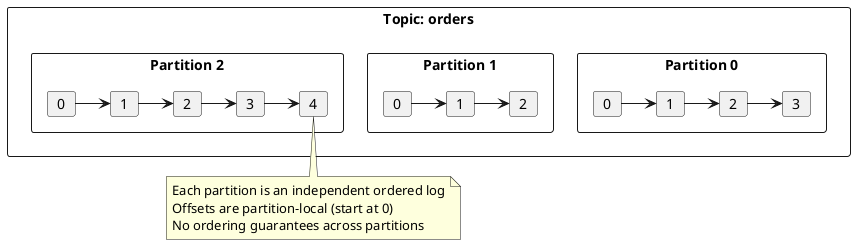
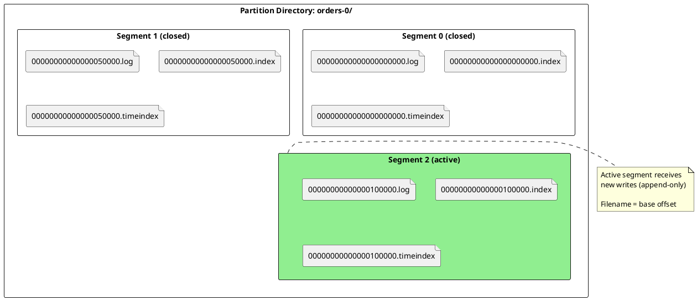
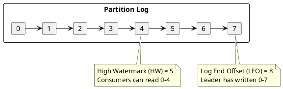
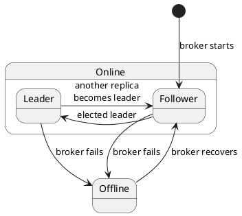
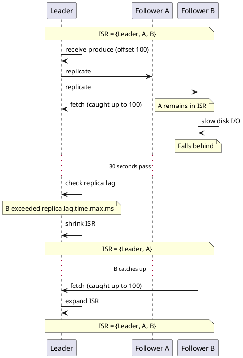
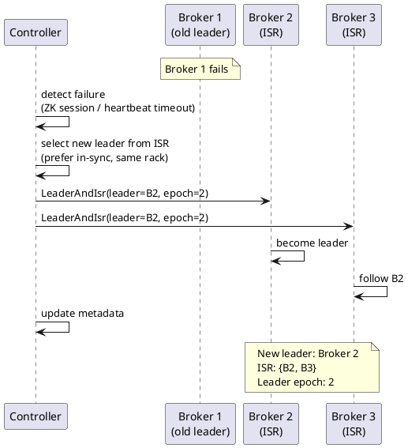
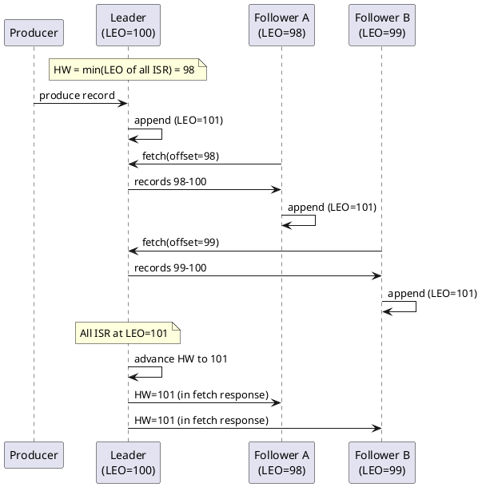
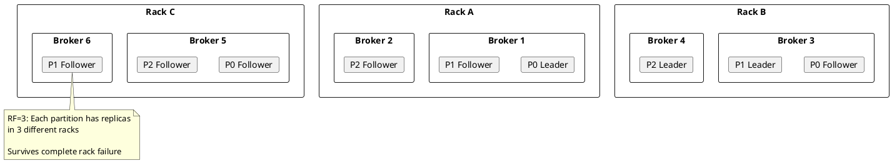

# Topics and Partitions

Topics and partitions form the foundation of Kafka's distributed architecture. A topic is a logical channel for records; partitions provide horizontal scalability and fault tolerance through distributed, replicated logs.

---

## Topic Architecture

A topic is a named, append-only log that organizes related records. Unlike traditional message queues where messages are deleted after consumption, Kafka topics retain records based on configurable retention policies.

### Topic Properties

| Property | Description |
|----------|-------------|
| **Name** | Unique identifier within the cluster; immutable after creation |
| **Partition count** | Number of partitions; can be increased but not decreased |
| **Replication factor** | Number of replicas per partition; set at creation |
| **Retention** | How long records are kept (time or size based) |
| **Cleanup policy** | Delete old segments or compact by key |

### Topic Naming Constraints

| Constraint | Rule |
|------------|------|
| Length | 1-249 characters |
| Characters | `[a-zA-Z0-9._-]` only |
| Reserved | Names starting with `__` are internal topics |
| Collision | `.` and `_` are interchangeable in metrics; avoid mixing |

!!! warning "Internal Topics"
    Topics prefixed with `__` are managed by Kafka internally and must not be modified directly:

    - `__consumer_offsets` - Consumer group offset storage
    - `__transaction_state` - Transaction coordinator state
    - `__cluster_metadata` - KRaft metadata (KRaft mode only)

---

## Partitions

Partitions are the unit of parallelism and distribution in Kafka. Each partition is an ordered, immutable sequence of records stored on a single broker (with replicas on other brokers).

### Why Partitions Exist

| Problem | How Partitions Solve It |
|---------|-------------------------|
| Single broker throughput limit | Distribute writes across multiple brokers |
| Single consumer throughput limit | Enable parallel consumption within consumer groups |
| Storage capacity limit | Spread data across cluster storage |
| Single point of failure | Replicas on different brokers provide redundancy |

### Partition Structure

Each partition is stored as a directory containing log segments:

### Partition Files

| File Extension | Purpose |
|----------------|---------|
| `.log` | Record data (keys, values, headers, timestamps) |
| `.index` | Sparse offset-to-file-position index |
| `.timeindex` | Sparse timestamp-to-offset index |
| `.txnindex` | Transaction abort index |
| `.snapshot` | Producer state snapshot for idempotence |
| `leader-epoch-checkpoint` | Leader epoch history |

### Offset Semantics

Offsets are 64-bit integers assigned sequentially within each partition:

| Concept | Description |
|---------|-------------|
| **Base offset** | First offset in a segment (used in filename) |
| **Log End Offset (LEO)** | Next offset to be assigned (last offset + 1) |
| **High Watermark (HW)** | Last offset replicated to all ISR; consumers read up to HW |
| **Last Stable Offset (LSO)** | HW excluding uncommitted transactions |

---

## Partition Leaders and Replicas

Each partition has one leader and zero or more follower replicas. The leader handles all read and write requests; followers replicate data from the leader.

### Leader Responsibilities

| Responsibility | Description |
|----------------|-------------|
| **Handle produces** | Accept and persist records from producers |
| **Handle fetches** | Serve records to consumers and followers |
| **Maintain ISR** | Track which followers are in-sync |
| **Advance HW** | Update high watermark as followers catch up |

### Follower Responsibilities

| Responsibility | Description |
|----------------|-------------|
| **Fetch from leader** | Continuously replicate new records |
| **Maintain LEO** | Track local log end offset |
| **Report position** | Include LEO in fetch requests for HW calculation |

### Replica States

---

## In-Sync Replicas (ISR)

The ISR is the set of replicas that are fully caught up with the leader. Only ISR members are eligible to become leader if the current leader fails.

### ISR Membership Criteria

A replica remains in the ISR if it meets **both** conditions:

| Condition | Configuration | Default |
|-----------|---------------|---------|
| Caught up to leader's LEO | `replica.lag.time.max.ms` | 30000 (30s) |
| Heartbeat received | `replica.socket.timeout.ms` | 30000 (30s) |

!!! note "Lag Time vs Lag Messages"
    Prior to Kafka 0.9, ISR membership was based on message lag (`replica.lag.max.messages`). This was removed because burst writes would cause unnecessary ISR shrinkage. The current time-based approach is more stable.

### ISR Dynamics

### ISR Configuration

| Configuration | Default | Description |
|---------------|---------|-------------|
| `replica.lag.time.max.ms` | 30000 | Max time follower can lag before removal from ISR |
| `min.insync.replicas` | 1 | Minimum ISR size for `acks=all` produces |
| `unclean.leader.election.enable` | false | Allow non-ISR replicas to become leader |

### Min In-Sync Replicas

The `min.insync.replicas` setting determines the minimum number of replicas (including leader) that must acknowledge a write for `acks=all`:

| RF | min.insync.replicas | Behavior |
|:--:|:-------------------:|----------|
| 3 | 1 | Write succeeds if leader alone persists (weak durability) |
| 3 | 2 | Write requires leader + 1 follower (recommended) |
| 3 | 3 | Write requires all replicas (highest durability, lower availability) |

!!! warning "ISR Shrinkage Impact"
    If ISR size falls below `min.insync.replicas`, producers with `acks=all` receive `NotEnoughReplicasException`. The partition becomes read-only until ISR recovers.

---

## Leader Election

When a partition leader fails, Kafka elects a new leader from the ISR. The controller (or KRaft quorum) coordinates this process.

### Election Process

### Leader Epoch

The leader epoch is a monotonically increasing number that identifies the leader's term. It prevents stale leaders from causing inconsistencies:

| Scenario | How Epoch Helps |
|----------|-----------------|
| Network partition | Old leader's writes rejected (stale epoch) |
| Split brain | Only current epoch accepted by followers |
| Log truncation | Followers truncate to epoch boundary on recovery |

### Preferred Leader Election

Kafka can automatically rebalance leadership to the "preferred" replica (first in the replica list):

| Configuration | Default | Description |
|---------------|---------|-------------|
| `auto.leader.rebalance.enable` | true | Automatically elect preferred leaders |
| `leader.imbalance.check.interval.seconds` | 300 | How often to check for imbalance |
| `leader.imbalance.per.broker.percentage` | 10 | Imbalance threshold to trigger rebalance |

### Unclean Leader Election

When all ISR members are unavailable, Kafka must choose between availability and consistency:

| `unclean.leader.election.enable` | Behavior |
|:--------------------------------:|----------|
| `false` (default) | Partition remains offline until ISR member recovers |
| `true` | Out-of-sync replica can become leader (potential data loss) |

!!! danger "Data Loss Risk"
    Enabling unclean leader election can cause data loss. Records written to the old leader but not replicated will be lost when an out-of-sync replica becomes leader.

---

## High Watermark and Log Consistency

The high watermark (HW) is the offset up to which all ISR replicas have replicated. Consumers can only read records up to the HW.

### HW Advancement

### Consumer Visibility

| Offset Range | Consumer Visibility |
|--------------|---------------------|
| `0` to `HW-1` | Visible to consumers |
| `HW` to `LEO-1` | Not visible (not yet replicated to all ISR) |

!!! note "Read-Your-Writes"
    A producer may not immediately read its own writes if consuming from the same topic. The record becomes visible only after HW advances (all ISR have replicated).

---

## Partition Assignment

When topics are created or partitions are added, the controller assigns partitions to brokers.

### Assignment Goals

| Goal | Strategy |
|------|----------|
| **Balance** | Distribute partitions evenly across brokers |
| **Rack awareness** | Place replicas in different racks |
| **Minimize movement** | Prefer keeping existing assignments |

### Rack-Aware Assignment

### Configuration

| Configuration | Default | Description |
|---------------|---------|-------------|
| `broker.rack` | null | Rack identifier for this broker |
| `default.replication.factor` | 1 | Default RF for auto-created topics |
| `num.partitions` | 1 | Default partition count for auto-created topics |

---

## Partition Count Selection

Choosing the right partition count involves trade-offs:

### Factors to Consider

| Factor | More Partitions | Fewer Partitions |
|--------|-----------------|------------------|
| **Consumer parallelism** | Higher (1 consumer per partition max) | Lower |
| **Throughput** | Higher (parallel I/O) | Lower |
| **Ordering scope** | Narrower (per-partition only) | Broader |
| **Broker memory** | Higher (~1-2 MB per partition) | Lower |
| **Leader election time** | Longer | Shorter |
| **End-to-end latency** | Can be higher (batching) | Can be lower |
| **Rebalance time** | Longer | Shorter |

### Guidelines

| Workload | Partition Count Guidance |
|----------|--------------------------|
| Low throughput (<10 MB/s) | 3-6 partitions |
| Medium throughput (10-100 MB/s) | 6-30 partitions |
| High throughput (100+ MB/s) | 30-100+ partitions |
| Ordering required across keys | 1 partition (limits throughput) |

!!! warning "Partition Count Cannot Be Decreased"
    Once a topic is created, the partition count can only be increased, not decreased. Increasing partitions also breaks key-based ordering guarantees for existing keys.

---

## Topic and Partition Metadata

Kafka maintains metadata about topics and partitions in the controller. Clients fetch this metadata to discover partition leaders.

### Metadata Contents

| Metadata | Description |
|----------|-------------|
| Topic list | All topics in cluster |
| Partition count | Number of partitions per topic |
| Replica assignment | Which brokers host each partition |
| Leader | Current leader for each partition |
| ISR | In-sync replicas for each partition |
| Controller | Current controller broker |

### Metadata Refresh

| Trigger | Description |
|---------|-------------|
| `metadata.max.age.ms` | Periodic refresh (default: 5 minutes) |
| `NOT_LEADER_OR_FOLLOWER` error | Immediate refresh |
| `UNKNOWN_TOPIC_OR_PARTITION` error | Immediate refresh |
| New producer/consumer | Initial fetch |

---

## Version Compatibility

| Feature | Minimum Version |
|---------|-----------------|
| Rack-aware assignment | 0.10.0 |
| Leader epoch | 0.11.0 |
| Follower fetching (KIP-392) | 2.4.0 |
| Tiered storage | 3.6.0 (early access) |
| KRaft mode | 3.3.0 (production) |

---

## Configuration Reference

### Topic Configuration

| Configuration | Default | Description |
|---------------|---------|-------------|
| `retention.ms` | 604800000 (7d) | Time-based retention |
| `retention.bytes` | -1 (unlimited) | Size-based retention per partition |
| `segment.bytes` | 1073741824 (1GB) | Log segment size |
| `segment.ms` | 604800000 (7d) | Time before rolling segment |
| `cleanup.policy` | delete | `delete`, `compact`, or both |
| `min.insync.replicas` | 1 | Minimum ISR for acks=all |
| `unclean.leader.election.enable` | false | Allow non-ISR leader election |

### Broker Configuration

| Configuration | Default | Description |
|---------------|---------|-------------|
| `num.partitions` | 1 | Default partitions for new topics |
| `default.replication.factor` | 1 | Default RF for new topics |
| `replica.lag.time.max.ms` | 30000 | Max lag before ISR removal |
| `replica.fetch.max.bytes` | 1048576 | Max bytes per replica fetch |
| `broker.rack` | null | Rack identifier |

---

## Related Documentation

- [Storage Engine](../storage-engine/index.md) - Log segments and compaction
- [Replication](../replication/index.md) - Replication protocol details
- [Fault Tolerance](../fault-tolerance/index.md) - Failure scenarios
- [Topics Concepts](../../concepts/topics/index.md) - Conceptual overview
- [Transaction Coordinator](../transactions/index.md) - Transactional writes
