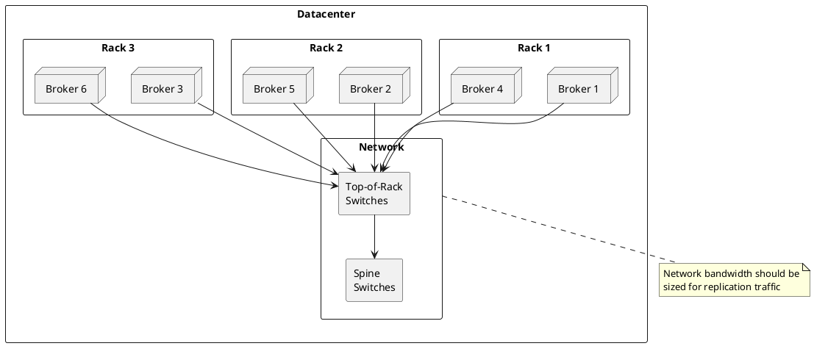
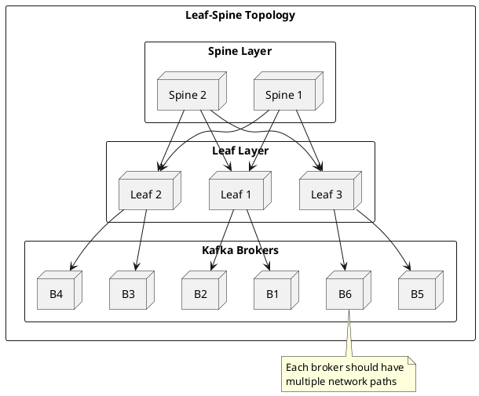
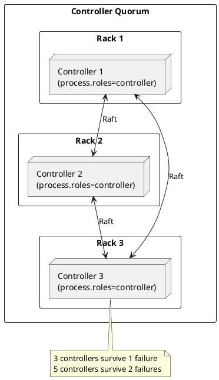
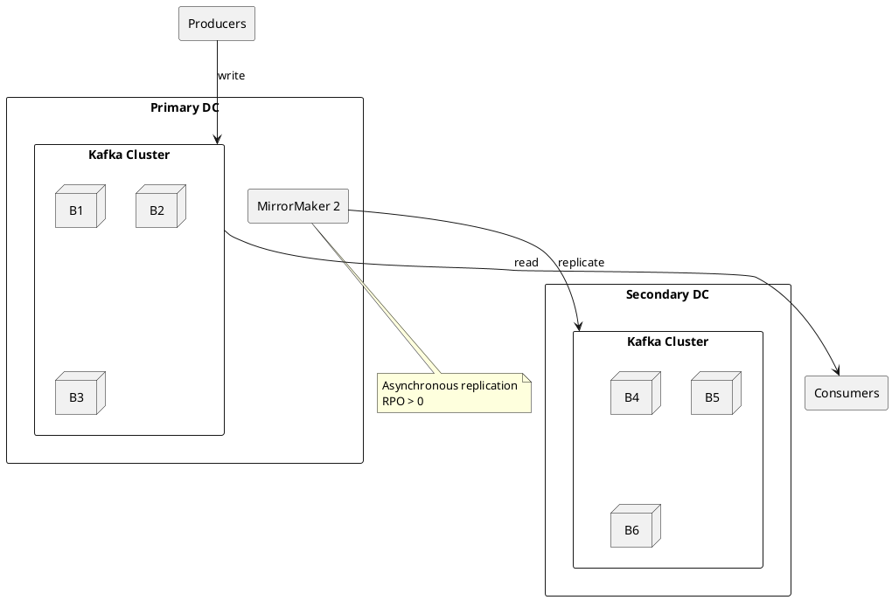
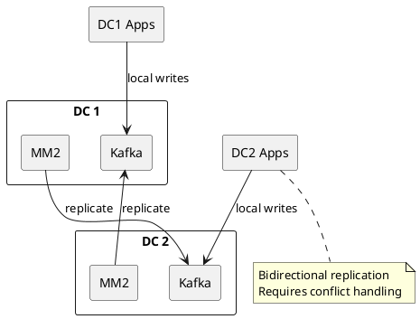

# Kafka Cluster Topology

Cluster topology design for fault tolerance, performance, and operational efficiency.

---

## Topology Overview



---

## Rack Awareness

Rack awareness ensures partition replicas are distributed across failure domains to survive rack-level failures.

### Configuration

```properties
# server.properties - set on each broker
broker.rack=rack-1
```

### Replica Distribution

With rack awareness enabled, Kafka distributes replicas across racks:

| Topic | Partition | Replica 1 | Replica 2 | Replica 3 |
|-------|-----------|-----------|-----------|-----------|
| orders | 0 | Broker 1 (rack-1) | Broker 2 (rack-2) | Broker 3 (rack-3) |
| orders | 1 | Broker 2 (rack-2) | Broker 3 (rack-3) | Broker 4 (rack-1) |
| orders | 2 | Broker 3 (rack-3) | Broker 1 (rack-1) | Broker 5 (rack-2) |

### Rack-Aware Client Configuration

Consumers can prefer reading from replicas in the same rack to reduce cross-rack traffic.

```properties
# consumer.properties
client.rack=rack-1
```

```properties
# broker configuration to enable follower fetching
replica.selector.class=org.apache.kafka.common.replica.RackAwareReplicaSelector
```

---

## Network Architecture

### Bandwidth Requirements

| Traffic Type | Sizing |
|--------------|--------|
| **Produce** | Peak produce throughput × number of brokers receiving |
| **Replication** | Peak produce throughput × (replication factor - 1) |
| **Consume** | Peak consume throughput × consumer fan-out |
| **Inter-broker** | Metadata + coordination overhead |

### Network Sizing Formula

```
Required bandwidth = (P × RF) + C

Where:
P = Peak produce throughput (MB/s)
RF = Replication factor
C = Peak consume throughput (MB/s)
```

**Example:**
- Peak produce: 500 MB/s
- Replication factor: 3
- Peak consume: 1000 MB/s (2x fanout)
- Required: (500 × 3) + 1000 = 2500 MB/s = 20 Gbps

### Network Topology Patterns



---

## Broker Placement

### Placement Strategies

| Strategy | Description | Use Case |
|----------|-------------|----------|
| **Rack-balanced** | Equal brokers per rack | Standard HA deployment |
| **Zone-balanced** | Equal brokers per availability zone | Cloud deployments |
| **Performance-tiered** | Faster hardware for leaders | Latency-sensitive workloads |

### Cloud Availability Zone Mapping

```properties
# AWS example - map AZ to rack
broker.rack=us-east-1a

# Azure example
broker.rack=eastus-zone1

# GCP example
broker.rack=us-central1-a
```

### Minimum Broker Requirements

| Replication Factor | Minimum Brokers | Recommended Brokers |
|-------------------|-----------------|---------------------|
| 1 | 1 | 3 (for controller quorum) |
| 2 | 2 | 4 (2 per rack) |
| 3 | 3 | 6 (2 per rack, 3 racks) |

---

## Controller Topology

### KRaft Controller Quorum

The controller quorum should be deployed across failure domains.



### Controller Configuration

```properties
# Dedicated controller
process.roles=controller
node.id=1
controller.quorum.voters=1@controller1:9093,2@controller2:9093,3@controller3:9093
```

### Combined vs Dedicated Controllers

| Deployment | Use Case | Pros | Cons |
|------------|----------|------|------|
| **Combined** | Small clusters (< 10 brokers) | Fewer machines | Resource contention |
| **Dedicated** | Large clusters, high partition count | Isolation, stability | More machines |

```properties
# Combined controller + broker
process.roles=broker,controller

# Dedicated controller only
process.roles=controller

# Dedicated broker only
process.roles=broker
```

---

## Multi-Datacenter Topology

### Active-Passive



### Active-Active



---

## Partition Distribution

### Leader Distribution

Leaders should be balanced across brokers for even load distribution.

```bash
# Check leader distribution
kafka-topics.sh --bootstrap-server kafka:9092 --describe | \
  grep "Leader:" | awk '{print $4}' | sort | uniq -c

# Trigger preferred leader election
kafka-leader-election.sh --bootstrap-server kafka:9092 \
  --election-type preferred \
  --all-topic-partitions
```

### Partition Reassignment

When adding or removing brokers, partitions must be reassigned.

```bash
# Generate reassignment plan
kafka-reassign-partitions.sh --bootstrap-server kafka:9092 \
  --topics-to-move-json-file topics.json \
  --broker-list "1,2,3,4,5,6" \
  --generate

# Execute with throttle
kafka-reassign-partitions.sh --bootstrap-server kafka:9092 \
  --reassignment-json-file reassignment.json \
  --throttle 100000000 \
  --execute
```

---

## Sizing Guidelines

### Broker Count

| Factor | Impact |
|--------|--------|
| **Throughput** | More brokers = more aggregate throughput |
| **Storage** | More brokers = more total storage |
| **Partitions** | ~4000 partitions per broker recommended maximum |
| **Replication** | RF × partitions = total replicas distributed |

### Partition Count

| Consideration | Guideline |
|---------------|-----------|
| **Parallelism** | Partitions ≥ max consumer instances |
| **Throughput** | ~10 MB/s per partition typical |
| **Overhead** | Each partition has memory/file handle cost |
| **Rebalance** | More partitions = longer rebalance |

### Formula for Partition Count

```
Partitions = max(
  target_throughput / per_partition_throughput,
  max_consumer_instances
)
```

---

## Related Documentation

- [Architecture Overview](../index.md) - System architecture
- [Brokers](../brokers/index.md) - Broker configuration
- [Replication](../replication/index.md) - Replication protocol
- [Fault Tolerance](../fault-tolerance/index.md) - Failure handling
- [Multi-Datacenter](../../concepts/multi-datacenter/index.md) - DR strategies
