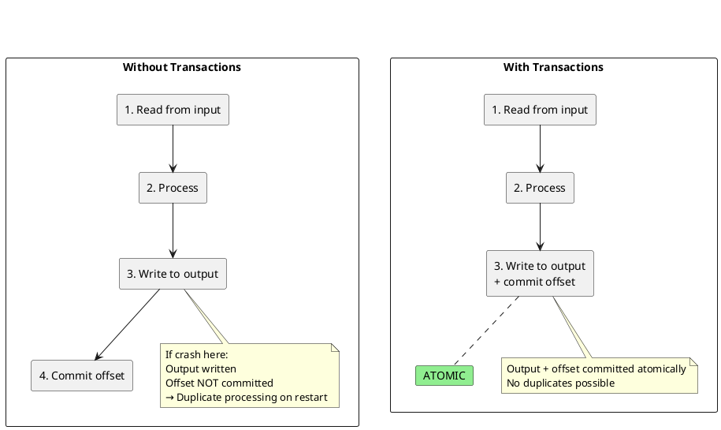
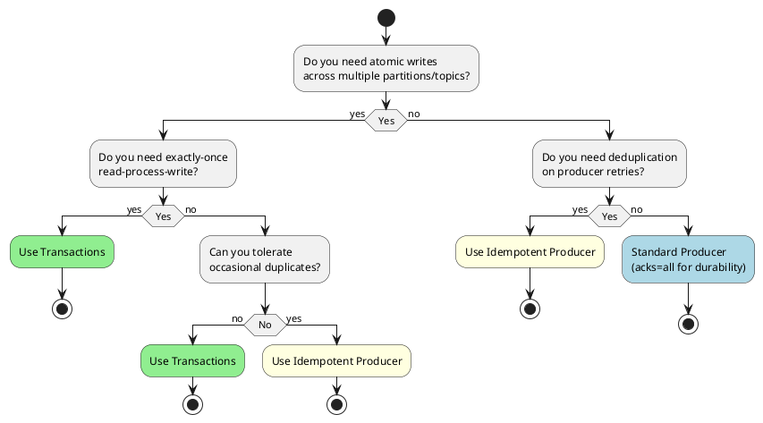

# Transaction Coordinator

The transaction coordinator enables atomic writes across multiple partitions and exactly-once semantics in Kafka. It manages producer identities, transaction state, and coordinates the two-phase commit protocol.

---

## Why Transactions Exist

Kafka was originally designed for high-throughput streaming with at-least-once delivery. However, certain use cases require stronger guarantees:

### The Problems Transactions Solve

| Problem | Without Transactions | With Transactions |
|---------|---------------------|-------------------|
| **Duplicate writes on retry** | Producer retries may create duplicates | Idempotent writes prevent duplicates |
| **Partial failures** | Writing to 3 topics may succeed for 2, fail for 1 | All-or-nothing atomicity |
| **Read-process-write consistency** | Consumer offset committed separately from output | Offset and output committed atomically |
| **Zombie producers** | Crashed producer restarts, old instance still writing | Epoch fencing blocks old instances |

### The Fundamental Challenge

Consider a stream processing application that reads from an input topic, processes records, and writes to an output topic:



---

## Use Cases

### When to Use Transactions

| Use Case | Why Transactions Help |
|----------|----------------------|
| **Financial data processing** | Cannot tolerate duplicates or partial updates |
| **Exactly-once stream processing** | Kafka Streams with `exactly_once_v2` uses transactions internally |
| **Multi-topic atomic writes** | Order service writes to `orders`, `inventory`, `notifications` atomically |
| **Read-process-write pipelines** | ETL jobs that must not reprocess or skip records |
| **Event sourcing with projections** | Event and projection updates must be atomic |
| **Cross-partition aggregations** | Aggregation results written atomically with source offsets |

### Concrete Examples

**Example 1: Order Processing**

An order service must update multiple topics atomically:

```
Transaction {
    write("orders", order_created_event)
    write("inventory", reserve_stock_event)
    write("payments", payment_request_event)
    write("notifications", order_confirmation_event)
}
```

If any write fails, all are rolled back. No partial orders.

**Example 2: Stream Aggregation**

A real-time dashboard aggregates sales by region:

```
Transaction {
    // Read sales events from input
    // Aggregate by region
    write("sales-by-region", aggregated_results)
    commit_offsets("sales-events", consumer_group)
}
```

If the application crashes after writing results but before committing offsets, restart would not reprocess—the transaction ensures both happen or neither.

**Example 3: Change Data Capture (CDC)**

Database changes replicated to Kafka must maintain consistency:

```
Transaction {
    write("users", user_updated)
    write("user-search-index", search_document)
    write("user-cache-invalidation", cache_key)
}
```

All downstream systems see the change atomically or not at all.

---

## When NOT to Use Transactions

Transactions add overhead and complexity. They are not always the right choice.

### Anti-Patterns

| Scenario | Why Transactions Are Wrong | Better Approach |
|----------|---------------------------|-----------------|
| **High-throughput logging** | Overhead can reduce throughput | Idempotent producer (no transactions) |
| **Fire-and-forget metrics** | Occasional duplicates acceptable | `acks=1` or `acks=0` |
| **Single-partition writes** | No cross-partition atomicity needed | Idempotent producer only |
| **Latency-critical paths** | Transaction commit adds latency | At-least-once with idempotent consumers |
| **Independent events** | Events don't need atomic grouping | Separate non-transactional writes |

### Performance Impact (Repository Guidance)

| Metric | Non-Transactional | Transactional | Impact |
|--------|-------------------|---------------|--------|
| **Throughput** | 100% baseline | 50-70% | 30-50% reduction |
| **Latency (p50)** | ~5ms | ~15-25ms | 3-5x increase |
| **Latency (p99)** | ~20ms | ~50-100ms | 2.5-5x increase |
| **Broker CPU** | Baseline | Higher | Coordinator overhead |

### Decision Guide



### Alternatives to Transactions

| Alternative | When to Use | Trade-off |
|-------------|-------------|-----------|
| **Idempotent producer** | Single-partition deduplication | No cross-partition atomicity |
| **Idempotent consumer** | Consumer handles duplicates | Application complexity |
| **Outbox pattern** | Database + Kafka consistency | Requires CDC or polling |
| **Saga pattern** | Long-running distributed workflows | Compensation logic needed |

---

## Transaction Architecture Overview

Kafka transactions provide atomicity—a set of writes either all succeed or all fail. The transaction coordinator is a broker-side component that manages transaction state and coordinates commits.


### Key Components

| Component | Responsibility |
|-----------|----------------|
| **Transaction Coordinator** | Manages transaction state and coordinates commit/abort |
| **`__transaction_state`** | Internal topic storing transaction metadata |
| **Producer ID (PID)** | Unique identifier for producer instance |
| **Epoch** | Fencing mechanism to prevent zombie producers |
| **Transaction Markers** | Control records marking transaction boundaries |

---

## Producer Identity

### Producer ID (PID)

Every producer is assigned a unique 64-bit Producer ID. For idempotent producers, this enables deduplication. For transactional producers, it identifies the transaction owner.


### Epoch and Fencing

The epoch is a 16-bit counter that increments each time a producer with the same `transactional.id` initializes. This enables "zombie fencing"—preventing old producers from causing inconsistencies.


### Fencing Scenarios

| Scenario | Behavior |
|----------|----------|
| Producer restart | New epoch assigned; old instance fenced |
| Network partition | First to re-initialize gets new epoch |
| Horizontal scaling | Each instance needs unique `transactional.id` |
| Zombie producer | Rejected with `ProducerFencedException` |

---

## Transaction Coordinator

### Coordinator Assignment

Each `transactional.id` maps to a specific coordinator via hashing:

```
coordinator = hash(transactional.id) % num_partitions(__transaction_state)
```

The broker hosting that partition of `__transaction_state` is the coordinator.


### Transaction State Storage

The `__transaction_state` topic stores:

| Field | Description |
|-------|-------------|
| `transactional.id` | Producer's transaction identifier |
| `producer_id` | Assigned PID |
| `producer_epoch` | Current epoch |
| `transaction_state` | Current state (Empty, Ongoing, etc.) |
| `topic_partitions` | Partitions participating in transaction |
| `transaction_timeout_ms` | Timeout for this transaction |
| `transaction_start_time` | When transaction began |

### Coordinator Configuration

| Configuration | Default | Description |
|---------------|---------|-------------|
| `transaction.state.log.replication.factor` | 3 | Replication factor for `__transaction_state` |
| `transaction.state.log.num.partitions` | 50 | Partitions in `__transaction_state` |
| `transaction.state.log.min.isr` | 2 | Minimum ISR for transaction log |
| `transaction.state.log.segment.bytes` | 104857600 | Segment size |

---

## Transaction Lifecycle

### State Machine


### State Descriptions

| State | Description |
|-------|-------------|
| **Empty** | Producer initialized; no active transaction |
| **Ongoing** | Transaction active; partitions being written |
| **PrepareCommit** | Commit requested; writing markers |
| **PrepareAbort** | Abort requested; writing markers |
| **CompleteCommit** | All commit markers written |
| **CompleteAbort** | All abort markers written |
| **Dead** | `transactional.id` expired due to inactivity |

---

## Two-Phase Commit Protocol

Kafka transactions use a variant of two-phase commit to ensure atomicity across partitions.

### Phase 1: Prepare


### Phase 2: Commit


### Transaction Markers

Transaction markers are special control records written to each partition:

| Marker Type | Meaning |
|-------------|---------|
| `COMMIT` | Transaction committed; records are valid |
| `ABORT` | Transaction aborted; records should be ignored |

Markers contain:
- Producer ID
- Producer epoch
- Coordinator epoch
- Control type (COMMIT/ABORT)

---

## Consumer Integration

### Transactional Consumer Offsets

When using read-process-write patterns, consumer offsets can be committed as part of the transaction:


### Isolation Levels

| `isolation.level` | Behavior |
|-------------------|----------|
| `read_uncommitted` | Read all records including aborted transactions |
| `read_committed` | Read only committed records; aborted filtered |

### Last Stable Offset (LSO)

The LSO is the offset below which all transactions are complete:


---

## Failure Handling

### Producer Failure During Transaction

| Scenario | Coordinator Action |
|----------|-------------------|
| Producer crashes before EndTxn | Transaction times out; coordinator aborts |
| Producer crashes during EndTxn | New producer instance completes or aborts |
| Network partition | Transaction times out if no progress |

### Coordinator Failure


### Transaction Timeout

If a transaction exceeds `transaction.timeout.ms`, the coordinator aborts it:

| Configuration | Default | Description |
|---------------|---------|-------------|
| `transaction.timeout.ms` | 60000 (1 min) | Max transaction duration |
| `transactional.id.expiration.ms` | 604800000 (7 days) | Expiration for inactive transactional.id |

---

## Idempotent vs Transactional Producers

| Feature | Idempotent | Transactional |
|---------|------------|---------------|
| **Deduplication** | Within single session | Across sessions |
| **Scope** | Single partition | Multiple partitions |
| **Atomicity** | Per-record | Multi-record |
| **Configuration** | `enable.idempotence=true` | `transactional.id` required |
| **Overhead** | Low | Higher (coordinator RPCs) |

### When to Use Each

| Use Case | Recommendation |
|----------|----------------|
| Prevent duplicate writes | Idempotent producer |
| Atomic multi-partition writes | Transactional producer |
| Read-process-write exactly-once | Transactional producer |
| High-throughput, no atomicity needed | Idempotent producer |

---

## Performance Considerations

### Transaction Overhead

| Operation | Overhead |
|-----------|----------|
| InitProducerId | One-time per producer start |
| AddPartitionsToTxn | Per new partition in transaction |
| EndTxn | Two-phase commit across partitions |
| Transaction markers | Additional records in each partition |

### Batching Transactions

Larger transactions amortize overhead:

| Pattern | Transactions/sec | Throughput |
|---------|------------------|------------|
| 1 record per transaction | Low | Low |
| 100 records per transaction | Medium | Medium |
| 1000+ records per transaction | High | High |

### Configuration Tuning

| Configuration | Default | Tuning Guidance |
|---------------|---------|-----------------|
| `transaction.timeout.ms` | 60000 | Increase for long-running transactions |
| `max.block.ms` | 60000 | Time to wait for transaction coordinator |
| `delivery.timeout.ms` | 120000 | Must exceed `transaction.timeout.ms` |

---

## Exactly-Once Semantics (EOS)

Kafka's EOS combines idempotent producers, transactions, and transactional consumers:


### EOS in Kafka Streams

Kafka Streams uses transactions internally for exactly-once:

| `processing.guarantee` | Behavior |
|------------------------|----------|
| `at_least_once` | No transactions; duplicates possible on failure |
| `exactly_once_v2` | Transactions per task; atomic state + output |

---

## Version Compatibility

| Feature | Minimum Version |
|---------|-----------------|
| Idempotent producer | 0.11.0 |
| Transactions | 0.11.0 |
| `exactly_once_v2` (Streams) | 2.5.0 |
| Transaction protocol improvements | 2.5.0 |

---

## Configuration Reference

### Producer Configuration

| Configuration | Default | Description |
|---------------|---------|-------------|
| `enable.idempotence` | true | Enable idempotent producer |
| `transactional.id` | null | Transaction identifier (enables transactions) |
| `transaction.timeout.ms` | 60000 | Transaction timeout |
| `max.in.flight.requests.per.connection` | 5 | Must be ≤5 for idempotence |

### Broker Configuration

| Configuration | Default | Description |
|---------------|---------|-------------|
| `transaction.state.log.replication.factor` | 3 | `__transaction_state` replication |
| `transaction.state.log.num.partitions` | 50 | `__transaction_state` partitions |
| `transaction.state.log.min.isr` | 2 | Minimum ISR |
| `transactional.id.expiration.ms` | 604800000 | Expiration for inactive IDs |

### Consumer Configuration

| Configuration | Default | Description |
|---------------|---------|-------------|
| `isolation.level` | read_uncommitted | `read_committed` for transactional |
| `enable.auto.commit` | true | Set to `false` for transactional |

---

## Related Documentation

- [Topics and Partitions](../topics/index.md) - Partition architecture
- [Transaction Protocol APIs](../client-connections/protocol-apis-transaction.md) - Wire protocol
- [Exactly-Once Semantics](../../concepts/delivery-semantics/exactly-once.md) - EOS patterns
- [Kafka Streams EOS](../../application-development/kafka-streams/index.md) - Streams transactions
