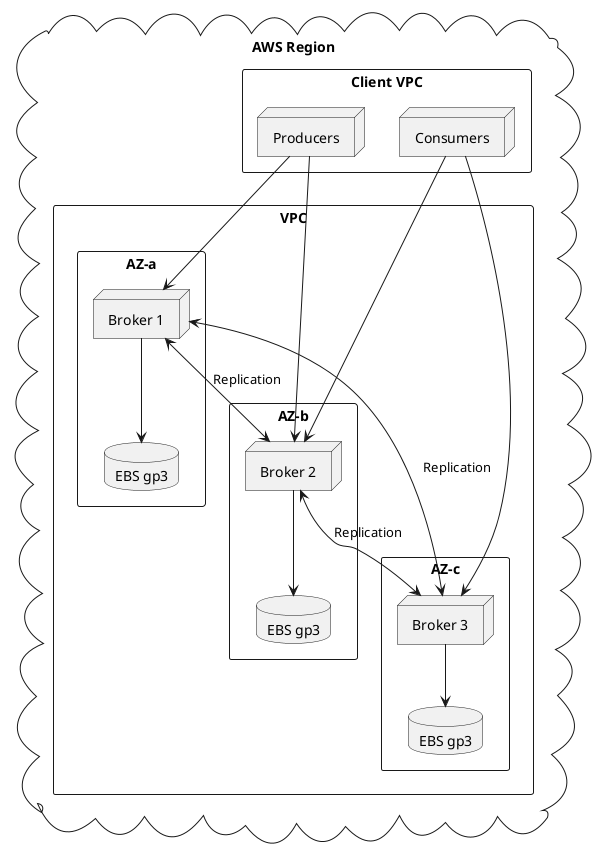

# Kafka on AWS

Production deployment guide for Apache Kafka on Amazon Web Services.

---

## Architecture Overview



---

## EC2 Instance Selection

### Recommended Instance Types

| Workload | Instance Type | vCPUs | Memory | Network | Use Case |
|----------|---------------|-------|--------|---------|----------|
| **Development** | m6i.large | 2 | 8 GB | Up to 12.5 Gbps | Testing |
| **Small Production** | m6i.xlarge | 4 | 16 GB | Up to 12.5 Gbps | Low throughput |
| **Medium Production** | m6i.2xlarge | 8 | 32 GB | Up to 12.5 Gbps | Moderate throughput |
| **Large Production** | r6i.4xlarge | 16 | 128 GB | Up to 12.5 Gbps | High throughput |
| **High Performance** | i3en.2xlarge | 8 | 64 GB | Up to 25 Gbps | I/O intensive |

### Instance Recommendations

- **Network-optimized instances** (m6i, r6i) should be used for most deployments
- **Storage-optimized instances** (i3en, d3en) may be used for I/O-intensive workloads
- **Memory-optimized instances** (r6i) should be used when large page cache is required
- A minimum of 3 brokers should be deployed across 3 availability zones

---

## Storage Configuration

### EBS Volume Types

| Volume Type | IOPS | Throughput | Use Case |
|-------------|------|------------|----------|
| **gp3** | 3,000-16,000 | 125-1,000 MB/s | Recommended default |
| **io2** | Up to 64,000 | Up to 4,000 MB/s | High-performance |
| **st1** | Baseline 40 MB/s per TB | Up to 500 MB/s | Cold data, cost-optimized |

### gp3 Configuration

```bash
# Create gp3 volume with custom IOPS and throughput
aws ec2 create-volume \
  --availability-zone us-east-1a \
  --volume-type gp3 \
  --size 1000 \
  --iops 6000 \
  --throughput 500 \
  --encrypted \
  --tag-specifications 'ResourceType=volume,Tags=[{Key=Name,Value=kafka-data}]'
```

### Storage Sizing Guidelines

| Metric | Recommendation |
|--------|----------------|
| **Volume Size** | 10x daily data volume |
| **IOPS** | 3,000 + (500 × partitions per broker) |
| **Throughput** | 2x expected peak MB/s |

### Filesystem Configuration

```bash
# Format with XFS
mkfs.xfs /dev/nvme1n1

# Mount options for Kafka
echo '/dev/nvme1n1 /kafka xfs noatime,nodiratime 0 2' >> /etc/fstab
mount /kafka

# Create Kafka directories
mkdir -p /kafka/data
chown -R kafka:kafka /kafka
```

---

## Networking

### VPC Configuration

```bash
# Create VPC
aws ec2 create-vpc --cidr-block 10.0.0.0/16

# Create subnets in each AZ
aws ec2 create-subnet --vpc-id vpc-xxx --cidr-block 10.0.1.0/24 --availability-zone us-east-1a
aws ec2 create-subnet --vpc-id vpc-xxx --cidr-block 10.0.2.0/24 --availability-zone us-east-1b
aws ec2 create-subnet --vpc-id vpc-xxx --cidr-block 10.0.3.0/24 --availability-zone us-east-1c
```

### Security Groups

```bash
# Kafka broker security group
aws ec2 create-security-group \
  --group-name kafka-brokers \
  --description "Kafka broker security group" \
  --vpc-id vpc-xxx

# Allow inter-broker communication
aws ec2 authorize-security-group-ingress \
  --group-id sg-xxx \
  --protocol tcp \
  --port 9092-9094 \
  --source-group sg-xxx

# Allow client access
aws ec2 authorize-security-group-ingress \
  --group-id sg-xxx \
  --protocol tcp \
  --port 9092 \
  --cidr 10.0.0.0/16
```

### Required Ports

Ports depend on your listener configuration; the table below shows common defaults.

| Port | Protocol | Purpose |
|------|----------|---------|
| 9092 | TCP | Client or inter-broker (PLAINTEXT example) |
| 9093 | TCP | Client or inter-broker (SSL) |
| 9094 | TCP | Client or inter-broker (SASL_SSL) |

### Enhanced Networking

Enhanced networking should be enabled for improved network performance.

```bash
# Verify enhanced networking
aws ec2 describe-instances --instance-ids i-xxx \
  --query "Reservations[].Instances[].EnaSupport"
```

---

## High Availability

### Multi-AZ Deployment

Brokers must be distributed across multiple availability zones for fault tolerance.

```properties
# server.properties - Rack awareness
broker.rack=us-east-1a

# Replica placement
default.replication.factor=3
min.insync.replicas=2
```

### Rack Awareness Configuration

```properties
# Broker 1 (AZ-a)
broker.id=1
broker.rack=us-east-1a

# Broker 2 (AZ-b)
broker.id=2
broker.rack=us-east-1b

# Broker 3 (AZ-c)
broker.id=3
broker.rack=us-east-1c
```

---

## Auto Scaling

### Launch Template

```json
{
  "LaunchTemplateName": "kafka-broker",
  "LaunchTemplateData": {
    "ImageId": "ami-xxx",
    "InstanceType": "m6i.2xlarge",
    "KeyName": "kafka-key",
    "SecurityGroupIds": ["sg-xxx"],
    "BlockDeviceMappings": [
      {
        "DeviceName": "/dev/sda1",
        "Ebs": {
          "VolumeSize": 100,
          "VolumeType": "gp3"
        }
      },
      {
        "DeviceName": "/dev/sdf",
        "Ebs": {
          "VolumeSize": 1000,
          "VolumeType": "gp3",
          "Iops": 6000,
          "Throughput": 500
        }
      }
    ],
    "UserData": "base64-encoded-startup-script"
  }
}
```

!!! warning "Auto Scaling Limitations"
    Kafka does not automatically rebalance partitions when brokers are added or removed. Partition reassignment must be performed manually after scaling operations.

---

## Terraform Example

```hcl
# main.tf
provider "aws" {
  region = "us-east-1"
}

resource "aws_instance" "kafka_broker" {
  count         = 3
  ami           = "ami-xxx"
  instance_type = "m6i.2xlarge"
  subnet_id     = element(var.subnet_ids, count.index)

  vpc_security_group_ids = [aws_security_group.kafka.id]

  root_block_device {
    volume_type = "gp3"
    volume_size = 100
  }

  tags = {
    Name = "kafka-broker-${count.index + 1}"
    Role = "kafka-broker"
  }
}

resource "aws_ebs_volume" "kafka_data" {
  count             = 3
  availability_zone = element(var.availability_zones, count.index)
  size              = 1000
  type              = "gp3"
  iops              = 6000
  throughput        = 500
  encrypted         = true

  tags = {
    Name = "kafka-data-${count.index + 1}"
  }
}

resource "aws_volume_attachment" "kafka_data" {
  count       = 3
  device_name = "/dev/sdf"
  volume_id   = aws_ebs_volume.kafka_data[count.index].id
  instance_id = aws_instance.kafka_broker[count.index].id
}

resource "aws_security_group" "kafka" {
  name        = "kafka-brokers"
  description = "Kafka broker security group"
  vpc_id      = var.vpc_id

  ingress {
    from_port   = 9092
    to_port     = 9094
    protocol    = "tcp"
    cidr_blocks = [var.vpc_cidr]
  }

  ingress {
    from_port = 9092
    to_port   = 9094
    protocol  = "tcp"
    self      = true
  }

  egress {
    from_port   = 0
    to_port     = 0
    protocol    = "-1"
    cidr_blocks = ["0.0.0.0/0"]
  }
}
```

---

## Monitoring Integration

### CloudWatch Metrics

```bash
# Install CloudWatch agent
sudo yum install amazon-cloudwatch-agent

# Configure for Kafka JMX metrics
cat > /opt/aws/amazon-cloudwatch-agent/etc/amazon-cloudwatch-agent.json << 'EOF'
{
  "metrics": {
    "metrics_collected": {
      "jmx": {
        "jvm": true,
        "kafka": {
          "measurement": [
            "kafka.server:type=BrokerTopicMetrics,name=MessagesInPerSec",
            "kafka.server:type=BrokerTopicMetrics,name=BytesInPerSec",
            "kafka.server:type=ReplicaManager,name=UnderReplicatedPartitions"
          ]
        }
      }
    }
  }
}
EOF
```

---

## Related Documentation

- [Architecture Overview](../../architecture/index.md) - Kafka architecture
- [Operations](../../operations/index.md) - Operational procedures
- [Monitoring](../../operations/monitoring/index.md) - Monitoring guide
- [Kubernetes Deployment](../kubernetes/index.md) - Container deployment