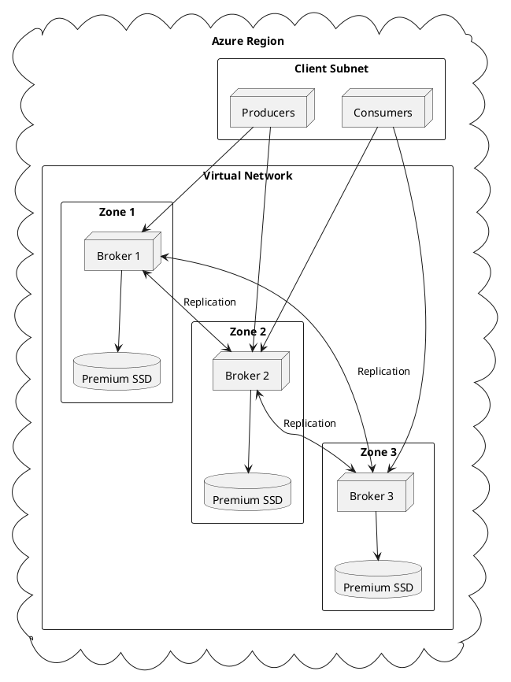

# Kafka on Azure

Production deployment guide for Apache Kafka on Microsoft Azure.

---

## Architecture Overview



---

## Virtual Machine Selection

### Recommended VM Sizes

| Workload | VM Size | vCPUs | Memory | Network | Use Case |
|----------|---------|-------|--------|---------|----------|
| **Development** | Standard_D2s_v5 | 2 | 8 GB | Up to 12.5 Gbps | Testing |
| **Small Production** | Standard_D4s_v5 | 4 | 16 GB | Up to 12.5 Gbps | Low throughput |
| **Medium Production** | Standard_D8s_v5 | 8 | 32 GB | 12.5 Gbps | Moderate throughput |
| **Large Production** | Standard_E16s_v5 | 16 | 128 GB | 12.5 Gbps | High throughput |
| **High Performance** | Standard_L8s_v3 | 8 | 64 GB | 12.5 Gbps | I/O intensive |

### VM Selection Guidelines

- **Dsv5-series** provides balanced compute for general workloads
- **Esv5-series** provides additional memory for large page cache requirements
- **Lsv3-series** provides local NVMe storage for I/O-intensive workloads
- Accelerated networking must be enabled for production deployments

---

## Storage Configuration

### Managed Disk Types

| Disk Type | IOPS (max) | Throughput (max) | Use Case |
|-----------|------------|------------------|----------|
| **Premium SSD v2** | 80,000 | 1,200 MB/s | Recommended |
| **Premium SSD** | 20,000 | 900 MB/s | Standard production |
| **Standard SSD** | 6,000 | 750 MB/s | Development |
| **Ultra Disk** | 160,000 | 4,000 MB/s | High performance |

### Premium SSD v2 Configuration

```bash
# Create Premium SSD v2 disk
az disk create \
  --resource-group kafka-rg \
  --name kafka-data-1 \
  --size-gb 1024 \
  --sku PremiumV2_LRS \
  --disk-iops-read-write 6000 \
  --disk-mbps-read-write 500 \
  --zone 1 \
  --location eastus
```

### Storage Sizing Guidelines

| Metric | Recommendation |
|--------|----------------|
| **Disk Size** | 10x daily data volume |
| **IOPS** | 3,000 + (500 × partitions per broker) |
| **Throughput** | 2x expected peak MB/s |

### Filesystem Configuration

```bash
# Format with XFS
mkfs.xfs /dev/sdc

# Mount options for Kafka
echo '/dev/sdc /kafka xfs noatime,nodiratime 0 2' >> /etc/fstab
mount /kafka

# Create Kafka directories
mkdir -p /kafka/data
chown -R kafka:kafka /kafka
```

---

## Networking

### Virtual Network Configuration

```bash
# Create resource group
az group create --name kafka-rg --location eastus

# Create virtual network
az network vnet create \
  --resource-group kafka-rg \
  --name kafka-vnet \
  --address-prefix 10.0.0.0/16

# Create subnets for each zone
az network vnet subnet create \
  --resource-group kafka-rg \
  --vnet-name kafka-vnet \
  --name kafka-subnet-1 \
  --address-prefix 10.0.1.0/24

az network vnet subnet create \
  --resource-group kafka-rg \
  --vnet-name kafka-vnet \
  --name kafka-subnet-2 \
  --address-prefix 10.0.2.0/24

az network vnet subnet create \
  --resource-group kafka-rg \
  --vnet-name kafka-vnet \
  --name kafka-subnet-3 \
  --address-prefix 10.0.3.0/24
```

### Network Security Group

```bash
# Create NSG
az network nsg create \
  --resource-group kafka-rg \
  --name kafka-nsg

# Allow inter-broker communication
az network nsg rule create \
  --resource-group kafka-rg \
  --nsg-name kafka-nsg \
  --name AllowKafkaBrokers \
  --priority 100 \
  --source-address-prefixes 10.0.0.0/16 \
  --destination-port-ranges 9092-9094 \
  --access Allow \
  --protocol Tcp

# Allow client access
az network nsg rule create \
  --resource-group kafka-rg \
  --nsg-name kafka-nsg \
  --name AllowKafkaClients \
  --priority 200 \
  --source-address-prefixes 10.0.0.0/16 \
  --destination-port-ranges 9092 \
  --access Allow \
  --protocol Tcp
```

### Required Ports

| Port | Protocol | Purpose |
|------|----------|---------|
| 9092 | TCP | Client connections (PLAINTEXT) |
| 9093 | TCP | Client connections (SSL) |
| 9094 | TCP | Client connections (SASL_SSL) |
| 9093 | TCP | Inter-broker replication |

### Accelerated Networking

Accelerated networking must be enabled for production deployments.

```bash
# Enable accelerated networking on NIC
az network nic update \
  --resource-group kafka-rg \
  --name kafka-broker-nic \
  --accelerated-networking true
```

---

## High Availability

### Availability Zones

Brokers must be distributed across availability zones for fault tolerance.

```bash
# Create VM in zone 1
az vm create \
  --resource-group kafka-rg \
  --name kafka-broker-1 \
  --zone 1 \
  --image UbuntuLTS \
  --size Standard_D8s_v5

# Create VM in zone 2
az vm create \
  --resource-group kafka-rg \
  --name kafka-broker-2 \
  --zone 2 \
  --image UbuntuLTS \
  --size Standard_D8s_v5

# Create VM in zone 3
az vm create \
  --resource-group kafka-rg \
  --name kafka-broker-3 \
  --zone 3 \
  --image UbuntuLTS \
  --size Standard_D8s_v5
```

### Rack Awareness Configuration

```properties
# Broker 1 (Zone 1)
broker.id=1
broker.rack=zone-1

# Broker 2 (Zone 2)
broker.id=2
broker.rack=zone-2

# Broker 3 (Zone 3)
broker.id=3
broker.rack=zone-3
```

---

## Terraform Example

```hcl
# main.tf
provider "azurerm" {
  features {}
}

resource "azurerm_resource_group" "kafka" {
  name     = "kafka-rg"
  location = "East US"
}

resource "azurerm_virtual_network" "kafka" {
  name                = "kafka-vnet"
  address_space       = ["10.0.0.0/16"]
  location            = azurerm_resource_group.kafka.location
  resource_group_name = azurerm_resource_group.kafka.name
}

resource "azurerm_subnet" "kafka" {
  count                = 3
  name                 = "kafka-subnet-${count.index + 1}"
  resource_group_name  = azurerm_resource_group.kafka.name
  virtual_network_name = azurerm_virtual_network.kafka.name
  address_prefixes     = ["10.0.${count.index + 1}.0/24"]
}

resource "azurerm_network_interface" "kafka" {
  count                         = 3
  name                          = "kafka-nic-${count.index + 1}"
  location                      = azurerm_resource_group.kafka.location
  resource_group_name           = azurerm_resource_group.kafka.name
  enable_accelerated_networking = true

  ip_configuration {
    name                          = "internal"
    subnet_id                     = azurerm_subnet.kafka[count.index].id
    private_ip_address_allocation = "Dynamic"
  }
}

resource "azurerm_linux_virtual_machine" "kafka" {
  count               = 3
  name                = "kafka-broker-${count.index + 1}"
  resource_group_name = azurerm_resource_group.kafka.name
  location            = azurerm_resource_group.kafka.location
  size                = "Standard_D8s_v5"
  zone                = count.index + 1

  admin_username = "azureuser"
  admin_ssh_key {
    username   = "azureuser"
    public_key = file("~/.ssh/id_rsa.pub")
  }

  network_interface_ids = [
    azurerm_network_interface.kafka[count.index].id,
  ]

  os_disk {
    caching              = "ReadWrite"
    storage_account_type = "Premium_LRS"
    disk_size_gb         = 100
  }

  source_image_reference {
    publisher = "Canonical"
    offer     = "0001-com-ubuntu-server-jammy"
    sku       = "22_04-lts"
    version   = "latest"
  }

  tags = {
    Role = "kafka-broker"
  }
}

resource "azurerm_managed_disk" "kafka_data" {
  count                = 3
  name                 = "kafka-data-${count.index + 1}"
  location             = azurerm_resource_group.kafka.location
  resource_group_name  = azurerm_resource_group.kafka.name
  storage_account_type = "PremiumV2_LRS"
  create_option        = "Empty"
  disk_size_gb         = 1024
  zone                 = count.index + 1

  disk_iops_read_write    = 6000
  disk_mbps_read_write    = 500
}

resource "azurerm_virtual_machine_data_disk_attachment" "kafka_data" {
  count              = 3
  managed_disk_id    = azurerm_managed_disk.kafka_data[count.index].id
  virtual_machine_id = azurerm_linux_virtual_machine.kafka[count.index].id
  lun                = 0
  caching            = "None"
}

resource "azurerm_network_security_group" "kafka" {
  name                = "kafka-nsg"
  location            = azurerm_resource_group.kafka.location
  resource_group_name = azurerm_resource_group.kafka.name

  security_rule {
    name                       = "AllowKafka"
    priority                   = 100
    direction                  = "Inbound"
    access                     = "Allow"
    protocol                   = "Tcp"
    source_port_range          = "*"
    destination_port_range     = "9092-9094"
    source_address_prefix      = "10.0.0.0/16"
    destination_address_prefix = "*"
  }
}
```

---

## Private Link

For secure connectivity from other Azure services.

```bash
# Create private endpoint for Kafka
az network private-endpoint create \
  --resource-group kafka-rg \
  --name kafka-private-endpoint \
  --vnet-name client-vnet \
  --subnet client-subnet \
  --private-connection-resource-id /subscriptions/xxx/resourceGroups/kafka-rg/... \
  --connection-name kafka-connection
```

---

## Related Documentation

- [Architecture Overview](../../architecture/index.md) - Kafka architecture
- [Operations](../../operations/index.md) - Operational procedures
- [Monitoring](../../operations/monitoring/index.md) - Monitoring guide
- [Kubernetes Deployment](../kubernetes/index.md) - Container deployment
