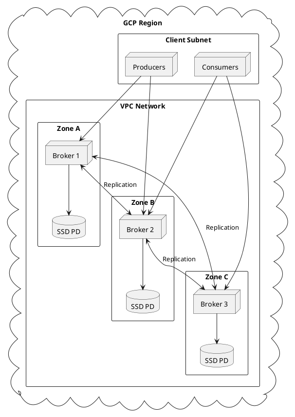

# Kafka on GCP

Production deployment guide for Apache Kafka on Google Cloud Platform.

---

## Architecture Overview



---

## Compute Engine Selection

### Recommended Machine Types

| Workload | Machine Type | vCPUs | Memory | Use Case |
|----------|--------------|-------|--------|----------|
| **Development** | e2-standard-2 | 2 | 8 GB | Testing |
| **Small Production** | n2-standard-4 | 4 | 16 GB | Low throughput |
| **Medium Production** | n2-standard-8 | 8 | 32 GB | Moderate throughput |
| **Large Production** | n2-highmem-16 | 16 | 128 GB | High throughput |
| **High Performance** | c3-standard-8 | 8 | 32 GB | CPU-intensive |

### Machine Type Guidelines

- **N2 series** provides balanced performance for most workloads
- **N2-highmem** should be used when large page cache is required
- **C3 series** provides higher per-core performance
- **Local SSD** may be attached for ephemeral high-performance storage

---

## Storage Configuration

### Persistent Disk Types

| Disk Type | IOPS (read) | IOPS (write) | Throughput | Use Case |
|-----------|-------------|--------------|------------|----------|
| **Hyperdisk Extreme** | 350,000 | 350,000 | 5,000 MB/s | Highest performance |
| **Hyperdisk Balanced** | 160,000 | 90,000 | 2,400 MB/s | High performance |
| **SSD Persistent Disk** | 100,000 | 70,000 | 1,200 MB/s | Recommended |
| **Balanced Persistent Disk** | 80,000 | 30,000 | 1,200 MB/s | Cost-optimized |

### SSD Persistent Disk Configuration

```bash
# Create SSD persistent disk
gcloud compute disks create kafka-data-1 \
  --project=my-project \
  --zone=us-central1-a \
  --type=pd-ssd \
  --size=1000GB

# Attach disk to instance
gcloud compute instances attach-disk kafka-broker-1 \
  --disk=kafka-data-1 \
  --zone=us-central1-a
```

### Storage Sizing Guidelines

| Metric | Recommendation |
|--------|----------------|
| **Disk Size** | 10x daily data volume |
| **IOPS** | 3,000 + (500 × partitions per broker) |
| **Throughput** | 2x expected peak MB/s |

### Filesystem Configuration

```bash
# Format with XFS
sudo mkfs.xfs -f /dev/sdb

# Mount options for Kafka
echo '/dev/sdb /kafka xfs noatime,nodiratime 0 2' | sudo tee -a /etc/fstab
sudo mount /kafka

# Create Kafka directories
sudo mkdir -p /kafka/data
sudo chown -R kafka:kafka /kafka
```

---

## Networking

### VPC Network Configuration

```bash
# Create VPC network
gcloud compute networks create kafka-network \
  --subnet-mode=custom

# Create subnets in each zone
gcloud compute networks subnets create kafka-subnet-a \
  --network=kafka-network \
  --region=us-central1 \
  --range=10.0.1.0/24

gcloud compute networks subnets create kafka-subnet-b \
  --network=kafka-network \
  --region=us-central1 \
  --range=10.0.2.0/24

gcloud compute networks subnets create kafka-subnet-c \
  --network=kafka-network \
  --region=us-central1 \
  --range=10.0.3.0/24
```

### Firewall Rules

```bash
# Allow inter-broker communication
gcloud compute firewall-rules create kafka-internal \
  --network=kafka-network \
  --allow=tcp:9092-9094 \
  --source-ranges=10.0.0.0/16 \
  --target-tags=kafka-broker

# Allow client access
gcloud compute firewall-rules create kafka-clients \
  --network=kafka-network \
  --allow=tcp:9092 \
  --source-ranges=10.0.0.0/16 \
  --target-tags=kafka-broker
```

### Required Ports

Ports depend on your listener configuration; the table below shows common defaults.

| Port | Protocol | Purpose |
|------|----------|---------|
| 9092 | TCP | Client or inter-broker (PLAINTEXT example) |
| 9093 | TCP | Client or inter-broker (SSL) |
| 9094 | TCP | Client or inter-broker (SASL_SSL) |

### Network Tier

Premium network tier should be used for production deployments to ensure lowest latency.

```bash
# Create instance with premium network tier
gcloud compute instances create kafka-broker-1 \
  --network-tier=PREMIUM \
  --network=kafka-network \
  --subnet=kafka-subnet-a
```

---

## High Availability

### Multi-Zone Deployment

Brokers must be distributed across multiple zones for fault tolerance.

```bash
# Create instances in different zones
gcloud compute instances create kafka-broker-1 \
  --zone=us-central1-a \
  --machine-type=n2-standard-8 \
  --network=kafka-network \
  --subnet=kafka-subnet-a \
  --tags=kafka-broker

gcloud compute instances create kafka-broker-2 \
  --zone=us-central1-b \
  --machine-type=n2-standard-8 \
  --network=kafka-network \
  --subnet=kafka-subnet-b \
  --tags=kafka-broker

gcloud compute instances create kafka-broker-3 \
  --zone=us-central1-c \
  --machine-type=n2-standard-8 \
  --network=kafka-network \
  --subnet=kafka-subnet-c \
  --tags=kafka-broker
```

### Rack Awareness Configuration

```properties
# Broker 1 (Zone A)
broker.id=1
broker.rack=us-central1-a

# Broker 2 (Zone B)
broker.id=2
broker.rack=us-central1-b

# Broker 3 (Zone C)
broker.id=3
broker.rack=us-central1-c
```

---

## Instance Groups

### Managed Instance Group

```bash
# Create instance template
gcloud compute instance-templates create kafka-template \
  --machine-type=n2-standard-8 \
  --network=kafka-network \
  --subnet=kafka-subnet-a \
  --tags=kafka-broker \
  --metadata-from-file=startup-script=startup.sh \
  --disk=name=boot,boot=yes,size=100GB,type=pd-ssd \
  --disk=name=data,size=1000GB,type=pd-ssd

# Create regional managed instance group
gcloud compute instance-groups managed create kafka-mig \
  --template=kafka-template \
  --size=3 \
  --region=us-central1 \
  --zones=us-central1-a,us-central1-b,us-central1-c
```

!!! warning "Instance Group Limitations"
    Managed instance groups should not be used with auto-scaling for Kafka brokers. Kafka requires stable broker IDs and manual partition reassignment when scaling.

---

## Terraform Example

```hcl
# main.tf
provider "google" {
  project = "my-project"
  region  = "us-central1"
}

resource "google_compute_network" "kafka" {
  name                    = "kafka-network"
  auto_create_subnetworks = false
}

resource "google_compute_subnetwork" "kafka" {
  count         = 3
  name          = "kafka-subnet-${count.index}"
  ip_cidr_range = "10.0.${count.index + 1}.0/24"
  region        = "us-central1"
  network       = google_compute_network.kafka.id
}

resource "google_compute_firewall" "kafka_internal" {
  name    = "kafka-internal"
  network = google_compute_network.kafka.name

  allow {
    protocol = "tcp"
    ports    = ["9092-9094"]
  }

  source_ranges = ["10.0.0.0/16"]
  target_tags   = ["kafka-broker"]
}

locals {
  zones = ["us-central1-a", "us-central1-b", "us-central1-c"]
}

resource "google_compute_instance" "kafka" {
  count        = 3
  name         = "kafka-broker-${count.index + 1}"
  machine_type = "n2-standard-8"
  zone         = local.zones[count.index]

  tags = ["kafka-broker"]

  boot_disk {
    initialize_params {
      image = "ubuntu-os-cloud/ubuntu-2204-lts"
      size  = 100
      type  = "pd-ssd"
    }
  }

  network_interface {
    subnetwork = google_compute_subnetwork.kafka[count.index].id
  }

  labels = {
    role = "kafka-broker"
  }

  metadata = {
    startup-script = file("startup.sh")
  }
}

resource "google_compute_disk" "kafka_data" {
  count = 3
  name  = "kafka-data-${count.index + 1}"
  type  = "pd-ssd"
  zone  = local.zones[count.index]
  size  = 1000
}

resource "google_compute_attached_disk" "kafka_data" {
  count    = 3
  disk     = google_compute_disk.kafka_data[count.index].id
  instance = google_compute_instance.kafka[count.index].id
}
```

---

## Internal Load Balancer

For client connectivity within the VPC.

```bash
# Create health check
gcloud compute health-checks create tcp kafka-health-check \
  --port=9092

# Create backend service
gcloud compute backend-services create kafka-backend \
  --protocol=TCP \
  --health-checks=kafka-health-check \
  --region=us-central1

# Add instance group to backend
gcloud compute backend-services add-backend kafka-backend \
  --instance-group=kafka-mig \
  --region=us-central1

# Create forwarding rule
gcloud compute forwarding-rules create kafka-ilb \
  --load-balancing-scheme=INTERNAL \
  --network=kafka-network \
  --subnet=kafka-subnet-a \
  --ports=9092 \
  --backend-service=kafka-backend \
  --region=us-central1
```

---

## Private Service Connect

For secure connectivity from other GCP projects.

```bash
# Create service attachment
gcloud compute service-attachments create kafka-attachment \
  --region=us-central1 \
  --producer-forwarding-rule=kafka-ilb \
  --connection-preference=ACCEPT_AUTOMATIC \
  --nat-subnets=kafka-psc-subnet
```

---

## Related Documentation

- [Architecture Overview](../../architecture/index.md) - Kafka architecture
- [Operations](../../operations/index.md) - Operational procedures
- [Monitoring](../../operations/monitoring/index.md) - Monitoring guide
- [Kubernetes Deployment](../kubernetes/index.md) - Container deployment