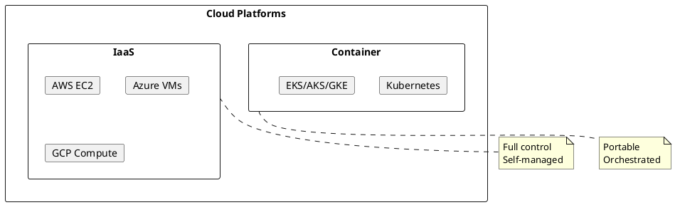
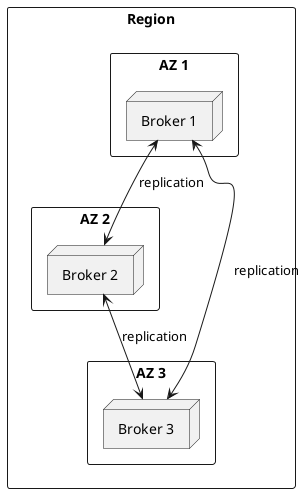
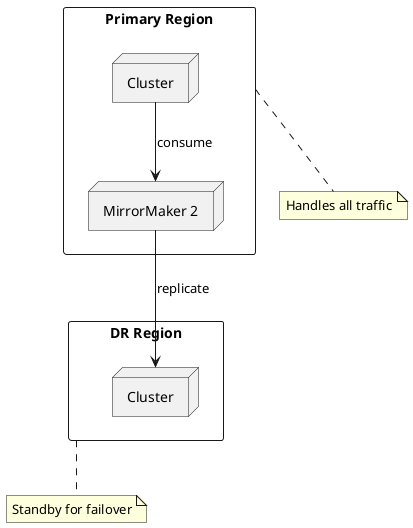

# Kafka Cloud Deployment

Deployment guides for running Apache Kafka on cloud platforms.

---

## Cloud Deployment Overview

---

## Platform Comparison

| Aspect | AWS | Azure | GCP | Kubernetes |
|--------|-----|-------|-----|------------|
| **Compute** | EC2 | Virtual Machines | Compute Engine | Pods |
| **Storage** | EBS gp3 | Premium SSD v2 | PD-SSD | PVC |
| **Networking** | VPC | VNet | VPC | Services |
| **Load Balancing** | NLB | LB | TCP LB | Service/Ingress |
| **IAM** | IAM Roles | Managed Identity | Service Accounts | RBAC |

---

## Deployment Patterns

### Single Region

### Multi-Region (Active-Passive)

---

## Region Strategy

Choosing between single-region and multi-region deployments is a critical architectural decision. See [Single Region vs Multi-Region](region-strategy/index.md) for:

- Cloud region failure statistics and historical incidents
- RTO/RPO analysis for different architectures
- Industry-specific recommendations (finance, healthcare, e-commerce)
- Cost analysis and decision framework
- Implementation checklists

---

## Cloud-Specific Guides

### [AWS Deployment](aws/index.md)

- EC2 instance selection
- EBS volume configuration
- VPC and security groups
- Terraform examples

### [Azure Deployment](azure/index.md)

- VM sizing
- Managed disk configuration
- VNet and NSG
- Terraform examples

### [GCP Deployment](gcp/index.md)

- Compute Engine sizing
- Persistent disk configuration
- VPC and firewall rules
- Terraform examples

### [Kubernetes Deployment](kubernetes/index.md)

- StatefulSet configuration
- Persistent volume claims
- Network policies
- Helm charts

---

## Common Considerations

### High Availability

| Requirement | Implementation |
|-------------|----------------|
| Zone redundancy | Spread brokers across 3+ AZs |
| Rack awareness | Configure `broker.rack` per zone |
| Replication | `replication.factor=3` |
| ISR | `min.insync.replicas=2` |

### Security

| Layer | Cloud Implementation |
|-------|---------------------|
| Network | Private subnets, security groups |
| Encryption in transit | TLS certificates |
| Encryption at rest | Encrypted volumes |
| Authentication | SASL/SCRAM or mTLS |
| Authorization | Kafka ACLs |

### Monitoring

| Aspect | Cloud Service |
|--------|---------------|
| Metrics | CloudWatch / Azure Monitor / Cloud Monitoring |
| Logs | CloudWatch Logs / Log Analytics / Cloud Logging |
| Alerting | SNS / Action Groups / Alerting |

---

## Cost Optimization

### Compute

- Use reserved instances for steady workloads
- Right-size based on actual utilization
- Consider spot/preemptible for non-critical workloads

### Storage

- Use appropriate disk type for workload
- Implement retention policies to limit storage growth
- Consider tiered storage for cold data

### Network

- Keep replication traffic within zone when possible
- Use private endpoints to avoid egress costs
- Compress data to reduce transfer volume

---

## Related Documentation

- [Region Strategy](region-strategy/index.md) - Single vs multi-region decision guide
- [Multi-Datacenter](../concepts/multi-datacenter/index.md) - DR strategies and MirrorMaker 2
- [Architecture](../architecture/index.md) - System architecture
- [Operations](../operations/index.md) - Operational procedures
- [Security](../security/index.md) - Security configuration