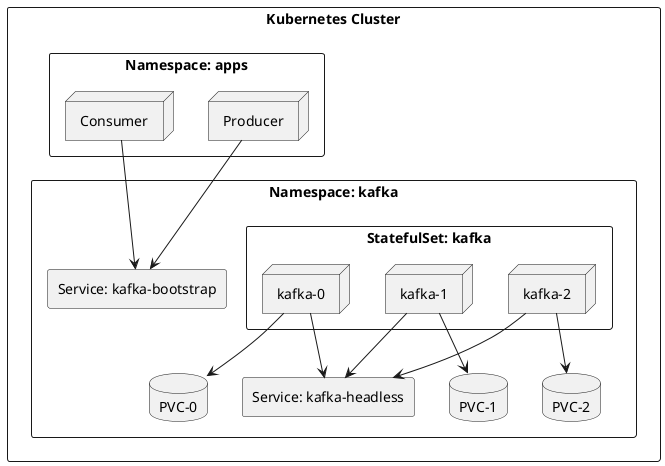

# Kafka on Kubernetes

Production deployment guide for Apache Kafka on Kubernetes clusters.

---

## Architecture Overview



---

## StatefulSet Deployment

### Namespace and ConfigMap

```yaml
# namespace.yaml
apiVersion: v1
kind: Namespace
metadata:
  name: kafka
---
# configmap.yaml
apiVersion: v1
kind: ConfigMap
metadata:
  name: kafka-config
  namespace: kafka
data:
  server.properties: |
    # KRaft mode
    process.roles=broker,controller
    node.id=${KAFKA_NODE_ID}
    controller.quorum.voters=0@kafka-0.kafka-headless:9093,1@kafka-1.kafka-headless:9093,2@kafka-2.kafka-headless:9093

    # Listeners
    listeners=PLAINTEXT://:9092,CONTROLLER://:9093
    advertised.listeners=PLAINTEXT://${HOSTNAME}.kafka-headless.kafka.svc.cluster.local:9092
    controller.listener.names=CONTROLLER
    inter.broker.listener.name=PLAINTEXT

    # Log configuration
    log.dirs=/var/kafka/data
    num.partitions=3
    default.replication.factor=3
    min.insync.replicas=2

    # Performance
    num.network.threads=8
    num.io.threads=16
    socket.send.buffer.bytes=102400
    socket.receive.buffer.bytes=102400
    socket.request.max.bytes=104857600
```

### Headless Service

```yaml
# service-headless.yaml
apiVersion: v1
kind: Service
metadata:
  name: kafka-headless
  namespace: kafka
  labels:
    app: kafka
spec:
  type: ClusterIP
  clusterIP: None
  publishNotReadyAddresses: true
  ports:
    - name: client
      port: 9092
      targetPort: 9092
    - name: controller
      port: 9093
      targetPort: 9093
  selector:
    app: kafka
```

### Bootstrap Service

```yaml
# service-bootstrap.yaml
apiVersion: v1
kind: Service
metadata:
  name: kafka-bootstrap
  namespace: kafka
  labels:
    app: kafka
spec:
  type: ClusterIP
  ports:
    - name: client
      port: 9092
      targetPort: 9092
  selector:
    app: kafka
```

### StatefulSet

```yaml
# statefulset.yaml
apiVersion: apps/v1
kind: StatefulSet
metadata:
  name: kafka
  namespace: kafka
spec:
  serviceName: kafka-headless
  replicas: 3
  podManagementPolicy: Parallel
  selector:
    matchLabels:
      app: kafka
  template:
    metadata:
      labels:
        app: kafka
    spec:
      affinity:
        podAntiAffinity:
          requiredDuringSchedulingIgnoredDuringExecution:
            - labelSelector:
                matchLabels:
                  app: kafka
              topologyKey: kubernetes.io/hostname
        nodeAffinity:
          preferredDuringSchedulingIgnoredDuringExecution:
            - weight: 100
              preference:
                matchExpressions:
                  - key: topology.kubernetes.io/zone
                    operator: In
                    values:
                      - us-central1-a
                      - us-central1-b
                      - us-central1-c
      terminationGracePeriodSeconds: 300
      securityContext:
        fsGroup: 1000
        runAsUser: 1000
        runAsNonRoot: true
      containers:
        - name: kafka
          image: apache/kafka:3.7.0
          ports:
            - name: client
              containerPort: 9092
            - name: controller
              containerPort: 9093
          env:
            - name: KAFKA_NODE_ID
              valueFrom:
                fieldRef:
                  fieldPath: metadata.name
            - name: KAFKA_HEAP_OPTS
              value: "-Xms4g -Xmx4g"
          command:
            - bash
            - -c
            - |
              export KAFKA_NODE_ID=${HOSTNAME##*-}
              /opt/kafka/bin/kafka-storage.sh format -t $(cat /var/kafka/data/cluster-id 2>/dev/null || kafka-storage.sh random-uuid | tee /var/kafka/data/cluster-id) -c /etc/kafka/server.properties --ignore-formatted
              exec /opt/kafka/bin/kafka-server-start.sh /etc/kafka/server.properties
          resources:
            requests:
              memory: "6Gi"
              cpu: "2"
            limits:
              memory: "8Gi"
              cpu: "4"
          volumeMounts:
            - name: data
              mountPath: /var/kafka/data
            - name: config
              mountPath: /etc/kafka
          readinessProbe:
            tcpSocket:
              port: 9092
            initialDelaySeconds: 30
            periodSeconds: 10
          livenessProbe:
            tcpSocket:
              port: 9092
            initialDelaySeconds: 60
            periodSeconds: 20
      volumes:
        - name: config
          configMap:
            name: kafka-config
  volumeClaimTemplates:
    - metadata:
        name: data
      spec:
        accessModes: ["ReadWriteOnce"]
        storageClassName: ssd
        resources:
          requests:
            storage: 100Gi
```

---

## Storage Classes

### AWS EBS

```yaml
apiVersion: storage.k8s.io/v1
kind: StorageClass
metadata:
  name: ssd
provisioner: ebs.csi.aws.com
parameters:
  type: gp3
  iops: "6000"
  throughput: "500"
  encrypted: "true"
volumeBindingMode: WaitForFirstConsumer
allowVolumeExpansion: true
```

### Azure Disk

```yaml
apiVersion: storage.k8s.io/v1
kind: StorageClass
metadata:
  name: ssd
provisioner: disk.csi.azure.com
parameters:
  skuName: PremiumV2_LRS
  diskIOPSReadWrite: "6000"
  diskMBpsReadWrite: "500"
volumeBindingMode: WaitForFirstConsumer
allowVolumeExpansion: true
```

### GCP Persistent Disk

```yaml
apiVersion: storage.k8s.io/v1
kind: StorageClass
metadata:
  name: ssd
provisioner: pd.csi.storage.gke.io
parameters:
  type: pd-ssd
volumeBindingMode: WaitForFirstConsumer
allowVolumeExpansion: true
```

---

## Pod Disruption Budget

```yaml
apiVersion: policy/v1
kind: PodDisruptionBudget
metadata:
  name: kafka-pdb
  namespace: kafka
spec:
  minAvailable: 2
  selector:
    matchLabels:
      app: kafka
```

---

## Resource Recommendations

### Pod Resources

| Component | CPU Request | CPU Limit | Memory Request | Memory Limit |
|-----------|-------------|-----------|----------------|--------------|
| **Development** | 500m | 1 | 2Gi | 4Gi |
| **Production** | 2 | 4 | 6Gi | 8Gi |
| **High Throughput** | 4 | 8 | 12Gi | 16Gi |

### JVM Heap Settings

| Memory Limit | Heap Size | Recommended |
|--------------|-----------|-------------|
| 4Gi | 2g | Development |
| 8Gi | 4g | Production |
| 16Gi | 8g | High throughput |

---

## Network Policies

```yaml
apiVersion: networking.k8s.io/v1
kind: NetworkPolicy
metadata:
  name: kafka-network-policy
  namespace: kafka
spec:
  podSelector:
    matchLabels:
      app: kafka
  policyTypes:
    - Ingress
    - Egress
  ingress:
    # Inter-broker communication
    - from:
        - podSelector:
            matchLabels:
              app: kafka
      ports:
        - port: 9092
        - port: 9093
    # Client access from application namespaces
    - from:
        - namespaceSelector:
            matchLabels:
              kafka-client: "true"
      ports:
        - port: 9092
  egress:
    # Inter-broker communication
    - to:
        - podSelector:
            matchLabels:
              app: kafka
      ports:
        - port: 9092
        - port: 9093
    # DNS resolution
    - to:
        - namespaceSelector: {}
          podSelector:
            matchLabels:
              k8s-app: kube-dns
      ports:
        - port: 53
          protocol: UDP
```

---

## External Access

### NodePort Service

```yaml
apiVersion: v1
kind: Service
metadata:
  name: kafka-external
  namespace: kafka
spec:
  type: NodePort
  ports:
    - name: client
      port: 9092
      nodePort: 30092
  selector:
    app: kafka
```

### LoadBalancer (Cloud)

```yaml
apiVersion: v1
kind: Service
metadata:
  name: kafka-lb
  namespace: kafka
  annotations:
    service.beta.kubernetes.io/aws-load-balancer-type: nlb
    service.beta.kubernetes.io/aws-load-balancer-internal: "true"
spec:
  type: LoadBalancer
  ports:
    - name: client
      port: 9092
      targetPort: 9092
  selector:
    app: kafka
```

### Ingress (with SNI)

```yaml
apiVersion: networking.k8s.io/v1
kind: Ingress
metadata:
  name: kafka-ingress
  namespace: kafka
  annotations:
    nginx.ingress.kubernetes.io/ssl-passthrough: "true"
spec:
  ingressClassName: nginx
  rules:
    - host: kafka.example.com
      http:
        paths:
          - path: /
            pathType: Prefix
            backend:
              service:
                name: kafka-bootstrap
                port:
                  number: 9092
```

---

## Helm Chart

### values.yaml

```yaml
# values.yaml
replicaCount: 3

image:
  repository: apache/kafka
  tag: "3.7.0"
  pullPolicy: IfNotPresent

resources:
  requests:
    memory: "6Gi"
    cpu: "2"
  limits:
    memory: "8Gi"
    cpu: "4"

jvmOptions:
  heapSize: "4g"

persistence:
  enabled: true
  storageClass: ssd
  size: 100Gi

config:
  numPartitions: 3
  defaultReplicationFactor: 3
  minInsyncReplicas: 2

affinity:
  podAntiAffinity:
    requiredDuringSchedulingIgnoredDuringExecution:
      - labelSelector:
          matchLabels:
            app: kafka
        topologyKey: kubernetes.io/hostname

podDisruptionBudget:
  minAvailable: 2

metrics:
  enabled: true
  port: 9404
```

---

## Monitoring

### ServiceMonitor (Prometheus)

```yaml
apiVersion: monitoring.coreos.com/v1
kind: ServiceMonitor
metadata:
  name: kafka
  namespace: kafka
spec:
  selector:
    matchLabels:
      app: kafka
  endpoints:
    - port: metrics
      interval: 30s
      path: /metrics
```

### JMX Exporter Sidecar

```yaml
# Add to StatefulSet containers
- name: jmx-exporter
  image: bitnami/jmx-exporter:latest
  ports:
    - name: metrics
      containerPort: 9404
  args:
    - "9404"
    - "/etc/jmx-exporter/config.yaml"
  volumeMounts:
    - name: jmx-config
      mountPath: /etc/jmx-exporter
```

---

## Rolling Updates

### Update Strategy

```yaml
spec:
  updateStrategy:
    type: RollingUpdate
  podManagementPolicy: OrderedReady
```

### Performing Updates

```bash
# Update image
kubectl set image statefulset/kafka kafka=apache/kafka:3.8.0 -n kafka

# Monitor rollout
kubectl rollout status statefulset/kafka -n kafka

# Rollback if needed
kubectl rollout undo statefulset/kafka -n kafka
```

!!! warning "Rolling Update Considerations"
    Rolling updates should be performed during low-traffic periods. Each broker restart causes partition leadership changes and potential consumer rebalancing.

---

## Related Documentation

- [Architecture Overview](../../architecture/index.md) - Kafka architecture
- [Operations](../../operations/index.md) - Operational procedures
- [Monitoring](../../operations/monitoring/index.md) - Monitoring guide
- [AWS Deployment](../aws/index.md) - AWS-specific guide
