# Single Region vs Multi-Region

Choosing between single-region and multi-region Kafka deployments involves balancing availability requirements, operational complexity, cost, and regulatory constraints. This guide provides a framework for making that decision based on business requirements and risk tolerance.

For technical implementation details, see [Multi-Datacenter Deployments](../../concepts/multi-datacenter/index.md).

---

## The Core Trade-off

| Factor | Single Region | Multi-Region |
|--------|---------------|--------------|
| **Infrastructure cost** | Baseline | 2-3x baseline |
| **Operational complexity** | Low | High |
| **Data consistency** | Simple | Requires careful design |
| **Latency** | Lowest possible | Cross-region penalty |
| **Region failure impact** | Full outage | Failover with RTO/RPO |
| **Regulatory compliance** | May not meet requirements | Supports data residency |

---

## Cloud Region Availability

### Understanding Regions and Availability Zones


### Failure Impact by Scope

| Failure Scope | Frequency | Impact | Kafka Survival | Protection |
|---------------|-----------|--------|----------------|------------|
| **Instance** | Daily | Single broker | ✅ Automatic | `replication.factor ≥ 3` |
| **Availability Zone** | 1-2/year | ~33% capacity | ✅ Automatic | Deploy across 3 AZs |
| **Region** | Every 2-5 years | **TOTAL OUTAGE** | ❌ Full outage | Multi-region only |

A Kafka cluster deployed across 3 AZs with `replication.factor=3` and `min.insync.replicas=2` survives instance and AZ failures automatically. **Region failures require multi-region architecture.**

### Historical Cloud Region Outages

| Date | Provider | Region | Duration | Root Cause |
|------|----------|--------|----------|------------|
| Oct 2025 | AWS | us-east-1 | 🟠 ~15 hours | [DNS/DynamoDB routing failure](https://www.thousandeyes.com/blog/aws-outage-analysis-october-20-2025) |
| Oct 2025 | Azure | Global (Front Door) | 🟡 ~9 hours | [Configuration change error](https://www.thousandeyes.com/blog/microsoft-azure-front-door-outage-analysis-october-29-2025) |
| Feb 2025 | AWS | eu-north-1 (Stockholm) | 🟡 Several hours | [Internal networking issue](https://aws.amazon.com/premiumsupport/technology/pes/) |
| Jul 2024 | AWS | us-east-1 | 🟡 ~7 hours | [Kinesis cell management failure](https://aws.amazon.com/premiumsupport/technology/pes/) |
| Jul 2024 | Azure | Central US | 🟠 ~15 hours | [Storage scale unit update error](https://www.thousandeyes.com/blog/microsoft-azure-disruption-analysis-july-30-2024) |
| Apr 2023 | GCP | europe-west9 (Paris) | 🔴 ~2 weeks | [Water intrusion and fire](https://status.cloud.google.com/incidents/dS9ps52MUnxQfyDGPfkY) |
| Dec 2021 | AWS | us-east-1 | 🟡 ~7 hours | [Network automation error](https://aws.amazon.com/premiumsupport/technology/pes/) |
| Aug 2019 | AWS | ap-northeast-1 (Tokyo) | 🟡 ~6 hours | [Cooling system failure](https://aws.amazon.com/premiumsupport/technology/pes/) |
| Sep 2018 | Azure | South Central US | 🔴 ~3 days | [Lightning strike, cooling failure](https://devblogs.microsoft.com/devopsservice/?p=17485) |
| Jun 2019 | GCP | us-east1 | 🟢 ~4 hours | [Network configuration error](https://status.cloud.google.com/incident/cloud-networking/19009) |

**Duration severity:** 🟢 < 6 hours | 🟡 6-12 hours | 🟠 12-24 hours | 🔴 > 24 hours

### Observed Patterns

- **us-east-1** appears frequently—high traffic volume and infrastructure complexity increase incident surface
- Configuration and automation errors are the most common causes
- Physical failures (cooling, power, water) can cause extended outages lasting days or weeks
- Network and automation errors cause widespread cascading failures
- Multi-AZ deployments do not protect against region-level failures
- Most region outages last 4-15 hours; physical damage incidents (e.g., Paris 2023) can extend to weeks

### Provider SLAs vs Reality

Cloud providers typically offer 99.99% availability SLAs for compute services, implying ~52 minutes of downtime per year. However:

- SLAs cover individual service availability, not correlated failures
- Region-wide outages affect multiple services simultaneously
- SLA credits provide financial compensation, not business continuity
- Historical data shows region outages of 4-12 hours occur every few years

---

## Architecture Options

### Single Region (3 AZ)

Deploy brokers across three availability zones within one region.

| Characteristic | Value |
|----------------|-------|
| **Survives** | Instance failures, single AZ outage |
| **Fails on** | Region outage, multi-AZ outage |
| **RPO (region failure)** | Last backup (hours) |
| **RTO (region failure)** | Hours to days |
| **Cost** | Baseline |

!!! danger "Re-provisioning Is Not a DR Strategy"
    "We'll use Terraform to spin up in another region" is not a viable disaster recovery plan. During a region outage:

    - **Resource contention**: Thousands of customers attempt to provision in alternate regions simultaneously
    - **Capacity exhaustion**: Popular instance types and storage become unavailable within minutes
    - **API rate limiting**: Cloud provider APIs become overwhelmed, causing provisioning failures
    - **Extended delays**: What normally takes 10 minutes may take hours—or fail entirely

    Pre-provisioned infrastructure in a secondary region is the only reliable DR approach for region failures.

**When appropriate:**

- RTO/RPO of hours is acceptable for region failures
- Workload is regional by nature
- Cost constraints prohibit multi-region infrastructure
- Region failure risk is documented and accepted

### Multi-Region Options

For implementation details of these architectures, see [Multi-Datacenter Deployments](../../concepts/multi-datacenter/index.md).

| Architecture | RPO | RTO | Cost | Complexity | Best For |
|--------------|-----|-----|------|------------|----------|
| **Active-Passive** | Minutes | 15-60 min | ~2x | Medium | Disaster recovery |
| **Active-Active** | Seconds | Seconds | ~2.5x | High | Global distribution |
| **Stretched Cluster** | Zero | Seconds | ~2.5x | Medium | Zero data loss (requires <10ms latency) |

---

## Industry Recommendations

Different industries have varying requirements for availability, data durability, and regulatory compliance.

| Industry | Requirement | Recommended | Outage Impact | End User Impact |
|----------|-------------|-------------|---------------|-----------------|
| 📈 Financial Trading | Required | Active-Active | $M per minute | Traders unable to execute, financial losses |
| 🏦 Banking Core | Required | Active-Passive+ | Regulatory fines | No payments, no account access |
| 🏥 Healthcare | Recommended | Active-Passive | Compliance penalties | Delayed care, inaccessible records |
| 🛒 E-Commerce (Large) | Recommended | Active-Passive | $100K+/hour revenue loss | Cannot browse or purchase |
| ☁️ SaaS Enterprise | Recommended | Per SLA tier | SLA credits, churn | Business operations blocked |
| 🎬 Media/Streaming | Recommended | Active-Active | Brand damage | Content unavailable, frustration |
| 🛍️ E-Commerce (Small) | Acceptable | 3-AZ + backups | $10K/hour revenue loss | Cannot complete purchases |
| 🏢 Internal Apps | Acceptable | 3-AZ | Productivity loss | Employees unable to work |
| 🧪 Dev/Test | Acceptable | Single region | Minimal | Development delays |

### 🏦 Financial Services

| Requirement | Recommendation |
|-------------|----------------|
| **Architecture** | Active-Active or Stretched Cluster |
| **Minimum regions** | 2 (preferably 3) |
| **RPO target** | < 1 minute |
| **RTO target** | < 15 minutes |
| **Testing frequency** | Quarterly failover drills |
| **Compliance** | SOX, PCI-DSS, regional banking regulations |

Financial regulators increasingly mandate geographic redundancy. Trading systems typically require Active-Active for continuous operation; core banking may use Active-Passive with aggressive RTO targets.

### 🛒 E-Commerce

| Requirement | Recommendation |
|-------------|----------------|
| **Architecture** | Active-Passive (minimum), Active-Active (preferred) |
| **Minimum regions** | 2 |
| **RPO target** | < 5 minutes |
| **RTO target** | < 30 minutes |
| **Peak consideration** | Scale DR to handle full load during sales events |
| **Cost optimization** | Active-Passive acceptable outside peak periods |

Revenue loss during outages is directly measurable. Peak events (Black Friday, flash sales) require DR capacity matching primary—a region failure during peak has outsized business impact.

### 🏥 Healthcare

| Requirement | Recommendation |
|-------------|----------------|
| **Architecture** | Active-Passive or Active-Active |
| **Minimum regions** | 2 within same regulatory boundary |
| **RPO target** | < 15 minutes |
| **RTO target** | < 1 hour |
| **Data residency** | Strict geographic boundaries (HIPAA, GDPR) |
| **Encryption** | End-to-end encryption required |

Data residency requirements may limit region choices. HIPAA requires documented disaster recovery plans; GDPR restricts cross-border data transfer.

### 🎬 Media/Streaming

| Requirement | Recommendation |
|-------------|----------------|
| **Architecture** | Active-Active (global presence) |
| **Minimum regions** | 3+ for global coverage |
| **RPO target** | < 1 minute |
| **RTO target** | < 5 minutes |
| **Latency consideration** | Route users to nearest region |
| **Cost note** | High cross-region data transfer costs |

User experience degrades immediately during outages. Global user bases require regional presence for latency. Cross-region replication costs can be significant for high-volume streams.

### ☁️ SaaS/Technology

| Requirement | Recommendation |
|-------------|----------------|
| **Architecture** | Based on SLA tier offered to customers |
| **Enterprise tier** | Active-Active with 99.99% SLA |
| **Standard tier** | Active-Passive with 99.9% SLA |
| **Startup/SMB** | Single region with 99.5% SLA acceptable |
| **Multi-tenant** | Isolate high-value tenants to dedicated clusters |

Tiered offerings allow cost optimization. Enterprise customers paying premium pricing expect multi-region availability; SMB customers accept lower SLAs at lower price points.

### 🚀 Startups / Cost-Constrained

| Requirement | Recommendation |
|-------------|----------------|
| **Architecture** | Single region, 3 AZs |
| **Backup strategy** | Regular backups to cross-region storage (S3/GCS) |
| **RPO target** | Hours (backup-based recovery) |
| **RTO target** | Hours to days |
| **Growth path** | Plan multi-region architecture for future |
| **Documentation** | Document region failure as accepted risk |

Accept region failure risk with documented business approval. Implement cross-region backups for eventual recovery. Design for future multi-region migration as business scales.

---

## Cost Analysis

### Cost vs Risk Trade-off

```plantuml
@startuml
skinparam backgroundColor transparent
skinparam defaultFontSize 12
skinparam roundcorner 10

title Executive Summary: Cost vs Risk

together {
    rectangle "SINGLE REGION\n━━━━━━━━━━━━━━━\n\n💰 Cost: $100K/yr\n\n⚠️ Risk: 6hr outage\nevery 2-5 years\n\n📉 Potential loss:\n$100K+ per incident" as sr #FFCDD2

    rectangle "ACTIVE-PASSIVE\n━━━━━━━━━━━━━━━\n\n💰 Cost: $200K/yr\n(+$100K)\n\n⚠️ Risk: 30min outage\n(manual failover)\n\n📉 Potential loss:\nMinimal" as ap #FFF9C4

    rectangle "ACTIVE-ACTIVE\n━━━━━━━━━━━━━━━\n\n💰 Cost: $250K/yr\n(+$150K)\n\n⚠️ Risk: Near-zero\n(automatic failover)\n\n📉 Potential loss:\nNear-zero" as aa #C8E6C9
}

sr -[hidden]right- ap
ap -[hidden]right- aa

note bottom of sr
  **Break-even Analysis**
  If hourly outage cost > $33K
  → Multi-region pays for itself
end note

note bottom of aa
  **Best For**
  Mission-critical systems
  Global user base
  Regulatory requirements
end note

@enduml
```



### Cost Multipliers by Architecture

| Architecture | Infrastructure | Network | Operations | Total |
|--------------|----------------|---------|------------|-------|
| Single region | 1.0x | 1.0x | 1.0x | **1.0x** |
| Active-Passive | 1.8x | 1.3x | 1.5x | **~2.0x** |
| Active-Active | 2.0x | 2.0x | 2.0x | **~2.5x** |
| Stretched Cluster | 2.0x | 2.5x | 1.5x | **~2.5x** |

### Cost Components

| Component | Single Region | Multi-Region Impact |
|-----------|---------------|---------------------|
| **Compute** | N brokers | 2N brokers (DR region) |
| **Storage** | N × disk size | 2N × disk size |
| **Network** | Intra-region only | Cross-region replication bandwidth |
| **Operations** | Standard | DR testing, runbook maintenance, training |
| **Monitoring** | Standard | Multi-region dashboards, alerting |

### Cost Optimization Strategies

| Strategy | Savings | Trade-off |
|----------|---------|-----------|
| **Smaller DR cluster** | 20-40% | Reduced DR capacity; may need scaling during failover |
| **Reserved instances** | 30-50% | Commitment required |
| **Compression** | 20-40% network | CPU overhead |
| **Tiered storage** | 30-50% storage | Access latency for cold data |
| **Spot instances** | 60-80% | Only for non-critical/test workloads |

---

## Decision Framework

### Executive Decision Flow


### Quick Assessment

| Question | Yes | No |
|----------|-----|-----|
| Can the business survive a multi-hour outage? | Single region viable | Multi-region needed |
| Is RPO of hours acceptable? | Single region viable | Multi-region needed |
| Are there regulatory mandates for geo-redundancy? | Multi-region required | Either option |
| Is cost the primary constraint? | Single region | Multi-region |
| Is the user base global? | Multi-region preferred | Single region viable |

### Outage Cost Calculation

```
Hourly Outage Cost = Revenue/hour + Productivity loss + Reputation damage + SLA penalties

Annual Risk = Hourly Outage Cost × Expected Hours × Probability
            = Hourly Outage Cost × 6 hours × 0.3/year
            = Hourly Outage Cost × 1.8 hours/year

Multi-Region Premium = (Infrastructure + Network + Operations) × 1.0-1.5x

Decision: Annual Risk > Multi-Region Premium → Multi-Region justified
```

### Decision Matrix

| Business Type | Revenue Impact | Regulation | Recommendation |
|---------------|----------------|------------|----------------|
| Financial trading | Very High | High | Active-Active |
| Banking core | High | High | Active-Passive minimum |
| E-commerce (large) | High | Low | Active-Passive |
| E-commerce (small) | Medium | Low | Single region + backups |
| Healthcare | Medium | High | Active-Passive |
| Media/streaming | High | Low | Active-Active |
| SaaS enterprise | High | Medium | Active-Passive or Active-Active |
| SaaS SMB | Low | Low | Single region |
| Internal apps | Low | Low | Single region |
| Development/test | None | None | Single region |

---

## Implementation Path

### Single Region Checklist

- [ ] Deploy brokers across 3+ availability zones
- [ ] Configure `broker.rack` for rack awareness
- [ ] Set `replication.factor=3`, `min.insync.replicas=2`
- [ ] Implement automated backups to cross-region storage
- [ ] Document region failure as accepted business risk
- [ ] Establish and test backup restore procedure
- [ ] Define communication plan for region outage

### Multi-Region Checklist

- [ ] Select architecture (Active-Passive, Active-Active, Stretched)
- [ ] Define RTO/RPO targets with business stakeholders
- [ ] Implement chosen architecture per [Multi-Datacenter guide](../../concepts/multi-datacenter/index.md)
- [ ] Document failover and failback procedures
- [ ] Establish monitoring for replication lag
- [ ] Train operations team on failover execution
- [ ] Schedule quarterly DR testing
- [ ] Review and update procedures annually

---

## Related Documentation

- [Multi-Datacenter Deployments](../../concepts/multi-datacenter/index.md) - Technical implementation (MirrorMaker 2, Active-Passive, Active-Active, Stretched Cluster)
- [MirrorMaker 2 Operations](../../operations/mirrormaker2/index.md) - Replication configuration and monitoring
- [Backup and Restore](../../operations/backup-restore/index.md) - Backup strategies for single-region recovery
- [Fault Tolerance](../../architecture/fault-tolerance/index.md) - HA architecture within a region
