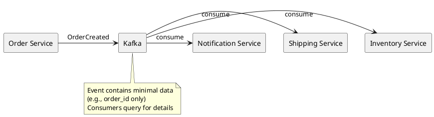
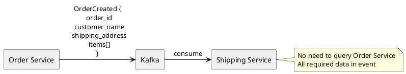
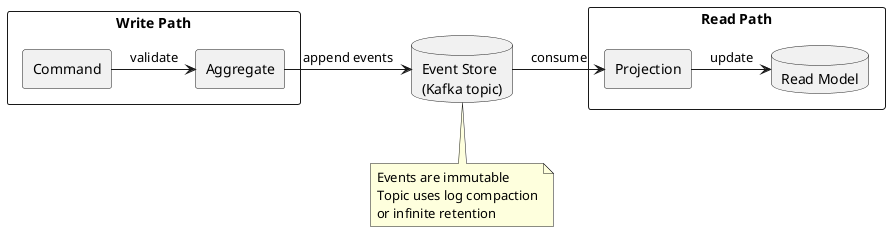
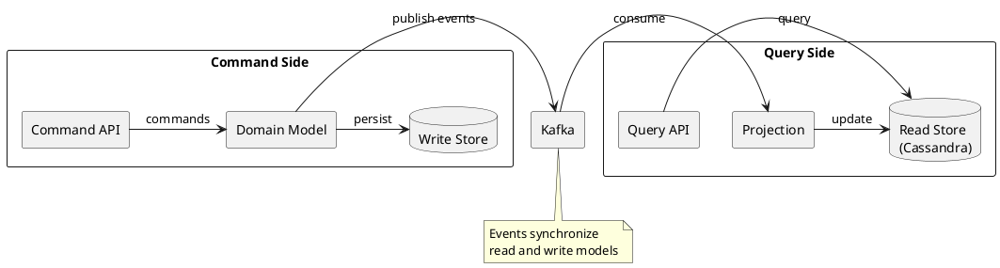
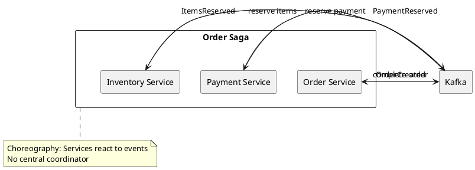
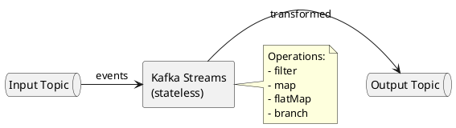
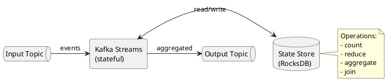

# Architecture Patterns

Common architectural patterns for building event-driven systems with Apache Kafka.

---

## Pattern Overview

| Pattern | Use Case | Complexity |
|---------|----------|------------|
| **Event Notification** | Decoupled service communication | Low |
| **Event-Carried State Transfer** | Avoid synchronous queries | Medium |
| **Event Sourcing** | Audit, replay, temporal queries | High |
| **CQRS** | Separate read/write models | High |
| **Saga** | Distributed transactions | High |

---

## Event Notification

Services publish events when state changes occur. Consumers react to events independently.



### Characteristics

| Aspect | Description |
|--------|-------------|
| **Coupling** | Loose—services only share event contracts |
| **Data** | Minimal—typically just identifiers |
| **Query pattern** | Consumers may need to query producer for details |
| **Consistency** | Eventually consistent |

### When to Use

- Simple notification requirements
- Consumers need fresh data on demand
- Low event volume

---

## Event-Carried State Transfer

Events carry complete state needed by consumers, eliminating synchronous queries.



### Characteristics

| Aspect | Description |
|--------|-------------|
| **Coupling** | Medium—larger event contracts |
| **Data** | Complete—all data consumers need |
| **Query pattern** | No synchronous queries required |
| **Consistency** | Eventually consistent with local caching |

### When to Use

- Consumers need complete data for processing
- Reducing inter-service dependencies
- Building local read models

---

## Event Sourcing

Store all state changes as an immutable sequence of events. Current state is derived by replaying events.



### Event Store Design

```
Topic: orders (compacted or infinite retention)

Key: order_id
Events:
  OrderCreated { order_id, customer_id, items }
  ItemAdded { order_id, item }
  ItemRemoved { order_id, item_id }
  OrderSubmitted { order_id, submitted_at }
  OrderCancelled { order_id, reason }
```

### Characteristics

| Aspect | Description |
|--------|-------------|
| **Audit** | Complete history of all changes |
| **Replay** | Rebuild state from any point in time |
| **Temporal queries** | Query state at any historical moment |
| **Complexity** | High—requires event versioning, snapshots |

### Implementation Considerations

| Concern | Solution |
|---------|----------|
| **Event versioning** | Include version in events, use upcasters |
| **Snapshots** | Periodically snapshot state to reduce replay time |
| **Compaction** | Use log compaction to retain latest per key |
| **Schema evolution** | Use Schema Registry with compatibility rules |

---

## CQRS (Command Query Responsibility Segregation)

Separate models for reading and writing data. Kafka connects the two.



### Read Model Optimization

| Read Pattern | Optimized Store | Example |
|--------------|-----------------|---------|
| Key-value lookup | Cassandra | User by ID |
| Full-text search | Elasticsearch | Product search |
| Aggregations | ClickHouse | Analytics |
| Graph queries | Neo4j | Recommendations |

### Characteristics

| Aspect | Description |
|--------|-------------|
| **Scalability** | Independent scaling of read/write |
| **Optimization** | Each model optimized for its access pattern |
| **Consistency** | Eventually consistent between models |
| **Complexity** | High—multiple data stores, synchronization |

---

## Saga Pattern

Coordinate distributed transactions across services using events.



### Saga Types

| Type | Description | Pros | Cons |
|------|-------------|------|------|
| **Choreography** | Services react to events | Loose coupling | Hard to track flow |
| **Orchestration** | Central coordinator | Clear flow | Single point of failure |

### Compensation

When a step fails, compensating events undo previous steps.

```
Happy Path:
  OrderCreated -> PaymentReserved -> ItemsReserved -> OrderCompleted

Failure (inventory unavailable):
  OrderCreated -> PaymentReserved -> ItemsUnavailable -> PaymentReleased -> OrderFailed
```

### Implementation with Kafka

| Concern | Solution |
|---------|----------|
| **Ordering** | Use order_id as partition key |
| **Idempotency** | Include saga_id, step_id in events |
| **Timeout** | Use Kafka Streams punctuators or external scheduler |
| **Dead letters** | Route failed events to DLQ for investigation |

---

## Streaming Patterns

### Stateless Stream Processing

Transform events without maintaining state.



### Stateful Stream Processing

Aggregate events maintaining state.



---

## Pattern Selection Guide

| Requirement | Recommended Pattern |
|-------------|---------------------|
| Simple decoupling | Event Notification |
| Avoid inter-service queries | Event-Carried State Transfer |
| Complete audit trail | Event Sourcing |
| Separate read optimization | CQRS |
| Distributed transactions | Saga |
| Real-time transformations | Kafka Streams |

---

## Related Documentation

- [Event Streaming Concepts](../index.md) - Kafka fundamentals
- [Kafka Streams](../../application-development/kafka-streams/index.md) - Stream processing
- [Delivery Semantics](../delivery-semantics/index.md) - Consistency guarantees
- [Data Integration](../data-integration/index.md) - Integration patterns
