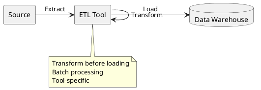
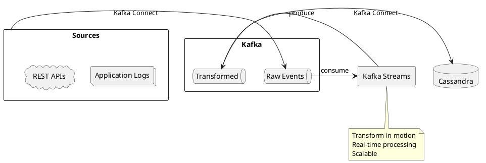
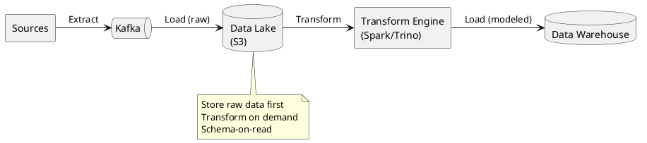
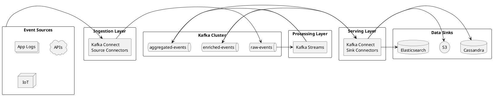
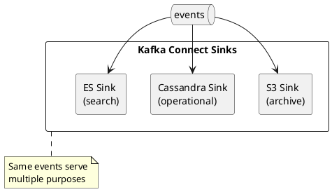
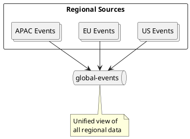
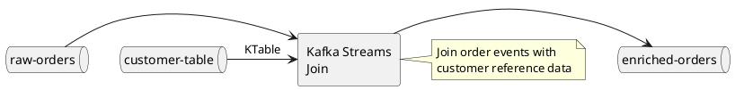
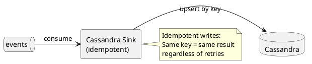

# Data Integration

Patterns for integrating Apache Kafka with data systems across the enterprise.

---

## Integration Approaches

| Approach | Description | Use Case |
|----------|-------------|----------|
| **Kafka Connect** | Declarative connectors | Standard integrations |
| **Custom Producers/Consumers** | Application code | Complex logic |
| **Kafka Streams** | Stream processing | Transformations |

---

## ETL vs ELT with Kafka

### Traditional ETL



### Kafka-Based Streaming ETL



### ELT Pattern



---

## Streaming Pipeline Architecture



---

## Integration Patterns

### Fan-Out Pattern

One source feeds multiple sinks for different use cases.



### Fan-In Pattern

Multiple sources aggregate into unified topics.



### Enrichment Pattern

Enrich events with reference data.



---

## Kafka Connect Patterns

### Source Connector Patterns

| Pattern | Description | Example |
|---------|-------------|---------|
| **Polling** | Periodically fetch data | HTTP Source |
| **Push** | Receive pushed events | MQTT Source |
| **Log tailing** | Stream log files | FileStream Source |
| **Message bridge** | Bridge message systems | JMS Source |

### Sink Connector Patterns

| Pattern | Description | Example |
|---------|-------------|---------|
| **Upsert** | Insert or update records | Cassandra Sink |
| **Append** | Append-only writes | S3 Sink |
| **Index** | Update search index | Elasticsearch Sink |
| **Time-partitioned** | Partition by time | S3 Sink with partitioner |

### Exactly-Once Sink Pattern



---

## Data Lake Integration

### S3 Sink Configuration

```json
{
  "name": "s3-sink",
  "config": {
    "connector.class": "io.confluent.connect.s3.S3SinkConnector",
    "tasks.max": "3",
    "topics": "events",
    "s3.bucket.name": "data-lake",
    "s3.region": "us-east-1",
    "storage.class": "io.confluent.connect.s3.storage.S3Storage",
    "format.class": "io.confluent.connect.s3.format.parquet.ParquetFormat",
    "partitioner.class": "io.confluent.connect.storage.partitioner.TimeBasedPartitioner",
    "partition.duration.ms": "3600000",
    "path.format": "'year'=YYYY/'month'=MM/'day'=dd/'hour'=HH",
    "rotate.interval.ms": "600000",
    "flush.size": "10000"
  }
}
```

### Resulting S3 Structure

```
s3://data-lake/topics/events/
  year=2024/
    month=01/
      day=15/
        hour=10/
          events+0+0000000000.parquet
          events+1+0000000000.parquet
        hour=11/
          events+0+0000000100.parquet
```

---

## Cassandra Integration

### Cassandra Sink Configuration

```json
{
  "name": "cassandra-sink",
  "config": {
    "connector.class": "com.datastax.oss.kafka.sink.CassandraSinkConnector",
    "tasks.max": "3",
    "topics": "events",
    "contactPoints": "cassandra1,cassandra2,cassandra3",
    "loadBalancing.localDc": "datacenter1",
    "port": "9042",
    "topic.events.keyspace.table.mapping": "analytics.events_by_time",
    "topic.events.keyspace.table.consistencyLevel": "LOCAL_QUORUM",
    "topic.events.keyspace.table.ttlTimeUnit": "DAYS",
    "topic.events.keyspace.table.ttl": "365"
  }
}
```

### Target Table Design

```sql
CREATE TABLE analytics.events_by_time (
    event_date date,
    event_time timestamp,
    event_id uuid,
    event_type text,
    payload text,
    PRIMARY KEY ((event_date), event_time, event_id)
) WITH CLUSTERING ORDER BY (event_time DESC);
```

---

## Best Practices

### Schema Management

| Practice | Rationale |
|----------|-----------|
| Use Schema Registry | Ensure compatibility across pipeline |
| Prefer Avro or Protobuf | Compact, schema evolution support |
| Version schemas explicitly | Track changes, enable rollback |

### Error Handling

| Strategy | Implementation |
|----------|----------------|
| Dead letter queue | Route failed records for investigation |
| Error tolerance | Configure `errors.tolerance=all` |
| Monitoring | Alert on DLQ growth |

### Performance

| Optimization | Configuration |
|--------------|---------------|
| Batching | Increase `batch.size`, `linger.ms` |
| Compression | Use `compression.type=lz4` |
| Parallelism | Increase `tasks.max` |
| Partitioning | Align with downstream partitioning |

---

## Related Documentation

- [Kafka Connect](../../kafka-connect/index.md) - Technical reference
- [Kafka Connect Concepts](../kafka-connect/index.md) - Connector ecosystem
- [Architecture Patterns](../architecture-patterns/index.md) - Event-driven patterns
- [Schema Registry](../../schema-registry/index.md) - Schema management
