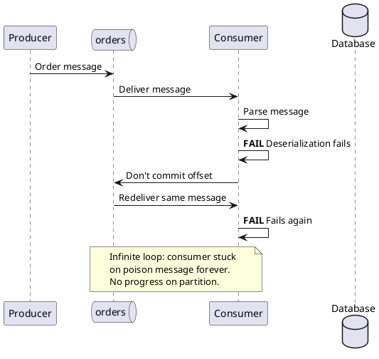
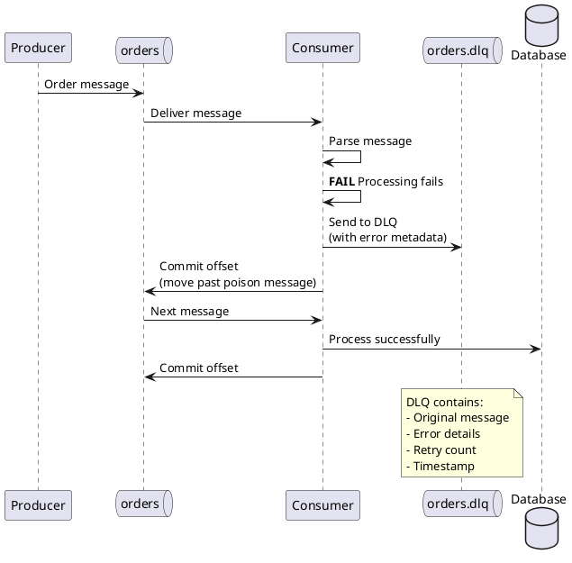
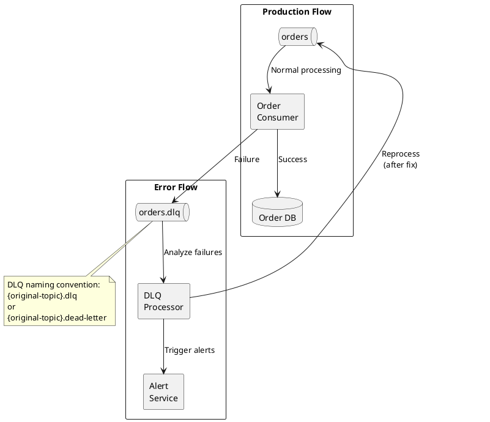
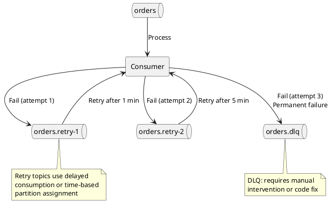
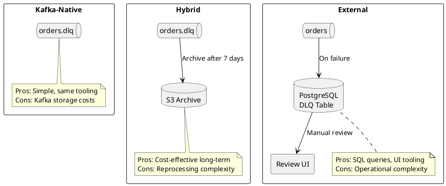
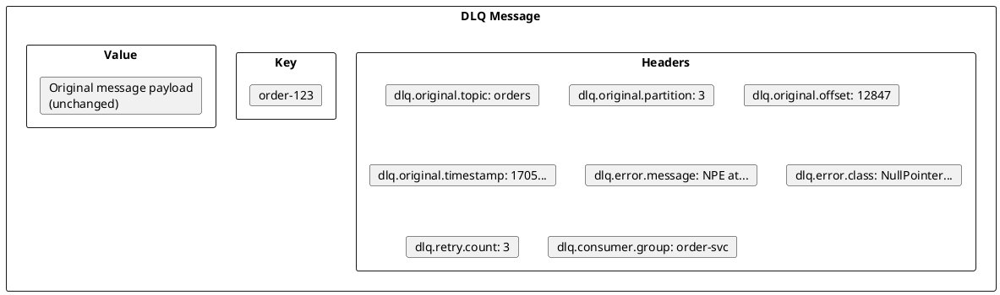
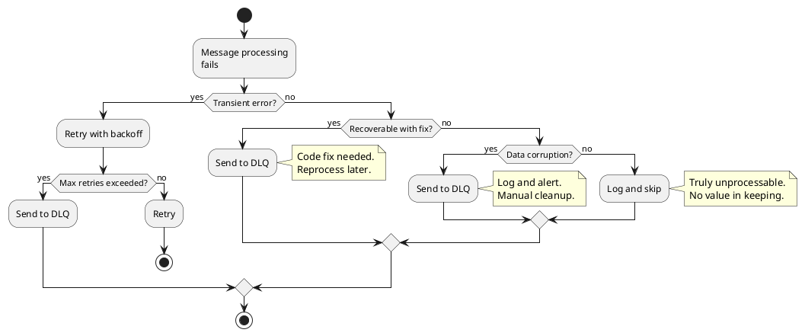
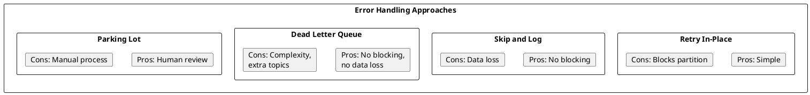
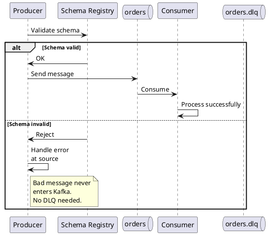
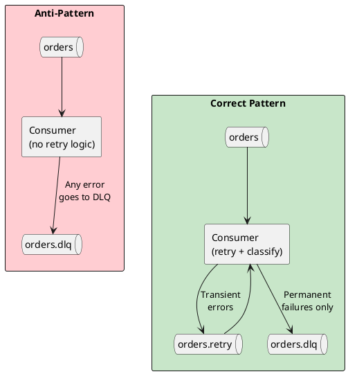

# Dead Letter Queues

A Dead Letter Queue (DLQ) is a separate topic that stores messages which cannot be processed successfully. Rather than blocking the consumer, losing the message, or retrying indefinitely, failed messages are moved to the DLQ for later analysis and reprocessing.

Kafka does not provide built-in DLQ functionality—it is an application-level pattern that must be implemented by producers or consumers. This follows Kafka's "dumb broker, smart consumer" architecture where error handling responsibility lies with client applications rather than the broker.

---

## Kafka DLQ vs Traditional Message Brokers

Traditional message brokers (JMS, RabbitMQ, IBM MQ) provide built-in DLQ functionality, typically routing messages based on:

- **TTL expiration** - message exceeded time-to-live
- **Delivery failures** - maximum delivery attempts exceeded
- **Queue capacity** - destination queue full

Kafka DLQs serve a different purpose. Since Kafka retains messages regardless of consumption and consumers control their own offsets, DLQs in Kafka primarily address:

- **Invalid message format** - deserialization failures, schema mismatches
- **Bad message content** - validation errors, missing required fields
- **Processing failures** - business logic exceptions, dependency errors

This distinction is important: Kafka DLQs are about **message quality**, not delivery mechanics.

---

## The Problem: Poison Messages

A poison message is a message that causes consumer failure repeatedly. Without proper handling, a single poison message can halt an entire consumer group.



### Common Causes of Poison Messages

| Cause | Description |
|-------|-------------|
| **Schema mismatch** | Producer schema incompatible with consumer's deserializer |
| **Corrupt data** | Malformed JSON, invalid Avro, truncated payload |
| **Business validation** | Data fails domain validation (negative price, invalid date) |
| **Missing dependencies** | Referenced entity doesn't exist in database |
| **Transient failures** | Database timeout, network error (may succeed on retry) |
| **Code bugs** | Consumer code throws exception for certain data patterns |

---

## DLQ Pattern

The DLQ pattern isolates failed messages so healthy messages continue processing.



### DLQ Benefits

| Benefit | Description |
|---------|-------------|
| **Fault isolation** | One bad message doesn't block partition processing |
| **No data loss** | Failed messages preserved for analysis and reprocessing |
| **Visibility** | DLQ depth indicates system health issues |
| **Debugging** | Failed messages available for root cause analysis |
| **Controlled retry** | Messages can be reprocessed after fixes deployed |

---

## DLQ Architecture

### Basic DLQ Topology



### Multi-Stage DLQ (Retry Tiers)

For transient failures, implement multiple retry stages before final DLQ:



### Retry Timing Strategies

| Strategy | Implementation | Use Case |
|----------|----------------|----------|
| **Immediate retry** | Consumer retries N times in-memory | Transient network glitches |
| **Delayed retry** | Separate retry topics with consumer pause | Rate limiting, backpressure |
| **Exponential backoff** | Increasing delays (1s, 5s, 30s, 5m) | External service recovery |
| **Scheduled retry** | Time-windowed reprocessing | Batch reconciliation |

### DLQ Topic Strategy

Organizations must decide between dedicated DLQs per topic or a unified DLQ.

| Strategy | Approach | Trade-offs |
|----------|----------|------------|
| **Per-topic DLQ** | `orders.dlq`, `payments.dlq`, `users.dlq` | Targeted analysis, clear ownership; more topics to manage |
| **Unified DLQ** | Single `application.dlq` for all topics | Simpler operations, single dashboard; harder root cause analysis |
| **Per-service DLQ** | `order-service.dlq` handles multiple input topics | Balanced approach; requires header-based routing |

Most production deployments use per-topic DLQs for clear ownership and targeted alerting.

### DLQ Storage Options

DLQ messages can remain in Kafka or be moved to external storage for long-term retention and analysis.



| Storage | Best For | Considerations |
|---------|----------|----------------|
| **Kafka topic** | Standard use cases, automated reprocessing | Set appropriate retention; monitor disk usage |
| **S3/GCS archive** | Compliance, long-term retention | Batch reprocessing; requires ETL tooling |
| **Database (PostgreSQL)** | Manual review workflows, complex remediation | Enables UI/CLI tooling; additional infrastructure |

---

## DLQ Message Structure

A DLQ message should contain the original message plus metadata for debugging and reprocessing.



### Standard DLQ Headers

| Header | Purpose |
|--------|---------|
| `dlq.original.topic` | Source topic name |
| `dlq.original.partition` | Source partition |
| `dlq.original.offset` | Source offset (for replay tracking) |
| `dlq.original.timestamp` | Original message timestamp |
| `dlq.original.key` | Original message key (if key changed) |
| `dlq.error.message` | Exception message |
| `dlq.error.class` | Exception class name |
| `dlq.error.stacktrace` | Stack trace (optional, can be large) |
| `dlq.retry.count` | Number of processing attempts |
| `dlq.failed.timestamp` | When message was sent to DLQ |
| `dlq.consumer.group` | Consumer group that failed |
| `dlq.consumer.instance` | Specific consumer instance |

---

## Error Classification

Not all errors should go to the DLQ. Classify errors to determine the appropriate handling strategy.



### Error Categories

| Category | Examples | Strategy |
|----------|----------|----------|
| **Transient** | Connection timeout, rate limit, lock contention | Retry with backoff |
| **Recoverable** | Schema mismatch, validation failure, missing reference | DLQ → fix → reprocess |
| **Corrupt** | Invalid encoding, truncated message, wrong topic | DLQ → investigate → discard |
| **Poison** | Causes crash/OOM, infinite loop trigger | DLQ → immediate alert |

---

## DLQ Topic Configuration

DLQ topics should be configured for durability and long retention since messages may need reprocessing weeks later.

### Recommended Settings

```properties
# DLQ topic configuration
cleanup.policy=delete
retention.ms=2592000000        # 30 days (longer than main topics)
retention.bytes=-1             # No size limit
min.insync.replicas=2          # Durability
replication.factor=3           # Durability
compression.type=producer      # Preserve original compression
```

### Partitioning Strategy

| Strategy | Approach | Trade-off |
|----------|----------|-----------|
| **Single partition** | All DLQ messages in one partition | Simple, ordered review; limited throughput |
| **Match source** | Same partition count as source topic | Preserves key locality; complex reprocessing |
| **By error type** | Partition by error category | Easy triage; custom partitioner needed |
| **Round-robin** | Default partitioning | Balanced load; no ordering |

---

## DLQ vs Alternatives

### Comparison with Other Patterns



| Approach | Blocking | Data Loss | Complexity | Best For |
|----------|----------|-----------|------------|----------|
| **Retry in-place** | Yes | No | Low | Transient errors only |
| **Skip and log** | No | Yes | Low | Non-critical data |
| **DLQ** | No | No | Medium | Production systems |
| **Parking lot** | No | No | High | Compliance, finance |

---

## Preventing DLQ Messages

The best DLQ strategy is minimizing messages that reach it. Schema Registry provides producer-side validation that catches bad messages before they enter Kafka.



### Prevention Strategies

| Strategy | Implementation | Effectiveness |
|----------|----------------|---------------|
| **Schema Registry** | Enforce Avro/Protobuf/JSON Schema at producer | Catches format errors before Kafka |
| **Producer validation** | Validate business rules before send | Catches domain errors at source |
| **Contract testing** | Verify producer/consumer compatibility in CI | Catches schema drift before deployment |
| **Input sanitization** | Clean/normalize data at ingestion boundary | Reduces malformed data |

Prevention reduces DLQ volume but cannot eliminate it entirely—runtime failures, dependency issues, and edge cases still require DLQ handling.

---

## When to Use DLQs

### Good Candidates

- Order processing where every message must be accounted for
- Financial transactions requiring audit trails
- Event sourcing where event loss corrupts state
- Multi-tenant systems where one tenant's bad data shouldn't affect others
- Integration pipelines where upstream data quality varies

### Poor Candidates

- Metrics/telemetry where occasional loss is acceptable
- Cache invalidation events (stale cache self-corrects)
- Heartbeats/health checks
- High-volume logs where DLQ would be overwhelmed

---

## DLQ Anti-Patterns

### Anti-Pattern: DLQ as Primary Error Handling



### Common Anti-Patterns

| Anti-Pattern | Problem | Solution |
|--------------|---------|----------|
| **No retry before DLQ** | Transient errors flood DLQ | Implement retry with backoff |
| **DLQ without monitoring** | Silent failures accumulate | Alert on DLQ depth |
| **No reprocessing plan** | DLQ becomes data graveyard | Build reprocessing tooling |
| **Infinite retry** | Poison messages never reach DLQ | Set max retry limit |
| **Losing error context** | Can't debug failures | Include error metadata in headers |
| **Same retention as source** | DLQ expires before review | Longer DLQ retention |
| **DLQ for backpressure** | Using DLQ to handle load spikes | Scale consumers or use quotas |
| **Connection errors to DLQ** | Network timeouts sent to DLQ | Retry in application; fix connectivity |
| **No DLQ ownership** | Nobody reviews DLQ messages | Assign data owners, not just infrastructure |
| **Ignoring DLQ entirely** | Messages accumulate indefinitely | Process or archive with defined SLA |

---

## DLQ Ownership

Effective DLQ management requires clear ownership and defined processes.

### Responsibility Model

| Role | Responsibility |
|------|----------------|
| **Data owner** | Review failed messages, determine if data fix needed |
| **Development team** | Fix code bugs causing failures, deploy fixes |
| **Operations** | Monitor DLQ depth, trigger alerts, manage retention |
| **Platform team** | Provide reprocessing tooling, maintain DLQ infrastructure |

### Process Considerations

- **SLA for review** - define maximum time messages can remain in DLQ unreviewed
- **Escalation path** - who gets notified when DLQ depth exceeds thresholds
- **Reprocessing authority** - who can trigger replay of DLQ messages
- **Discard policy** - criteria for permanently discarding unrecoverable messages

---

## Related Documentation

- [Error Handling Implementation](../../application-development/error-handling/dead-letter-queues.md) - Code patterns and implementation
- [DLQ Operations](../../operations/troubleshooting/dead-letter-queues.md) - Monitoring, alerting, and reprocessing
- [Schema Registry](../../schema-registry/index.md) - Producer-side validation to prevent bad messages
- [Delivery Semantics](../delivery-semantics/index.md) - At-least-once and exactly-once processing
- [Consumer Error Handling](../../application-development/consumers/index.md) - Consumer-side error strategies