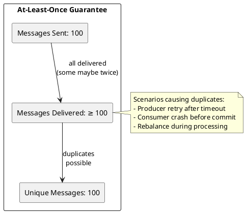
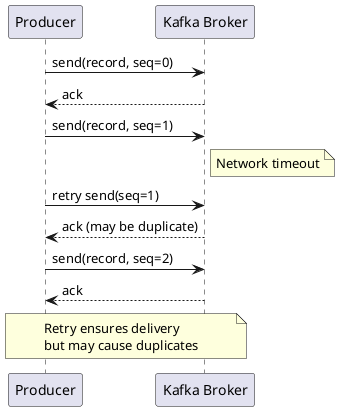
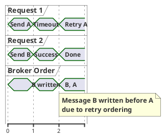
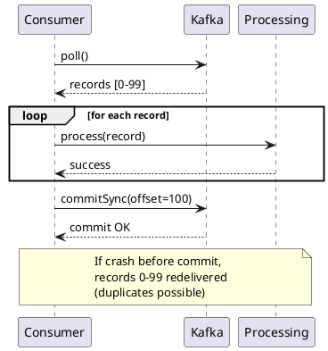
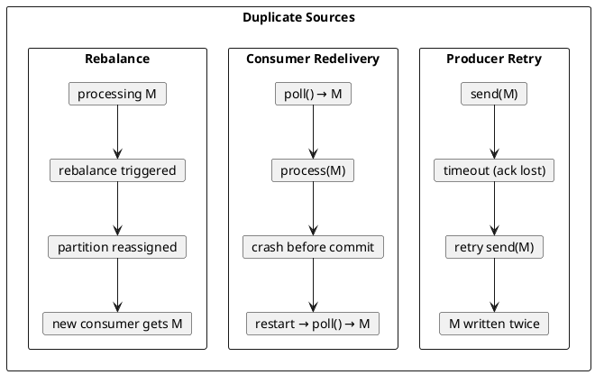
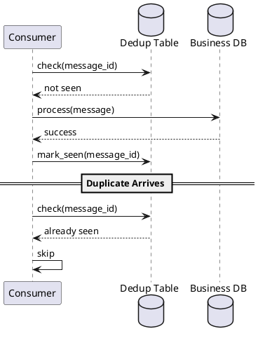
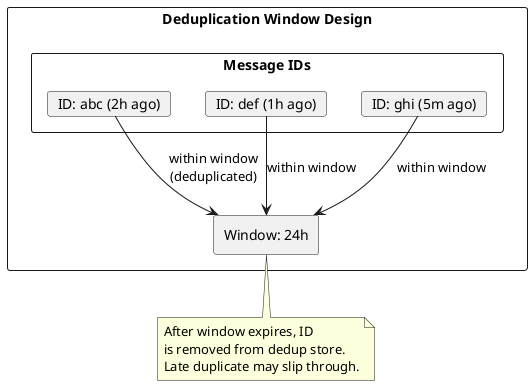
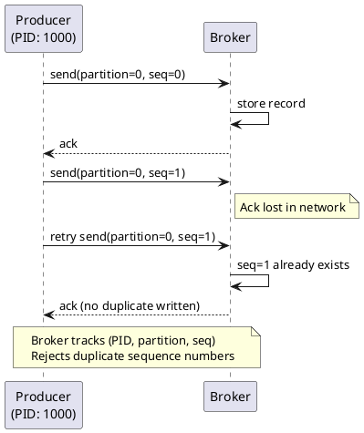
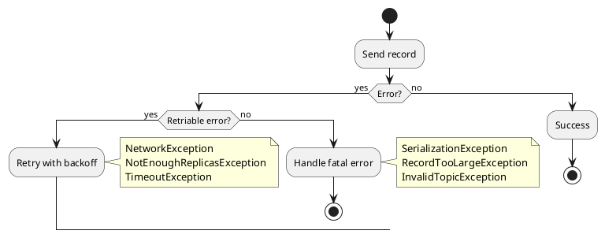

# At-Least-Once Delivery

At-least-once delivery guarantees that messages are never lost but may be delivered multiple times. This semantic is the default for most Kafka deployments and requires consumers to handle potential duplicates.

---

## Semantic Definition



| Property | Guarantee |
|----------|-----------|
| **Delivery count** | ≥ 1 |
| **Message loss** | Never |
| **Duplicates** | Possible |
| **Ordering** | Preserved within partition (with constraints) |

---

## Producer Implementation

### Acknowledgment and Retry

At-least-once producers wait for acknowledgment and retry on failure.



### Configuration

```properties
# At-least-once producer configuration
acks=all                                   # Wait for all in-sync replicas
retries=2147483647                         # Retry indefinitely
retry.backoff.ms=100                       # Initial retry delay
delivery.timeout.ms=120000                 # Total delivery timeout
max.in.flight.requests.per.connection=5    # Default parallelism
request.timeout.ms=30000                   # Per-request timeout
```

### Configuration Explanation

| Configuration | Value | Rationale |
|---------------|:-----:|-----------|
| `acks=all` | all | Wait for all ISR replicas; strongest durability |
| `retries` | MAX_INT | Retry until delivery.timeout.ms expires |
| `delivery.timeout.ms` | 120000 | Total time budget for delivery |
| `max.in.flight.requests.per.connection` | 5 | Balance parallelism and ordering |

### Ordering Considerations

With `max.in.flight.requests.per.connection > 1`, retries may cause reordering:



To preserve strict ordering:

```properties
# Strict ordering (lower throughput)
max.in.flight.requests.per.connection=1

# Or use idempotent producer (recommended)
enable.idempotence=true
# Idempotence allows max.in.flight=5 with ordering preserved
```

### Java Producer Example

```java
Properties props = new Properties();
props.put(ProducerConfig.BOOTSTRAP_SERVERS_CONFIG, "kafka:9092");
props.put(ProducerConfig.ACKS_CONFIG, "all");
props.put(ProducerConfig.RETRIES_CONFIG, Integer.MAX_VALUE);
props.put(ProducerConfig.RETRY_BACKOFF_MS_CONFIG, 100);
props.put(ProducerConfig.DELIVERY_TIMEOUT_MS_CONFIG, 120000);
props.put(ProducerConfig.KEY_SERIALIZER_CLASS_CONFIG, StringSerializer.class);
props.put(ProducerConfig.VALUE_SERIALIZER_CLASS_CONFIG, StringSerializer.class);

Producer<String, String> producer = new KafkaProducer<>(props);

// Synchronous send (blocks until ack or timeout)
try {
    RecordMetadata metadata = producer.send(
        new ProducerRecord<>("orders", order.getId(), order.toJson())
    ).get();
    log.info("Delivered to partition {} offset {}",
        metadata.partition(), metadata.offset());
} catch (ExecutionException e) {
    log.error("Failed to deliver after retries", e);
    // Handle permanent failure
}

// Asynchronous send with callback
producer.send(
    new ProducerRecord<>("orders", order.getId(), order.toJson()),
    (metadata, exception) -> {
        if (exception != null) {
            log.error("Delivery failed", exception);
            // Retry application-level or alert
        } else {
            log.debug("Delivered to {} @ {}",
                metadata.partition(), metadata.offset());
        }
    }
);
```

---

## Consumer Implementation

### Process-Before-Commit Pattern

At-least-once consumers process messages before committing offsets.



### Consumer Configuration

```properties
# At-least-once consumer configuration
enable.auto.commit=false            # Manual commit control
auto.offset.reset=earliest          # Process all messages on new consumer
max.poll.records=500                # Reasonable batch size
max.poll.interval.ms=300000         # Processing time budget
session.timeout.ms=45000            # Heartbeat timeout
```

### Java Consumer Example

```java
Properties props = new Properties();
props.put(ConsumerConfig.BOOTSTRAP_SERVERS_CONFIG, "kafka:9092");
props.put(ConsumerConfig.GROUP_ID_CONFIG, "order-processor");
props.put(ConsumerConfig.ENABLE_AUTO_COMMIT_CONFIG, false);
props.put(ConsumerConfig.AUTO_OFFSET_RESET_CONFIG, "earliest");
props.put(ConsumerConfig.MAX_POLL_RECORDS_CONFIG, 500);
props.put(ConsumerConfig.KEY_DESERIALIZER_CLASS_CONFIG, StringDeserializer.class);
props.put(ConsumerConfig.VALUE_DESERIALIZER_CLASS_CONFIG, StringDeserializer.class);

KafkaConsumer<String, String> consumer = new KafkaConsumer<>(props);
consumer.subscribe(Collections.singletonList("orders"));

while (running) {
    ConsumerRecords<String, String> records = consumer.poll(Duration.ofMillis(100));

    for (ConsumerRecord<String, String> record : records) {
        // Process first (at-least-once)
        processOrder(record.value());
    }

    // Commit after successful processing
    if (!records.isEmpty()) {
        consumer.commitSync();
    }
}
```

### Commit Strategies

| Strategy | Implementation | Trade-off |
|----------|----------------|-----------|
| **Commit per batch** | `commitSync()` after poll loop | Balance safety/performance |
| **Commit per record** | `commitSync(offsets)` per record | Safest, lowest throughput |
| **Async commit** | `commitAsync()` | Faster, may lose commits |
| **Periodic commit** | Commit every N records | Balance |

```java
// Commit per record (safest, slowest)
for (ConsumerRecord<String, String> record : records) {
    processOrder(record.value());

    Map<TopicPartition, OffsetAndMetadata> offset = Map.of(
        new TopicPartition(record.topic(), record.partition()),
        new OffsetAndMetadata(record.offset() + 1)
    );
    consumer.commitSync(offset);
}

// Async commit with retry (faster)
consumer.commitAsync((offsets, exception) -> {
    if (exception != null) {
        log.warn("Commit failed, will retry on next poll", exception);
    }
});
```

---

## Duplicate Handling

### Why Duplicates Occur



### Idempotent Consumer Strategies

#### 1. Natural Idempotence

Operations that produce the same result regardless of execution count.

```java
// Naturally idempotent: SET operation
database.execute("UPDATE users SET email = ? WHERE id = ?",
    record.email(), record.userId());
// Running twice sets the same value

// NOT idempotent: INCREMENT operation
database.execute("UPDATE accounts SET balance = balance + ? WHERE id = ?",
    record.amount(), record.accountId());
// Running twice doubles the amount!
```

#### 2. Deduplication Table

Track processed message IDs to detect and skip duplicates.



```java
// Deduplication with database
public void processWithDedup(ConsumerRecord<String, String> record) {
    String messageId = extractMessageId(record);

    // Check if already processed
    if (deduplicationService.isProcessed(messageId)) {
        log.debug("Skipping duplicate: {}", messageId);
        return;
    }

    // Process within transaction
    transactionTemplate.execute(status -> {
        processBusinessLogic(record);
        deduplicationService.markProcessed(messageId);
        return null;
    });
}
```

#### 3. Idempotency Keys

Include unique keys in messages; downstream systems deduplicate.

```java
// Producer: include idempotency key
ProducerRecord<String, String> record = new ProducerRecord<>(
    "payments",
    payment.getId(),
    payment.toJson()
);
record.headers().add("idempotency-key",
    UUID.randomUUID().toString().getBytes());

// Consumer: use key for external API
String idempotencyKey = new String(
    record.headers().lastHeader("idempotency-key").value()
);
paymentGateway.charge(payment, idempotencyKey);
// Gateway deduplicates based on idempotency key
```

#### 4. Upsert Semantics

Use database upsert operations where duplicates overwrite with same data.

```sql
-- PostgreSQL upsert
INSERT INTO events (event_id, event_type, payload, created_at)
VALUES (?, ?, ?, ?)
ON CONFLICT (event_id) DO UPDATE SET
    event_type = EXCLUDED.event_type,
    payload = EXCLUDED.payload;
-- Duplicate insert has no effect (same data)
```

```java
// Cassandra natural idempotence
session.execute(
    "INSERT INTO events (event_id, event_type, payload) VALUES (?, ?, ?)",
    record.eventId(), record.eventType(), record.payload()
);
// Cassandra INSERT is an upsert; duplicates overwrite with same values
```

### Deduplication Window



| Window Size | Trade-off |
|-------------|-----------|
| **Short (1h)** | Less storage, may miss late duplicates |
| **Medium (24h)** | Balanced for most use cases |
| **Long (7d)** | High storage, catches very late duplicates |
| **Forever** | Maximum safety, unbounded storage |

---

## Producer Idempotence

### Idempotent Producer (KIP-98)

Kafka's idempotent producer prevents duplicates caused by producer retries.



### Configuration

```properties
# Enable idempotent producer
enable.idempotence=true

# Implied settings (automatically set):
# acks=all
# retries=Integer.MAX_VALUE
# max.in.flight.requests.per.connection ≤ 5
```

### Idempotent Producer Scope

| Scope | Covered | Not Covered |
|-------|:-------:|:-----------:|
| Single producer session | ✅ | - |
| Producer restart | ❌ | New PID assigned |
| Multiple producers | ❌ | Different PIDs |
| Cross-partition | ❌ | Per-partition sequence |

!!! note "Idempotent Producer Limitations"
    Idempotent producers prevent duplicates within a single producer instance session. For cross-session or cross-producer deduplication, use transactions or application-level deduplication.

---

## Error Handling

### Retriable vs Non-Retriable Errors



| Error Type | Examples | Action |
|------------|----------|--------|
| **Retriable** | NetworkException, TimeoutException | Automatic retry |
| **Non-retriable** | SerializationException, RecordTooLargeException | Fail immediately |
| **Conditional** | NotEnoughReplicasException | Retry until timeout |

### Error Handling Code

```java
producer.send(record, (metadata, exception) -> {
    if (exception == null) {
        // Success
        return;
    }

    if (exception instanceof RetriableException) {
        // Already retried by producer; this is final failure
        log.error("Retriable error exhausted retries", exception);
        deadLetterQueue.send(record);
    } else if (exception instanceof SerializationException) {
        // Non-retriable; bad data
        log.error("Serialization failed", exception);
        errorMetrics.increment("serialization_error");
    } else {
        // Other fatal error
        log.error("Unexpected error", exception);
        alertService.alert("Kafka producer error", exception);
    }
});
```

---

## Monitoring

### Producer Metrics

| Metric | Alert Condition | Implication |
|--------|-----------------|-------------|
| `record-retry-rate` | > 0.1/sec sustained | Network or broker issues |
| `record-error-rate` | > 0 | Delivery failures |
| `request-latency-avg` | > 100ms | Slow broker response |
| `batch-size-avg` | Very small | Inefficient batching |
| `records-per-request-avg` | Low | Check linger.ms |

### Consumer Metrics

| Metric | Alert Condition | Implication |
|--------|-----------------|-------------|
| `records-lag-max` | Growing | Processing too slow |
| `commit-latency-avg` | > 100ms | Slow commits |
| `rebalance-latency-avg` | > 30s | Long rebalances |

### Duplicate Detection Metrics

```java
// Track duplicates in application
Counter duplicatesDetected = meterRegistry.counter("kafka.consumer.duplicates");
Counter recordsProcessed = meterRegistry.counter("kafka.consumer.processed");

public void process(ConsumerRecord<String, String> record) {
    String messageId = extractMessageId(record);

    if (deduplicationService.isProcessed(messageId)) {
        duplicatesDetected.increment();
        return;
    }

    processBusinessLogic(record);
    recordsProcessed.increment();
    deduplicationService.markProcessed(messageId);
}
```

---

## Best Practices

### Producer

| Practice | Rationale |
|----------|-----------|
| Use `acks=all` | Strongest durability guarantee |
| Enable idempotence | Prevents producer-side duplicates |
| Set reasonable delivery timeout | Avoid infinite retries |
| Include message ID in payload | Enable consumer deduplication |

### Consumer

| Practice | Rationale |
|----------|-----------|
| Disable auto-commit | Explicit commit control |
| Process before commit | Ensures at-least-once |
| Implement idempotent processing | Handle duplicates gracefully |
| Use reasonable poll intervals | Avoid session timeout |

### Architecture

| Practice | Rationale |
|----------|-----------|
| Design for idempotence | Simplifies duplicate handling |
| Use natural keys as message keys | Enables partition-level deduplication |
| Consider deduplication layer | Centralized duplicate handling |
| Monitor duplicate rates | Detect configuration issues |

---

## Anti-Patterns

### Commit Before Process

```java
// WRONG: At-most-once, not at-least-once
ConsumerRecords<String, String> records = consumer.poll(Duration.ofMillis(100));
consumer.commitSync();  // Commit first
for (ConsumerRecord<String, String> record : records) {
    process(record);    // Crash here loses messages
}
```

### Ignoring Duplicates

```java
// WRONG: Non-idempotent operation without deduplication
for (ConsumerRecord<String, String> record : records) {
    // Duplicate execution doubles the balance!
    accountService.credit(record.accountId(), record.amount());
}
consumer.commitSync();
```

### Async Commit Without Handling

```java
// RISKY: Lost commits cause redelivery
for (ConsumerRecord<String, String> record : records) {
    process(record);
}
consumer.commitAsync();  // May silently fail
// If commit fails and consumer crashes, redelivery occurs
```

---

## Related Documentation

- [Delivery Semantics Overview](index.md) - Semantic comparison
- [At-Most-Once](at-most-once.md) - Fire and forget patterns
- [Exactly-Once](exactly-once.md) - Transactional processing
- [Choosing Semantics](choosing-semantics.md) - Decision guide
- [Producer Configuration](../../producers/index.md) - Producer settings
