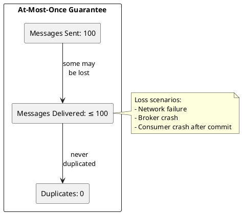
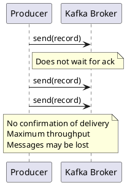
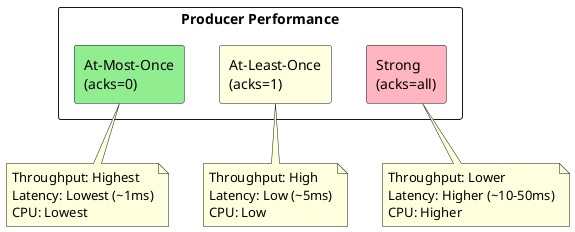
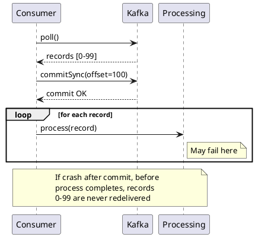
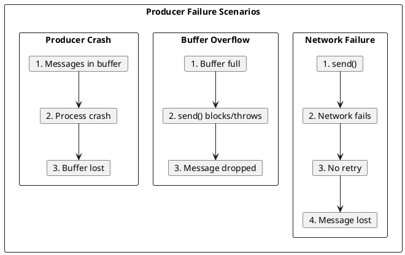
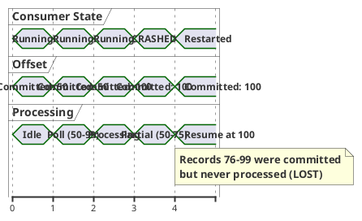
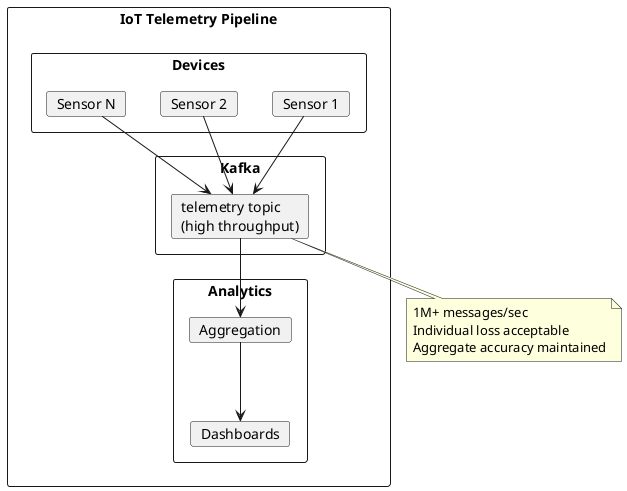
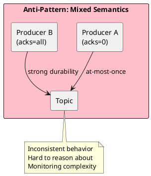

# At-Most-Once Delivery

At-most-once delivery guarantees that messages are delivered zero or one time, never more. Messages may be lost but are never duplicated. This semantic provides the highest performance but lowest reliability.

---

## Semantic Definition



| Property | Guarantee |
|----------|-----------|
| **Delivery count** | 0 or 1 |
| **Message loss** | Possible |
| **Duplicates** | Never |
| **Ordering** | Preserved within partition |

---

## Producer Implementation

### Fire-and-Forget Pattern

The producer sends messages without waiting for acknowledgment.



### Configuration (Example Tuning)

```properties
# At-most-once producer configuration
acks=0                              # No broker acknowledgment
retries=0                           # No retry on failure
buffer.memory=67108864              # 64MB buffer
linger.ms=5                         # Batch for 5ms
batch.size=32768                    # 32KB batch size
max.in.flight.requests.per.connection=1000  # High parallelism
```

### Configuration Explanation

| Configuration | Value | Rationale |
|---------------|:-----:|-----------|
| `acks=0` | 0 | Producer does not wait for broker acknowledgment |
| `retries=0` | 0 | No retry; failed sends are lost |
| `linger.ms` | 5 | Small batch window for throughput |
| `batch.size` | 32KB | Reasonable batch size |
| `max.in.flight.requests.per.connection` | 1000 | Maximum parallelism |

### Java Producer Example

```java
Properties props = new Properties();
props.put(ProducerConfig.BOOTSTRAP_SERVERS_CONFIG, "kafka:9092");
props.put(ProducerConfig.ACKS_CONFIG, "0");
props.put(ProducerConfig.RETRIES_CONFIG, 0);
props.put(ProducerConfig.LINGER_MS_CONFIG, 5);
props.put(ProducerConfig.BATCH_SIZE_CONFIG, 32768);
props.put(ProducerConfig.KEY_SERIALIZER_CLASS_CONFIG, StringSerializer.class);
props.put(ProducerConfig.VALUE_SERIALIZER_CLASS_CONFIG, StringSerializer.class);

Producer<String, String> producer = new KafkaProducer<>(props);

// Fire and forget - no callback, no Future.get()
for (Metric metric : metrics) {
    producer.send(new ProducerRecord<>("metrics", metric.key(), metric.toJson()));
}

// Buffer flush (optional, at shutdown)
producer.flush();
producer.close();
```

### Performance Characteristics (Repository Guidance)



| Metric | At-Most-Once | At-Least-Once | Exactly-Once |
|--------|:------------:|:-------------:|:------------:|
| **Latency (p50)** | ~1ms | ~5ms | ~20ms |
| **Throughput** | Highest | High | Moderate |
| **CPU overhead** | Lowest | Low | Higher |
| **Network round trips** | 0 | 1+ | Multiple |

---

## Consumer Implementation

### Commit-Before-Process Pattern

At-most-once consumers commit offsets before processing, ensuring no redelivery but risking message loss on failure.



### Consumer Configuration

```properties
# At-most-once consumer configuration
enable.auto.commit=false            # Manual commit control
auto.offset.reset=latest            # Skip old messages on new consumer
max.poll.records=500                # Batch size
```

### Java Consumer Example

```java
Properties props = new Properties();
props.put(ConsumerConfig.BOOTSTRAP_SERVERS_CONFIG, "kafka:9092");
props.put(ConsumerConfig.GROUP_ID_CONFIG, "metrics-processor");
props.put(ConsumerConfig.ENABLE_AUTO_COMMIT_CONFIG, false);
props.put(ConsumerConfig.AUTO_OFFSET_RESET_CONFIG, "latest");
props.put(ConsumerConfig.MAX_POLL_RECORDS_CONFIG, 500);
props.put(ConsumerConfig.KEY_DESERIALIZER_CLASS_CONFIG, StringDeserializer.class);
props.put(ConsumerConfig.VALUE_DESERIALIZER_CLASS_CONFIG, StringDeserializer.class);

KafkaConsumer<String, String> consumer = new KafkaConsumer<>(props);
consumer.subscribe(Collections.singletonList("metrics"));

while (running) {
    ConsumerRecords<String, String> records = consumer.poll(Duration.ofMillis(100));

    if (!records.isEmpty()) {
        // Commit BEFORE processing (at-most-once)
        consumer.commitSync();

        // Process after commit - failure here loses messages
        for (ConsumerRecord<String, String> record : records) {
            processMetric(record.value());
        }
    }
}
```

### Auto-Commit Alternative

Using auto-commit for at-most-once semantics (example only; not recommended due to timing complexity):

```properties
enable.auto.commit=true
auto.commit.interval.ms=100         # Very frequent commits
```

!!! warning "Auto-Commit Timing"
    Auto-commit timing does not guarantee at-most-once semantics. Manual commit-before-process provides explicit control.

---

## Failure Scenarios

### Producer Failures



| Failure | Outcome | Mitigation |
|---------|---------|------------|
| Network timeout | Message lost | Accept loss |
| Broker unavailable | Message lost | Accept loss |
| Serialization error | Message dropped | Log error |
| Buffer full | Block or exception | Increase buffer |
| Producer crash | Buffer lost | Accept loss |

### Consumer Failures



| Failure Point | Records Affected | Outcome |
|---------------|------------------|---------|
| After commit, before process | All polled records | Lost |
| During processing | Remaining unprocessed | Lost |
| After processing | None | No impact |

---

## Use Cases

### High-Volume Telemetry



**Why at-most-once works:**

- High data volume means individual points are expendable
- Aggregates (averages, percentiles) remain accurate
- Next reading arrives within seconds
- Throughput matters more than individual reliability

### Real-Time Gaming

| Data Type | Loss Impact | Semantic |
|-----------|-------------|----------|
| Player position updates | Old data stale anyway | At-most-once |
| Kill/death events | Must be recorded | At-least-once |
| Chat messages | Must not be lost | At-least-once |
| Heartbeats | Expendable | At-most-once |

### Log Streaming

```properties
# Log forwarder configuration (at-most-once acceptable)
acks=0
retries=0
compression.type=lz4               # High compression
linger.ms=100                      # Batch aggressively
batch.size=1048576                 # 1MB batches
```

**Rationale:**

- Log volume often exceeds retention capacity
- Missing a few log lines rarely impacts debugging
- Throughput and cost are primary concerns
- Duplicates would complicate log analysis

---

## Monitoring

### Producer Metrics

| Metric | Alert Condition | Action |
|--------|-----------------|--------|
| `record-send-total` | Dropping significantly | Check connectivity |
| `record-error-rate` | > 1% | Investigate errors |
| `buffer-available-bytes` | < 10% of total | Increase buffer or reduce rate |
| `batch-size-avg` | Very small | Increase linger.ms |

### Consumer Metrics

| Metric | Alert Condition | Action |
|--------|-----------------|--------|
| `records-consumed-total` | Lower than expected | Check producer health |
| `commit-latency-avg` | High | Check broker health |
| `records-lag` | Growing | Scale consumers |

### Estimating Loss Rate

At-most-once systems should monitor approximate loss:

```java
// Producer-side counter
AtomicLong sendAttempts = new AtomicLong(0);
AtomicLong sendErrors = new AtomicLong(0);

producer.send(record, (metadata, exception) -> {
    sendAttempts.incrementAndGet();
    if (exception != null) {
        sendErrors.incrementAndGet();
    }
});

// Estimated loss rate
double lossRate = (double) sendErrors.get() / sendAttempts.get();
```

!!! note "Loss Estimation"
    With `acks=0`, the callback exception only captures local errors. Network and broker-side losses are not reported and must be estimated through consumer-side analysis.

---

## Anti-Patterns

### Using At-Most-Once for Critical Data

```java
// WRONG: Financial transactions must not be lost
producer.send(new ProducerRecord<>("payments", payment.toJson()));
// No ack, no retry - payment may be lost!
```

**Instead:** Use at-least-once with idempotent processing:

```java
props.put(ProducerConfig.ACKS_CONFIG, "all");
props.put(ProducerConfig.RETRIES_CONFIG, Integer.MAX_VALUE);
props.put(ProducerConfig.ENABLE_IDEMPOTENCE_CONFIG, true);
```

### Mixing Semantics Within Topic



**Instead:** Separate topics by reliability requirement:

```
metrics-realtime    → at-most-once (high volume, low value)
metrics-critical    → at-least-once (auditing, billing)
```

---

## Comparison with Other Semantics

| Aspect | At-Most-Once | At-Least-Once | Exactly-Once |
|--------|--------------|---------------|--------------|
| **Message loss** | Possible | No loss when durability settings are met | Never |
| **Duplicates** | Never | Possible | Never |
| **Latency** | Lowest | Low | Higher |
| **Throughput** | Highest | High | Moderate |
| **Complexity** | Simple | Moderate | Complex |
| **Use case** | Telemetry, logs | Most workloads | Financial, billing |

---

## Migration to Stronger Semantics

When requirements change, migrating from at-most-once to stronger semantics:

### Step 1: Enable Acknowledgments

```properties
# Change from acks=0 to acks=1 or acks=all
acks=all
```

### Step 2: Enable Retries

```properties
retries=2147483647
retry.backoff.ms=100
```

### Step 3: Consider Idempotence

```properties
enable.idempotence=true
```

### Step 4: Update Consumer

```java
// Change from commit-before-process to process-before-commit
for (ConsumerRecord<String, String> record : records) {
    process(record);  // Process first
}
consumer.commitSync();  // Then commit
```

---

## Related Documentation

- [Delivery Semantics Overview](index.md) - Semantic comparison
- [At-Least-Once](at-least-once.md) - Retry-based delivery
- [Exactly-Once](exactly-once.md) - Transactional processing
- [Producer Configuration](../../application-development/producers/index.md) - Producer settings
