# Choosing Delivery Semantics

Selecting the appropriate delivery semantic involves balancing reliability requirements against performance and complexity costs. This document provides a decision framework for choosing between at-most-once, at-least-once, and exactly-once semantics.

---

## Decision Framework

### Primary Decision Tree

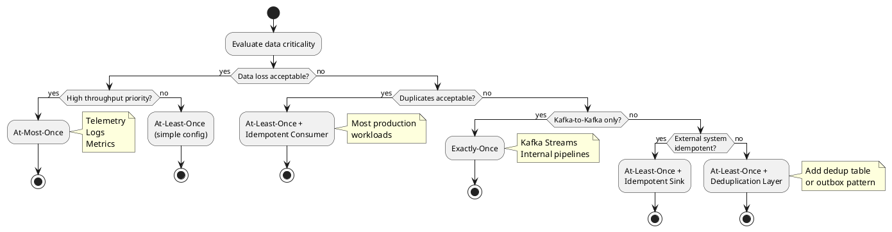

### Decision Matrix

| Requirement | At-Most-Once | At-Least-Once | Exactly-Once |
|-------------|:------------:|:-------------:|:------------:|
| No data loss | ❌ | ✅ | ✅ |
| No duplicates | ✅ | ❌ | ✅ |
| High throughput | ✅ | ✅ | ⚠️ |
| Low latency | ✅ | ✅ | ⚠️ |
| Simple implementation | ✅ | ✅ | ❌ |
| Kafka-only | ✅ | ✅ | ✅ |
| External systems | ✅ | ✅ | ⚠️ |

**Legend:** ✅ Supported | ⚠️ With constraints | ❌ Not supported

---

## Use Case Analysis

### At-Most-Once Use Cases

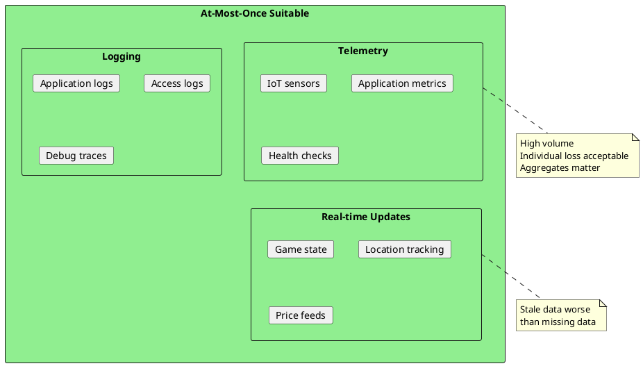

| Use Case | Why At-Most-Once |
|----------|------------------|
| **IoT telemetry** | 1M+ msgs/sec; individual readings expendable |
| **Application metrics** | Statistical accuracy preserved with 99.9% delivery |
| **Real-time gaming** | Next update arrives in milliseconds |
| **Log streaming** | Missing log lines rarely impact debugging |

### At-Least-Once Use Cases

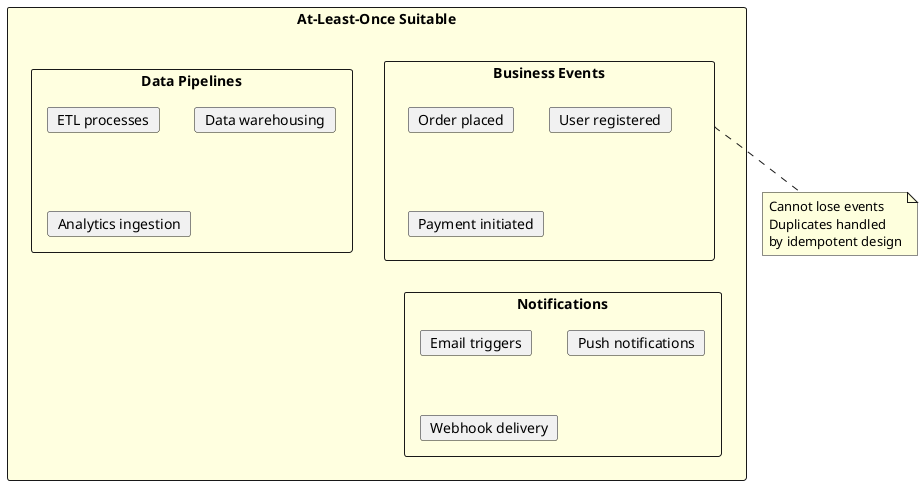

| Use Case | Why At-Least-Once | Duplicate Handling |
|----------|-------------------|-------------------|
| **Order processing** | Orders must not be lost | Order ID deduplication |
| **User events** | User actions must be captured | Event ID + timestamp |
| **Financial transactions** | Money movement must be recorded | Transaction ID |
| **Email notifications** | Users must receive communications | Email dedup by user+type |

### Exactly-Once Use Cases

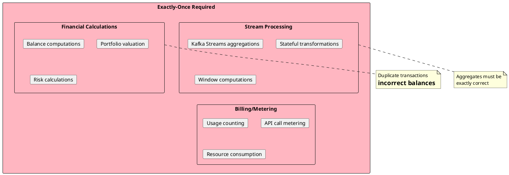

| Use Case | Why Exactly-Once | Alternative |
|----------|------------------|-------------|
| **Kafka Streams aggregates** | SUM/COUNT must be exact | None (use EOS) |
| **Balance calculations** | Duplicate credits/debits cause errors | Strong idempotency |
| **Usage metering** | Billing must be accurate | Dedup with strong guarantees |
| **Vote counting** | Each vote counted once | Dedup table with unique constraint |

---

## Semantic Selection by Data Type

### Classification Guide

| Data Type | Typical Semantic | Rationale |
|-----------|------------------|-----------|
| **Metrics/telemetry** | At-most-once | Volume, expendability |
| **Logs** | At-most-once | Volume, non-critical |
| **User activity** | At-least-once | Cannot lose, naturally deduped |
| **Business transactions** | At-least-once | Critical, idempotent design |
| **Financial records** | Exactly-once or strong at-least-once | Accuracy critical |
| **Aggregated state** | Exactly-once | Correctness required |

### Data Criticality Assessment

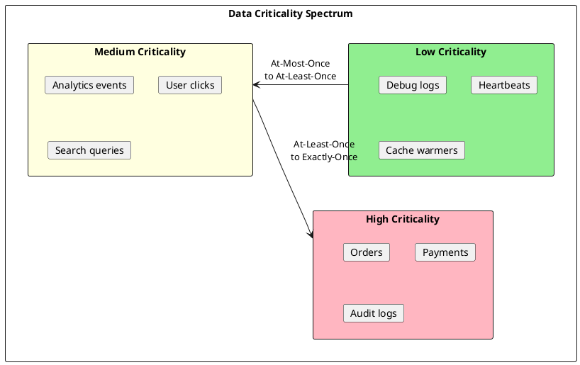

---

## Cost-Benefit Analysis

### Performance Cost

| Semantic | Latency Overhead | Throughput Impact | Resource Usage |
|----------|:----------------:|:-----------------:|:--------------:|
| At-most-once | Baseline | 100% | Low |
| At-least-once | +5-10ms | 90-95% | Medium |
| Exactly-once | +15-50ms | 50-70% | High |

### Implementation Cost

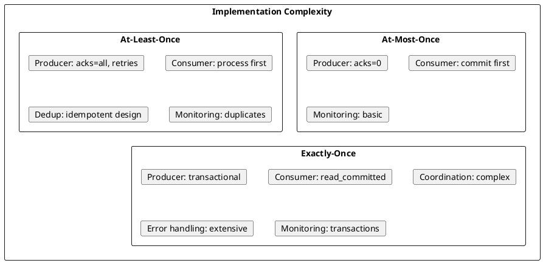

| Aspect | At-Most-Once | At-Least-Once | Exactly-Once |
|--------|:------------:|:-------------:|:------------:|
| **Code complexity** | Simple | Moderate | Complex |
| **Testing effort** | Low | Medium | High |
| **Debugging difficulty** | Easy | Moderate | Challenging |
| **Operational overhead** | Low | Medium | High |

### Total Cost of Ownership

| Semantic | Development | Operations | Infrastructure |
|----------|:-----------:|:----------:|:--------------:|
| At-most-once | Low | Low | Low |
| At-least-once | Medium | Medium | Medium |
| Exactly-once | High | High | High |

---

## Migration Strategies

### Upgrading Semantics

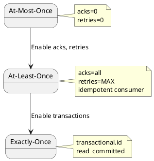

### At-Most-Once → At-Least-Once

**Producer changes:**
```properties
# Before
acks=0
retries=0

# After
acks=all
retries=2147483647
enable.idempotence=true
```

**Consumer changes:**
```java
// Before: commit first
consumer.poll(timeout);
consumer.commitSync();
for (record : records) process(record);

// After: process first
consumer.poll(timeout);
for (record : records) process(record);
consumer.commitSync();
```

**Additional requirements:**
- Implement idempotent consumer logic
- Add message ID tracking or natural idempotence

### At-Least-Once → Exactly-Once

**Producer changes:**
```properties
# Before
acks=all
enable.idempotence=true

# After
acks=all
enable.idempotence=true
transactional.id=my-app-instance-1
```

**Consumer changes:**
```properties
# Before
enable.auto.commit=false

# After
enable.auto.commit=false
isolation.level=read_committed
```

**Code changes:**
```java
// Before
for (record : records) {
    process(record);
    producer.send(output);
}
consumer.commitSync();

// After
producer.initTransactions();

producer.beginTransaction();
for (record : records) {
    process(record);
    producer.send(output);
}
producer.sendOffsetsToTransaction(offsets, consumer.groupMetadata());
producer.commitTransaction();
```

---

## Hybrid Approaches

### Topic-Level Semantics

Different topics may require different semantics within the same application.

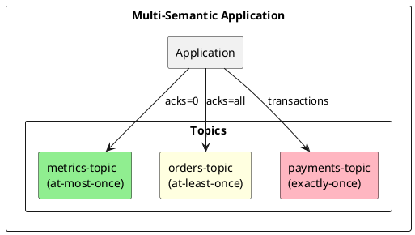

```java
// Multiple producers with different configurations
Producer<String, String> metricsProducer = createProducer(acks=0);
Producer<String, String> ordersProducer = createProducer(acks=all);
Producer<String, String> paymentsProducer = createTransactionalProducer();

// Route by data type
switch (eventType) {
    case METRIC:
        metricsProducer.send(record);  // Fire and forget
        break;
    case ORDER:
        ordersProducer.send(record, callback);  // With retry
        break;
    case PAYMENT:
        paymentsProducer.beginTransaction();
        paymentsProducer.send(record);
        paymentsProducer.commitTransaction();
        break;
}
```

### Tiered Processing

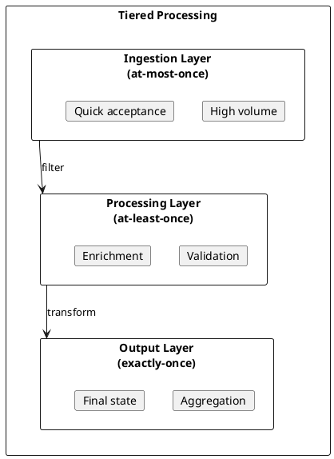

---

## Anti-Patterns

### Over-Engineering

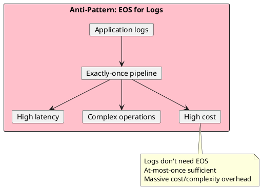

### Under-Engineering

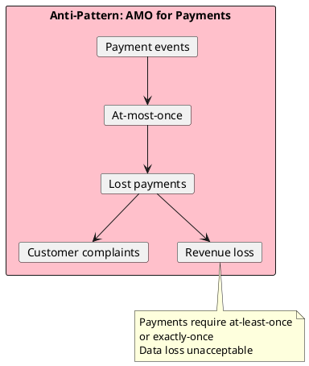

### Inconsistent Semantics

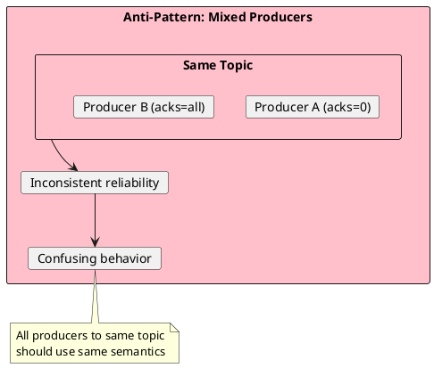

---

## Decision Checklist

### Before Choosing

- [ ] What is the business impact of losing a message?
- [ ] What is the business impact of processing duplicates?
- [ ] What is the acceptable latency?
- [ ] What is the required throughput?
- [ ] Does the consumer have natural idempotence?
- [ ] Are external systems involved?
- [ ] What is the team's operational capability?

### Semantic Selection

| If... | Then use... |
|-------|-------------|
| Loss acceptable, throughput critical | At-most-once |
| Loss unacceptable, can handle duplicates | At-least-once |
| Loss and duplicates unacceptable, Kafka-only | Exactly-once |
| Loss and duplicates unacceptable, external systems | At-least-once + idempotent sink |

### Post-Selection Validation

- [ ] Performance tested under expected load
- [ ] Failure scenarios tested
- [ ] Monitoring in place for semantic violations
- [ ] Runbooks for common issues
- [ ] Team trained on operational procedures

---

## Summary Table

| Semantic | Best For | Avoid For |
|----------|----------|-----------|
| **At-most-once** | Telemetry, logs, real-time updates | Transactions, orders, critical events |
| **At-least-once** | Most business events, general purpose | When duplicates cause financial impact |
| **Exactly-once** | Aggregations, billing, financial calculations | Logs, metrics, non-critical data |

---

## Related Documentation

- [At-Most-Once](at-most-once.md) - Fire and forget patterns
- [At-Least-Once](at-least-once.md) - Retry with idempotent consumers
- [Exactly-Once](exactly-once.md) - Transactional processing
- [Delivery Semantics Overview](index.md) - Semantic definitions
