# Exactly-Once Semantics

Exactly-once semantics (EOS) guarantee that messages are processed exactly once, even in the presence of failures. Kafka achieves this through idempotent producers, transactions, and transactional consumers.

---

## Semantic Definition

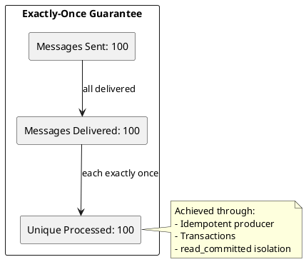

| Property | Guarantee |
|----------|-----------|
| **Delivery count** | Exactly 1 |
| **Message loss** | Never |
| **Duplicates** | Never (within Kafka) |
| **Atomicity** | Yes (transactions) |

---

## EOS Components

### Architecture Overview

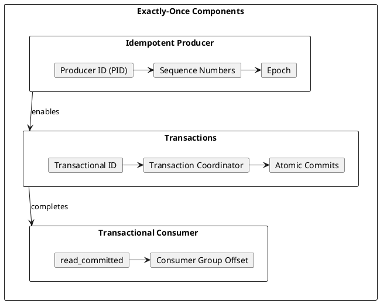

### Component Responsibilities

| Component | Responsibility |
|-----------|----------------|
| **Idempotent Producer** | Prevent duplicate writes from retries |
| **Transaction Coordinator** | Manage transaction state |
| **Transactional Consumer** | Read only committed data |
| **Consumer Group Coordinator** | Atomic offset commits |

---

## Idempotent Producer

### How It Works

The idempotent producer assigns each producer instance a unique Producer ID (PID) and tracks sequence numbers per partition.

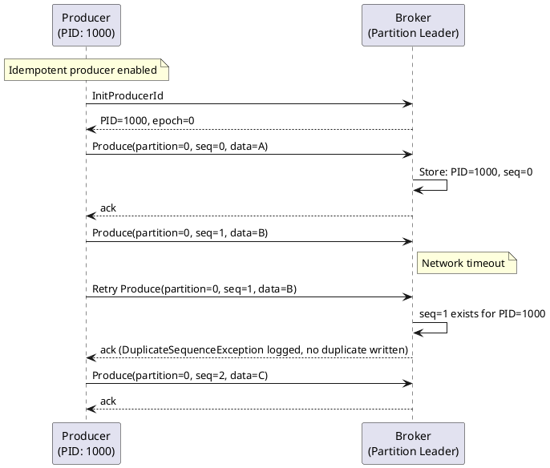

### Sequence Number Tracking

| State | Action |
|-------|--------|
| `seq == expected` | Accept record, increment expected |
| `seq < expected` | Duplicate; reject with DuplicateSequenceException |
| `seq > expected` | Out of order; reject with OutOfOrderSequenceException |

### Configuration

```properties
# Enable idempotent producer
enable.idempotence=true

# Automatically enforced:
# acks=all
# retries=Integer.MAX_VALUE
# max.in.flight.requests.per.connection <= 5
```

### Java Example

```java
Properties props = new Properties();
props.put(ProducerConfig.BOOTSTRAP_SERVERS_CONFIG, "kafka:9092");
props.put(ProducerConfig.ENABLE_IDEMPOTENCE_CONFIG, true);
props.put(ProducerConfig.KEY_SERIALIZER_CLASS_CONFIG, StringSerializer.class);
props.put(ProducerConfig.VALUE_SERIALIZER_CLASS_CONFIG, StringSerializer.class);

Producer<String, String> producer = new KafkaProducer<>(props);

// Retries are deduplicated automatically
for (int i = 0; i < 1000; i++) {
    producer.send(new ProducerRecord<>("events", "key-" + i, "value-" + i));
}

producer.flush();
producer.close();
```

### Idempotent Producer Scope

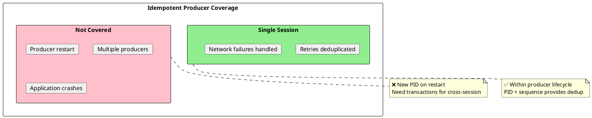

---

## Transactions

### Transaction Lifecycle

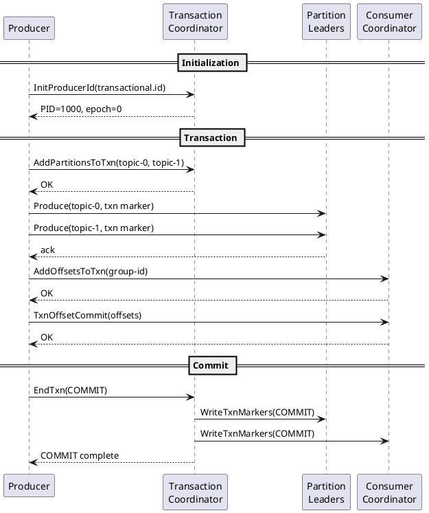

### Transaction States

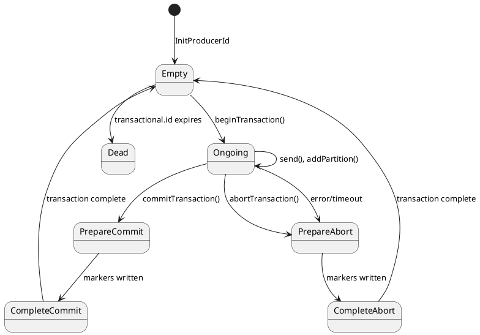

### Configuration

```properties
# Producer configuration
transactional.id=my-app-instance-1
enable.idempotence=true             # Required for transactions

# Consumer configuration
isolation.level=read_committed       # Only see committed transactions
enable.auto.commit=false            # Manual offset management
```

### Java Transaction Example

```java
Properties props = new Properties();
props.put(ProducerConfig.BOOTSTRAP_SERVERS_CONFIG, "kafka:9092");
props.put(ProducerConfig.TRANSACTIONAL_ID_CONFIG, "order-processor-1");
props.put(ProducerConfig.ENABLE_IDEMPOTENCE_CONFIG, true);
props.put(ProducerConfig.KEY_SERIALIZER_CLASS_CONFIG, StringSerializer.class);
props.put(ProducerConfig.VALUE_SERIALIZER_CLASS_CONFIG, StringSerializer.class);

KafkaProducer<String, String> producer = new KafkaProducer<>(props);

// Initialize transactions (call once on startup)
producer.initTransactions();

try {
    producer.beginTransaction();

    // Send to multiple partitions atomically
    producer.send(new ProducerRecord<>("orders", "order-1", "data-1"));
    producer.send(new ProducerRecord<>("audit", "order-1", "audit-1"));
    producer.send(new ProducerRecord<>("notifications", "user-1", "notify-1"));

    // All writes commit together
    producer.commitTransaction();
} catch (ProducerFencedException | OutOfOrderSequenceException e) {
    // Fatal errors - cannot recover
    producer.close();
    throw e;
} catch (KafkaException e) {
    // Abort and retry
    producer.abortTransaction();
}
```

---

## Read-Process-Write Pattern

### Canonical EOS Pattern

The read-process-write pattern consumes from input topics, processes, and produces to output topics atomically.

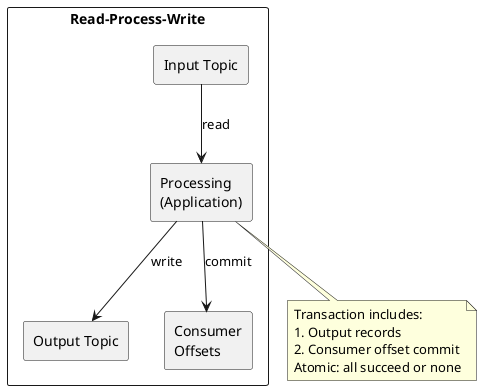

### Implementation

```java
// Configure producer for transactions
Properties producerProps = new Properties();
producerProps.put(ProducerConfig.BOOTSTRAP_SERVERS_CONFIG, "kafka:9092");
producerProps.put(ProducerConfig.TRANSACTIONAL_ID_CONFIG, "stream-processor-1");
producerProps.put(ProducerConfig.ENABLE_IDEMPOTENCE_CONFIG, true);

// Configure consumer for read_committed
Properties consumerProps = new Properties();
consumerProps.put(ConsumerConfig.BOOTSTRAP_SERVERS_CONFIG, "kafka:9092");
consumerProps.put(ConsumerConfig.GROUP_ID_CONFIG, "stream-processors");
consumerProps.put(ConsumerConfig.ISOLATION_LEVEL_CONFIG, "read_committed");
consumerProps.put(ConsumerConfig.ENABLE_AUTO_COMMIT_CONFIG, false);

KafkaProducer<String, String> producer = new KafkaProducer<>(producerProps);
KafkaConsumer<String, String> consumer = new KafkaConsumer<>(consumerProps);

producer.initTransactions();
consumer.subscribe(Collections.singletonList("input-topic"));

while (running) {
    ConsumerRecords<String, String> records = consumer.poll(Duration.ofMillis(100));

    if (records.isEmpty()) continue;

    producer.beginTransaction();
    try {
        // Process and produce
        for (ConsumerRecord<String, String> record : records) {
            String output = process(record.value());
            producer.send(new ProducerRecord<>("output-topic", record.key(), output));
        }

        // Commit offsets as part of transaction
        Map<TopicPartition, OffsetAndMetadata> offsets = new HashMap<>();
        for (TopicPartition partition : records.partitions()) {
            List<ConsumerRecord<String, String>> partitionRecords = records.records(partition);
            long lastOffset = partitionRecords.get(partitionRecords.size() - 1).offset();
            offsets.put(partition, new OffsetAndMetadata(lastOffset + 1));
        }

        producer.sendOffsetsToTransaction(offsets, consumer.groupMetadata());
        producer.commitTransaction();

    } catch (ProducerFencedException | OutOfOrderSequenceException e) {
        // Fatal - close and restart
        throw e;
    } catch (KafkaException e) {
        // Recoverable - abort and retry
        producer.abortTransaction();
        // Consumer will re-read uncommitted records
    }
}
```

### Failure Scenarios

```plantuml
@startuml

skinparam backgroundColor transparent

rectangle "Failure Handling" {

    rectangle "Success" as success #lightgreen {
        card "1. Read records" as s1
        card "2. Process" as s2
        card "3. Produce output" as s3
        card "4. Commit offsets" as s4
        card "5. Commit transaction" as s5
        s1 --> s2 --> s3 --> s4 --> s5
    }

    rectangle "Failure → Abort" as failure #lightyellow {
        card "1. Read records" as f1
        card "2. Process" as f2
        card "3. Produce output" as f3
        card "4. Error occurs" as f4
        card "5. Abort transaction" as f5
        card "6. Re-read records" as f6
        f1 --> f2 --> f3 --> f4 --> f5 --> f6
    }

    rectangle "Zombie Fencing" as zombie #lightpink {
        card "Old producer continues" as z1
        card "New producer starts" as z2
        card "Old producer fenced" as z3
        z1 --> z2 --> z3
    }
}

@enduml
```

---

## Transactional Consumer

### Isolation Levels

| Isolation Level | Behavior |
|-----------------|----------|
| `read_uncommitted` | See all records including aborted transactions |
| `read_committed` | See only committed records; aborted filtered |

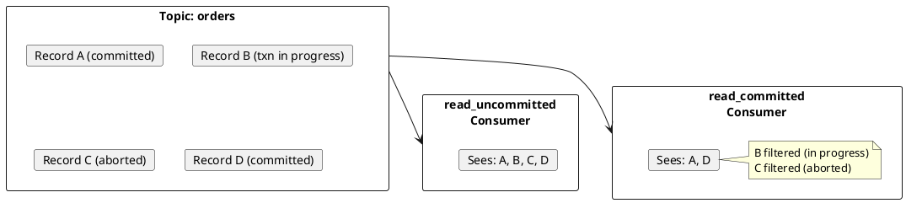

### Consumer Configuration

```properties
# Transactional consumer
isolation.level=read_committed
enable.auto.commit=false
auto.offset.reset=earliest
```

### Last Stable Offset (LSO)

The LSO is the offset up to which all transactions are complete.

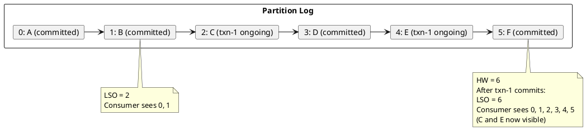

---

## Kafka Streams EOS

### Processing Guarantee Configuration

```java
Properties props = new Properties();
props.put(StreamsConfig.BOOTSTRAP_SERVERS_CONFIG, "kafka:9092");
props.put(StreamsConfig.APPLICATION_ID_CONFIG, "order-processor");

// Enable exactly-once v2 (Kafka 2.5+)
props.put(StreamsConfig.PROCESSING_GUARANTEE_CONFIG,
    StreamsConfig.EXACTLY_ONCE_V2);

KafkaStreams streams = new KafkaStreams(topology, props);
streams.start();
```

### EOS Versions

| Version | Kafka Version | Description |
|---------|---------------|-------------|
| `exactly_once` | 0.11.0+ | Original EOS; one producer per task |
| `exactly_once_v2` | 2.5.0+ | Optimized; one producer per thread |

### Streams EOS Internals

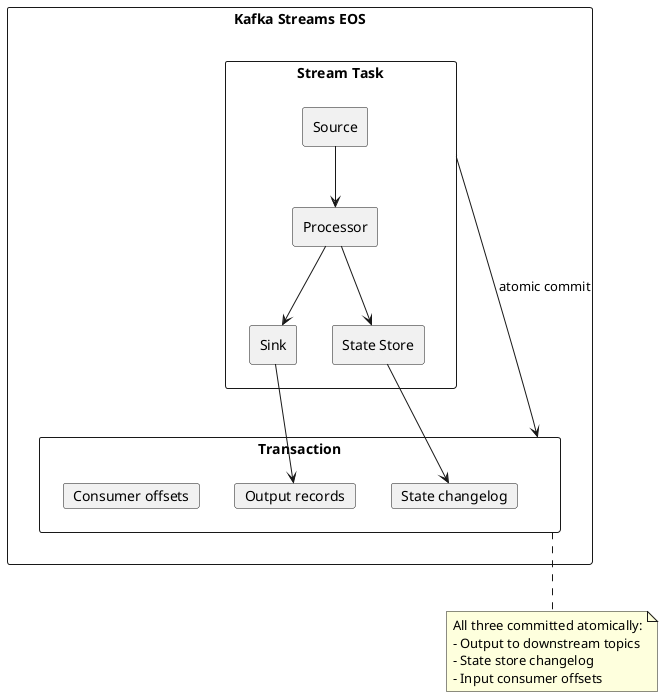

---

## Performance Considerations

### Latency Impact

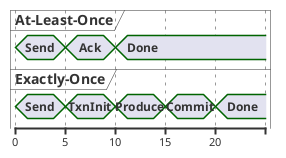

| Metric | At-Least-Once | Exactly-Once | Overhead |
|--------|:-------------:|:------------:|:--------:|
| **Latency (p50)** | ~5ms | ~20ms | +15ms |
| **Latency (p99)** | ~20ms | ~100ms | +80ms |
| **Throughput** | High | Moderate | -30-50% |

### Throughput Optimization

```properties
# Batch transactions for better throughput
# Process multiple records per transaction
max.poll.records=1000

# Longer commit intervals
transaction.timeout.ms=60000

# Increase producer batch size
batch.size=65536
linger.ms=10
```

### When EOS Overhead is Acceptable

| Scenario | Recommendation |
|----------|----------------|
| Financial calculations | Use EOS; correctness critical |
| Billing/metering | Use EOS; duplicates costly |
| Stream aggregations | Use EOS; state must be consistent |
| High-throughput logging | Use at-least-once; EOS overhead too high |

---

## Zombie Fencing

### Producer Fencing

When a producer crashes and restarts (or a new instance starts with the same transactional.id), the old producer is "fenced."

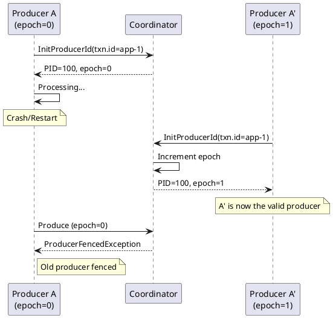

### Handling ProducerFencedException

```java
try {
    producer.commitTransaction();
} catch (ProducerFencedException e) {
    // Another instance with same transactional.id is active
    // This instance must shut down
    log.error("Producer fenced - another instance is active", e);
    producer.close();
    System.exit(1);
}
```

---

## EOS Scope and Limitations

### What EOS Covers

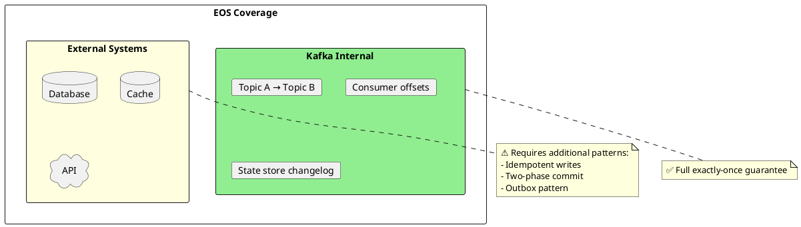

### External System Integration

| Pattern | Description | Use Case |
|---------|-------------|----------|
| **Idempotent sink** | Sink handles duplicates | Database with unique constraints |
| **Outbox pattern** | Write to Kafka via outbox table | Database + Kafka consistency |
| **Saga pattern** | Compensating transactions | Distributed workflow |

### Idempotent Database Sink

```java
// Use idempotency key for external writes
producer.beginTransaction();
try {
    for (ConsumerRecord<String, String> record : records) {
        // Database write with idempotency
        String idempotencyKey = record.topic() + "-" +
            record.partition() + "-" + record.offset();

        database.upsert(
            "INSERT INTO events (idempotency_key, data) VALUES (?, ?) " +
            "ON CONFLICT (idempotency_key) DO NOTHING",
            idempotencyKey, record.value()
        );
    }

    producer.sendOffsetsToTransaction(offsets, consumer.groupMetadata());
    producer.commitTransaction();
} catch (Exception e) {
    producer.abortTransaction();
}
```

---

## Version Requirements

| Feature | Minimum Kafka Version |
|---------|:---------------------:|
| Idempotent producer | 0.11.0 |
| Transactions | 0.11.0 |
| Exactly-once (original) | 0.11.0 |
| Exactly-once v2 | 2.5.0 |
| Kafka Connect EOS | 3.3.0 |

---

## Configuration Reference

### Producer

| Configuration | Required | Default | Description |
|---------------|:--------:|:-------:|-------------|
| `enable.idempotence` | Yes | false | Enable idempotent producer |
| `transactional.id` | For txn | - | Unique transaction identifier |
| `transaction.timeout.ms` | No | 60000 | Transaction timeout |
| `max.in.flight.requests.per.connection` | No | 5 | Must be ≤ 5 for idempotence |

### Consumer

| Configuration | Required | Default | Description |
|---------------|:--------:|:-------:|-------------|
| `isolation.level` | Yes | read_uncommitted | Set to read_committed for EOS |
| `enable.auto.commit` | Yes | true | Set to false for EOS |

### Broker

| Configuration | Default | Description |
|---------------|:-------:|-------------|
| `transaction.state.log.replication.factor` | 3 | Transaction log replication |
| `transaction.state.log.min.isr` | 2 | Minimum ISR for transaction log |
| `transactional.id.expiration.ms` | 604800000 | Transaction ID expiration |

---

## Related Documentation

- [Delivery Semantics Overview](index.md) - Semantic comparison
- [At-Most-Once](at-most-once.md) - Fire and forget patterns
- [At-Least-Once](at-least-once.md) - Retry with idempotent consumers
- [Choosing Semantics](choosing-semantics.md) - Decision guide
- [Transactions](../../producers/index.md) - Transaction API details
