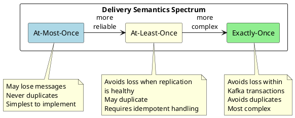
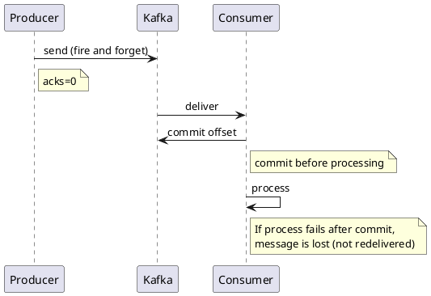
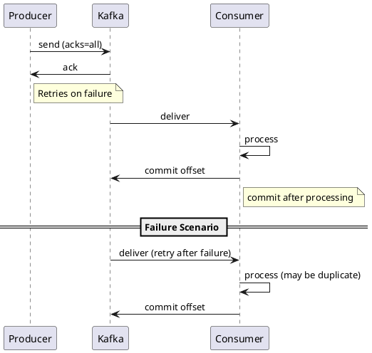
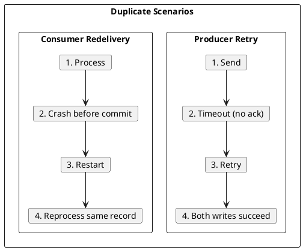
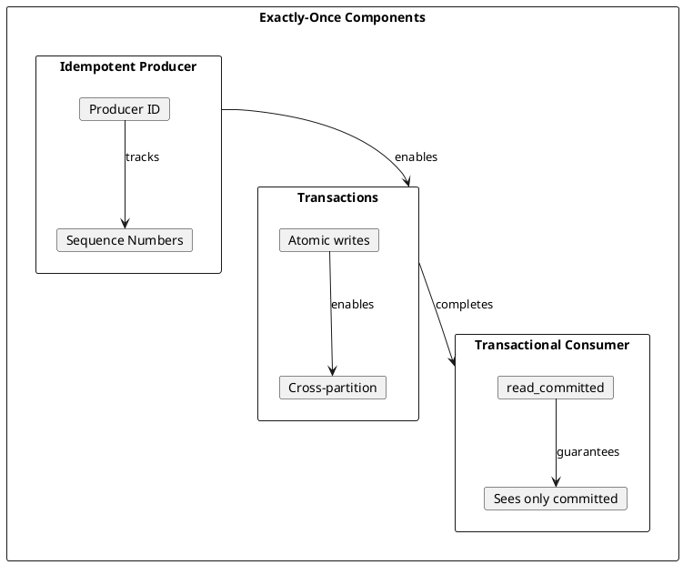
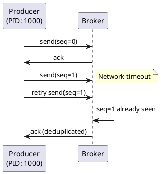
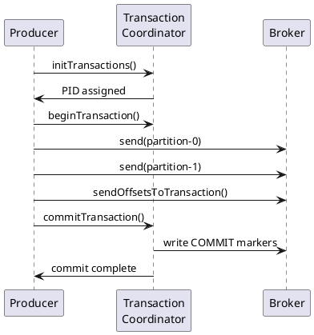
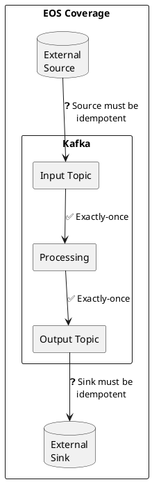
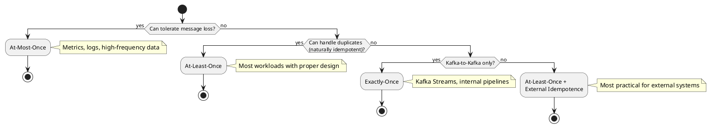
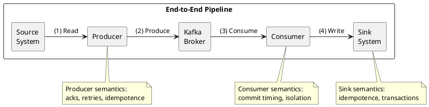

# Delivery Semantics

Message delivery semantics define the guarantees a system provides about how many times a message will be delivered and processed.

---

## Overview

Distributed systems face fundamental challenges in message delivery due to network failures, process crashes, and the impossibility of distinguishing between a slow system and a failed one. Delivery semantics describe the guarantees a system can provide despite these challenges.



| Semantic | Message Loss | Duplicates | Complexity |
|----------|:------------:|:----------:|:----------:|
| **At-most-once** | Possible | Never | Low |
| **At-least-once** | Avoided when replication is healthy | Possible | Medium |
| **Exactly-once** | Avoided within Kafka transactions | Avoided within Kafka transactions | High |

The choice of delivery semantics depends on the use case, with tradeoffs between reliability, complexity, and performance.

---

## At-Most-Once

In at-most-once delivery, messages may be lost but are never duplicated. The producer sends and does not wait for acknowledgment, or acknowledges before processing.



### Producer Configuration

```properties
# At-most-once producer settings
acks=0                    # Don't wait for broker acknowledgment
retries=0                 # Don't retry failed sends
```

### Consumer Pattern

```java
// At-most-once: commit before processing
while (true) {
    ConsumerRecords<String, String> records = consumer.poll(Duration.ofMillis(100));
    consumer.commitSync();  // Commit first
    for (ConsumerRecord<String, String> record : records) {
        process(record);    // Then process (may fail after commit)
    }
}
```

### When to Use At-Most-Once

| Use Case | Why Acceptable |
|----------|----------------|
| **Metrics/telemetry** | Individual data points are expendable; aggregate matters |
| **Log streaming** | Missing log entries usually acceptable |
| **Real-time gaming updates** | Stale data worse than missing data |
| **High-frequency sensor data** | Next reading arrives shortly |

### Failure Scenarios

| Failure Point | Outcome |
|---------------|---------|
| Producer crash before send | Message lost |
| Network failure during send | Message may be lost |
| Consumer crash after commit, before process | Message lost |

→ [At-Most-Once Details](at-most-once.md)

---

## At-Least-Once

In at-least-once delivery, messages are never lost but may be delivered multiple times. The system retries until successful acknowledgment.



### Producer Configuration

```properties
# At-least-once producer settings
acks=all                  # Wait for all replicas
retries=2147483647        # Retry indefinitely
max.in.flight.requests.per.connection=5  # Default, allows reordering
delivery.timeout.ms=120000  # Total time to deliver
```

### Consumer Pattern

```java
// At-least-once: process before commit
while (true) {
    ConsumerRecords<String, String> records = consumer.poll(Duration.ofMillis(100));
    for (ConsumerRecord<String, String> record : records) {
        process(record);    // Process first
    }
    consumer.commitSync();  // Then commit (if crash before commit, redelivered)
}
```

### The Duplicate Problem

At-least-once delivery can produce duplicates in several scenarios:



### Handling Duplicates: Idempotent Consumers

Consumers must be designed to handle duplicates safely:

| Strategy | Implementation |
|----------|----------------|
| **Natural idempotence** | Operations that produce same result regardless of repetition (e.g., SET vs INCREMENT) |
| **Deduplication table** | Track processed message IDs, skip if seen |
| **Upsert semantics** | Use database upsert; duplicate writes same data |
| **Idempotency keys** | Include unique key in message; external system deduplicates |

```java
// Idempotent consumer with deduplication
Set<String> processedIds = getProcessedIds();  // Load from persistent store

for (ConsumerRecord<String, String> record : records) {
    String messageId = record.headers().lastHeader("message-id").value();
    if (processedIds.contains(messageId)) {
        continue;  // Skip duplicate
    }
    process(record);
    markProcessed(messageId);  // Persist to deduplication store
}
```

### When to Use At-Least-Once

| Use Case | Why |
|----------|-----|
| **Financial transactions** | Cannot lose data; duplicates handled by business logic |
| **Order processing** | Cannot lose orders; idempotency keys prevent double processing |
| **Event sourcing** | Events must not be lost; event IDs enable deduplication |
| **Most production workloads** | Default choice when data must not be lost |

→ [At-Least-Once Details](at-least-once.md)

---

## Exactly-Once Semantics (EOS)

Exactly-once semantics ensure Kafka transactional read-process-write pipelines process committed records exactly once. Kafka achieves this through idempotent producers, transactions, and transactional consumers.



### How Kafka EOS Works

#### 1. Idempotent Producers (KIP-98)

Idempotent producers ensure that retries do not create duplicates within a single producer session.



| Component | Purpose |
|-----------|---------|
| **Producer ID (PID)** | Unique identifier assigned by broker |
| **Sequence number** | Per-partition sequence; broker detects duplicates |
| **Epoch** | Fences zombie producers after failures |

Configuration:
```properties
enable.idempotence=true   # Enable idempotent producer (default in Kafka 3.0+)
```

#### 2. Transactions

Transactions enable atomic writes to multiple partitions and coordination between produce and consume operations.



Configuration:
```properties
# Producer
transactional.id=my-app-instance-1  # Unique ID for transaction coordination
enable.idempotence=true              # Required for transactions

# Consumer
isolation.level=read_committed       # Only see committed transactions
```

#### 3. Read-Process-Write Pattern

The canonical exactly-once pattern: consume from input topic, process, produce to output topic, all atomically.

```java
producer.initTransactions();

while (true) {
    ConsumerRecords<String, String> records = consumer.poll(Duration.ofMillis(100));

    producer.beginTransaction();
    try {
        for (ConsumerRecord<String, String> record : records) {
            ProducerRecord<String, String> output = process(record);
            producer.send(output);
        }

        // Commit consumer offsets as part of transaction
        producer.sendOffsetsToTransaction(
            getOffsetsToCommit(records),
            consumer.groupMetadata()
        );

        producer.commitTransaction();
    } catch (Exception e) {
        producer.abortTransaction();
    }
}
```

### EOS Scope and Limitations

| Scope | EOS Guarantee |
|-------|---------------|
| **Kafka to Kafka** | Full exactly-once within Kafka |
| **External source → Kafka** | Depends on source idempotence |
| **Kafka → External sink** | Requires sink idempotence or 2PC |



### EOS Performance Considerations

| Aspect | Impact |
|--------|--------|
| **Latency** | Transaction commit adds latency (~10-50ms typical, workload-dependent) |
| **Throughput** | Lower than at-least-once due to coordination (workload-dependent) |
| **Complexity** | More failure modes to handle |
| **Resource usage** | Transaction coordinator memory and CPU |

### When to Use Exactly-Once

| Use Case | Why |
|----------|-----|
| **Stream processing pipelines** | Kafka Streams with EOS for stateful processing |
| **Financial calculations** | Cannot tolerate duplicates in aggregations |
| **Billing/metering** | Must count each event exactly once |
| **Event sourcing with projections** | Projections must be consistent with events |

→ [Exactly-Once Details](exactly-once.md)

---

## Choosing Delivery Semantics



### Decision Matrix

| Requirement | Recommended Semantic | Notes |
|-------------|---------------------|-------|
| High throughput, loss acceptable | At-most-once | Telemetry, metrics |
| Data must not be lost | At-least-once | Default for most workloads |
| Duplicates unacceptable, Kafka-only | Exactly-once | Kafka Streams, internal processing |
| Duplicates unacceptable, external systems | At-least-once + idempotent sink | More practical than distributed 2PC |

### Semantic Guarantees by Component

| Component | Default | EOS Support |
|-----------|---------|-------------|
| **Producer** | At-least-once | Idempotent producer (enable.idempotence=true) |
| **Consumer** | At-least-once | read_committed isolation |
| **Kafka Streams** | At-least-once | processing.guarantee=exactly_once_v2 |
| **Kafka Connect** | At-least-once | Connector-dependent |

---

## End-to-End Delivery

Understanding end-to-end delivery requires considering the entire pipeline:



End-to-end exactly-once requires:

1. Source must not produce duplicates (or producer must deduplicate)
2. Producer must be idempotent (or transactional)
3. Consumer must use read_committed (or handle uncommitted reads)
4. Sink must be idempotent (or support transactions)

The weakest link determines the overall guarantee.

---

## Related Documentation

- [At-Most-Once](at-most-once.md) - Fire and forget patterns
- [At-Least-Once](at-least-once.md) - Retry with idempotent consumers
- [Exactly-Once](exactly-once.md) - Transactions and EOS deep-dive
- [Choosing Semantics](choosing-semantics.md) - Decision guide
- [Producer Guide](../../application-development/producers/index.md) - Producer configuration
- [Consumer Guide](../../application-development/consumers/index.md) - Consumer patterns
