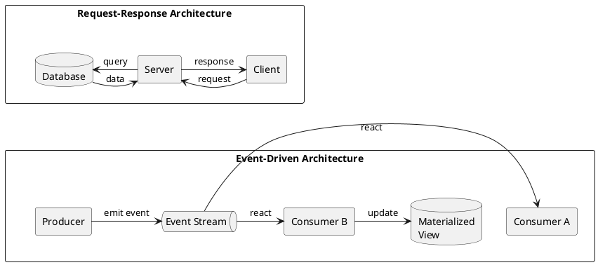
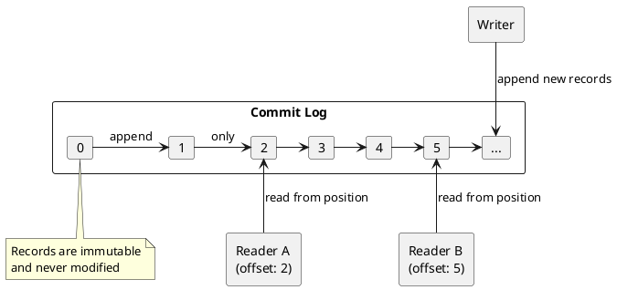
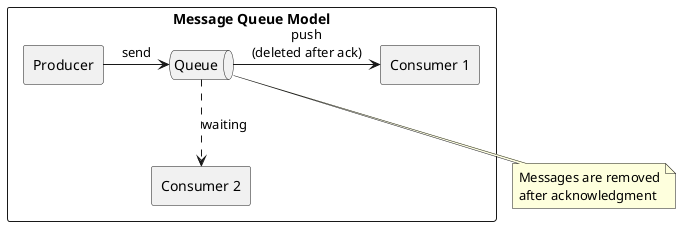
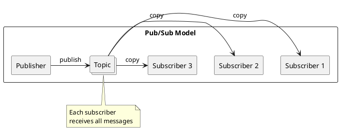
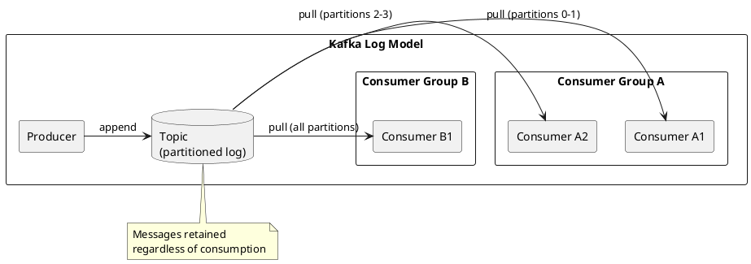
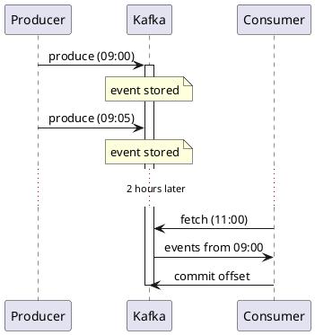
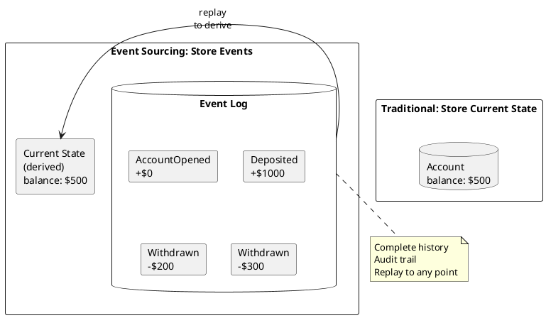
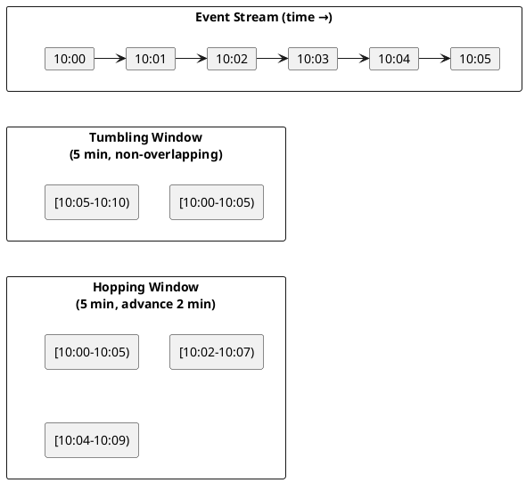

# What is Event Streaming?

Event streaming is a data architecture paradigm where data is captured, stored, and processed as continuous streams of events.

---

## The Event-Driven Paradigm

Traditional application architectures are request-driven: a client sends a request, the server processes it, and returns a response. Data is stored in databases and queried on demand.

Event-driven architectures invert this model: systems emit events as things happen, and other systems react to those events. Events are stored in order and can be replayed, enabling new capabilities that request-response architectures cannot provide.

### Events vs Commands

| Concept | Definition | Example |
|---------|------------|---------|
| **Event** | Immutable fact that something occurred | "OrderPlaced", "PaymentReceived", "UserLoggedIn" |
| **Command** | Request for something to happen | "PlaceOrder", "ProcessPayment", "SendEmail" |

Events are named in past tense because they represent facts that have already happened. Commands are named in imperative form because they request future action.

Key distinction: Events describe what happened. Commands can be accepted or rejected based on business rules; if a command is rejected, no event is emitted (or a rejection event is emitted).

---

## The Commit Log Model

At its core, Kafka is a distributed commit log: an ordered, append-only sequence of records. This simple data structure provides powerful guarantees.

### Commit Log Properties

| Property | Description |
|----------|-------------|
| **Append-only** | New records are only added to the end; existing records are never modified |
| **Immutable** | Once written, records cannot be changed |
| **Ordered** | Records have a strict sequence (offset) |
| **Durable** | Records are persisted to disk and replicated when configured |
| **Replayable** | Readers can start from any retained position and replay forward |

### Why Append-Only?

The append-only constraint enables:

1. **Sequential I/O**: Writing to the end of a file is orders of magnitude faster than random writes
2. **Easy replication**: Followers simply append whatever the leader appends
3. **Consumer independence**: Readers track their own position without modifying the log
4. **Point-in-time recovery**: Start from any offset to replay history

---

## Comparing Messaging Models

### Traditional Message Queues

Traditional message queues (RabbitMQ, ActiveMQ, IBM MQ) implement a push-based model where the broker actively delivers messages to consumers.

**Queue characteristics:**

| Aspect | Behavior |
|--------|----------|
| Delivery | Push-based—broker sends to consumers |
| Lifetime | Message deleted after successful delivery |
| Consumers | Competing—each message goes to one consumer |
| Ordering | Usually FIFO across entire queue |
| Replay | Not possible—messages are deleted |

### Publish-Subscribe

Traditional pub/sub systems deliver messages to all subscribers of a topic.

**Pub/sub characteristics:**

| Aspect | Behavior |
|--------|----------|
| Delivery | Push-based or pull-based depending on implementation |
| Lifetime | Often transient—no retention |
| Consumers | Independent—all subscribers receive everything |
| Ordering | Often not guaranteed |
| Replay | Limited or not supported |

### Kafka's Log Model

Kafka combines the best of both models through consumer groups.

**Kafka characteristics:**

| Aspect | Behavior |
|--------|----------|
| Delivery | Pull-based—consumers fetch at their own pace |
| Lifetime | Retained based on time or size policy |
| Consumers | Consumer groups enable both queue and pub/sub semantics |
| Ordering | Guaranteed per partition; per-producer order preserved |
| Replay | Full replay from any retained offset |

---

## Pull vs Push Delivery

Kafka uses a pull-based model where consumers request data from brokers, rather than brokers pushing data to consumers.

### Advantages of Pull

| Advantage | Explanation |
|-----------|-------------|
| **Consumer-controlled rate** | Consumers fetch only what they can process, preventing overload |
| **Batching efficiency** | Consumers can batch requests for efficient network utilization |
| **Simple broker** | Broker does not track consumer state or manage delivery retries |
| **Replay support** | Consumers control their position and can re-read data |

### Push Model Drawbacks

In push-based systems:

- Broker must track each consumer's state
- Slow consumers can back up the entire system
- Broker must implement complex flow control
- Replay requires special infrastructure

---

## Event Streaming Benefits

### Temporal Decoupling

Producers and consumers do not need to be online simultaneously. A consumer can process events hours or days after they were produced.

### Replayability

Events can be replayed to:

- Rebuild materialized views
- Fix bugs in processing logic and reprocess
- Bootstrap new consumers with historical data
- Perform what-if analysis on historical events

### Multiple Consumer Patterns

The same topic can serve different use cases simultaneously:

| Consumer Group | Use Case | Processing Pattern |
|----------------|----------|-------------------|
| `analytics` | Real-time dashboards | Streaming aggregation |
| `search-indexer` | Search updates | Index on every event |
| `data-warehouse` | Batch analytics | Periodic bulk loads |
| `audit-log` | Compliance | Long-term archival |

### Loose Coupling

Producers and consumers are decoupled:

- Producers do not know who consumes their events
- Consumers do not know who produces events
- New consumers can be added without producer changes
- Processing logic can be changed without affecting producers

---

## Event Sourcing with Kafka

Event sourcing stores the sequence of events that led to current state, rather than just the current state itself.

### Event Sourcing Benefits

| Benefit | Description |
|---------|-------------|
| **Complete audit trail** | Every state change is recorded |
| **Temporal queries** | "What was the state at time T?" |
| **Debugging** | Replay events to understand what happened |
| **Flexibility** | Derive new views from historical events |

Kafka's log retention and compaction features make it suitable as an event store for event-sourced systems.

---

## Stream Processing Concepts

Event streaming enables stream processing: continuous computation over unbounded data.

### Bounded vs Unbounded Data

| Data Type | Characteristics | Processing |
|-----------|-----------------|------------|
| **Bounded** | Fixed size, complete | Batch processing |
| **Unbounded** | Infinite, never complete | Stream processing |

Traditional batch processing operates on bounded datasets. Stream processing operates on unbounded streams, processing events as they arrive.

### Windowing

Since streams are unbounded, aggregations require windows—bounded subsets of the stream.

| Window Type | Description | Use Case |
|-------------|-------------|----------|
| **Tumbling** | Fixed size, non-overlapping | Hourly aggregations |
| **Hopping** | Fixed size, overlapping | Moving averages |
| **Sliding** | Fixed size, event-triggered | Continuous monitoring |
| **Session** | Activity-based, variable size | User session analytics |

---

## Related Documentation

- [Event Streaming Fundamentals](index.md) - Core concepts overview
- [Kafka Ecosystem](kafka-ecosystem.md) - Kafka platform components
- [Architecture Patterns](architecture-patterns/index.md) - Event sourcing, CQRS, CDC
- [Delivery Semantics](delivery-semantics/index.md) - Message delivery guarantees
