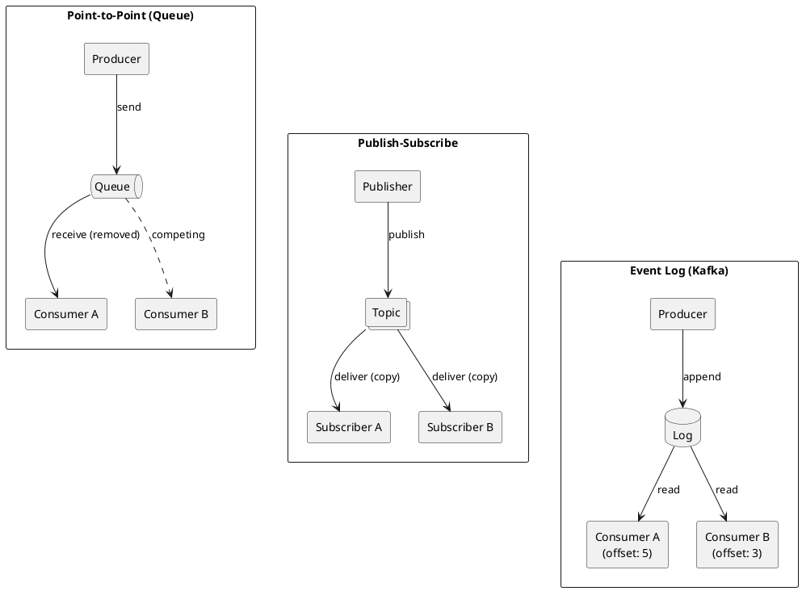
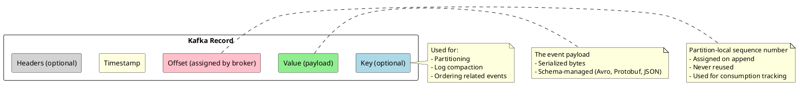
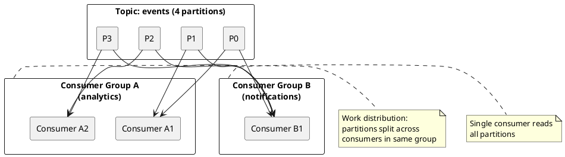

# Event Streaming Fundamentals

Core concepts underlying Apache Kafka and modern event-driven architectures.

---

Event streaming is a paradigm for capturing, storing, and processing continuous flows of data as they occur. Unlike traditional request-response architectures where applications query databases on demand, event streaming systems treat data as a continuous stream of immutable events that applications can observe, process, and react to in real time.

Apache Kafka implements event streaming through a distributed commit log—an append-only data structure that provides durable, ordered storage of events with high throughput and low latency.

---

## Messaging Paradigms

Three fundamental paradigms exist for asynchronous communication between systems: point-to-point messaging, publish-subscribe, and event logs. Understanding these paradigms clarifies where Kafka fits and why it was designed the way it was.

### Point-to-Point Messaging (Queues)

In point-to-point messaging, producers send messages to a queue, and exactly one consumer receives each message. Once a consumer acknowledges a message, it is removed from the queue.

| Characteristic | Behavior |
|----------------|----------|
| **Message consumption** | Each message delivered to exactly one consumer |
| **Message lifetime** | Removed after acknowledgment |
| **Consumer coordination** | Competing consumers—load balanced across instances |
| **Replay capability** | Not supported—messages are deleted |

Point-to-point queues excel at work distribution: tasks that must be processed exactly once by one worker. Traditional message brokers like RabbitMQ, IBM MQ, and ActiveMQ implement this pattern.

### Publish-Subscribe

In publish-subscribe systems, publishers send messages to topics, and all subscribers to that topic receive a copy of each message. Messages are typically delivered in real time and may or may not be retained.

| Characteristic | Behavior |
|----------------|----------|
| **Message consumption** | Each message delivered to all subscribers |
| **Message lifetime** | Varies—often transient or short-lived |
| **Consumer coordination** | Independent—each subscriber receives everything |
| **Replay capability** | Limited or not supported |

Pub/sub systems enable broadcasting: notifications, updates, and events that multiple systems need to observe. Traditional implementations include JMS topics and cloud pub/sub services.

### Event Log (Kafka's Model)

Kafka implements a distributed commit log: an ordered, append-only sequence of records that is retained for a configurable period. Consumers read from the log at their own pace, tracking their position (offset) independently.

| Characteristic | Behavior |
|----------------|----------|
| **Message consumption** | Consumers read from the log independently |
| **Message lifetime** | Retained based on time or size policy |
| **Consumer coordination** | Consumer groups enable both broadcast and work distribution |
| **Replay capability** | Full replay from any retained offset |

The log model provides unique capabilities:

- **Decoupling in time**: Consumers can process events long after they were produced
- **Multiple consumer patterns**: Same data serves real-time processing, batch analytics, and audit
- **Replay and reprocessing**: Consumers can reset to earlier offsets to reprocess historical data
- **Ordering guarantees**: Events within a partition maintain strict ordering

---

## Events, Messages, and Records

Kafka uses specific terminology that reflects its log-based architecture.

| Term | Definition |
|------|------------|
| **Event** | A fact that occurred at a point in time—immutable and timestamped |
| **Record** | Kafka's unit of data: key, value, timestamp, headers, offset |
| **Message** | Often used interchangeably with record |
| **Topic** | A named category or feed of records |
| **Partition** | An ordered, immutable sequence of records within a topic |
| **Offset** | A unique sequential identifier for each record within a partition |

### Record Structure

Every Kafka record contains:

| Field | Required | Purpose |
|-------|----------|---------|
| **Key** | No | Determines partition assignment; used for compaction |
| **Value** | Yes | The event payload |
| **Timestamp** | Yes | Event time or ingestion time |
| **Headers** | No | Metadata key-value pairs |
| **Offset** | Assigned | Sequential position within partition |

---

## Topics and Partitions

Kafka organizes data into **topics**—named feeds that producers write to and consumers read from. Each topic is divided into **partitions**, enabling horizontal scalability and parallel processing. **Replication** across brokers provides fault tolerance.

| Concept | Purpose |
|---------|---------|
| **Topic** | Named category for related records |
| **Partition** | Ordered, append-only log segment enabling parallelism |
| **Replication** | Copies across brokers for fault tolerance |
| **Offset** | Sequential position of a record within a partition |

Key guarantees:

- Records within a partition maintain strict ordering
- Records with the same key are routed to the same partition
- Partition count determines maximum consumer parallelism

For comprehensive coverage of topic architecture, partitioning strategies, replication, and configuration, see [Topics](topics/index.md).

---

## Consumer Groups

Consumer groups enable Kafka to support both broadcast (pub/sub) and work distribution (queue) patterns with a single mechanism.

### Consumer Group Semantics

| Pattern | Configuration | Behavior |
|---------|---------------|----------|
| **Work distribution** | Multiple consumers in same group | Each partition assigned to exactly one consumer |
| **Broadcast** | Different consumer groups | Each group receives all messages independently |
| **Competing consumers** | More consumers than partitions | Extra consumers remain idle (standby) |

### Offset Management

Each consumer group tracks its position in each partition independently:

| Offset Type | Definition |
|-------------|------------|
| **Current offset** | Next record to be fetched by consumer |
| **Committed offset** | Last successfully processed record (persisted to `__consumer_offsets` topic) |
| **Log end offset** | Latest record in the partition |
| **Consumer lag** | Difference between log end offset and committed offset |

Consumer lag is a critical operational metric—growing lag indicates consumers cannot keep up with production rate.

---

## Event Time vs Processing Time

Kafka distinguishes between when an event occurred and when it is processed.

| Time Concept | Definition | Use Case |
|--------------|------------|----------|
| **Event time** | When the event actually occurred (embedded in record) | Analytics, time-windowed aggregations |
| **Ingestion time** | When the broker received the record | Simpler processing when event time unavailable |
| **Processing time** | When the consumer processes the record | Triggering actions, real-time alerting |

Event time is essential for accurate analytics—processing delays, consumer restarts, or replays should not affect time-based calculations.

### Timestamp Configuration

| Setting | Behavior |
|---------|----------|
| `CreateTime` (default) | Timestamp set by producer (event time or producer clock) |
| `LogAppendTime` | Timestamp set by broker on receipt |

---

## Event Streaming vs Traditional Messaging

| Aspect | Traditional Message Queue | Kafka Event Streaming |
|--------|--------------------------|----------------------|
| **Message lifetime** | Deleted after consumption | Retained based on policy |
| **Replay** | Not supported | Supported via offset reset |
| **Consumer coupling** | Consumers must be online | Consumers can catch up later |
| **Multiple consumers** | Requires separate queues | Single topic, multiple groups |
| **Message ordering** | Queue-wide (often) | Partition-scoped |
| **Throughput** | Thousands/second typical | Millions/second achievable |
| **Primary use case** | Task distribution | Event streaming, data integration |

---

## When to Use Event Streaming

Event streaming with Kafka is well-suited for:

| Use Case | Why Kafka |
|----------|-----------|
| **Real-time data pipelines** | High throughput, exactly-once delivery, connector ecosystem |
| **Event-driven microservices** | Decoupling, replay capability, event sourcing support |
| **Event persistence** | Log compaction, exactly-once semantics, Cassandra Sink |
| **Stream processing** | Kafka Streams for stateful processing |
| **Data integration** | Kafka Connect with 200+ connectors |
| **Audit logging** | Immutable log, long retention, compliance |

Event streaming may not be the best fit for:

| Scenario | Why Not |
|----------|---------|
| **Simple request-response** | HTTP/REST is simpler |
| **Small scale, low throughput** | Kafka adds operational overhead |
| **Strict message ordering across all data** | Ordering is partition-scoped |
| **Complex routing logic** | Traditional message brokers may be more flexible |

---

## Related Documentation

- [Topics](topics/index.md) - Topic architecture, partitions, replication, and configuration
- [Event Streaming](event-streaming.md) - Deeper exploration of event streaming concepts
- [Kafka Ecosystem](kafka-ecosystem.md) - Components that make up the Kafka platform
- [Kafka Connect](kafka-connect/index.md) - Integration framework and connector ecosystem
- [Delivery Semantics](delivery-semantics/index.md) - At-most-once, at-least-once, exactly-once
- [Architecture Patterns](architecture-patterns/index.md) - Event sourcing, CQRS, CDC, sagas
