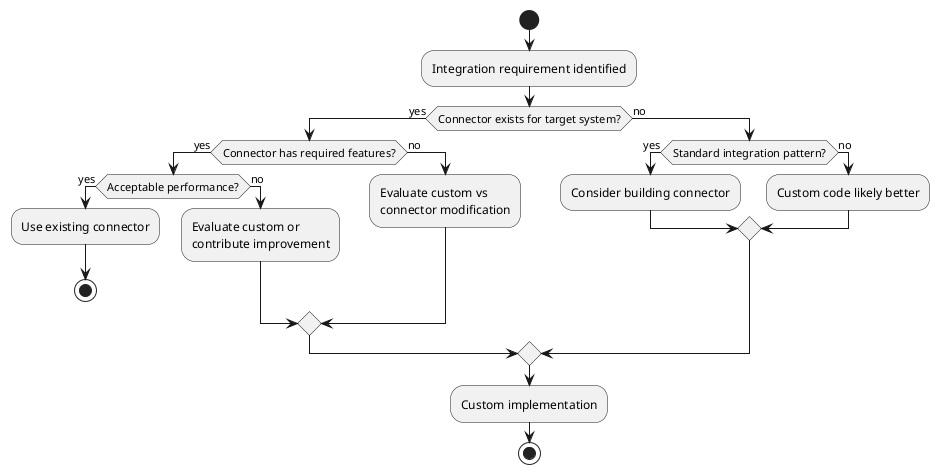
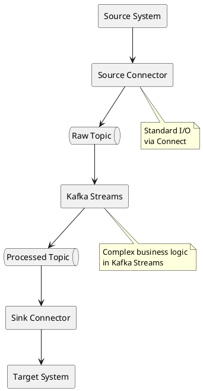
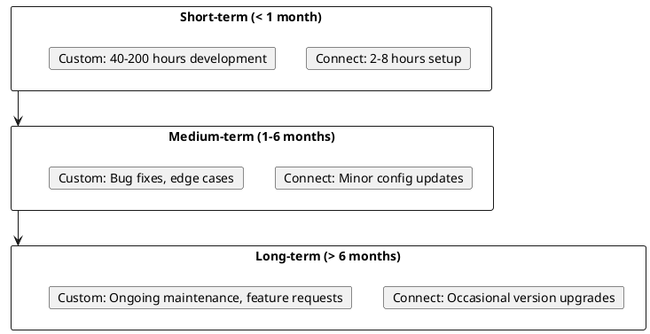

# Build vs Buy Decision Framework

Guidance for choosing between Kafka Connect connectors and custom integration code.

---

## Decision Overview



---

## Kafka Connect Advantages

### Operational Benefits

| Benefit | Description |
|---------|-------------|
| **Standardized deployment** | Same process for all integrations |
| **Built-in fault tolerance** | Automatic task redistribution |
| **Offset management** | Framework handles position tracking |
| **Monitoring** | Standard JMX metrics |
| **Configuration** | REST API, no code deployment |
| **Scaling** | Add workers, increase tasks |

### Feature Benefits

| Benefit | Description |
|---------|-------------|
| **Schema Registry integration** | Automatic serialization |
| **Single Message Transforms** | Lightweight transformations |
| **Dead letter queues** | Standardized error handling |
| **Exactly-once** | Supported for compatible connectors |
| **Converters** | Multiple serialization formats |

### Cost Benefits

| Aspect | Connect | Custom |
|--------|---------|--------|
| **Initial development** | Configuration only | Full implementation |
| **Maintenance** | Connector updates | Full ownership |
| **Testing** | Connector tested by community | Full test suite needed |
| **Documentation** | Provided by maintainer | Must create |

---

## When to Use Kafka Connect

### Strong Indicators

| Scenario | Rationale |
|----------|-----------|
| **Standard sink (S3, Cassandra, Elasticsearch)** | Mature, tested connectors exist |
| **CDC from databases** | Debezium connectors are excellent |
| **Cloud service integration** | Vendor-maintained connectors |
| **Operational simplicity required** | Same management for all integrations |
| **Team lacks Kafka expertise** | Connect abstracts complexity |

### Example: S3 Integration

**Using Connect (Recommended):**
```json
{
  "name": "s3-sink",
  "config": {
    "connector.class": "io.confluent.connect.s3.S3SinkConnector",
    "topics": "events",
    "s3.bucket.name": "data-lake",
    "format.class": "io.confluent.connect.s3.format.parquet.ParquetFormat",
    "flush.size": "10000"
  }
}
```

**Custom Implementation Required:**
- S3 client setup
- Batch management
- File rotation logic
- Offset tracking
- Error handling
- Retry logic
- Exactly-once semantics
- Parquet serialization
- Partitioning logic
- Monitoring metrics

The connector encapsulates thousands of lines of production-tested code.

---

## When to Build Custom

### Strong Indicators

| Scenario | Rationale |
|----------|-----------|
| **Complex business logic** | Kafka Streams better suited |
| **Sub-millisecond latency** | Direct producer has less overhead |
| **No suitable connector** | Novel or proprietary system |
| **Connector missing critical feature** | Custom may be faster than contribution |
| **Deep system integration** | Application-specific behavior |

### Example: Complex Event Processing

**Custom Code Better:**
```java
// Business logic interleaved with Kafka operations
streams.stream("orders")
    .filter(order -> validateOrder(order))
    .mapValues(order -> enrichWithInventory(order))
    .filter(order -> checkFraudRules(order))
    .mapValues(order -> calculatePricing(order))
    .to("validated-orders");
```

This logic doesn't fit the Connect model of simple record transformation.

### Example: Proprietary Protocol

**Custom Code Required:**
```java
// No connector exists for legacy system
LegacyClient client = new LegacyClient(config);
Producer<String, byte[]> producer = new KafkaProducer<>(props);

while (true) {
    LegacyMessage msg = client.receive();
    ProducerRecord<String, byte[]> record =
        new ProducerRecord<>("legacy-events", msg.toBytes());
    producer.send(record);
}
```

---

## Hybrid Approaches

### Connect + Kafka Streams

Use Connect for I/O, Streams for processing.



### Connect with Custom SMT

Write custom Single Message Transform for specialized logic.

```java
public class CustomTransform implements Transformation<SinkRecord> {
    @Override
    public SinkRecord apply(SinkRecord record) {
        // Custom transformation logic
        return record.newRecord(
            record.topic(),
            record.kafkaPartition(),
            record.keySchema(),
            record.key(),
            transformedSchema,
            transformedValue,
            record.timestamp()
        );
    }
}
```

**Configuration:**
```json
{
  "transforms": "custom",
  "transforms.custom.type": "com.example.CustomTransform"
}
```

---

## Decision Matrix

| Factor | Connect | Custom | Hybrid |
|--------|:-------:|:------:|:------:|
| Simple source/sink | ✅ | ❌ | ⚠️ |
| Complex processing | ❌ | ✅ | ✅ |
| Sub-ms latency | ❌ | ✅ | ❌ |
| Operational simplicity | ✅ | ❌ | ⚠️ |
| Schema management | ✅ | ⚠️ | ✅ |
| Exactly-once | ✅ | ⚠️ | ✅ |
| Novel integration | ❌ | ✅ | ⚠️ |
| Team expertise needed | Low | High | Medium |

Legend: ✅ Recommended | ⚠️ Possible | ❌ Not Recommended

---

## Total Cost of Ownership

### Connect Approach

| Phase | Effort |
|-------|--------|
| **Initial setup** | Hours to days |
| **Configuration** | JSON/REST |
| **Testing** | Connector validation |
| **Maintenance** | Connector upgrades |
| **Monitoring** | Standard metrics |
| **Scaling** | Configuration change |

### Custom Approach

| Phase | Effort |
|-------|--------|
| **Initial development** | Weeks to months |
| **Implementation** | Full code base |
| **Testing** | Unit, integration, load |
| **Maintenance** | Bug fixes, feature additions |
| **Monitoring** | Custom instrumentation |
| **Scaling** | Code changes possibly needed |

### Break-Even Analysis



---

## Connector Evaluation Checklist

When evaluating whether a connector meets requirements:

| Criteria | Questions |
|----------|-----------|
| **Functionality** | Does it support required features? |
| **Performance** | Can it handle expected throughput? |
| **Reliability** | What's the production track record? |
| **Maintainer** | Is it actively maintained? |
| **License** | Compatible with deployment model? |
| **Support** | What support options exist? |
| **Documentation** | Is configuration well-documented? |
| **Community** | Are issues addressed promptly? |

---

## Migration Paths

### Custom to Connect

1. Deploy connector alongside custom code
2. Validate connector output matches custom
3. Gradually shift traffic to connector
4. Decommission custom code

### Connect to Custom

1. Implement custom code with same behavior
2. Deploy alongside connector
3. Validate output equivalence
4. Switch over
5. Remove connector

---

## Related Documentation

- [Kafka Connect Concepts](index.md) - Connect overview
- [Connector Ecosystem](connector-ecosystem.md) - Available connectors
- [Cloud Storage](cloud-storage.md) - Data lake patterns
- [Kafka Connect Guide](../../kafka-connect/index.md) - Implementation reference
