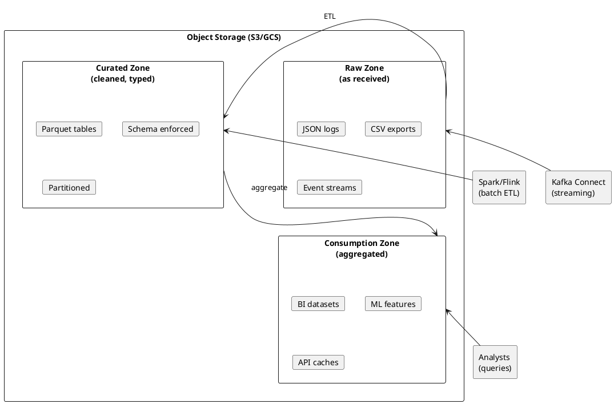
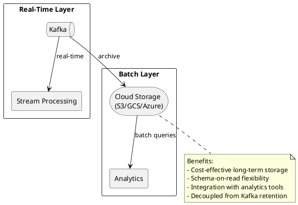
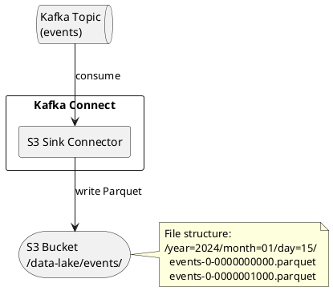
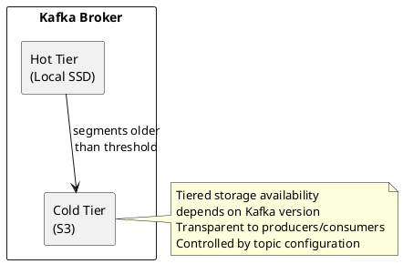
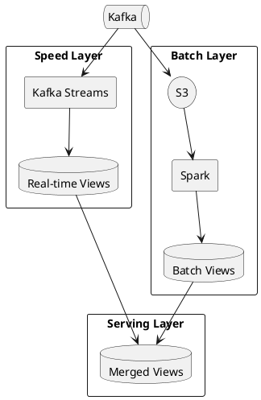

# Cloud Storage Integration

Streaming Kafka data to cloud storage enables data lake architectures, long-term retention, and analytics workloads.

---

## The Rise of Object Storage

Object storage services—Amazon S3, Google Cloud Storage, Azure Blob Storage—have become the foundation of modern analytics platforms. Understanding why requires context on how data architecture has evolved.

### Traditional vs Modern Data Architecture

| Era | Storage | Compute | Characteristics |
|-----|---------|---------|-----------------|
| **Traditional (pre-2010)** | SAN/NAS attached to servers | Tied to storage | Expensive, limited scale, vendor lock-in |
| **Hadoop era (2010s)** | HDFS distributed across nodes | Co-located with data | Better scale, but compute/storage coupled |
| **Cloud-native (2020s)** | Object storage (S3, GCS) | Separate query engines | Independent scaling, pay-per-use, open formats |

### Why Object Storage Won

Object storage became the analytics standard because it solved fundamental problems:

| Problem | Object Storage Solution |
|---------|------------------------|
| **Cost** | Typically lower cost than block storage; pay only for what's stored |
| **Scale** | Effectively unlimited capacity; no cluster sizing decisions |
| **Durability** | Provider-specific targets (for example S3/GCS advertise 11 nines); automatic replication across zones |
| **Decoupled compute** | Query with any engine (Spark, Presto, Athena, Snowflake) without moving data |
| **Open formats** | Parquet, Avro, ORC readable by any tool; no vendor lock-in |
| **Separation of concerns** | Storage team manages buckets; analytics teams query independently |

### The Data Lake Pattern

A data lake is a central repository storing raw data in its native format until needed for analysis:



Kafka's role is feeding real-time data into this architecture—streaming events directly to the raw zone as they occur.

---

## Why Stream Kafka to Cloud Storage?



### Use Cases

| Use Case | Description |
|----------|-------------|
| **Data Lake** | Central repository for analytics |
| **Long-term Retention** | Store data beyond Kafka retention |
| **Compliance** | Audit trails and regulatory archives |
| **Batch Processing** | Input for Spark, Flink, Presto |
| **Disaster Recovery** | Cross-region data backup |

---

## Architecture Patterns

### Pattern 1: Direct Sink

Stream directly from Kafka to cloud storage.



**Configuration:**
```json
{
  "name": "s3-events-sink",
  "config": {
    "connector.class": "io.confluent.connect.s3.S3SinkConnector",
    "tasks.max": "6",
    "topics": "events",
    "s3.bucket.name": "data-lake",
    "s3.region": "us-east-1",
    "format.class": "io.confluent.connect.s3.format.parquet.ParquetFormat",
    "partitioner.class": "io.confluent.connect.storage.partitioner.TimeBasedPartitioner",
    "path.format": "'year'=YYYY/'month'=MM/'day'=dd/'hour'=HH",
    "flush.size": "10000"
  }
}
```

### Pattern 2: Tiered Storage

Kafka's tiered storage offloads segments to cloud storage.



**Configuration:**
```properties
# Broker configuration
remote.log.storage.system.enable=true
remote.log.manager.task.interval.ms=30000
remote.log.reader.threads=10
remote.log.reader.max.pending.tasks=100

# Topic configuration
remote.storage.enable=true
local.retention.ms=86400000
retention.ms=2592000000
```

### Pattern 3: Lambda Architecture

Combine real-time and batch layers.



---

## Output Formats

### Parquet

Columnar format optimized for analytics queries.

| Characteristic | Value |
|----------------|-------|
| **Compression** | High (column encoding) |
| **Query performance** | Excellent (column pruning) |
| **Schema support** | Embedded schema |
| **Best for** | Analytics, data warehousing |

**Configuration:**
```json
{
  "format.class": "io.confluent.connect.s3.format.parquet.ParquetFormat",
  "parquet.codec": "snappy"
}
```

### Avro

Row-based binary format with schema.

| Characteristic | Value |
|----------------|-------|
| **Compression** | Good |
| **Query performance** | Good (row-based) |
| **Schema support** | Embedded + Registry |
| **Best for** | ETL, schema evolution |

**Configuration:**
```json
{
  "format.class": "io.confluent.connect.s3.format.avro.AvroFormat",
  "avro.codec": "snappy"
}
```

### JSON

Human-readable format.

| Characteristic | Value |
|----------------|-------|
| **Compression** | Low (text) |
| **Query performance** | Poor (parse overhead) |
| **Schema support** | None embedded |
| **Best for** | Debugging, simple integrations |

**Configuration:**
```json
{
  "format.class": "io.confluent.connect.s3.format.json.JsonFormat"
}
```

### Format Comparison

| Aspect | Parquet | Avro | JSON |
|--------|:-------:|:----:|:----:|
| File size | Small | Medium | Large |
| Write speed | Medium | Fast | Fast |
| Read speed (analytics) | Fast | Medium | Slow |
| Schema evolution | Limited | Excellent | None |
| Human readable | No | No | Yes |

---

## Partitioning Strategies

### Time-Based Partitioning

Organize data by time for efficient querying.

```
s3://bucket/topics/events/
├── year=2024/
│   ├── month=01/
│   │   ├── day=15/
│   │   │   ├── hour=00/
│   │   │   │   ├── events+0+0000000000.parquet
│   │   │   │   └── events+0+0000010000.parquet
│   │   │   └── hour=01/
│   │   │       └── events+0+0000020000.parquet
```

**Configuration:**
```json
{
  "partitioner.class": "io.confluent.connect.storage.partitioner.TimeBasedPartitioner",
  "path.format": "'year'=YYYY/'month'=MM/'day'=dd/'hour'=HH",
  "partition.duration.ms": "3600000",
  "locale": "en-US",
  "timezone": "UTC"
}
```

### Field-Based Partitioning

Partition by record field values.

```
s3://bucket/topics/events/
├── region=us-east/
│   ├── type=click/
│   │   └── events+0+0000000000.parquet
│   └── type=view/
│       └── events+0+0000005000.parquet
├── region=eu-west/
│   └── type=click/
│       └── events+0+0000002000.parquet
```

**Configuration:**
```json
{
  "partitioner.class": "io.confluent.connect.storage.partitioner.FieldPartitioner",
  "partition.field.name": "region,type"
}
```

### Hybrid Partitioning

Combine time and field partitioning.

```
s3://bucket/topics/events/
├── region=us-east/
│   └── year=2024/month=01/day=15/
│       └── events+0+0000000000.parquet
├── region=eu-west/
│   └── year=2024/month=01/day=15/
│       └── events+0+0000001000.parquet
```

---

## File Rotation

### Size-Based Rotation

```json
{
  "flush.size": "10000"
}
```

Create new file every 10,000 records.

### Time-Based Rotation

```json
{
  "rotate.schedule.interval.ms": "3600000"
}
```

Create new file every hour.

### Recommendations

Example starting points; tune based on throughput and query patterns.

| Workload | Flush Size | Rotation Interval |
|----------|:----------:|:-----------------:|
| High volume (>10k msg/s) | 50,000-100,000 | 10-30 minutes |
| Medium volume (1k-10k msg/s) | 10,000-50,000 | 30-60 minutes |
| Low volume (<1k msg/s) | 1,000-10,000 | 1-4 hours |

Avoid many small files (>1000 files/partition/day)—impacts query performance.

---

## Analytics Integration

### AWS Athena

Query S3 data directly with SQL.

```sql
CREATE EXTERNAL TABLE events (
  event_id STRING,
  event_type STRING,
  timestamp BIGINT,
  user_id STRING,
  payload STRING
)
PARTITIONED BY (year STRING, month STRING, day STRING, hour STRING)
STORED AS PARQUET
LOCATION 's3://data-lake/topics/events/';

-- Load partitions
MSCK REPAIR TABLE events;

-- Query
SELECT event_type, COUNT(*)
FROM events
WHERE year = '2024' AND month = '01' AND day = '15'
GROUP BY event_type;
```

### AWS Glue

Automatically discover schema and partitions.

```json
{
  "Name": "events-crawler",
  "Role": "arn:aws:iam::123456789:role/GlueRole",
  "Targets": {
    "S3Targets": [
      {"Path": "s3://data-lake/topics/events/"}
    ]
  },
  "SchemaChangePolicy": {
    "UpdateBehavior": "UPDATE_IN_DATABASE"
  }
}
```

### Apache Spark

```python
# Read from S3
events = spark.read.parquet("s3://data-lake/topics/events/")

# Query with partition pruning
recent_events = events.filter(
    (events.year == "2024") &
    (events.month == "01") &
    (events.day == "15")
)

# Aggregate
recent_events.groupBy("event_type").count().show()
```

---

## Cost Optimization

### Storage Classes

| Class | Use Case | Cost |
|-------|----------|------|
| **S3 Standard** | Frequently accessed data | Highest |
| **S3 Intelligent-Tiering** | Unknown access patterns | Variable |
| **S3 Standard-IA** | Infrequently accessed | Lower |
| **S3 Glacier** | Archive (>90 days) | Lowest |

### Lifecycle Policy

```json
{
  "Rules": [
    {
      "ID": "ArchiveOldData",
      "Status": "Enabled",
      "Filter": {"Prefix": "topics/"},
      "Transitions": [
        {"Days": 30, "StorageClass": "STANDARD_IA"},
        {"Days": 90, "StorageClass": "GLACIER"},
        {"Days": 365, "StorageClass": "DEEP_ARCHIVE"}
      ],
      "Expiration": {"Days": 2555}
    }
  ]
}
```

### Cost Factors

| Factor | Impact | Optimization |
|--------|--------|--------------|
| **Storage** | Per GB/month | Compression, lifecycle policies |
| **Requests** | Per PUT/GET | Larger files, fewer rotations |
| **Data transfer** | Per GB out | Same-region processing |
| **Query scans** | Per TB scanned | Partitioning, columnar format |

---

## Related Documentation

- [Kafka Connect Concepts](index.md) - Connect overview
- [Connector Ecosystem](connector-ecosystem.md) - Available connectors
- [S3 Sink Connector](../../kafka-connect/connectors/s3.md) - Configuration guide
- [Build vs Buy](build-vs-buy.md) - Decision framework
