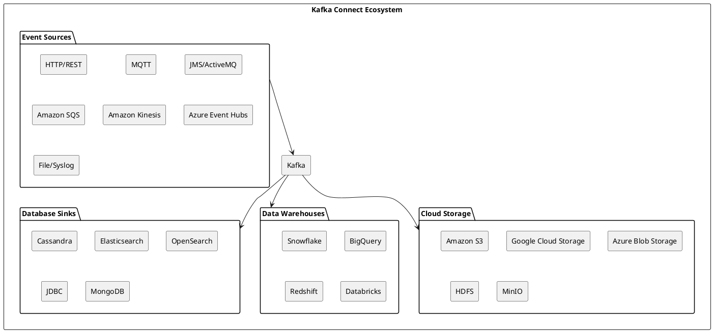

# Connector Ecosystem

The Kafka Connect ecosystem includes hundreds of connectors for integrating Kafka with external systems. Understanding this ecosystem—who builds connectors, where to find them, and how to evaluate them—is essential for making integration decisions.

---

## What is a Connector?

A connector is a plugin that enables Kafka Connect to read from or write to an external system. Connectors handle the system-specific logic while the Connect framework manages common concerns like offset tracking, fault tolerance, and scaling.

| Connector Type | Direction | Examples |
|----------------|-----------|----------|
| **Source Connector** | External system → Kafka | Database CDC, API polling, message queue bridge |
| **Sink Connector** | Kafka → External system | Data lake writes, search indexing, database inserts |

### Connector vs Custom Code

Writing integration code from scratch requires implementing:

- Connection management and authentication
- Data serialization and schema handling
- Offset tracking for at-least-once; exactly-once is connector/config dependent
- Error handling and retry logic
- Scaling across partitions
- Monitoring and metrics

A connector encapsulates this complexity. Using an existing connector can replace weeks of development with hours of configuration.

---

## How the Ecosystem Developed

The Kafka Connect ecosystem grew through multiple channels:

| Era | Development Pattern |
|-----|---------------------|
| **Early (2016-2018)** | Confluent built core connectors (JDBC, HDFS, S3, Elasticsearch) |
| **Vendor adoption (2018-2020)** | Database vendors (MongoDB, DataStax) built first-party connectors |
| **Community growth (2019+)** | Open source projects (Debezium) gained traction |
| **Cloud expansion (2020+)** | Cloud providers (AWS, Azure, GCP) contributed connectors |
| **Maturity (2022+)** | Ecosystem stabilized with 200+ production-grade connectors |

Today, connectors come from three main sources:

1. **Vendor-maintained**: Built by the system vendor (MongoDB, DataStax, Snowflake)
2. **Confluent-maintained**: Built by Confluent for common integrations
3. **Community-maintained**: Open source projects on GitHub

---

## Where to Find Connectors

### Confluent Hub

The primary marketplace for Kafka Connect connectors. Provides:

- Curated, tested connectors
- Version management
- Installation tooling
- Documentation links

**URL**: https://www.confluent.io/hub/

```bash
# Install from Confluent Hub
confluent-hub install confluentinc/kafka-connect-s3:latest
```

### GitHub

Many connectors are open source projects:

| Project | Focus | URL |
|---------|-------|-----|
| **Debezium** | Change Data Capture | github.com/debezium |
| **Lenses Stream Reactor** | Various sinks | github.com/lensesio/stream-reactor |
| **Aiven** | Open source connectors | github.com/aiven |

### Vendor Documentation

System vendors often maintain their own connectors:

| Vendor | Connector |
|--------|-----------|
| **DataStax** | Cassandra Sink Connector |
| **MongoDB** | MongoDB Kafka Connector |
| **Snowflake** | Snowflake Kafka Connector |
| **Elastic** | Elasticsearch Sink Connector |

---

## Understanding Licensing

Connector licensing affects how and where connectors can be used:

| License | What It Means | Examples |
|---------|---------------|----------|
| **Apache 2.0** | Free for any use, including commercial; can modify and redistribute | Debezium, most community connectors |
| **Confluent Community License** | Free for self-managed deployments; cannot offer as SaaS | Many Confluent connectors |
| **Confluent Enterprise License** | Requires Confluent Platform subscription | Advanced Confluent connectors |
| **Vendor Commercial** | Requires license from connector vendor | Some vendor connectors |

### License Implications

| Deployment Model | Apache 2.0 | Confluent Community | Commercial |
|------------------|:----------:|:-------------------:|:----------:|
| Self-managed (on-prem) | ✅ | ✅ | License required |
| Self-managed (cloud VMs) | ✅ | ✅ | License required |
| Managed Kafka service | ✅ | ❌ (usually) | Depends on vendor |
| Building a SaaS product | ✅ | ❌ | License required |

!!! warning "License Verification"
    Always verify the license of a connector before production deployment. Licenses can change between versions, and some connectors have different licenses for different features.

---

## Connector Categories



---

## Connector Sources

### Commercial Vendors

| Vendor | Focus | Licensing |
|--------|-------|-----------|
| **Confluent** | Comprehensive catalog | Community + Commercial |
| **Debezium** | CDC connectors | Apache 2.0 |
| **Lenses** | Stream processing | Commercial |
| **StreamSets** | Data integration | Apache 2.0 |

### Community

| Source | Description |
|--------|-------------|
| **Confluent Hub** | Curated connector marketplace |
| **GitHub** | Open source connectors |
| **Maven Central** | Java connector packages |

---

## Event Source Connectors

### HTTP/REST Source

Poll REST APIs and stream responses to Kafka.

| Connector | Maintainer | Features |
|-----------|------------|----------|
| Confluent HTTP Source | Confluent | Pagination, OAuth, rate limiting |
| kafka-connect-http | Community | Basic HTTP polling |

**Use Cases:**
- API data ingestion
- Webhook aggregation
- External service monitoring

### MQTT Source

Bridge MQTT messages to Kafka topics.

| Connector | Maintainer | Features |
|-----------|------------|----------|
| Confluent MQTT Source | Confluent | QoS support, topic mapping |
| kafka-connect-mqtt | Community | Basic MQTT bridge |

**Use Cases:**
- IoT device telemetry
- Sensor data ingestion
- Industrial automation

### JMS/Message Queue Sources

Connect enterprise messaging systems to Kafka.

| Connector | Source System | Features |
|-----------|---------------|----------|
| IBM MQ Source | IBM MQ | Transactional reads |
| ActiveMQ Source | ActiveMQ | JMS compliant |
| RabbitMQ Source | RabbitMQ | AMQP protocol |

**Use Cases:**
- Legacy system integration
- Message queue migration
- Hybrid messaging architectures

### Cloud Event Sources

| Connector | Source | Features |
|-----------|--------|----------|
| Amazon SQS Source | AWS SQS | FIFO support, visibility timeout |
| Amazon Kinesis Source | AWS Kinesis | Shard management |
| Azure Event Hubs Source | Azure | Partition handling |
| Google Pub/Sub Source | GCP | Subscription management |

---

## Cloud Storage Sinks

### Amazon S3

Stream Kafka data to S3 for data lake storage.

| Connector | Maintainer | Features |
|-----------|------------|----------|
| Confluent S3 Sink | Confluent | Parquet, Avro, time partitioning |
| kafka-connect-s3 | Community | Basic S3 writes |

**Capabilities:**
- Multiple output formats (Parquet, Avro, JSON)
- Time-based and field-based partitioning
- At-least-once; use idempotent sinks/dedup if required
- Automatic file rotation

### Google Cloud Storage

| Connector | Maintainer | Features |
|-----------|------------|----------|
| Confluent GCS Sink | Confluent | Format support, partitioning |

### Azure Blob Storage

| Connector | Maintainer | Features |
|-----------|------------|----------|
| Confluent Azure Blob Sink | Confluent | Container management |

### HDFS

| Connector | Maintainer | Features |
|-----------|------------|----------|
| Confluent HDFS Sink | Confluent | Kerberos, partitioning |

---

## Database Sinks

### Apache Cassandra

Persist Kafka events to Cassandra tables.

| Connector | Maintainer | Features |
|-----------|------------|----------|
| DataStax Kafka Connector | DataStax | Table mapping, TTL, batching |

**Capabilities:**
- Automatic schema mapping
- Configurable consistency levels
- TTL support
- Batch optimization

### Elasticsearch/OpenSearch

Index Kafka data for search and analytics.

| Connector | Target | Features |
|-----------|--------|----------|
| Confluent Elasticsearch Sink | Elasticsearch | Bulk API, index management |
| OpenSearch Sink | OpenSearch | Index lifecycle |

**Capabilities:**
- Automatic index creation
- Bulk indexing
- Time-based index naming
- Schema detection

### JDBC Sink

Write to any JDBC-compatible database.

| Connector | Maintainer | Features |
|-----------|------------|----------|
| Confluent JDBC Sink | Confluent | Auto-create tables, upsert |

**Supported Databases:**
- PostgreSQL
- MySQL
- Oracle
- SQL Server
- Any JDBC-compliant database

### MongoDB

| Connector | Maintainer | Features |
|-----------|------------|----------|
| MongoDB Kafka Connector | MongoDB | Change streams, sink/source |

---

## Data Warehouse Sinks

### Snowflake

| Connector | Maintainer | Features |
|-----------|------------|----------|
| Snowflake Kafka Connector | Snowflake | Snowpipe, staging |

### Google BigQuery

| Connector | Maintainer | Features |
|-----------|------------|----------|
| Confluent BigQuery Sink | Confluent | Streaming inserts |

### Amazon Redshift

| Connector | Maintainer | Features |
|-----------|------------|----------|
| Confluent Redshift Sink | Confluent | S3 staging, COPY |

### Databricks

| Connector | Maintainer | Features |
|-----------|------------|----------|
| Databricks Connector | Databricks | Delta Lake integration |

---

## Connector Selection Criteria

### Evaluation Factors

| Factor | Considerations |
|--------|----------------|
| **Maintainer** | Vendor support vs community maintenance |
| **License** | Open source vs commercial |
| **Features** | Required capabilities (exactly-once, transforms) |
| **Maturity** | Production usage, known issues |
| **Performance** | Throughput, latency characteristics |
| **Documentation** | Quality of setup and operational guides |

### Licensing Models

| License | Implications |
|---------|--------------|
| **Apache 2.0** | Free for all use |
| **Confluent Community** | Free for self-managed |
| **Confluent Enterprise** | Requires Confluent Platform license |
| **Commercial** | Vendor-specific licensing |

---

## Connector Quality Indicators

### Production Readiness

| Indicator | What to Look For |
|-----------|------------------|
| **Version stability** | 1.0+ releases, semantic versioning |
| **Update frequency** | Regular releases, bug fixes |
| **Issue resolution** | Active issue tracker, responsive maintainers |
| **Documentation** | Configuration reference, examples |
| **Community usage** | Downloads, GitHub stars, Stack Overflow questions |

### Feature Completeness

| Capability | Production Requirement |
|------------|----------------------|
| Exactly-once support | Required only when the pipeline demands it; verify connector capability |
| Dead letter queue | Essential for error handling |
| Schema Registry integration | Required for governed deployments |
| SMT support | Flexibility for transformations |
| Monitoring metrics | Operational visibility |

---

## Finding Connectors

### Confluent Hub

Primary connector marketplace:

```bash
# Install from Confluent Hub
confluent-hub install confluentinc/kafka-connect-s3:latest
```

### Maven Dependencies

```xml
<dependency>
    <groupId>com.datastax.oss</groupId>
    <artifactId>kafka-connect-cassandra-sink</artifactId>
    <version>1.4.0</version>
</dependency>
```

### Manual Installation

```bash
# Download connector
curl -O https://connector-download-url/connector.zip
unzip connector.zip -d /usr/share/kafka/plugins/
```

---

## Related Documentation

- [Kafka Connect Concepts](index.md) - Connect overview
- [Cloud Storage](cloud-storage.md) - Data lake patterns
- [Build vs Buy](build-vs-buy.md) - Decision framework
- [Connectors Guide](../../kafka-connect/connectors/index.md) - Implementation guides
