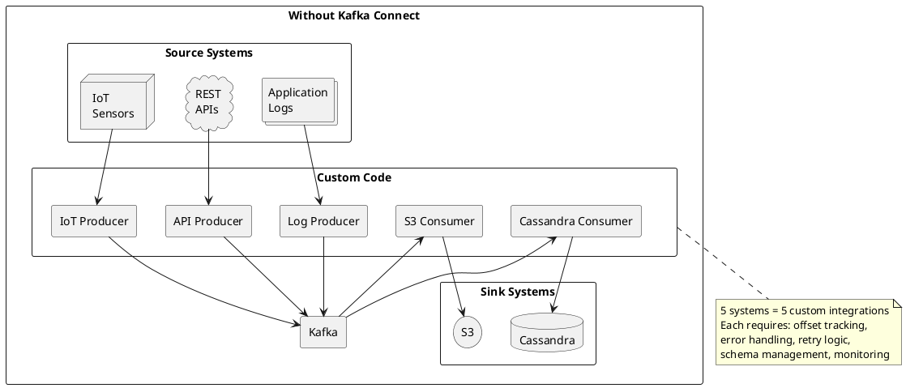
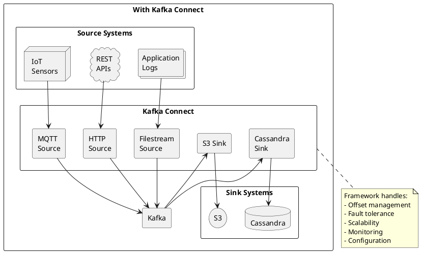
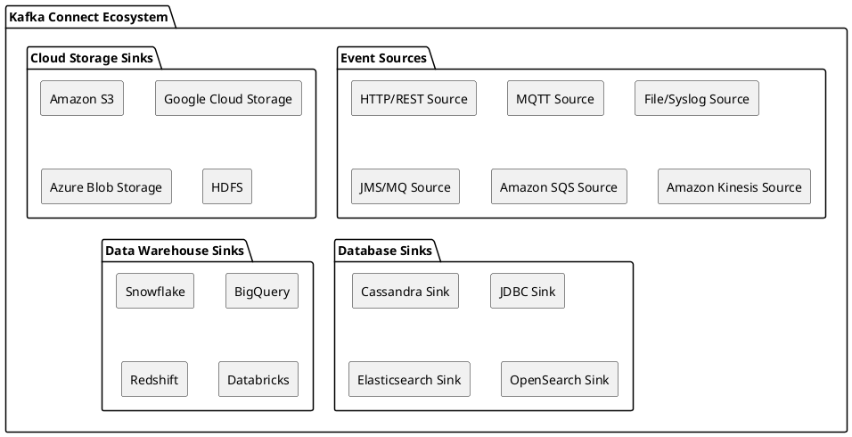
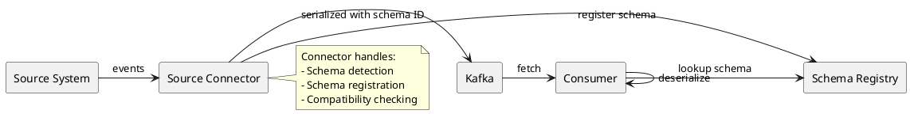
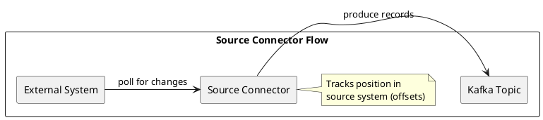
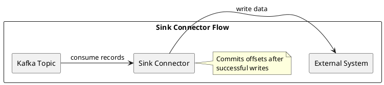
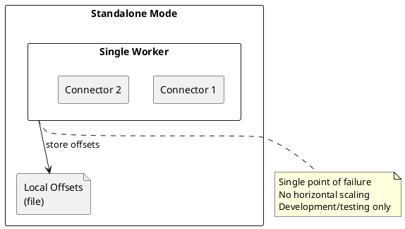
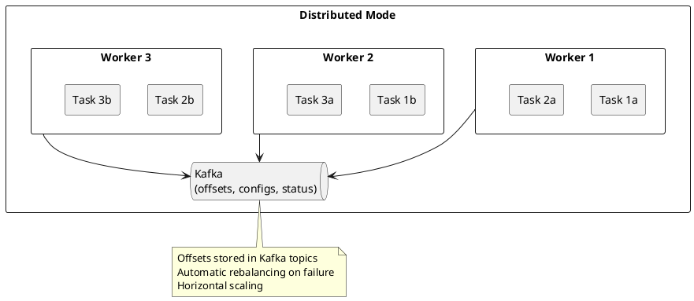
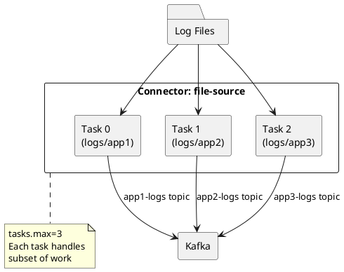

# Kafka Connect

Kafka Connect is the integration layer of the Kafka ecosystem, providing a standardized framework for moving data between Kafka and external systems.

---

## Configuration-Driven Integration

Kafka Connect enables enterprise data integration without writing code. Instead of developing custom producers and consumers for each system, organizations deploy integrations through JSON configuration.

### From Code to Configuration

**Traditional approach** (custom code for each integration):

```java
// Hundreds of lines per integration
KafkaProducer<String, byte[]> producer = new KafkaProducer<>(props);
S3Client s3 = S3Client.builder().region(Region.US_EAST_1).build();

while (true) {
    ConsumerRecords<String, byte[]> records = consumer.poll(Duration.ofMillis(100));
    // Batching logic
    // Parquet conversion
    // S3 multipart upload
    // Offset management
    // Error handling
    // Retry logic
    // Monitoring
}
```

**Kafka Connect approach** (configuration only):

```json
{
  "name": "s3-sink",
  "config": {
    "connector.class": "io.confluent.connect.s3.S3SinkConnector",
    "topics": "events",
    "s3.bucket.name": "data-lake",
    "s3.region": "us-east-1",
    "format.class": "io.confluent.connect.s3.format.parquet.ParquetFormat",
    "flush.size": "10000"
  }
}
```

Deploy via REST API:

```bash
curl -X POST -H "Content-Type: application/json" \
  --data @s3-sink.json \
  http://connect:8083/connectors
```

### Enterprise Benefits

| Aspect | Custom Code | Kafka Connect |
|--------|-------------|---------------|
| **Time to deploy** | Weeks to months | Hours to days |
| **Skills required** | Kafka expertise + target system expertise | Configuration knowledge |
| **Maintenance burden** | Full ownership of code | Connector upgrades only |
| **Consistency** | Varies by developer | Standardized across all integrations |
| **Risk** | Untested code in production | Battle-tested connectors |
| **Scaling** | Code changes may be needed | Configuration change (`tasks.max`) |

For organizations with dozens of integration requirements, the configuration-driven approach transforms data integration from a development problem into an operations problem—dramatically reducing time-to-value and ongoing maintenance costs.

### Modify Integrations Without Deployments

Connector behavior can be modified at runtime via REST API:

```bash
# Update configuration (no restart required for some changes)
curl -X PUT -H "Content-Type: application/json" \
  --data '{"connector.class": "...", "flush.size": "50000"}' \
  http://connect:8083/connectors/s3-sink/config

# Pause connector
curl -X PUT http://connect:8083/connectors/s3-sink/pause

# Resume connector
curl -X PUT http://connect:8083/connectors/s3-sink/resume

# Check status
curl http://connect:8083/connectors/s3-sink/status
```

No code deployments. No container rebuilds. No CI/CD pipelines for configuration changes.

---

## The Integration Challenge

Modern enterprises operate dozens to hundreds of data systems: relational databases, NoSQL stores, search engines, cloud storage, data warehouses, SaaS applications, and legacy systems. Without a standardized integration approach, each connection requires custom code.



### Custom Integration Problems

| Problem | Impact |
|---------|--------|
| **Duplicated effort** | Every integration reimplements common patterns |
| **Inconsistent quality** | Each integration has different error handling, monitoring |
| **Operational burden** | Each integration is a separate system to deploy and monitor |
| **Schema coupling** | Producers and consumers must coordinate on formats |
| **Scalability challenges** | Each integration must solve parallelism independently |

---

## Kafka Connect Solution

Kafka Connect provides a standardized framework where connectors handle system-specific logic and the framework handles operational concerns.



### What Kafka Connect Provides

| Capability | Description |
|------------|-------------|
| **200+ production-grade connectors** | Database CDC, cloud storage, search engines, messaging systems |
| **Standardized operations** | Same deployment, monitoring, and management for all connectors |
| **Distributed mode** | Automatic task distribution and fault tolerance |
| **Offset tracking** | Framework manages position in source/sink systems |
| **Schema integration** | Automatic serialization via Schema Registry |
| **Single Message Transforms** | Lightweight transformations without custom code |
| **Dead letter queues** | Standardized error handling |
| **Exactly-once processing** | Supported for compatible connectors and configurations |

---

## Connector Ecosystem

The Kafka Connect ecosystem includes connectors for virtually every common data system.



### Connector Categories

| Category | Connectors | Primary Use Case |
|----------|------------|------------------|
| **Event Sources** | HTTP/REST, MQTT, File/Syslog, JMS/MQ | Streaming events into Kafka |
| **Cloud Storage Sinks** | S3, GCS, Azure Blob, HDFS | Data lake ingestion |
| **Database Sinks** | Cassandra, JDBC, Elasticsearch, OpenSearch (examples) | Persistent storage and search |
| **Data Warehouse Sinks** | Snowflake, BigQuery, Redshift, Databricks | Analytics pipelines |

---

## Kafka Connect Benefits

Kafka Connect is often the most valuable component of a Kafka deployment. Several factors explain this:

### 1. Connector Quality

Production connectors implement complex logic that is difficult to replicate:

| Connector | Complexity Handled |
|-----------|-------------------|
| **HTTP Source** | Pagination, rate limiting, authentication, retry logic |
| **S3 Sink** | Partitioning, rotation, at-least-once; use idempotent sinks/dedup if required |
| **Cassandra Sink** | Batching, retry policies, consistency levels, schema mapping |
| **MQTT Source** | QoS handling, reconnection, message ordering, topic mapping |

### 2. Operational Standardization

| Aspect | Without Connect | With Connect |
|--------|-----------------|--------------|
| **Deployment** | Different for each integration | Same for all connectors |
| **Monitoring** | Custom metrics per integration | Standard JMX metrics |
| **Scaling** | Custom logic | Add workers, increase tasks |
| **Failure handling** | Custom implementation | Dead letter queues, retry policies |
| **Configuration** | Code changes | REST API, JSON configuration |

### 3. Schema Registry Integration

Connectors integrate with Schema Registry automatically:



---

## Source vs Sink Connectors

### Source Connectors

Source connectors read from external systems and write to Kafka topics.



| Source Type | How It Works | Examples |
|-------------|--------------|----------|
| **File-based** | Watches for new files or streams | File Source, Syslog |
| **API-based** | Polls REST/GraphQL APIs | HTTP Source |
| **Message-based** | Bridges messaging systems | JMS, MQTT, SQS |
| **Stream-based** | Connects streaming platforms | Kinesis, Event Hubs |

### Sink Connectors

Sink connectors read from Kafka topics and write to external systems.



| Sink Type | How It Works | Examples |
|-----------|--------------|----------|
| **Storage** | Writes files in batches | S3, GCS, HDFS |
| **Database** | Upserts or inserts records | Cassandra, JDBC |
| **Search** | Indexes documents | Elasticsearch, OpenSearch |

---

## Deployment Modes

### Standalone Mode

Single worker process—suitable for development and simple use cases.



### Distributed Mode

Multiple worker processes forming a cluster—required for production.



| Aspect | Standalone | Distributed |
|--------|------------|-------------|
| **Fault tolerance** | None | Automatic task redistribution |
| **Scaling** | Vertical only | Horizontal (add workers) |
| **Offset storage** | Local file | Kafka topics |
| **Use case** | Development, simple integrations | Production |

---

## Tasks and Parallelism

Connectors are divided into tasks for parallelism. Each task processes a subset of the data.



### Task Distribution

| Connector Type | Task Parallelism |
|----------------|------------------|
| **File Source** | One task per file or directory |
| **HTTP Source** | One task per endpoint (typically) |
| **S3 Sink** | Tasks share topic partitions |
| **Cassandra Sink** | Tasks share topic partitions |

The `tasks.max` configuration controls maximum parallelism. Actual task count depends on the connector's ability to parallelize the work.

---

## Connect vs Custom Code

### When to Use Connect

| Scenario | Recommendation |
|----------|----------------|
| Cloud storage ingestion | Use S3/GCS connector—handles partitioning, rotation |
| Persistent storage to Cassandra | Use Cassandra Sink—handles batching, consistency levels |
| Search indexing | Use Elasticsearch connector—handles bulk API, backpressure |
| Legacy messaging bridge | Use JMS/MQ connector—handles protocol translation |

### When Custom Code May Be Better

| Scenario | Why |
|----------|-----|
| Complex business logic in transformation | Kafka Streams provides full programming model |
| Non-standard protocols or APIs | May require custom producer/consumer |
| Real-time with sub-millisecond latency | Direct producer may have less overhead |
| Highly specialized integration | No suitable connector exists |

The general guidance: prefer Connect when a suitable connector exists. Connectors encode years of production experience and edge case handling.

---

## Related Documentation

- [Connector Ecosystem](connector-ecosystem.md) - Comprehensive connector catalog
- [Cloud Storage](cloud-storage.md) - S3, GCS, data lake patterns
- [Kafka Connect Guide](../../kafka-connect/index.md) - Technical reference
- [Build vs Buy](build-vs-buy.md) - Decision framework
