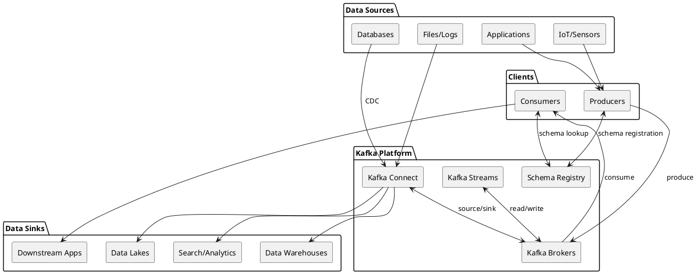
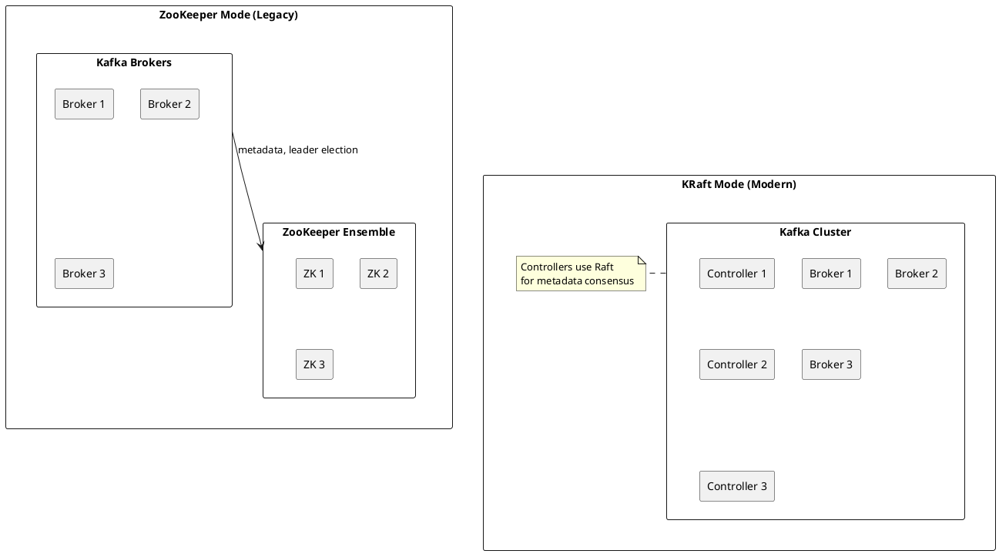
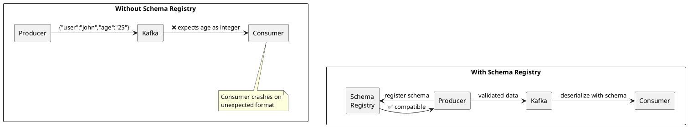
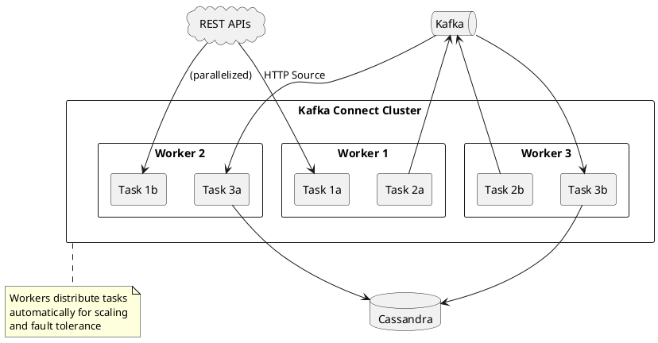
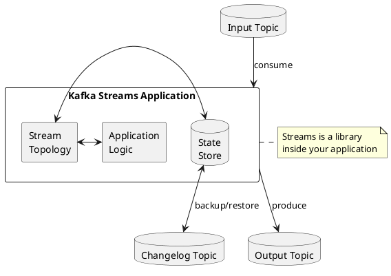
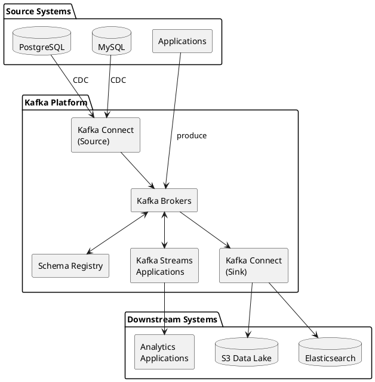

# Kafka Ecosystem

The Apache Kafka platform consists of multiple components that work together to provide a complete event streaming infrastructure.

---

## Ecosystem Overview

Modern Kafka deployments typically include multiple components beyond the core broker cluster. Understanding the role of each component clarifies architectural decisions and deployment patterns.

| Component | Purpose | Deployment |
|-----------|---------|------------|
| **Kafka Brokers** | Distributed commit log storage and serving | Cluster of 3+ nodes |
| **Schema Registry** | Schema management and compatibility enforcement | Separate service |
| **Kafka Connect** | Data integration framework with 200+ connectors | Distributed workers |
| **Kafka Streams** | Stream processing library | Embedded in applications |

---

## Kafka Brokers

Kafka brokers form the core of the platform: a distributed cluster that stores and serves event streams.

### Broker Responsibilities

| Responsibility | Description |
|----------------|-------------|
| **Message storage** | Persist messages to disk in log segments |
| **Replication** | Maintain copies across brokers for fault tolerance |
| **Leader election** | Coordinate partition leadership |
| **Client protocol** | Handle produce and fetch requests |
| **Cluster coordination** | Participate in cluster membership (via KRaft or ZooKeeper) |

### KRaft vs ZooKeeper

Kafka is transitioning from ZooKeeper-based coordination to KRaft (Kafka Raft), a built-in consensus protocol.

| Aspect | ZooKeeper Mode | KRaft Mode |
|--------|----------------|------------|
| **External dependency** | Requires ZooKeeper cluster | Self-contained |
| **Metadata storage** | Split between ZK and brokers | Unified in Kafka |
| **Operational complexity** | Two systems to manage | Single system |
| **Recovery time** | Slower (ZK sync required) | Faster failover |
| **Scale limits** | Lower metadata scale vs KRaft (varies by hardware/config) | Millions of partitions |
| **Version support** | All versions | Kafka 3.3+ production ready |

KRaft mode is the recommended deployment model for new clusters (Kafka 3.3+). Kafka 4.x brokers are KRaft-only.

---

## Schema Registry

Schema Registry provides centralized schema management for Kafka data, ensuring producers and consumers agree on data formats.

### Why Schema Registry?

Without schema management:

- Producers can change data format without warning
- Consumers fail when they encounter unexpected formats
- Schema evolution becomes dangerous
- Documentation becomes the only contract (and quickly becomes stale)

### Schema Registry Features

| Feature | Description |
|---------|-------------|
| **Schema storage** | Schemas stored in a Kafka topic (`_schemas`) |
| **Compatibility checking** | Validates new schemas against compatibility rules |
| **Schema evolution** | Supports backward, forward, and full compatibility |
| **Multiple formats** | Avro, Protobuf, JSON Schema |
| **Subject management** | Schemas organized by subject (typically topic-based) |

### Compatibility Modes

| Mode | Rule | Safe Changes |
|------|------|--------------|
| **BACKWARD** | New schema can read old data | Add optional fields, remove fields |
| **FORWARD** | Old schema can read new data | Remove optional fields, add fields |
| **FULL** | Both backward and forward | Add/remove optional fields only |
| **NONE** | No checking | Any change (dangerous) |

Schema Registry is critical for production deployments where multiple teams produce and consume data independently.

→ [Schema Registry Guide](../schema-registry/index.md)

---

## Kafka Connect

Kafka Connect is a framework for streaming data between Kafka and external systems. It is the primary integration mechanism for most Kafka deployments.

### Why Kafka Connect?

| Without Connect | With Connect |
|-----------------|--------------|
| Write custom producer/consumer for each system | Use pre-built connectors |
| Implement offset tracking, error handling, retry logic | Framework handles operational concerns |
| Build and maintain integration infrastructure | Focus on configuration |
| Different code for each data source/sink | Consistent operational model |

### Connect Architecture

### Connector Types

| Type | Direction | Example Use Cases |
|------|-----------|-------------------|
| **Source connectors** | External → Kafka | Database CDC, file ingestion, API polling |
| **Sink connectors** | Kafka → External | Data lake writes, search indexing, notifications |

### Connector Ecosystem

200+ production-grade connectors are available:

| Category | Examples |
|----------|----------|
| **Event Sources** | HTTP/REST, MQTT, File/Syslog, JMS/MQ |
| **Cloud Storage Sinks** | S3, GCS, Azure Blob, HDFS |
| **Database Sinks** | Cassandra, Elasticsearch, OpenSearch |
| **Data Warehouse Sinks** | Snowflake, BigQuery, Redshift |

Kafka Connect is often the most valuable component of a Kafka deployment—it eliminates thousands of lines of integration code.

→ [Kafka Connect Guide](../kafka-connect/index.md)

---

## Kafka Streams

Kafka Streams is a client library for building stream processing applications. Unlike Connect, Streams is embedded in applications rather than deployed as a separate cluster.

### Streams Characteristics

| Aspect | Description |
|--------|-------------|
| **Deployment** | Library embedded in application (JAR dependency) |
| **Scaling** | Add application instances to scale |
| **State management** | Local state stores with changelog topics for recovery |
| **Processing semantics** | Exactly-once processing supported |
| **Fault tolerance** | Automatic state recovery from changelog topics |

### When to Use Streams

| Use Case | Why Streams |
|----------|-------------|
| **Stateful transformations** | Aggregations, joins, windowing |
| **Application-embedded processing** | No separate cluster to manage |
| **Microservice event processing** | Natural fit for event-driven services |
| **Real-time enrichment** | Stream-table joins for lookups |

### Streams vs Connect

| Aspect | Kafka Streams | Kafka Connect |
|--------|---------------|---------------|
| **Purpose** | Data processing and transformation | Data movement between systems |
| **Deployment** | Application library | Separate worker cluster |
| **Custom logic** | Full programming model | Configuration + SMTs |
| **State** | Built-in state stores | Stateless (connector-dependent) |
| **Scaling** | Add application instances | Add workers |

→ [Kafka Streams Guide](../application-development/kafka-streams/index.md)

---

## Component Selection Guide

| Requirement | Recommended Component |
|-------------|----------------------|
| Stream events from APIs to Kafka | Kafka Connect + HTTP/MQTT Source |
| Move data from Kafka to data lake | Kafka Connect + S3/GCS connector |
| Transform and enrich events | Kafka Streams |
| Custom application logic | Kafka Streams or custom consumer |
| Schema enforcement | Schema Registry |
| Real-time dashboards | Kafka Streams + external visualization |

### Typical Production Architecture

---

## Version Compatibility

| Component | Kafka 2.x | Kafka 3.x | Kafka 4.x |
|-----------|:---------:|:---------:|:---------:|
| Kafka Brokers | ✅ | ✅ | ✅ |
| Schema Registry | ✅ | ✅ | ✅ |
| Kafka Connect | ✅ | ✅ | ✅ |
| Kafka Streams | ✅ | ✅ | ✅ |
| KRaft (production) | ❌ | ✅ (3.3+) | ✅ |

---

## Related Documentation

- [Event Streaming Fundamentals](index.md) - Core concepts
- [Kafka Connect](kafka-connect/index.md) - Data integration deep-dive
- [Delivery Semantics](delivery-semantics/index.md) - Message delivery guarantees
- [Schema Registry](../schema-registry/index.md) - Schema management guide
- [Kafka Streams](../application-development/kafka-streams/index.md) - Stream processing library