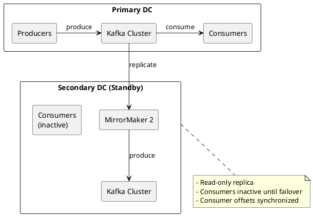
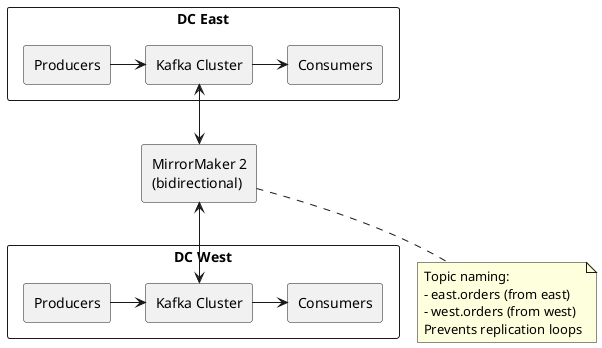
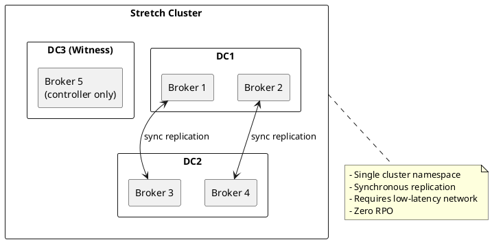
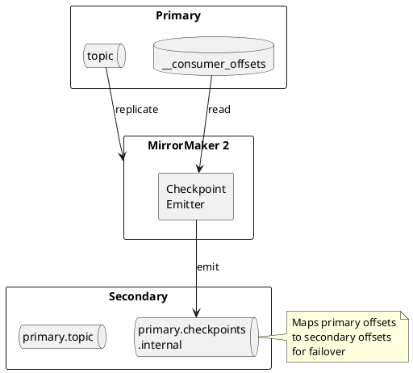

# Multi-Datacenter Deployments

Strategies for deploying Apache Kafka across multiple datacenters for disaster recovery and global distribution.

---

## Deployment Models

| Model | RPO | RTO | Complexity | Use Case |
|-------|-----|-----|------------|----------|
| **Active-Passive** | Minutes | Minutes | Low | Disaster recovery |
| **Active-Active** | Near-zero | Near-zero | High | Global distribution |
| **Stretch Cluster** | Zero | Seconds | Medium | Low-latency DR |

---

## Active-Passive with MirrorMaker 2

Primary datacenter handles all traffic. Secondary datacenter receives replicated data for failover.



### MirrorMaker 2 Configuration

```properties
# mm2.properties

# Define clusters
clusters=primary,secondary

primary.bootstrap.servers=kafka-primary-1:9092,kafka-primary-2:9092
secondary.bootstrap.servers=kafka-secondary-1:9092,kafka-secondary-2:9092

# Replication flows
primary->secondary.enabled=true
primary->secondary.topics=.*
primary->secondary.groups=.*

# Exclude internal topics
primary->secondary.topics.exclude=.*[\-\.]internal,.*\.replica,__.*

# Replication settings
replication.factor=3
checkpoints.topic.replication.factor=3
heartbeats.topic.replication.factor=3
offset-syncs.topic.replication.factor=3

# Consumer offset sync (for failover)
sync.group.offsets.enabled=true
sync.group.offsets.interval.seconds=60

# Emit checkpoints for offset translation
emit.checkpoints.enabled=true
emit.checkpoints.interval.seconds=60
```

### Failover Procedure

1. **Detect failure** - Monitor primary cluster health
2. **Stop MirrorMaker 2** - Prevent split-brain
3. **Translate offsets** - Use checkpoint data
4. **Redirect producers** - Update bootstrap servers
5. **Start consumers** - Resume from translated offsets

```bash
# Translate consumer group offsets
kafka-consumer-groups.sh --bootstrap-server kafka-secondary:9092 \
  --group my-consumer-group \
  --reset-offsets \
  --to-offset <translated-offset> \
  --topic primary.my-topic \
  --execute
```

---

## Active-Active with MirrorMaker 2

Both datacenters handle traffic. Bidirectional replication with conflict avoidance.



### Bidirectional Configuration

```properties
# mm2-active-active.properties

clusters=east,west

east.bootstrap.servers=kafka-east-1:9092,kafka-east-2:9092
west.bootstrap.servers=kafka-west-1:9092,kafka-west-2:9092

# East to West replication
east->west.enabled=true
east->west.topics=orders,events

# West to East replication
west->east.enabled=true
west->east.topics=orders,events

# Prevent replication loops
replication.policy.class=org.apache.kafka.connect.mirror.DefaultReplicationPolicy

# Topic naming (default adds source cluster prefix)
# east.orders in west cluster
# west.orders in east cluster
```

### Conflict Avoidance Strategies

| Strategy | Description | Trade-off |
|----------|-------------|-----------|
| **Topic prefixing** | Different topic names per DC | Consumers must aggregate |
| **Key partitioning** | Route keys to owning DC | Requires consistent routing |
| **Last-write-wins** | Accept all writes, latest wins | Potential data loss |
| **Application merge** | Application-level conflict resolution | Complexity |

---

## Stretch Cluster

Single Kafka cluster spanning multiple datacenters with synchronous replication.



### Configuration

```properties
# Rack awareness for cross-DC placement
broker.rack=dc1

# Minimum ISR spans DCs
min.insync.replicas=2
default.replication.factor=3

# Replica placement
replica.selector.class=org.apache.kafka.common.replica.RackAwareReplicaSelector
```

### Requirements

| Requirement | Threshold |
|-------------|-----------|
| **Network latency** | < 10ms RTT between DCs |
| **Network bandwidth** | Sufficient for replication traffic |
| **Broker count** | Odd number for controller quorum |

---

## Comparison

| Aspect | Active-Passive | Active-Active | Stretch Cluster |
|--------|----------------|---------------|-----------------|
| **RPO** | Minutes | Near-zero | Zero |
| **RTO** | Minutes | Near-zero | Seconds |
| **Latency impact** | None | None | Cross-DC latency |
| **Network requirement** | Async-capable | Async-capable | Low-latency |
| **Topic namespace** | Separate | Separate (prefixed) | Single |
| **Failover complexity** | Manual/automated | Minimal | Automatic |

---

## Consumer Offset Handling

### MirrorMaker 2 Offset Sync

MirrorMaker 2 synchronizes consumer group offsets using checkpoints.



### Offset Translation

```bash
# View checkpoint topic
kafka-console-consumer.sh --bootstrap-server kafka-secondary:9092 \
  --topic primary.checkpoints.internal \
  --from-beginning \
  --property print.key=true
```

---

## Monitoring

### Key Metrics

| Metric | Description | Alert Threshold |
|--------|-------------|-----------------|
| `kafka.connect.mirror.record-count` | Records replicated | Sudden drops |
| `kafka.connect.mirror.record-age-ms` | Replication lag | > 60000 ms |
| `kafka.connect.mirror.checkpoint-latency-ms` | Checkpoint delay | > 120000 ms |
| `kafka.connect.mirror.replication-latency-ms` | End-to-end latency | > 30000 ms |

### Health Checks

```bash
# Check MirrorMaker 2 status
curl http://connect:8083/connectors/mirror-source-connector/status

# Check replication lag
kafka-consumer-groups.sh --bootstrap-server kafka-secondary:9092 \
  --group mirror-source-connector \
  --describe
```

---

## Best Practices

| Practice | Rationale |
|----------|-----------|
| Test failover regularly | Ensure procedures work |
| Monitor replication lag | Detect issues early |
| Use rack awareness | Distribute replicas across DCs |
| Document failover procedures | Reduce MTTR |
| Automate where possible | Reduce human error |

---

## Related Documentation

- [Kafka Connect](../../kafka-connect/index.md) - Connect framework
- [Operations](../../operations/index.md) - Operational procedures
- [Fault Tolerance](../../architecture/fault-tolerance/index.md) - HA design
- [Backup/Restore](../../operations/backup-restore/index.md) - DR procedures
