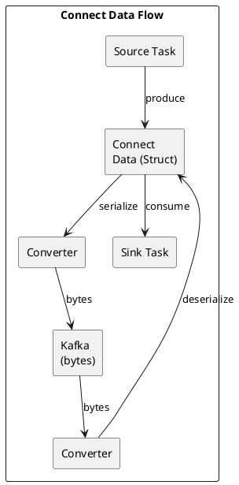

# Kafka Connect Converters

Converters handle serialization and deserialization between Connect's internal data format and Kafka's byte arrays.

---

## Overview



---

## Available Converters

| Converter | Format | Schema Support | Use Case |
|-----------|--------|:--------------:|----------|
| `JsonConverter` | JSON | Optional | Development, debugging |
| `AvroConverter` | Avro binary | Yes (SR) | Production, schema evolution |
| `ProtobufConverter` | Protobuf binary | Yes (SR) | gRPC ecosystems |
| `JsonSchemaConverter` | JSON | Yes (SR) | JSON with validation |
| `StringConverter` | Plain text | No | Simple text data |
| `ByteArrayConverter` | Raw bytes | No | Pre-serialized data |

---

## JSON Converter

### Without Schema

```properties
key.converter=org.apache.kafka.connect.json.JsonConverter
key.converter.schemas.enable=false
value.converter=org.apache.kafka.connect.json.JsonConverter
value.converter.schemas.enable=false
```

Output:
```json
{"user_id": 123, "event": "login", "timestamp": 1699900000}
```

### With Embedded Schema

```properties
key.converter=org.apache.kafka.connect.json.JsonConverter
key.converter.schemas.enable=true
value.converter=org.apache.kafka.connect.json.JsonConverter
value.converter.schemas.enable=true
```

Output:
```json
{
  "schema": {
    "type": "struct",
    "fields": [
      {"field": "user_id", "type": "int32"},
      {"field": "event", "type": "string"},
      {"field": "timestamp", "type": "int64"}
    ]
  },
  "payload": {
    "user_id": 123,
    "event": "login",
    "timestamp": 1699900000
  }
}
```

---

## Avro Converter

Requires Schema Registry.

```properties
key.converter=io.confluent.connect.avro.AvroConverter
key.converter.schema.registry.url=http://schema-registry:8081
value.converter=io.confluent.connect.avro.AvroConverter
value.converter.schema.registry.url=http://schema-registry:8081

# Optional: auto-register schemas
value.converter.auto.register.schemas=true
```

**Benefits:**
- Compact binary format
- Schema evolution support
- Type safety

---

## Protobuf Converter

```properties
key.converter=io.confluent.connect.protobuf.ProtobufConverter
key.converter.schema.registry.url=http://schema-registry:8081
value.converter=io.confluent.connect.protobuf.ProtobufConverter
value.converter.schema.registry.url=http://schema-registry:8081
```

---

## String Converter

For simple text data without schema:

```properties
key.converter=org.apache.kafka.connect.storage.StringConverter
value.converter=org.apache.kafka.connect.storage.StringConverter
```

---

## Converter Selection

| Scenario | Recommended |
|----------|-------------|
| Development | JsonConverter (schemas.enable=false) |
| Production | AvroConverter or ProtobufConverter |
| Existing JSON consumers | JsonConverter or JsonSchemaConverter |
| Text logs | StringConverter |
| Pre-serialized | ByteArrayConverter |

---

## Per-Connector Override

Override worker-level converters for specific connectors:

```json
{
  "name": "my-connector",
  "config": {
    "connector.class": "...",
    "key.converter": "org.apache.kafka.connect.storage.StringConverter",
    "value.converter": "org.apache.kafka.connect.json.JsonConverter",
    "value.converter.schemas.enable": "false"
  }
}
```

---

## Related Documentation

- [Kafka Connect](index.md) - Connect overview
- [Schema Registry](../schema-registry/index.md) - Schema management
- [Transforms](transforms.md) - Single Message Transforms
