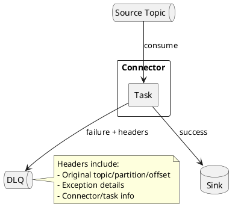

# Kafka Connect Error Handling

Kafka Connect provides configurable error handling for record processing failures.

---

## Error Tolerance

### Fail-Fast (Default)

```json
{
  "errors.tolerance": "none"
}
```

Connector stops on first error. Use for critical data pipelines where any failure requires attention.

### Skip Errors

```json
{
  "errors.tolerance": "all"
}
```

Log errors and continue processing. Combine with dead letter queue for failed records.

---

## Dead Letter Queue

Route failed records to a DLQ topic for later analysis:

```json
{
  "name": "my-connector",
  "config": {
    "connector.class": "...",
    "errors.tolerance": "all",
    "errors.deadletterqueue.topic.name": "dlq-my-connector",
    "errors.deadletterqueue.topic.replication.factor": "3",
    "errors.deadletterqueue.context.headers.enable": "true"
  }
}
```

### DLQ Headers

When `errors.deadletterqueue.context.headers.enable=true`:

| Header | Description |
|--------|-------------|
| `__connect.errors.topic` | Original topic |
| `__connect.errors.partition` | Original partition |
| `__connect.errors.offset` | Original offset |
| `__connect.errors.connector.name` | Connector name |
| `__connect.errors.task.id` | Task ID |
| `__connect.errors.exception.class.name` | Exception class |
| `__connect.errors.exception.message` | Error message |



---

## Error Logging

```json
{
  "errors.log.enable": "true",
  "errors.log.include.messages": "true"
}
```

| Configuration | Description |
|---------------|-------------|
| `errors.log.enable` | Log errors to Connect worker log |
| `errors.log.include.messages` | Include record content (may expose sensitive data) |

---

## Error Retry

For transient failures:

```json
{
  "errors.retry.timeout": "300000",
  "errors.retry.delay.max.ms": "60000"
}
```

| Configuration | Default | Description |
|---------------|:-------:|-------------|
| `errors.retry.timeout` | 0 | Total retry time (0 = no retry) |
| `errors.retry.delay.max.ms` | 60000 | Max delay between retries |

---

## Complete Configuration

```json
{
  "name": "resilient-sink",
  "config": {
    "connector.class": "...",
    "topics": "events",

    "errors.tolerance": "all",
    "errors.retry.timeout": "300000",
    "errors.retry.delay.max.ms": "60000",

    "errors.deadletterqueue.topic.name": "dlq-resilient-sink",
    "errors.deadletterqueue.topic.replication.factor": "3",
    "errors.deadletterqueue.context.headers.enable": "true",

    "errors.log.enable": "true",
    "errors.log.include.messages": "false"
  }
}
```

---

## Processing DLQ Records

```java
// Consume and analyze DLQ
consumer.subscribe(Collections.singletonList("dlq-my-connector"));

while (true) {
    ConsumerRecords<byte[], byte[]> records = consumer.poll(Duration.ofSeconds(1));
    for (ConsumerRecord<byte[], byte[]> record : records) {
        String originalTopic = headerValue(record, "__connect.errors.topic");
        String errorClass = headerValue(record, "__connect.errors.exception.class.name");
        String errorMessage = headerValue(record, "__connect.errors.exception.message");

        log.error("Failed record from {} - {}: {}",
            originalTopic, errorClass, errorMessage);

        // Analyze and potentially replay
    }
}
```

---

## Error Handling Strategy

| Scenario | Configuration |
|----------|---------------|
| Critical data, no loss | `errors.tolerance=none` |
| High volume, some loss OK | `errors.tolerance=all` + DLQ |
| Transient failures expected | `errors.retry.timeout > 0` |
| Debug failures | `errors.log.include.messages=true` |

---

## Related Documentation

- [Kafka Connect](index.md) - Connect overview
- [Operations](operations.md) - Monitoring and management
- [Exactly-Once](exactly-once.md) - EOS delivery
