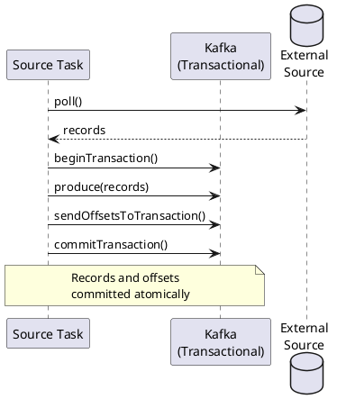

# Kafka Connect Exactly-Once

Kafka Connect supports exactly-once semantics (EOS) for both source and sink connectors.

---

## Source Connector EOS

Available in Kafka 3.3+. Source connectors use transactions to ensure exactly-once delivery.

### Worker Configuration

```properties
# Enable exactly-once support
exactly.once.source.support=enabled

# Transaction boundary mode
transaction.boundary=poll
```

| Transaction Boundary | Behavior |
|---------------------|----------|
| `poll` | Transaction per poll() call (default) |
| `connector` | Connector defines boundaries |
| `interval` | Transaction every N milliseconds |

### How It Works



### Connector Configuration

No additional connector config needed; EOS uses worker settings:

```json
{
  "name": "eos-source",
  "config": {
    "connector.class": "...",
    "tasks.max": "1"
  }
}
```

---

## Sink Connector EOS

Sink connectors achieve exactly-once through idempotent writes, not Kafka transactions.

### Strategies

| Strategy | Implementation |
|----------|----------------|
| **Upsert** | Primary key ensures idempotent updates |
| **Deduplication** | Track offsets in sink system |
| **External transactions** | Commit offset with sink transaction |

### Upsert Pattern

Use natural keys for idempotent writes:

```json
{
  "name": "cassandra-sink",
  "config": {
    "connector.class": "com.datastax.oss.kafka.sink.CassandraSinkConnector",
    "topics": "events",
    "topic.events.keyspace.table.mapping": "analytics.events"
  }
}
```

Cassandra's upsert semantics ensure duplicates overwrite with same data.

### Offset Tracking Pattern

Store Kafka offsets alongside data:

```sql
-- PostgreSQL example
CREATE TABLE events (
    kafka_topic VARCHAR(255),
    kafka_partition INT,
    kafka_offset BIGINT,
    event_data JSONB,
    PRIMARY KEY (kafka_topic, kafka_partition, kafka_offset)
);
```

---

## Comparison

| Aspect | Source EOS | Sink EOS |
|--------|------------|----------|
| Mechanism | Kafka transactions | Idempotent writes |
| Kafka version | 3.3+ | Any |
| Configuration | Worker-level | Connector/sink-level |
| Overhead | Transaction coordination | Sink-dependent |

---

## Limitations

| Limitation | Description |
|------------|-------------|
| Source connector support | Connector must be EOS-compatible |
| Sink external systems | Must support idempotent writes |
| Performance | Transaction overhead on source side |
| Zombie fencing | Requires proper task assignment |

---

## Verification

Check connector status for EOS mode:

```bash
curl http://connect:8083/connectors/my-source/status | jq '.tasks[].trace'
```

---

## Related Documentation

- [Kafka Connect](index.md) - Connect overview
- [Error Handling](error-handling.md) - DLQ configuration
- [Exactly-Once Semantics](../concepts/delivery-semantics/exactly-once.md) - EOS concepts