# Kafka Connect

Kafka Connect is a framework for streaming data between Apache Kafka and external systems using pre-built or custom connectors.

---

## Overview

Kafka Connect eliminates the need to write custom integration code for common data sources and sinks. The framework handles:

- Parallelization and scaling
- Offset management and exactly-once delivery
- Schema integration with Schema Registry
- Fault tolerance and automatic recovery
- Standardized monitoring and operations

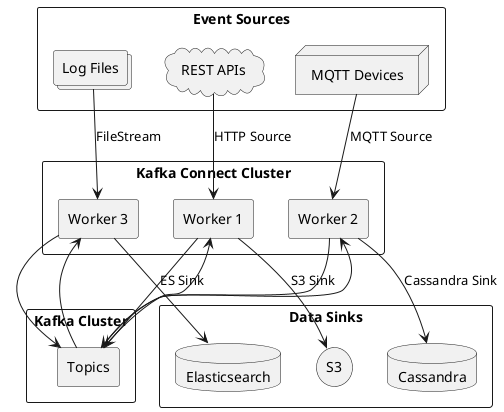

---

## Architecture

### Components

| Component | Description |
|-----------|-------------|
| **Worker** | JVM process that executes connectors and tasks |
| **Connector** | Plugin that defines how to connect to external system |
| **Task** | Unit of work; connectors are divided into tasks for parallelism |
| **Converter** | Serializes/deserializes data between Connect and Kafka |
| **Transform** | Modifies records in-flight (Single Message Transforms) |

### Worker Architecture

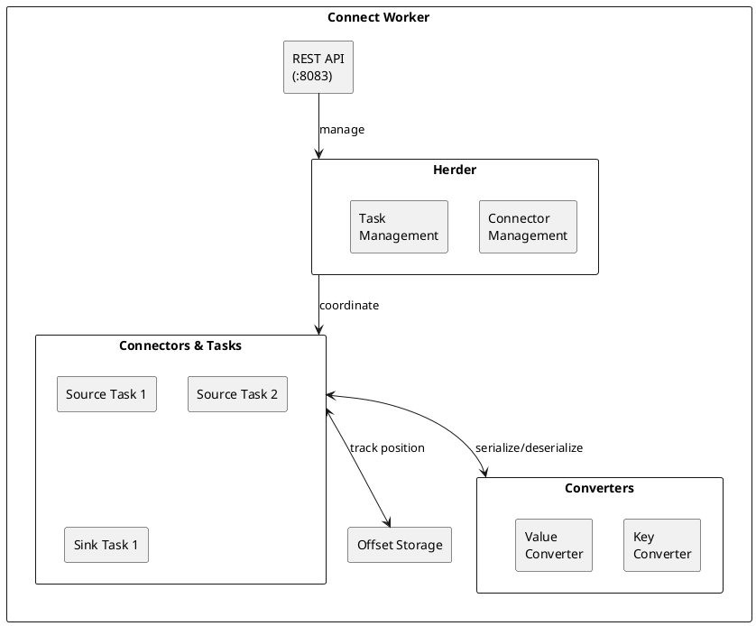

### Data Flow

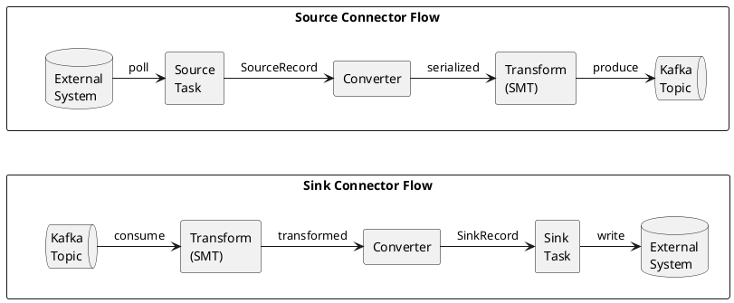

---

## Deployment Modes

### Standalone Mode

Single worker process—suitable for development and simple use cases.

```bash
# Start standalone worker
connect-standalone.sh \
  config/connect-standalone.properties \
  config/file-source.properties \
  config/file-sink.properties
```

**Standalone properties:**
```properties
bootstrap.servers=localhost:9092
key.converter=org.apache.kafka.connect.json.JsonConverter
value.converter=org.apache.kafka.connect.json.JsonConverter

# Offset storage (local file)
offset.storage.file.filename=/tmp/connect.offsets

# REST API
rest.port=8083
```

| Characteristic | Standalone Mode |
|----------------|-----------------|
| **Workers** | Single process |
| **Offset storage** | Local file |
| **Fault tolerance** | None |
| **Scaling** | Not supported |
| **Use case** | Development, testing |

### Distributed Mode

Multiple workers forming a cluster—required for production.

```bash
# Start distributed worker (on each node)
connect-distributed.sh config/connect-distributed.properties
```

**Distributed properties:**
```properties
bootstrap.servers=kafka1:9092,kafka2:9092,kafka3:9092

# Group coordination
group.id=connect-cluster

# Offset storage (Kafka topics)
offset.storage.topic=connect-offsets
offset.storage.replication.factor=3
offset.storage.partitions=25

# Config storage
config.storage.topic=connect-configs
config.storage.replication.factor=3

# Status storage
status.storage.topic=connect-status
status.storage.replication.factor=3
status.storage.partitions=5

# Converters
key.converter=io.confluent.connect.avro.AvroConverter
key.converter.schema.registry.url=http://schema-registry:8081
value.converter=io.confluent.connect.avro.AvroConverter
value.converter.schema.registry.url=http://schema-registry:8081

# REST API
rest.advertised.host.name=connect-worker-1
rest.port=8083
```

| Characteristic | Distributed Mode |
|----------------|------------------|
| **Workers** | Multiple processes (cluster) |
| **Offset storage** | Kafka topic (`connect-offsets`) |
| **Fault tolerance** | Automatic task redistribution |
| **Scaling** | Add workers to scale |
| **Use case** | Production |

### Internal Topics

| Topic | Purpose | Recommended Config |
|-------|---------|-------------------|
| `connect-offsets` | Source connector offsets | RF=3, partitions=25 |
| `connect-configs` | Connector configurations | RF=3, partitions=1, compacted |
| `connect-status` | Connector/task status | RF=3, partitions=5, compacted |

---

## Deployment Architectures

### Standalone Architecture

Single worker process for development and simple integrations.

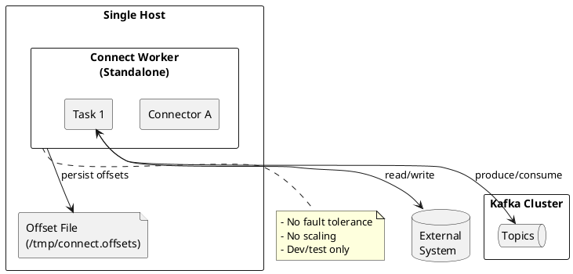

### Distributed Architecture

Multi-worker cluster for production deployments.

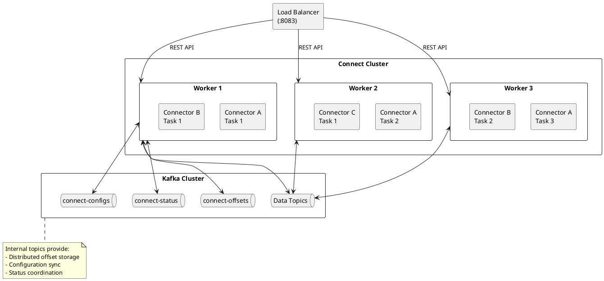

### Co-located Deployment

Connect workers on Kafka broker nodes—suitable for smaller clusters.

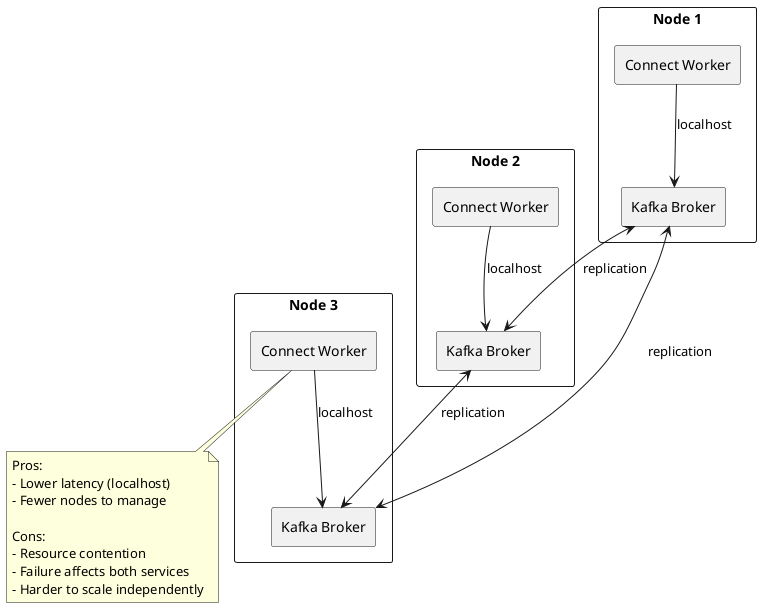

### Dedicated Connect Cluster

Separate Connect cluster—recommended for production.

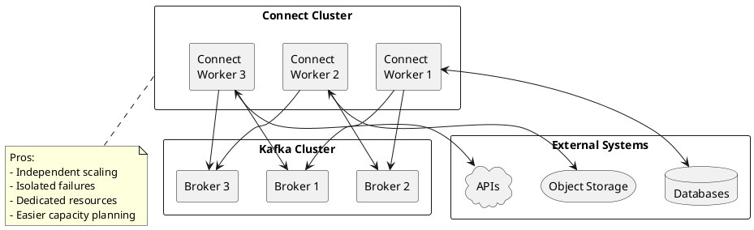

### Sidecar Pattern

Connect worker per application—useful for application-specific integrations.

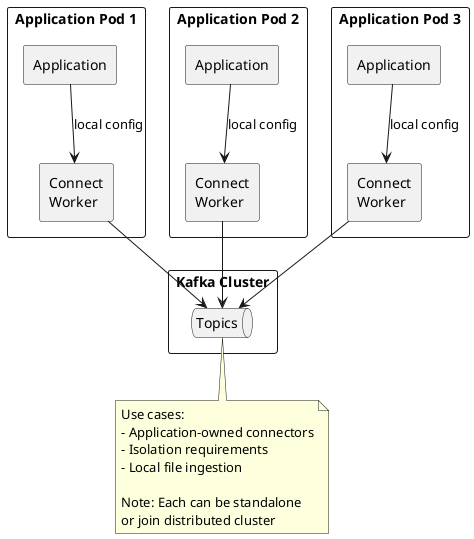

### Kubernetes Deployment

Connect cluster on Kubernetes with horizontal scaling.

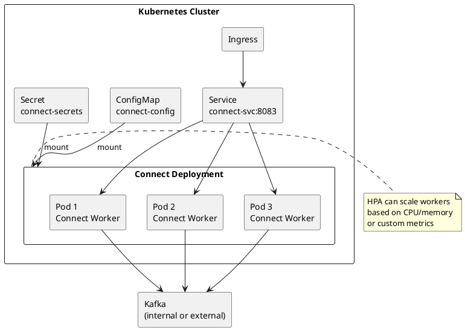

**Kubernetes manifest example:**

```yaml
apiVersion: apps/v1
kind: Deployment
metadata:
  name: kafka-connect
spec:
  replicas: 3
  selector:
    matchLabels:
      app: kafka-connect
  template:
    metadata:
      labels:
        app: kafka-connect
    spec:
      containers:
      - name: connect
        image: confluentinc/cp-kafka-connect:7.5.0
        ports:
        - containerPort: 8083
        env:
        - name: CONNECT_BOOTSTRAP_SERVERS
          value: "kafka:9092"
        - name: CONNECT_GROUP_ID
          value: "connect-cluster"
        - name: CONNECT_REST_ADVERTISED_HOST_NAME
          valueFrom:
            fieldRef:
              fieldPath: status.podIP
        resources:
          requests:
            memory: "2Gi"
            cpu: "1"
          limits:
            memory: "4Gi"
            cpu: "2"
---
apiVersion: v1
kind: Service
metadata:
  name: kafka-connect
spec:
  ports:
  - port: 8083
  selector:
    app: kafka-connect
```

### Multi-Region Deployment

Separate Connect clusters per region for geo-distributed workloads.

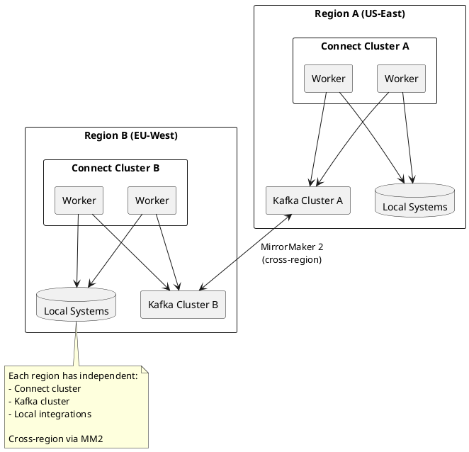

### Deployment Comparison

| Pattern | Scaling | Fault Tolerance | Resource Isolation | Use Case |
|---------|---------|-----------------|-------------------|----------|
| **Standalone** | None | None | N/A | Development |
| **Co-located** | With brokers | Shared | Poor | Small clusters |
| **Dedicated cluster** | Independent | Independent | Good | Production |
| **Sidecar** | Per application | Per application | Excellent | App-specific |
| **Kubernetes** | HPA/VPA | Pod replacement | Good | Cloud-native |
| **Multi-region** | Per region | Regional | Excellent | Global deployments |

### Sizing Guidelines

| Workload | Workers | Memory per Worker | CPU per Worker |
|----------|---------|-------------------|----------------|
| **Light** (< 10 connectors) | 2-3 | 2-4 GB | 1-2 cores |
| **Medium** (10-50 connectors) | 3-5 | 4-8 GB | 2-4 cores |
| **Heavy** (50+ connectors) | 5-10+ | 8-16 GB | 4-8 cores |

!!! note "Worker Sizing"
    Worker memory depends on:

    - Number of tasks per worker
    - Message size and throughput
    - Converter complexity (Avro/Protobuf vs JSON)
    - Transform chain depth

---

## Connector Configuration

### Creating Connectors via REST API

```bash
# Create a Cassandra Sink connector
curl -X POST http://connect:8083/connectors \
  -H "Content-Type: application/json" \
  -d '{
    "name": "cassandra-sink",
    "config": {
      "connector.class": "com.datastax.oss.kafka.sink.CassandraSinkConnector",
      "tasks.max": "1",
      "topics": "events",
      "contactPoints": "cassandra1,cassandra2,cassandra3",
      "loadBalancing.localDc": "datacenter1",
      "port": "9042",
      "topic.events.keyspace.table.mapping": "events.events_by_time",
      "topic.events.keyspace.table.consistencyLevel": "LOCAL_QUORUM"
    }
  }'
```

### Common Configuration Properties

| Property | Description |
|----------|-------------|
| `name` | Unique connector name |
| `connector.class` | Fully qualified connector class |
| `tasks.max` | Maximum number of tasks |
| `key.converter` | Key converter (overrides worker default) |
| `value.converter` | Value converter (overrides worker default) |
| `transforms` | Comma-separated list of transforms |
| `errors.tolerance` | Error handling: none, all |
| `errors.deadletterqueue.topic.name` | Dead letter queue topic |

### Connector Lifecycle

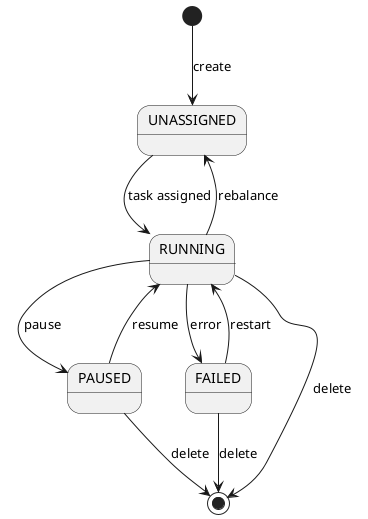

---

## REST API Reference

### Connector Management

| Endpoint | Method | Description |
|----------|--------|-------------|
| `/connectors` | GET | List all connectors |
| `/connectors` | POST | Create connector |
| `/connectors/{name}` | GET | Get connector info |
| `/connectors/{name}` | DELETE | Delete connector |
| `/connectors/{name}/config` | GET | Get connector config |
| `/connectors/{name}/config` | PUT | Update connector config |
| `/connectors/{name}/status` | GET | Get connector status |
| `/connectors/{name}/restart` | POST | Restart connector |
| `/connectors/{name}/pause` | PUT | Pause connector |
| `/connectors/{name}/resume` | PUT | Resume connector |
| `/connectors/{name}/stop` | PUT | Stop connector (deallocate resources) |

### Task Management

| Endpoint | Method | Description |
|----------|--------|-------------|
| `/connectors/{name}/tasks` | GET | List tasks |
| `/connectors/{name}/tasks/{id}/status` | GET | Get task status |
| `/connectors/{name}/tasks/{id}/restart` | POST | Restart task |

### Offset Management

Manage connector offsets (connector must be stopped):

| Endpoint | Method | Description |
|----------|--------|-------------|
| `/connectors/{name}/offsets` | GET | Get current offsets |
| `/connectors/{name}/offsets` | DELETE | Reset offsets |
| `/connectors/{name}/offsets` | PATCH | Alter offsets |

**Alter source connector offsets:**

```bash
# Stop connector first
curl -X PUT http://connect:8083/connectors/my-connector/stop

# Alter offsets
curl -X PATCH http://connect:8083/connectors/my-connector/offsets \
  -H "Content-Type: application/json" \
  -d '{
    "offsets": [
      {
        "partition": {"filename": "test.txt"},
        "offset": {"position": 30}
      }
    ]
  }'

# Resume connector
curl -X PUT http://connect:8083/connectors/my-connector/resume
```

**Reset sink connector offsets:**

```bash
# Stop and reset to re-consume from beginning
curl -X PUT http://connect:8083/connectors/my-sink/stop
curl -X DELETE http://connect:8083/connectors/my-sink/offsets
curl -X PUT http://connect:8083/connectors/my-sink/resume
```

### Cluster Information

| Endpoint | Method | Description |
|----------|--------|-------------|
| `/` | GET | Cluster info |
| `/connector-plugins` | GET | List installed plugins |
| `/connector-plugins/{plugin}/config/validate` | PUT | Validate config |

### Admin Logging

Dynamically adjust log levels:

| Endpoint | Method | Description |
|----------|--------|-------------|
| `/admin/loggers` | GET | List loggers with explicit levels |
| `/admin/loggers/{name}` | GET | Get logger level |
| `/admin/loggers/{name}` | PUT | Set logger level |

```bash
# Enable debug logging for connector
curl -X PUT http://connect:8083/admin/loggers/org.apache.kafka.connect \
  -H "Content-Type: application/json" \
  -d '{"level": "DEBUG"}'
```

---

## Converters

Converters serialize and deserialize data between Connect's internal format and Kafka.

### Available Converters

| Converter | Format | Schema Support |
|-----------|--------|----------------|
| `JsonConverter` | JSON | Optional (schemas.enable) |
| `AvroConverter` | Avro binary | Yes (Schema Registry) |
| `ProtobufConverter` | Protobuf binary | Yes (Schema Registry) |
| `JsonSchemaConverter` | JSON with schema | Yes (Schema Registry) |
| `StringConverter` | Plain string | No |
| `ByteArrayConverter` | Raw bytes | No |

### Converter Configuration

```properties
# JSON without schemas (simple)
key.converter=org.apache.kafka.connect.json.JsonConverter
key.converter.schemas.enable=false
value.converter=org.apache.kafka.connect.json.JsonConverter
value.converter.schemas.enable=false

# Avro with Schema Registry (production)
key.converter=io.confluent.connect.avro.AvroConverter
key.converter.schema.registry.url=http://schema-registry:8081
value.converter=io.confluent.connect.avro.AvroConverter
value.converter.schema.registry.url=http://schema-registry:8081
```

### Converter Selection Guide

| Use Case | Recommended Converter |
|----------|----------------------|
| Development/debugging | JsonConverter (schemas.enable=false) |
| Production with schema evolution | AvroConverter or ProtobufConverter |
| Existing JSON consumers | JsonConverter or JsonSchemaConverter |
| Maximum compatibility | StringConverter (manual serialization) |

→ [Converters Guide](converters.md)

---

## Single Message Transforms (SMTs)

SMTs modify records as they flow through Connect—useful for simple transformations without custom code.

### Built-in Transforms

| Transform | Description |
|-----------|-------------|
| `InsertField` | Add field with static or metadata value |
| `ReplaceField` | Rename, include, or exclude fields |
| `MaskField` | Replace field value with valid null |
| `ValueToKey` | Copy fields from value to key |
| `ExtractField` | Extract single field from struct |
| `SetSchemaMetadata` | Set schema name and version |
| `TimestampRouter` | Route to topic based on timestamp |
| `RegexRouter` | Route to topic based on regex |
| `Flatten` | Flatten nested structures |
| `Cast` | Cast field to different type |
| `HeaderFrom` | Copy field to header |
| `InsertHeader` | Add static header |
| `DropHeaders` | Remove headers |
| `Filter` | Drop records matching predicate |

### Transform Configuration

```json
{
  "name": "my-connector",
  "config": {
    "connector.class": "...",
    "transforms": "addTimestamp,route",

    "transforms.addTimestamp.type": "org.apache.kafka.connect.transforms.InsertField$Value",
    "transforms.addTimestamp.timestamp.field": "processed_at",

    "transforms.route.type": "org.apache.kafka.connect.transforms.RegexRouter",
    "transforms.route.regex": "(.*)_raw",
    "transforms.route.replacement": "$1_processed"
  }
}
```

### Transform Chain

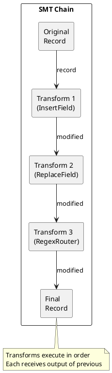

### Predicates

Apply transforms conditionally based on message properties:

**Built-in Predicates:**

| Predicate | Description |
|-----------|-------------|
| `TopicNameMatches` | Match records where topic name matches regex |
| `HasHeaderKey` | Match records with specific header key |
| `RecordIsTombstone` | Match tombstone records (null value) |

**Predicate Configuration:**

```json
{
  "name": "my-connector",
  "config": {
    "connector.class": "...",
    "transforms": "FilterFoo,ExtractBar",

    "transforms.FilterFoo.type": "org.apache.kafka.connect.transforms.Filter",
    "transforms.FilterFoo.predicate": "IsFoo",

    "transforms.ExtractBar.type": "org.apache.kafka.connect.transforms.ExtractField$Key",
    "transforms.ExtractBar.field": "other_field",
    "transforms.ExtractBar.predicate": "IsBar",
    "transforms.ExtractBar.negate": "true",

    "predicates": "IsFoo,IsBar",

    "predicates.IsFoo.type": "org.apache.kafka.connect.transforms.predicates.TopicNameMatches",
    "predicates.IsFoo.pattern": "foo",

    "predicates.IsBar.type": "org.apache.kafka.connect.transforms.predicates.TopicNameMatches",
    "predicates.IsBar.pattern": "bar"
  }
}
```

| Property | Description |
|----------|-------------|
| `predicate` | Associate predicate alias with transform |
| `negate` | Invert predicate match (apply when NOT matched) |

→ [Transforms Guide](transforms.md)

---

## Error Handling

### Error Tolerance

```json
{
  "name": "my-connector",
  "config": {
    "connector.class": "...",
    "errors.tolerance": "all",
    "errors.deadletterqueue.topic.name": "my-connector-dlq",
    "errors.deadletterqueue.topic.replication.factor": 3,
    "errors.deadletterqueue.context.headers.enable": true,
    "errors.log.enable": true,
    "errors.log.include.messages": true
  }
}
```

| Configuration | Description |
|---------------|-------------|
| `errors.tolerance=none` | Fail on first error (default) |
| `errors.tolerance=all` | Log errors and continue |
| `errors.deadletterqueue.topic.name` | Topic for failed records |
| `errors.deadletterqueue.context.headers.enable` | Include error context in headers |
| `errors.log.enable` | Log errors to Connect log |
| `errors.log.include.messages` | Include record content in logs |

### Dead Letter Queue

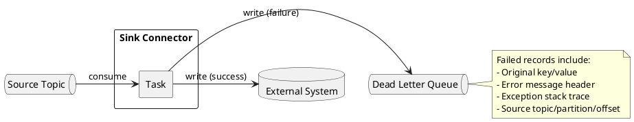

→ [Error Handling Guide](error-handling.md)

---

## Exactly-Once Delivery

Kafka Connect supports exactly-once semantics for source connectors (Kafka 3.3+).

### Source Connector EOS

```properties
# Worker configuration
exactly.once.source.support=enabled
transaction.boundary=poll  # or connector, interval

# Connector configuration (automatically uses transactions)
```

| Transaction Boundary | Behavior |
|---------------------|----------|
| `poll` | Transaction per poll() call |
| `connector` | Connector defines boundaries |
| `interval` | Transaction every N milliseconds |

### Sink Connector EOS

Sink connectors achieve exactly-once through idempotent writes to external systems:

| Strategy | Implementation |
|----------|----------------|
| **Upsert** | Use primary key for idempotent updates |
| **Deduplication** | Track processed offsets in sink |
| **Transactions** | Commit offset with sink transaction |

→ [Exactly-Once Guide](exactly-once.md)

---

## Monitoring

### Key Metrics

| Metric | Description | Alert Threshold |
|--------|-------------|-----------------|
| `connector-count` | Number of connectors | Expected count |
| `task-count` | Number of running tasks | Expected count |
| `connector-startup-failure-total` | Connector startup failures | > 0 |
| `task-startup-failure-total` | Task startup failures | > 0 |
| `source-record-poll-total` | Records polled by source | Depends on workload |
| `sink-record-send-total` | Records sent by sink | Depends on workload |
| `offset-commit-failure-total` | Offset commit failures | > 0 |
| `deadletterqueue-produce-total` | Records sent to DLQ | > 0 (investigate) |

### JMX MBeans

```
kafka.connect:type=connector-metrics,connector={connector}
kafka.connect:type=connector-task-metrics,connector={connector},task={task}
kafka.connect:type=source-task-metrics,connector={connector},task={task}
kafka.connect:type=sink-task-metrics,connector={connector},task={task}
```

→ [Operations Guide](operations.md)

---

## Scaling

### Horizontal Scaling

Add workers to the Connect cluster to distribute load:

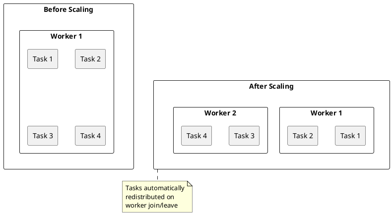

### Task Parallelism

Increase `tasks.max` for connectors that support parallelism:

```json
{
  "name": "jdbc-source",
  "config": {
    "connector.class": "io.confluent.connect.jdbc.JdbcSourceConnector",
    "tasks.max": "10",
    "table.whitelist": "orders,customers,products"
  }
}
```

| Connector Type | Parallelism Model |
|----------------|-------------------|
| **HTTP Source** | One task per endpoint (typically) |
| **File Source** | One task per file or directory |
| **S3 Sink** | Tasks share topic partitions |
| **Cassandra Sink** | Tasks share topic partitions |

---

## Connector Development

Building custom connectors to integrate Kafka with proprietary or unsupported systems.

### Connector Components

| Component | Interface | Purpose |
|-----------|-----------|---------|
| **SourceConnector** | `SourceConnector` | Configuration and task distribution for imports |
| **SourceTask** | `SourceTask` | Read data from external system |
| **SinkConnector** | `SinkConnector` | Configuration and task distribution for exports |
| **SinkTask** | `SinkTask` | Write data to external system |

### Source Connector Structure

```java
public class MySourceConnector extends SourceConnector {
    private Map<String, String> configProps;

    @Override
    public void start(Map<String, String> props) {
        this.configProps = props;
    }

    @Override
    public Class<? extends Task> taskClass() {
        return MySourceTask.class;
    }

    @Override
    public List<Map<String, String>> taskConfigs(int maxTasks) {
        // Distribute work across tasks
        List<Map<String, String>> configs = new ArrayList<>();
        for (int i = 0; i < maxTasks; i++) {
            Map<String, String> taskConfig = new HashMap<>(configProps);
            taskConfig.put("task.id", String.valueOf(i));
            configs.add(taskConfig);
        }
        return configs;
    }

    @Override
    public void stop() {
        // Clean up resources
    }

    @Override
    public ConfigDef config() {
        return new ConfigDef()
            .define("connection.url", Type.STRING, Importance.HIGH, "Connection URL");
    }

    @Override
    public String version() {
        return "1.0.0";
    }
}
```

### Source Task Implementation

```java
public class MySourceTask extends SourceTask {
    private String connectionUrl;

    @Override
    public void start(Map<String, String> props) {
        connectionUrl = props.get("connection.url");
        // Initialize connection
    }

    @Override
    public List<SourceRecord> poll() throws InterruptedException {
        List<SourceRecord> records = new ArrayList<>();

        // Read from external system
        List<DataItem> items = fetchData();

        for (DataItem item : items) {
            Map<String, ?> sourcePartition = Collections.singletonMap("source", connectionUrl);
            Map<String, ?> sourceOffset = Collections.singletonMap("position", item.getOffset());

            records.add(new SourceRecord(
                sourcePartition,
                sourceOffset,
                "target-topic",
                Schema.STRING_SCHEMA,
                item.getKey(),
                Schema.STRING_SCHEMA,
                item.getValue()
            ));
        }
        return records;
    }

    @Override
    public void stop() {
        // Close connections
    }

    @Override
    public String version() {
        return "1.0.0";
    }
}
```

### Sink Task Implementation

```java
public class MySinkTask extends SinkTask {
    private ErrantRecordReporter reporter;

    @Override
    public void start(Map<String, String> props) {
        // Initialize connection
        try {
            reporter = context.errantRecordReporter();
        } catch (NoSuchMethodError e) {
            reporter = null; // Older Connect runtime
        }
    }

    @Override
    public void put(Collection<SinkRecord> records) {
        for (SinkRecord record : records) {
            try {
                writeToDestination(record);
            } catch (Exception e) {
                if (reporter != null) {
                    reporter.report(record, e);  // Send to DLQ
                } else {
                    throw new ConnectException("Write failed", e);
                }
            }
        }
    }

    @Override
    public void flush(Map<TopicPartition, OffsetAndMetadata> offsets) {
        // Ensure all data is persisted before offset commit
    }

    @Override
    public void stop() {
        // Close connections
    }

    @Override
    public String version() {
        return "1.0.0";
    }
}
```

### Plugin Discovery

Register connector class in `META-INF/services/`:

```
# META-INF/services/org.apache.kafka.connect.source.SourceConnector
com.example.MySourceConnector

# META-INF/services/org.apache.kafka.connect.sink.SinkConnector
com.example.MySinkConnector
```

### Resume from Offset

```java
@Override
public void start(Map<String, String> props) {
    Map<String, Object> partition = Collections.singletonMap("source", connectionUrl);
    Map<String, Object> offset = context.offsetStorageReader().offset(partition);

    if (offset != null) {
        Long lastPosition = (Long) offset.get("position");
        seekToPosition(lastPosition);
    }
}
```

---

## Related Documentation

- [Connectors](connectors/index.md) - Connector guides (Cassandra, S3, HTTP)
- [Transforms](transforms.md) - Single Message Transforms
- [Converters](converters.md) - Serialization configuration
- [Error Handling](error-handling.md) - DLQ and error tolerance
- [Exactly-Once](exactly-once.md) - EOS configuration
- [Operations](operations.md) - Monitoring and management
- [Kafka Connect Concepts](../concepts/kafka-connect/index.md) - Conceptual overview
