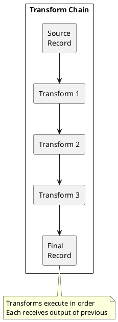

# Kafka Connect Transforms

Single Message Transforms (SMTs) modify records as they flow through Connect without custom code.

---

## Overview



---

## Built-in Transforms

### Field Manipulation

| Transform | Description |
|-----------|-------------|
| `InsertField` | Add field with static or metadata value |
| `ReplaceField` | Include, exclude, or rename fields |
| `MaskField` | Replace field value with null |
| `ValueToKey` | Copy fields from value to key |
| `ExtractField` | Extract single field from struct |
| `Flatten` | Flatten nested structures |
| `Cast` | Cast field to different type |

### Routing

| Transform | Description |
|-----------|-------------|
| `RegexRouter` | Route to topic based on regex |
| `TimestampRouter` | Route based on timestamp |
| `SetSchemaMetadata` | Set schema name and version |

### Headers

| Transform | Description |
|-----------|-------------|
| `HeaderFrom` | Copy field to header |
| `InsertHeader` | Add static header |
| `DropHeaders` | Remove headers |

### Filtering

| Transform | Description |
|-----------|-------------|
| `Filter` | Drop records matching predicate |

---

## Configuration

### Basic Structure

```json
{
  "name": "my-connector",
  "config": {
    "connector.class": "...",
    "transforms": "transform1,transform2",
    "transforms.transform1.type": "...",
    "transforms.transform1.field": "...",
    "transforms.transform2.type": "...",
    "transforms.transform2.regex": "..."
  }
}
```

### Key vs Value

Apply to key with `$Key` suffix, value with `$Value`:

```json
{
  "transforms": "addTimestamp",
  "transforms.addTimestamp.type": "org.apache.kafka.connect.transforms.InsertField$Value",
  "transforms.addTimestamp.timestamp.field": "processed_at"
}
```

---

## Common Examples

### Add Timestamp

```json
{
  "transforms": "addTimestamp",
  "transforms.addTimestamp.type": "org.apache.kafka.connect.transforms.InsertField$Value",
  "transforms.addTimestamp.timestamp.field": "ingested_at"
}
```

### Route by Pattern

```json
{
  "transforms": "route",
  "transforms.route.type": "org.apache.kafka.connect.transforms.RegexRouter",
  "transforms.route.regex": "(.*)_raw",
  "transforms.route.replacement": "$1_processed"
}
```

### Drop Fields

```json
{
  "transforms": "dropFields",
  "transforms.dropFields.type": "org.apache.kafka.connect.transforms.ReplaceField$Value",
  "transforms.dropFields.exclude": "password,ssn,credit_card"
}
```

### Flatten Nested JSON

```json
{
  "transforms": "flatten",
  "transforms.flatten.type": "org.apache.kafka.connect.transforms.Flatten$Value",
  "transforms.flatten.delimiter": "_"
}
```

Before: `{"user": {"name": "Alice", "age": 30}}`
After: `{"user_name": "Alice", "user_age": 30}`

### Cast Types

```json
{
  "transforms": "cast",
  "transforms.cast.type": "org.apache.kafka.connect.transforms.Cast$Value",
  "transforms.cast.spec": "price:float64,quantity:int32"
}
```

---

## Transform Chain Example

```json
{
  "name": "events-sink",
  "config": {
    "connector.class": "...",
    "transforms": "addTimestamp,dropSensitive,route",

    "transforms.addTimestamp.type": "org.apache.kafka.connect.transforms.InsertField$Value",
    "transforms.addTimestamp.timestamp.field": "processed_at",

    "transforms.dropSensitive.type": "org.apache.kafka.connect.transforms.ReplaceField$Value",
    "transforms.dropSensitive.exclude": "password,token",

    "transforms.route.type": "org.apache.kafka.connect.transforms.RegexRouter",
    "transforms.route.regex": "events_(.*)",
    "transforms.route.replacement": "processed_$1"
  }
}
```

---

## Predicates (Kafka 2.6+)

Apply transforms conditionally:

```json
{
  "transforms": "insertSource",
  "transforms.insertSource.type": "org.apache.kafka.connect.transforms.InsertField$Value",
  "transforms.insertSource.static.field": "source",
  "transforms.insertSource.static.value": "kafka",
  "transforms.insertSource.predicate": "isOrder",
  "transforms.insertSource.negate": "false",

  "predicates": "isOrder",
  "predicates.isOrder.type": "org.apache.kafka.connect.transforms.predicates.TopicNameMatches",
  "predicates.isOrder.pattern": "orders-.*"
}
```

---

## Limitations

| Limitation | Alternative |
|------------|-------------|
| Complex logic | Custom SMT or Kafka Streams |
| Stateful transforms | Kafka Streams |
| Joins | Kafka Streams |
| Aggregations | Kafka Streams |

---

## Related Documentation

- [Kafka Connect](index.md) - Connect overview
- [Converters](converters.md) - Serialization
- [Error Handling](error-handling.md) - Error tolerance
