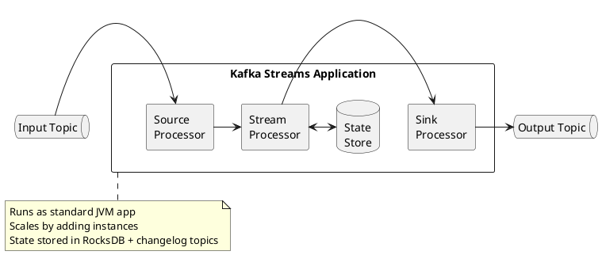
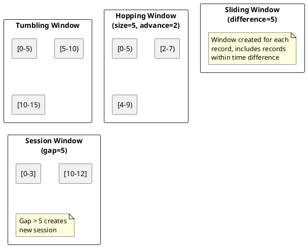
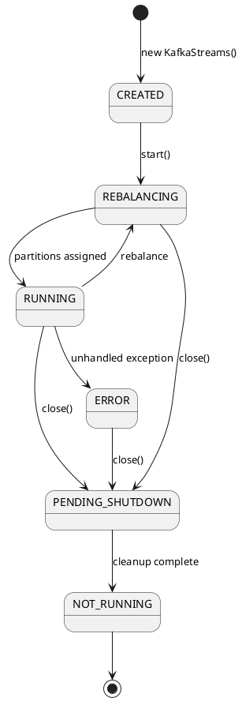

# Kafka Streams

Kafka Streams is a client library for building stream processing applications that consume from and produce to Kafka topics.

---

## Overview



### Key Characteristics

| Feature | Description |
|---------|-------------|
| **Library, not framework** | Embed in any Java/Scala application |
| **No cluster required** | No separate processing cluster needed |
| **Exactly-once** | Full EOS support |
| **Scalable** | Elastic scaling via partitions |
| **Fault-tolerant** | Automatic state recovery |

---

## Core Abstractions

### KStream

Unbounded stream of records (event stream).

```java
StreamsBuilder builder = new StreamsBuilder();
KStream<String, String> events = builder.stream("events");

events
    .filter((key, value) -> value.contains("important"))
    .mapValues(value -> value.toUpperCase())
    .to("filtered-events");
```

### KTable

Changelog stream representing current state (table semantics).

```java
KTable<String, Long> counts = builder.table("user-counts");

// Updates replace previous values for same key
// null value = tombstone (delete)
```

### GlobalKTable

Fully replicated table for broadcast joins.

```java
GlobalKTable<String, String> config = builder.globalTable("config");

// Every instance has complete copy
// Useful for reference data
```

---

## Stateless Operations

Operations that process records independently.

| Operation | Description | Example |
|-----------|-------------|---------|
| `filter` | Keep matching records | `stream.filter((k, v) -> v > 0)` |
| `map` | Transform key and value | `stream.map((k, v) -> KeyValue.pair(k, v * 2))` |
| `mapValues` | Transform value only | `stream.mapValues(v -> v.toUpperCase())` |
| `flatMap` | One-to-many transformation | `stream.flatMap((k, v) -> splitToMultiple(v))` |
| `branch` | Split stream by condition | `stream.branch(isA, isB, other)` |
| `merge` | Combine streams | `stream1.merge(stream2)` |

### Example: Filtering and Transformation

```java
KStream<String, Event> events = builder.stream("raw-events");

events
    .filter((key, event) -> event.getType().equals("click"))
    .mapValues(event -> new ClickEvent(event))
    .to("click-events");
```

---

## Stateful Operations

Operations that maintain state across records.

### Aggregations

```java
KStream<String, Purchase> purchases = builder.stream("purchases");

KTable<String, Long> purchaseCounts = purchases
    .groupBy((key, purchase) -> purchase.getCustomerId())
    .count();

KTable<String, Double> purchaseTotals = purchases
    .groupBy((key, purchase) -> purchase.getCustomerId())
    .aggregate(
        () -> 0.0,
        (key, purchase, total) -> total + purchase.getAmount(),
        Materialized.with(Serdes.String(), Serdes.Double())
    );
```

### Joins

| Join Type | Left | Right | Output |
|-----------|------|-------|--------|
| **Inner** | KStream | KStream | Matches only |
| **Left** | KStream | KStream | All left + matches |
| **Outer** | KStream | KStream | All records |
| **KStream-KTable** | KStream | KTable | Enrich stream |
| **KStream-GlobalKTable** | KStream | GlobalKTable | Broadcast join |

```java
KStream<String, Order> orders = builder.stream("orders");
KTable<String, Customer> customers = builder.table("customers");

KStream<String, EnrichedOrder> enriched = orders.join(
    customers,
    (order, customer) -> new EnrichedOrder(order, customer),
    Joined.with(Serdes.String(), orderSerde, customerSerde)
);
```

---

## Windowing

Group records by time windows for temporal aggregations.

### Window Types



### Tumbling Windows

Fixed-size, non-overlapping windows.

```java
KStream<String, Click> clicks = builder.stream("clicks");

KTable<Windowed<String>, Long> clicksPerMinute = clicks
    .groupBy((key, click) -> click.getPageId())
    .windowedBy(TimeWindows.ofSizeWithNoGrace(Duration.ofMinutes(1)))
    .count();
```

### Hopping Windows

Fixed-size, overlapping windows.

```java
KTable<Windowed<String>, Long> clicksHopping = clicks
    .groupBy((key, click) -> click.getPageId())
    .windowedBy(TimeWindows.ofSizeAndGrace(
        Duration.ofMinutes(5),
        Duration.ofMinutes(1)
    ).advanceBy(Duration.ofMinutes(1)))
    .count();
```

### Session Windows

Dynamic windows based on activity gaps.

```java
KTable<Windowed<String>, Long> sessions = clicks
    .groupBy((key, click) -> click.getUserId())
    .windowedBy(SessionWindows.ofInactivityGapWithNoGrace(Duration.ofMinutes(30)))
    .count();
```

---

## State Stores

### Local State

```java
StoreBuilder<KeyValueStore<String, Long>> storeBuilder =
    Stores.keyValueStoreBuilder(
        Stores.persistentKeyValueStore("my-store"),
        Serdes.String(),
        Serdes.Long()
    );

builder.addStateStore(storeBuilder);
```

### Interactive Queries

Query state stores from external applications.

```java
ReadOnlyKeyValueStore<String, Long> store =
    streams.store(
        StoreQueryParameters.fromNameAndType(
            "my-store",
            QueryableStoreTypes.keyValueStore()
        )
    );

Long value = store.get("key");
```

---

## Exactly-Once Processing

```java
Properties props = new Properties();
props.put(StreamsConfig.PROCESSING_GUARANTEE_CONFIG,
    StreamsConfig.EXACTLY_ONCE_V2);
```

| Guarantee | Description |
|-----------|-------------|
| `AT_LEAST_ONCE` | May produce duplicates on failure |
| `EXACTLY_ONCE_V2` | No duplicates (Kafka 2.5+) |

---

## Configuration

### Essential Settings

```java
Properties props = new Properties();
props.put(StreamsConfig.APPLICATION_ID_CONFIG, "my-streams-app");
props.put(StreamsConfig.BOOTSTRAP_SERVERS_CONFIG, "kafka:9092");
props.put(StreamsConfig.DEFAULT_KEY_SERDE_CLASS_CONFIG,
    Serdes.String().getClass());
props.put(StreamsConfig.DEFAULT_VALUE_SERDE_CLASS_CONFIG,
    Serdes.String().getClass());

// State directory
props.put(StreamsConfig.STATE_DIR_CONFIG, "/var/kafka-streams");

// Exactly-once
props.put(StreamsConfig.PROCESSING_GUARANTEE_CONFIG,
    StreamsConfig.EXACTLY_ONCE_V2);

// Commit interval
props.put(StreamsConfig.COMMIT_INTERVAL_MS_CONFIG, 100);
```

### Performance Tuning

```java
// Threading
props.put(StreamsConfig.NUM_STREAM_THREADS_CONFIG, 4);

// Buffering
props.put(StreamsConfig.CACHE_MAX_BYTES_BUFFERING_CONFIG, 10 * 1024 * 1024);

// Commit frequency
props.put(StreamsConfig.COMMIT_INTERVAL_MS_CONFIG, 1000);
```

---

## Application Lifecycle

```java
StreamsBuilder builder = new StreamsBuilder();
// ... define topology ...

KafkaStreams streams = new KafkaStreams(builder.build(), props);

// Handle shutdown gracefully
Runtime.getRuntime().addShutdownHook(new Thread(streams::close));

// Start processing
streams.start();
```

### State Transitions



---

## Related Documentation

- [DSL Reference](dsl/index.md) - Complete DSL operations
- [Delivery Semantics](../concepts/delivery-semantics/index.md) - Processing guarantees
- [Architecture Patterns](../concepts/architecture-patterns/index.md) - Stream processing patterns
- [Schema Registry](../schema-registry/index.md) - Schema management
