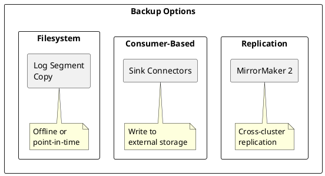
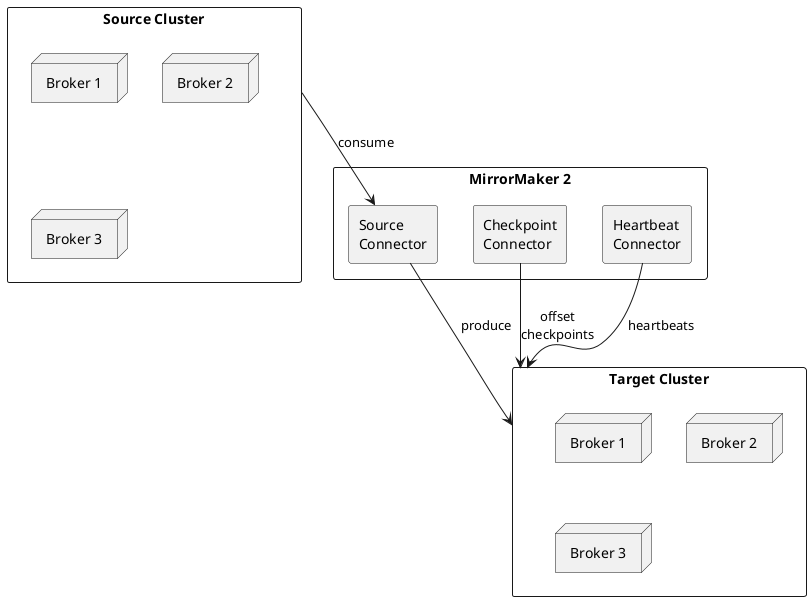

# Kafka Backup and Restore

Strategies for backing up and restoring Kafka data and configurations.

---

## Backup Strategies Overview



| Strategy | RPO | RTO | Use Case |
|----------|-----|-----|----------|
| **MirrorMaker 2** | Near-zero | Minutes | Cross-DC DR |
| **Sink Connector** | Minutes | Hours | Archival, analytics |
| **Filesystem backup** | Hours | Hours | Point-in-time recovery |

---

## MirrorMaker 2 Replication

### Architecture



### Configuration

```properties
# mm2.properties
clusters=source,target

source.bootstrap.servers=source-kafka:9092
target.bootstrap.servers=target-kafka:9092

# Replication flow
source->target.enabled=true
source->target.topics=.*

# Exclude internal topics
source->target.topics.exclude=.*[\-\.]internal,.*\.replica,__.*

# Preserve partitioning
replication.factor=3
refresh.topics.interval.seconds=30

# Sync consumer offsets
sync.group.offsets.enabled=true
sync.group.offsets.interval.seconds=60

# Heartbeats
emit.heartbeats.enabled=true
emit.heartbeats.interval.seconds=5

# Checkpoints for offset translation
emit.checkpoints.enabled=true
emit.checkpoints.interval.seconds=60
```

### Starting MirrorMaker 2

```bash
# Start as distributed Connect cluster
connect-distributed.sh mm2.properties

# Or as standalone
connect-mirror-maker.sh mm2.properties
```

---

## Sink Connector Backup

### Backup to Object Storage

Use Kafka Connect S3 Sink Connector to archive data.

```json
{
  "name": "s3-backup-sink",
  "config": {
    "connector.class": "io.confluent.connect.s3.S3SinkConnector",
    "tasks.max": "4",
    "topics": "orders,events,transactions",
    "s3.region": "us-east-1",
    "s3.bucket.name": "kafka-backup",
    "s3.part.size": "5242880",
    "flush.size": "10000",
    "rotate.interval.ms": "3600000",
    "storage.class": "io.confluent.connect.s3.storage.S3Storage",
    "format.class": "io.confluent.connect.s3.format.avro.AvroFormat",
    "partitioner.class": "io.confluent.connect.storage.partitioner.TimeBasedPartitioner",
    "path.format": "'year'=YYYY/'month'=MM/'day'=dd/'hour'=HH",
    "locale": "en-US",
    "timezone": "UTC",
    "timestamp.extractor": "RecordField",
    "timestamp.field": "timestamp"
  }
}
```

### Directory Structure

```
s3://kafka-backup/
└── topics/
    └── orders/
        └── year=2024/
            └── month=01/
                └── day=15/
                    └── hour=10/
                        ├── orders+0+0000000000.avro
                        ├── orders+1+0000000000.avro
                        └── orders+2+0000000000.avro
```

---

## Filesystem Backup

### Log Segment Backup

```bash
#!/bin/bash
# backup-kafka-logs.sh

KAFKA_LOG_DIR="/var/kafka-logs"
BACKUP_DIR="/backup/kafka/$(date +%Y%m%d_%H%M%S)"
TOPICS="orders events transactions"

mkdir -p "$BACKUP_DIR"

for topic in $TOPICS; do
  echo "Backing up topic: $topic"

  # Find all partition directories
  for partition_dir in "$KAFKA_LOG_DIR"/${topic}-*; do
    if [ -d "$partition_dir" ]; then
      partition=$(basename "$partition_dir")
      mkdir -p "$BACKUP_DIR/$partition"

      # Copy closed segments only (not active)
      for segment in "$partition_dir"/*.log; do
        # Skip if this is the active segment
        segment_name=$(basename "$segment" .log)
        if [ -f "$partition_dir/$segment_name.log" ] && \
           [ ! -f "$partition_dir/$segment_name.log.deleted" ]; then
          cp "$segment" "$BACKUP_DIR/$partition/"
          cp "$partition_dir/$segment_name.index" "$BACKUP_DIR/$partition/" 2>/dev/null
          cp "$partition_dir/$segment_name.timeindex" "$BACKUP_DIR/$partition/" 2>/dev/null
        fi
      done
    fi
  done
done

# Create manifest
echo "Backup completed at $(date)" > "$BACKUP_DIR/manifest.txt"
kafka-topics.sh --bootstrap-server localhost:9092 --describe >> "$BACKUP_DIR/manifest.txt"

# Compress backup
tar -czf "${BACKUP_DIR}.tar.gz" -C "$(dirname $BACKUP_DIR)" "$(basename $BACKUP_DIR)"
rm -rf "$BACKUP_DIR"

echo "Backup saved to: ${BACKUP_DIR}.tar.gz"
```

### Restore from Filesystem

```bash
#!/bin/bash
# restore-kafka-logs.sh

BACKUP_FILE=$1
KAFKA_LOG_DIR="/var/kafka-logs"
RESTORE_TEMP="/tmp/kafka-restore"

# Stop Kafka broker first
# systemctl stop kafka

# Extract backup
mkdir -p "$RESTORE_TEMP"
tar -xzf "$BACKUP_FILE" -C "$RESTORE_TEMP"

# Copy to Kafka log directory
for partition_dir in "$RESTORE_TEMP"/*-*; do
  partition=$(basename "$partition_dir")
  target_dir="$KAFKA_LOG_DIR/$partition"

  mkdir -p "$target_dir"
  cp "$partition_dir"/* "$target_dir/"

  # Fix ownership
  chown -R kafka:kafka "$target_dir"
done

# Start Kafka broker
# systemctl start kafka

rm -rf "$RESTORE_TEMP"
```

---

## Configuration Backup

### Backup Cluster Configuration

```bash
#!/bin/bash
# backup-kafka-config.sh

BOOTSTRAP_SERVER="localhost:9092"
BACKUP_DIR="/backup/kafka-config/$(date +%Y%m%d_%H%M%S)"

mkdir -p "$BACKUP_DIR"

# Backup topic configurations
echo "Backing up topic configurations..."
kafka-topics.sh --bootstrap-server $BOOTSTRAP_SERVER --describe > "$BACKUP_DIR/topics.txt"

for topic in $(kafka-topics.sh --bootstrap-server $BOOTSTRAP_SERVER --list); do
  kafka-configs.sh --bootstrap-server $BOOTSTRAP_SERVER \
    --entity-type topics --entity-name "$topic" --describe \
    >> "$BACKUP_DIR/topic-configs.txt"
done

# Backup broker configurations
echo "Backing up broker configurations..."
kafka-configs.sh --bootstrap-server $BOOTSTRAP_SERVER \
  --entity-type brokers --describe --all > "$BACKUP_DIR/broker-configs.txt"

# Backup ACLs
echo "Backing up ACLs..."
kafka-acls.sh --bootstrap-server $BOOTSTRAP_SERVER --list > "$BACKUP_DIR/acls.txt"

# Backup consumer groups
echo "Backing up consumer group offsets..."
for group in $(kafka-consumer-groups.sh --bootstrap-server $BOOTSTRAP_SERVER --list); do
  kafka-consumer-groups.sh --bootstrap-server $BOOTSTRAP_SERVER \
    --group "$group" --describe >> "$BACKUP_DIR/consumer-groups.txt"
done

# Backup SCRAM credentials (users only, not passwords)
echo "Backing up SCRAM users..."
kafka-configs.sh --bootstrap-server $BOOTSTRAP_SERVER \
  --entity-type users --describe > "$BACKUP_DIR/scram-users.txt"

echo "Configuration backup saved to: $BACKUP_DIR"
```

### Restore Configuration

```bash
#!/bin/bash
# restore-kafka-config.sh

BOOTSTRAP_SERVER="localhost:9092"
BACKUP_DIR=$1

# Restore topic configurations
echo "Restoring topic configurations..."
while IFS= read -r line; do
  if [[ $line == *"Config for topic"* ]]; then
    topic=$(echo "$line" | grep -oP "topic '\K[^']+")
  elif [[ $line == *"="* ]] && [[ -n "$topic" ]]; then
    config=$(echo "$line" | tr -d ' ')
    kafka-configs.sh --bootstrap-server $BOOTSTRAP_SERVER \
      --entity-type topics --entity-name "$topic" \
      --alter --add-config "$config"
  fi
done < "$BACKUP_DIR/topic-configs.txt"

# Note: ACLs need to be restored manually with kafka-acls.sh
echo "ACLs must be restored manually. See: $BACKUP_DIR/acls.txt"
```

---

## Consumer Offset Backup

### Export Offsets

```bash
#!/bin/bash
# export-offsets.sh

BOOTSTRAP_SERVER="localhost:9092"
OUTPUT_FILE="consumer-offsets-$(date +%Y%m%d).json"

echo "[" > "$OUTPUT_FILE"

first=true
for group in $(kafka-consumer-groups.sh --bootstrap-server $BOOTSTRAP_SERVER --list); do
  kafka-consumer-groups.sh --bootstrap-server $BOOTSTRAP_SERVER \
    --group "$group" --describe 2>/dev/null | \
  tail -n +2 | while read -r line; do
    if [[ -n "$line" ]]; then
      topic=$(echo "$line" | awk '{print $2}')
      partition=$(echo "$line" | awk '{print $3}')
      offset=$(echo "$line" | awk '{print $4}')

      if [[ "$first" == "true" ]]; then
        first=false
      else
        echo "," >> "$OUTPUT_FILE"
      fi

      echo "  {\"group\": \"$group\", \"topic\": \"$topic\", \"partition\": $partition, \"offset\": $offset}" >> "$OUTPUT_FILE"
    fi
  done
done

echo "]" >> "$OUTPUT_FILE"
```

### Restore Offsets

```bash
#!/bin/bash
# restore-offsets.sh

BOOTSTRAP_SERVER="localhost:9092"
GROUP=$1
TOPIC=$2
OFFSET_FILE=$3

# Group must have no active members
kafka-consumer-groups.sh --bootstrap-server $BOOTSTRAP_SERVER \
  --group "$GROUP" \
  --reset-offsets \
  --from-file "$OFFSET_FILE" \
  --execute
```

---

## Disaster Recovery Procedures

### Recovery Checklist

1. **Assess damage**
   - Identify failed components
   - Determine data loss extent

2. **Restore infrastructure**
   - Deploy replacement brokers
   - Configure networking

3. **Restore data**
   - Apply latest backup
   - Verify data integrity

4. **Restore configuration**
   - Topics and partitions
   - ACLs and quotas

5. **Restore consumer offsets**
   - Reset to known good position

6. **Verify recovery**
   - Test producer connectivity
   - Test consumer connectivity
   - Verify data flow

### Failover to DR Cluster

```bash
#!/bin/bash
# failover-to-dr.sh

DR_BOOTSTRAP="dr-kafka:9092"
PRIMARY_BOOTSTRAP="primary-kafka:9092"

echo "=== Kafka DR Failover ==="

# 1. Stop MirrorMaker
echo "Stopping MirrorMaker..."
# systemctl stop kafka-mirrormaker

# 2. Verify DR cluster health
echo "Checking DR cluster health..."
kafka-broker-api-versions.sh --bootstrap-server $DR_BOOTSTRAP

# 3. Check replication lag (should be minimal)
echo "Checking replication status..."
kafka-consumer-groups.sh --bootstrap-server $DR_BOOTSTRAP \
  --describe --all-groups

# 4. Update DNS/load balancer to point to DR
echo "Update DNS to point to DR cluster"

# 5. Verify applications can connect
echo "Failover complete. Verify application connectivity."
```

---

## Related Documentation

- [Operations Overview](../index.md) - Operations guide
- [Multi-Datacenter](../../concepts/multi-datacenter/index.md) - DR architecture
- [Cluster Management](../cluster-management/index.md) - Cluster operations
- [Monitoring](../monitoring/index.md) - Health monitoring
