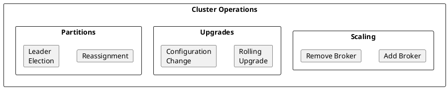
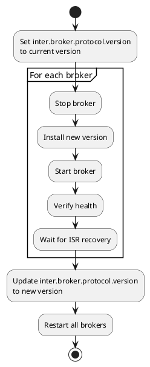

# Kafka Cluster Management

Operational procedures for managing Apache Kafka clusters.

---

## Cluster Operations Overview



---

## Adding Brokers

### Pre-Addition Checklist

- [ ] New broker has same Kafka version
- [ ] Network connectivity to all existing brokers
- [ ] Sufficient disk space
- [ ] Proper configuration (broker.id, listeners, etc.)

### Addition Process

1. **Configure the new broker**

```properties
# server.properties
broker.id=4  # Unique ID
node.id=4    # KRaft mode

# Controller connection
controller.quorum.voters=1@ctrl1:9093,2@ctrl2:9093,3@ctrl3:9093

# Listeners
listeners=PLAINTEXT://0.0.0.0:9092
advertised.listeners=PLAINTEXT://broker4:9092

# Log directories
log.dirs=/var/kafka-logs

# Rack (if applicable)
broker.rack=rack-2
```

2. **Start the broker**

```bash
# Format storage (KRaft mode, first time only)
kafka-storage.sh format -t <cluster-id> -c /etc/kafka/server.properties

# Start broker
kafka-server-start.sh /etc/kafka/server.properties
```

3. **Verify registration**

```bash
# Check broker is registered
kafka-broker-api-versions.sh --bootstrap-server broker4:9092

# Check cluster membership
kafka-metadata.sh --snapshot /var/kafka-logs/__cluster_metadata-0/*.log \
  --command "brokers"
```

4. **Reassign partitions to new broker**

```bash
# Generate reassignment plan including new broker
cat > topics.json << 'EOF'
{
  "topics": [{"topic": "topic1"}, {"topic": "topic2"}],
  "version": 1
}
EOF

kafka-reassign-partitions.sh --bootstrap-server kafka:9092 \
  --topics-to-move-json-file topics.json \
  --broker-list "1,2,3,4" \
  --generate

# Execute reassignment
kafka-reassign-partitions.sh --bootstrap-server kafka:9092 \
  --reassignment-json-file reassignment.json \
  --throttle 100000000 \
  --execute
```

---

## Removing Brokers

### Pre-Removal Checklist

- [ ] All partitions have replicas on other brokers
- [ ] Reassignment completed successfully
- [ ] No under-replicated partitions

### Decommission Process

1. **Move all partitions off the broker**

```bash
# Generate plan without the broker to remove (broker 4)
kafka-reassign-partitions.sh --bootstrap-server kafka:9092 \
  --topics-to-move-json-file topics.json \
  --broker-list "1,2,3" \
  --generate

# Execute
kafka-reassign-partitions.sh --bootstrap-server kafka:9092 \
  --reassignment-json-file reassignment.json \
  --throttle 100000000 \
  --execute

# Verify completion
kafka-reassign-partitions.sh --bootstrap-server kafka:9092 \
  --reassignment-json-file reassignment.json \
  --verify
```

2. **Verify no partitions remain**

```bash
# Check broker has no partitions
kafka-log-dirs.sh --bootstrap-server kafka:9092 \
  --describe --broker-list 4
```

3. **Graceful shutdown**

```bash
# Stop broker gracefully (controlled shutdown)
kafka-server-stop.sh

# Or
kill -TERM <kafka-pid>
```

4. **Verify removal**

```bash
# Check broker is no longer registered
kafka-metadata.sh --snapshot /var/kafka-logs/__cluster_metadata-0/*.log \
  --command "brokers"
```

---

## Rolling Upgrades

### Upgrade Process



### Step-by-Step

1. **Prepare for upgrade**

```properties
# Before upgrade, set in server.properties
inter.broker.protocol.version=3.6
log.message.format.version=3.6
```

2. **Upgrade each broker**

```bash
#!/bin/bash
# upgrade-broker.sh

BROKER=$1

echo "Upgrading $BROKER..."

# Stop broker
ssh $BROKER "sudo systemctl stop kafka"

# Install new version
ssh $BROKER "sudo yum install kafka-3.7.0"  # Or appropriate command

# Start broker
ssh $BROKER "sudo systemctl start kafka"

# Wait for recovery
sleep 30

# Verify health
kafka-broker-api-versions.sh --bootstrap-server $BROKER:9092

# Check under-replicated partitions
kafka-topics.sh --bootstrap-server $BROKER:9092 \
  --describe --under-replicated-partitions

echo "Waiting for ISR to recover..."
while true; do
  URP=$(kafka-topics.sh --bootstrap-server $BROKER:9092 \
    --describe --under-replicated-partitions 2>/dev/null | wc -l)
  if [ "$URP" -eq 0 ]; then
    echo "ISR recovered"
    break
  fi
  sleep 10
done
```

3. **After all brokers upgraded**

```properties
# Update protocol version
inter.broker.protocol.version=3.7
log.message.format.version=3.7
```

4. **Rolling restart to apply**

```bash
for broker in broker1 broker2 broker3; do
  ./upgrade-broker.sh $broker
done
```

---

## Partition Reassignment

### Generate Reassignment Plan

```bash
# Create topics file
cat > topics.json << 'EOF'
{
  "topics": [
    {"topic": "orders"},
    {"topic": "events"}
  ],
  "version": 1
}
EOF

# Generate plan
kafka-reassign-partitions.sh --bootstrap-server kafka:9092 \
  --topics-to-move-json-file topics.json \
  --broker-list "1,2,3,4" \
  --generate
```

### Custom Reassignment

```json
{
  "version": 1,
  "partitions": [
    {"topic": "orders", "partition": 0, "replicas": [1,2,3]},
    {"topic": "orders", "partition": 1, "replicas": [2,3,4]},
    {"topic": "orders", "partition": 2, "replicas": [3,4,1]}
  ]
}
```

### Execute with Throttling

```bash
# Start reassignment with throttle (100 MB/s)
kafka-reassign-partitions.sh --bootstrap-server kafka:9092 \
  --reassignment-json-file reassignment.json \
  --throttle 100000000 \
  --execute

# Monitor progress
kafka-reassign-partitions.sh --bootstrap-server kafka:9092 \
  --reassignment-json-file reassignment.json \
  --verify

# Adjust throttle if needed
kafka-reassign-partitions.sh --bootstrap-server kafka:9092 \
  --reassignment-json-file reassignment.json \
  --throttle 200000000 \
  --execute

# Remove throttle after completion
kafka-reassign-partitions.sh --bootstrap-server kafka:9092 \
  --reassignment-json-file reassignment.json \
  --verify
```

---

## Leader Election

### Preferred Leader Election

```bash
# All partitions
kafka-leader-election.sh --bootstrap-server kafka:9092 \
  --election-type preferred \
  --all-topic-partitions

# Specific topic
kafka-leader-election.sh --bootstrap-server kafka:9092 \
  --election-type preferred \
  --topic my-topic

# Specific partition
kafka-leader-election.sh --bootstrap-server kafka:9092 \
  --election-type preferred \
  --topic my-topic \
  --partition 0
```

### Unclean Leader Election

!!! danger "Data Loss Risk"
    Unclean leader election allows out-of-sync replicas to become leader, potentially causing data loss.

```bash
kafka-leader-election.sh --bootstrap-server kafka:9092 \
  --election-type unclean \
  --topic my-topic \
  --partition 0
```

---

## Increasing Partitions

```bash
# Increase partition count (cannot decrease)
kafka-topics.sh --bootstrap-server kafka:9092 \
  --alter \
  --topic my-topic \
  --partitions 24
```

!!! warning "Key-Based Ordering"
    Increasing partitions changes key-to-partition mapping. Existing keys may route to different partitions.

---

## Topic Management

### Create Topic

```bash
kafka-topics.sh --bootstrap-server kafka:9092 \
  --create \
  --topic new-topic \
  --partitions 12 \
  --replication-factor 3 \
  --config retention.ms=604800000 \
  --config cleanup.policy=delete
```

### Delete Topic

```bash
# Delete topic (data is permanently removed)
kafka-topics.sh --bootstrap-server kafka:9092 \
  --delete \
  --topic old-topic
```

### Modify Configuration

```bash
# Add/update config
kafka-configs.sh --bootstrap-server kafka:9092 \
  --entity-type topics \
  --entity-name my-topic \
  --alter \
  --add-config retention.ms=86400000

# Remove config (revert to default)
kafka-configs.sh --bootstrap-server kafka:9092 \
  --entity-type topics \
  --entity-name my-topic \
  --alter \
  --delete-config retention.ms
```

---

## Health Verification

### Post-Operation Checks

```bash
#!/bin/bash
# verify-cluster-health.sh

BOOTSTRAP="kafka:9092"

echo "=== Cluster Health Check ==="

# Check broker connectivity
echo "Checking broker connectivity..."
kafka-broker-api-versions.sh --bootstrap-server $BOOTSTRAP > /dev/null 2>&1
if [ $? -eq 0 ]; then
  echo "✓ Broker connectivity OK"
else
  echo "✗ Broker connectivity FAILED"
  exit 1
fi

# Check offline partitions
OFFLINE=$(kafka-topics.sh --bootstrap-server $BOOTSTRAP \
  --describe --unavailable-partitions 2>/dev/null | grep -c "Topic:")
echo "Offline partitions: $OFFLINE"
if [ "$OFFLINE" -gt 0 ]; then
  echo "✗ CRITICAL: Offline partitions detected"
  exit 2
fi

# Check under-replicated partitions
URP=$(kafka-topics.sh --bootstrap-server $BOOTSTRAP \
  --describe --under-replicated-partitions 2>/dev/null | grep -c "Topic:")
echo "Under-replicated partitions: $URP"
if [ "$URP" -gt 0 ]; then
  echo "⚠ WARNING: Under-replicated partitions"
fi

echo "=== Health Check Complete ==="
```

---

## Related Documentation

- [Operations Overview](../index.md) - Operations guide
- [Monitoring](../monitoring/index.md) - Metrics and alerting
- [Backup and Restore](../backup-restore/index.md) - DR procedures
- [Maintenance](../maintenance/index.md) - Routine maintenance
