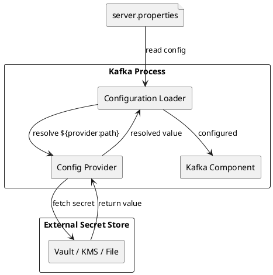
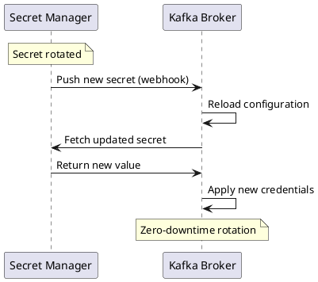

# Configuration Providers

Configuration providers enable Kafka to retrieve sensitive configuration values from external systems. This separates secrets from configuration files, improving security and enabling centralized secret management.

---

## Overview

Configuration providers resolve variable references in Kafka configuration files at runtime.



### Configuration Provider Interface

Providers implement `org.apache.kafka.common.config.provider.ConfigProvider`:

```java
public interface ConfigProvider extends Configurable, Closeable {
    ConfigData get(String path);
    ConfigData get(String path, Set<String> keys);
}
```

---

## Variable Syntax

Configuration values use the syntax:

```
${provider-name:path:key}
```

| Component | Description | Example |
|-----------|-------------|---------|
| `provider-name` | Configured provider alias | `vault`, `file`, `env` |
| `path` | Path to secret in provider | `/secret/kafka/broker` |
| `key` | Specific key within secret | `ssl.keystore.password` |

**Example:**
```properties
ssl.keystore.password=${vault:/secret/kafka:keystore-password}
```

---

## Built-in Providers

### File Configuration Provider

Reads configuration from files on disk.

```properties
# Register the file provider
config.providers=file
config.providers.file.class=org.apache.kafka.common.config.provider.FileConfigProvider

# Reference file-based secrets
ssl.keystore.password=${file:/etc/kafka/secrets/keystore-password:password}
ssl.key.password=${file:/etc/kafka/secrets/key-password:password}
```

**Secret file format:**
```properties
# /etc/kafka/secrets/keystore-password
password=my-secret-password
```

### Environment Variable Provider

Reads configuration from environment variables. Available in Kafka 3.5+.

```properties
# Register the env provider
config.providers=env
config.providers.env.class=org.apache.kafka.common.config.provider.EnvVarConfigProvider

# Reference environment variables
ssl.keystore.password=${env:KAFKA_SSL_KEYSTORE_PASSWORD}
sasl.jaas.config=${env:KAFKA_JAAS_CONFIG}
```

### Directory Configuration Provider

Reads secrets from individual files in a directory (Kubernetes secrets pattern).

```properties
# Register the directory provider
config.providers=dir
config.providers.dir.class=org.apache.kafka.common.config.provider.DirectoryConfigProvider
config.providers.dir.param.directory=/etc/kafka/secrets

# Reference secrets (filename = key)
ssl.keystore.password=${dir:ssl.keystore.password}
ssl.key.password=${dir:ssl.key.password}
```

**Directory structure:**
```
/etc/kafka/secrets/
├── ssl.keystore.password    # Contains: my-keystore-password
├── ssl.key.password         # Contains: my-key-password
└── sasl.jaas.config         # Contains: JAAS config string
```

---

## HashiCorp Vault Provider

Integrates with HashiCorp Vault for enterprise secret management.

### Configuration

```properties
# Register Vault provider
config.providers=vault
config.providers.vault.class=io.confluent.kafka.security.vault.VaultConfigProvider

# Vault connection
config.providers.vault.param.vault.url=https://vault.example.com:8200
config.providers.vault.param.vault.token=${env:VAULT_TOKEN}

# Or use AppRole authentication
config.providers.vault.param.vault.auth.method=approle
config.providers.vault.param.vault.approle.role.id=${env:VAULT_ROLE_ID}
config.providers.vault.param.vault.approle.secret.id=${env:VAULT_SECRET_ID}

# Secret engine configuration
config.providers.vault.param.vault.secrets.engine=kv-v2
config.providers.vault.param.vault.secrets.mount=secret

# Reference Vault secrets
ssl.keystore.password=${vault:secret/data/kafka/broker:keystore-password}
```

### Vault Secret Structure

```bash
# Store secrets in Vault
vault kv put secret/kafka/broker \
  keystore-password="my-keystore-password" \
  key-password="my-key-password" \
  truststore-password="my-truststore-password"
```

### Authentication Methods

| Method | Configuration |
|--------|---------------|
| Token | `vault.token` |
| AppRole | `vault.approle.role.id`, `vault.approle.secret.id` |
| Kubernetes | `vault.kubernetes.role` |
| AWS IAM | `vault.aws.role` |

---

## AWS Secrets Manager Provider

Integrates with AWS Secrets Manager.

### Configuration

```properties
# Register AWS provider
config.providers=aws
config.providers.aws.class=io.confluent.kafka.security.aws.AwsSecretsManagerConfigProvider

# AWS configuration
config.providers.aws.param.aws.region=us-east-1

# Authentication (use IAM roles when possible)
# Falls back to default credential chain

# Reference AWS secrets
ssl.keystore.password=${aws:kafka/broker/ssl:keystore-password}
sasl.jaas.config=${aws:kafka/broker/sasl:jaas-config}
```

### Secret Structure in AWS

```bash
# Create secret in AWS Secrets Manager
aws secretsmanager create-secret \
  --name kafka/broker/ssl \
  --secret-string '{
    "keystore-password": "my-keystore-password",
    "key-password": "my-key-password",
    "truststore-password": "my-truststore-password"
  }'
```

### IAM Policy

```json
{
  "Version": "2012-10-17",
  "Statement": [
    {
      "Effect": "Allow",
      "Action": [
        "secretsmanager:GetSecretValue"
      ],
      "Resource": [
        "arn:aws:secretsmanager:us-east-1:123456789012:secret:kafka/*"
      ]
    }
  ]
}
```

---

## Azure Key Vault Provider

Integrates with Azure Key Vault.

### Configuration

```properties
# Register Azure provider
config.providers=azure
config.providers.azure.class=io.confluent.kafka.security.azure.AzureKeyVaultConfigProvider

# Azure Key Vault configuration
config.providers.azure.param.azure.keyvault.url=https://my-keyvault.vault.azure.net/
config.providers.azure.param.azure.tenant.id=${env:AZURE_TENANT_ID}
config.providers.azure.param.azure.client.id=${env:AZURE_CLIENT_ID}
config.providers.azure.param.azure.client.secret=${env:AZURE_CLIENT_SECRET}

# Or use managed identity
config.providers.azure.param.azure.use.managed.identity=true

# Reference Azure secrets
ssl.keystore.password=${azure:kafka-keystore-password}
```

### Secret Naming

Azure Key Vault uses flat secret names (no hierarchy):

| Kafka Secret | Azure Key Vault Name |
|--------------|---------------------|
| SSL keystore password | `kafka-ssl-keystore-password` |
| SSL key password | `kafka-ssl-key-password` |
| SASL password | `kafka-sasl-password` |

---

## GCP Secret Manager Provider

Integrates with Google Cloud Secret Manager.

### Configuration

```properties
# Register GCP provider
config.providers=gcp
config.providers.gcp.class=io.confluent.kafka.security.gcp.GcpSecretManagerConfigProvider

# GCP configuration
config.providers.gcp.param.gcp.project.id=my-project
config.providers.gcp.param.gcp.credentials.path=/etc/kafka/gcp-credentials.json

# Or use default credentials (GCE, GKE)
# No explicit credentials needed

# Reference GCP secrets
ssl.keystore.password=${gcp:kafka-keystore-password}
```

### Secret Structure in GCP

```bash
# Create secret
gcloud secrets create kafka-keystore-password \
  --replication-policy="automatic"

# Add secret version
echo -n "my-keystore-password" | \
  gcloud secrets versions add kafka-keystore-password --data-file=-
```

---

## Multiple Providers

Multiple providers can be configured simultaneously:

```properties
# Register multiple providers
config.providers=file,vault,env
config.providers.file.class=org.apache.kafka.common.config.provider.FileConfigProvider
config.providers.vault.class=io.confluent.kafka.security.vault.VaultConfigProvider
config.providers.env.class=org.apache.kafka.common.config.provider.EnvVarConfigProvider

# Vault configuration
config.providers.vault.param.vault.url=https://vault.example.com:8200
config.providers.vault.param.vault.token=${env:VAULT_TOKEN}

# Use different providers for different secrets
ssl.keystore.password=${vault:secret/data/kafka:keystore-password}
ssl.truststore.password=${file:/etc/kafka/secrets/truststore-password:password}
log.dirs=${env:KAFKA_LOG_DIRS}
```

---

## Custom Configuration Providers

### Implementing a Custom Provider

```java
public class CustomConfigProvider implements ConfigProvider {
    private String secretPath;

    @Override
    public void configure(Map<String, ?> configs) {
        this.secretPath = (String) configs.get("secret.path");
    }

    @Override
    public ConfigData get(String path) {
        Map<String, String> data = fetchSecretsFromPath(path);
        return new ConfigData(data);
    }

    @Override
    public ConfigData get(String path, Set<String> keys) {
        Map<String, String> allData = fetchSecretsFromPath(path);
        Map<String, String> filteredData = new HashMap<>();
        for (String key : keys) {
            if (allData.containsKey(key)) {
                filteredData.put(key, allData.get(key));
            }
        }
        return new ConfigData(filteredData);
    }

    @Override
    public void close() {
        // Cleanup resources
    }

    private Map<String, String> fetchSecretsFromPath(String path) {
        // Implementation to fetch secrets
        return new HashMap<>();
    }
}
```

### Registering Custom Provider

```properties
config.providers=custom
config.providers.custom.class=com.example.CustomConfigProvider
config.providers.custom.param.secret.path=/custom/secrets
```

---

## Kubernetes Integration

### Using Kubernetes Secrets

Mount Kubernetes secrets as files and use the DirectoryConfigProvider:

```yaml
apiVersion: v1
kind: Pod
metadata:
  name: kafka-broker
spec:
  containers:
  - name: kafka
    image: kafka:latest
    volumeMounts:
    - name: kafka-secrets
      mountPath: /etc/kafka/secrets
      readOnly: true
  volumes:
  - name: kafka-secrets
    secret:
      secretName: kafka-broker-secrets
```

```properties
# server.properties
config.providers=dir
config.providers.dir.class=org.apache.kafka.common.config.provider.DirectoryConfigProvider
config.providers.dir.param.directory=/etc/kafka/secrets

ssl.keystore.password=${dir:keystore-password}
ssl.key.password=${dir:key-password}
```

### External Secrets Operator

For dynamic secret injection, use External Secrets Operator with Vault or cloud providers:

```yaml
apiVersion: external-secrets.io/v1beta1
kind: ExternalSecret
metadata:
  name: kafka-secrets
spec:
  refreshInterval: 1h
  secretStoreRef:
    name: vault-backend
    kind: SecretStore
  target:
    name: kafka-broker-secrets
  data:
  - secretKey: keystore-password
    remoteRef:
      key: secret/data/kafka/broker
      property: keystore-password
```

---

## Security Considerations

### Best Practices

| Practice | Description |
|----------|-------------|
| Least privilege | Grant minimum required permissions to access secrets |
| Secret rotation | Use providers that support automatic rotation |
| Audit logging | Enable audit logs in secret management systems |
| Network security | Restrict network access to secret management systems |
| Encryption at rest | Ensure secrets are encrypted in the external store |

### Secret Rotation



### Provider-Specific Security

| Provider | Security Consideration |
|----------|----------------------|
| File | Restrict file permissions (600) |
| Environment | Avoid logging environment variables |
| Vault | Use short-lived tokens, enable audit |
| AWS | Use IAM roles, avoid access keys |
| Azure | Use managed identity |
| GCP | Use Workload Identity |

---

## Troubleshooting

### Common Issues

| Issue | Cause | Solution |
|-------|-------|----------|
| Provider not found | Class not in classpath | Add provider JAR to classpath |
| Authentication failed | Invalid credentials | Verify credentials and permissions |
| Secret not found | Wrong path or key | Check path syntax and secret existence |
| Timeout | Network issues | Check connectivity to secret store |

### Debug Logging

```properties
# Enable configuration provider logging
log4j.logger.org.apache.kafka.common.config.provider=DEBUG
log4j.logger.io.confluent.kafka.security=DEBUG
```

### Testing Configuration

```bash
# Test variable resolution (dry run)
kafka-configs.sh --bootstrap-server localhost:9092 \
  --describe \
  --entity-type brokers \
  --entity-name 0
```

---

## Related Documentation

- [Configuration Overview](index.md) - Configuration guide
- [Broker Configuration](broker.md) - Broker settings
- [Security](../../security/index.md) - Security architecture
- [System Properties](system-properties.md) - JVM properties
