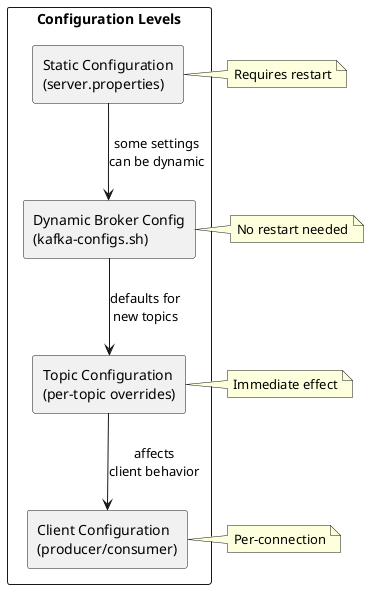

# Kafka Configuration

This section provides comprehensive configuration reference for Apache Kafka deployments, covering server-side settings, topic configuration, security, and operational parameters.

---

## Configuration Overview

Kafka configuration operates at multiple levels, each with different scopes and modification methods:



| Level | Scope | Persistence | Modification |
|-------|-------|-------------|--------------|
| **Static** | Broker | `server.properties` | Requires restart |
| **Dynamic Broker** | Broker/Cluster | Metadata | No restart |
| **Topic** | Single topic | Metadata | Immediate |
| **Client** | Connection | Client config | Per-connection |

---

## Configuration Sections

### [Broker Configuration](broker.md)

Server-side configuration for Kafka brokers:

- Node identity and KRaft/ZooKeeper settings
- Listeners and network configuration
- Storage and retention settings
- Replication and ISR management
- Threading and performance tuning
- Dynamic configuration updates

### [Topic Configuration](topic.md)

Per-topic settings that override broker defaults:

- Retention policies (time and size)
- Cleanup policies (delete and compact)
- Compression settings
- Replication and ISR requirements
- Segment configuration
- Message size limits

### [ACL Configuration](acl.md)

Access Control List management for authorization:

- Enabling authorization
- Resource types and operations
- Managing ACLs with kafka-acls.sh
- Common ACL patterns for producers, consumers, and streams
- Wildcard and prefix patterns
- Host-based restrictions

### [Quotas](quotas.md)

Client resource quotas for rate limiting:

- Producer and consumer byte rate quotas
- Request percentage quotas
- User, client ID, and combined quotas
- Quota resolution and precedence
- Multi-tenant quota patterns
- Monitoring throttling

### [Tiered Storage](tiered-storage.md)

Remote storage configuration for long-term retention:

- Enabling tiered storage
- S3, GCS, and Azure Blob backends
- Local vs remote retention settings
- Performance tuning
- Monitoring and troubleshooting

### [System Properties](system-properties.md)

JVM and environment configuration:

- JAAS and security properties
- SSL/TLS debugging
- JVM memory and GC settings
- JMX configuration
- Logging configuration
- Environment variables

### [Configuration Providers](configuration-providers.md)

External secret management integration:

- Built-in providers (file, environment, directory)
- HashiCorp Vault integration
- AWS Secrets Manager
- Azure Key Vault
- GCP Secret Manager
- Custom provider implementation

---

## Configuration Methods

### Static Configuration

Edit `server.properties` and restart the broker:

```properties
# server.properties
broker.id=1
log.dirs=/var/kafka-logs
num.partitions=3
```

### Dynamic Configuration

Use `kafka-configs.sh` for runtime changes:

```bash
# Broker-level dynamic config
kafka-configs.sh --bootstrap-server kafka:9092 \
  --entity-type brokers \
  --entity-name 1 \
  --alter \
  --add-config log.retention.ms=86400000

# Cluster-wide default
kafka-configs.sh --bootstrap-server kafka:9092 \
  --entity-type brokers \
  --entity-default \
  --alter \
  --add-config log.retention.ms=86400000

# Topic-level config
kafka-configs.sh --bootstrap-server kafka:9092 \
  --entity-type topics \
  --entity-name events \
  --alter \
  --add-config retention.ms=172800000
```

### Viewing Configuration

```bash
# View broker configuration
kafka-configs.sh --bootstrap-server kafka:9092 \
  --entity-type brokers \
  --entity-name 1 \
  --describe

# View topic configuration
kafka-configs.sh --bootstrap-server kafka:9092 \
  --entity-type topics \
  --entity-name events \
  --describe

# View all dynamic configs
kafka-configs.sh --bootstrap-server kafka:9092 \
  --entity-type brokers \
  --describe --all
```

---

## Configuration Files

### Standard File Locations

| File | Purpose |
|------|---------|
| `server.properties` | Broker configuration |
| `jvm.options` | JVM settings |
| `log4j.properties` | Logging configuration |
| `jaas.conf` | JAAS security configuration |
| `connect-distributed.properties` | Kafka Connect workers |

### Environment-Specific Configuration

```
/etc/kafka/
├── server.properties           # Core broker config
├── jvm.options                  # JVM settings
├── log4j.properties            # Logging
├── jaas.conf                   # JAAS config
├── ssl/
│   ├── kafka.keystore.jks     # Broker keystore
│   └── kafka.truststore.jks   # Trust store
└── secrets/
    └── credentials             # Sensitive values
```

---

## Production Configuration Checklist

### Reliability

| Setting | Location | Recommended |
|---------|----------|-------------|
| `min.insync.replicas` | Broker/Topic | 2 (with RF=3) |
| `default.replication.factor` | Broker | 3 |
| `unclean.leader.election.enable` | Broker/Topic | false |
| `acks` | Producer | all |
| `enable.idempotence` | Producer | true |

### Security

| Setting | Location | Recommended |
|---------|----------|-------------|
| `auto.create.topics.enable` | Broker | false |
| `allow.everyone.if.no.acl.found` | Broker | false |
| `ssl.client.auth` | Broker | required |
| Security protocol | Listeners | SASL_SSL |

### Performance

| Setting | Location | Recommended |
|---------|----------|-------------|
| `num.io.threads` | Broker | 2× CPU cores |
| `num.network.threads` | Broker | 2-3 per listener |
| `compression.type` | Producer/Topic | lz4 or zstd |
| `batch.size` | Producer | 65536-131072 |

### Operations

| Setting | Location | Recommended |
|---------|----------|-------------|
| `log.retention.hours` | Broker/Topic | Based on requirements |
| JMX enabled | JVM options | Yes |
| GC logging | JVM options | Enabled |
| Quotas | Dynamic config | Set for tenants |

---

## Related Documentation

- [Operations Overview](../index.md) - Operations guide
- [CLI Tools](../cli-tools/index.md) - Command-line tools
- [Monitoring](../monitoring/index.md) - Metrics and alerting
- [Security](../../security/index.md) - Security architecture
- [Performance](../performance/index.md) - Performance tuning
